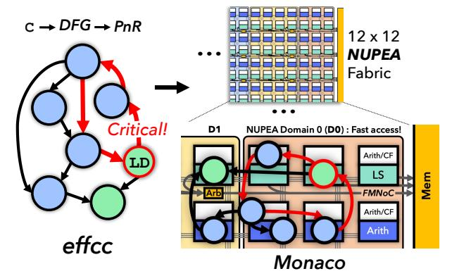

# Keywords

spatial dataflow architecture, data movement

Permission to make digital or hard copies of all or part of this work for personal or classroom use is granted without fee provided that copies are not made or distributed for profit or commercial advantage and that copies bear this notice and the full citation on the first page. Copyrights for components of this work owned by others than the author(s) must be honored. Abstracting with credit is permitted. To copy otherwise, or republish, to post on servers or to redistribute to lists, requires prior specific permission and/or a fee. Request permissions from permissions@acm.org.

ISCA '25, Tokyo, Japan

© 2025 Copyright held by the owner/author(s). Publication rights licensed to ACM. ACM ISBN 979-8-4007-1261-6/25/06

<https://doi.org/10.1145/3695053.3731061>

#### ACM Reference Format:

Souradip Ghosh, Graham Gobieski, Keyi Zhang, Brandon Lucia, Nathan Beckmann, and Tony Nowatzki. 2025. NUPEA: Optimizing Critical Loads on Spatial Dataflow Architectures via Non-Uniform Processing-Element Access. In Proceedings of the 52nd Annual International Symposium on Computer Architecture (ISCA '25), June 21–25, 2025, Tokyo, Japan. ACM, New York, NY, USA, [14](#page-13-0) pages.<https://doi.org/10.1145/3695053.3731061>

Figure 1: effcc and Monaco: a NUPEA-aware dataflow compiler and NUPEA SDA. Monaco implements domains of PEs with non-uniform memory-access latency that enable high performance and scalability. effcc identifies critical loads and prioritizes them onto fast NUPEA domains during PnR. Monaco's fabric-memory network (FMNoC) routes data from PEs to memory.

