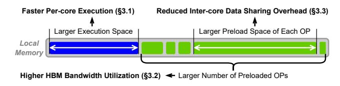
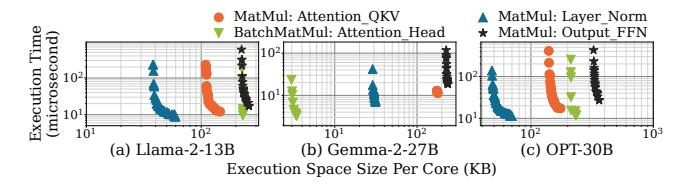

# Elk: Exploring the Efficiency of Inter-core Connected Al Chips with Deep Learning Compiler Techniques

Yiqi Liu University of Illinois Urbana Champaign Urbana, Illinois, USA yiqiliu2@illinois.edu Yuqi Xue University of Illinois Urbana Champaign Urbana, Illinois, USA yuqixue2@illinois.edu Noelle Crawford University of Illinois at Urbana-Champaign Urbana, Illinois, USA noellec3@illinois.edu

Jilong Xue Microsoft Research Beijing, China jxue@microsoft.com

Jian Huang
University of Illinois at
Urbana-Champaign
Urbana, Illinois, USA\niianh@illinois.edu

#### Abstract

To meet the increasing demand of deep learning (DL) models, AI chips are employing both off-chip memory (e.g., HBM) and high-bandwidth low-latency interconnect for direct inter-core data exchange. However, it is not easy to explore the efficiency of these inter-core connected AI (ICCA) chips, due to a fundamental tussle among compute (per-core execution), communication (inter-core data exchange), and I/O (off-chip data access).

In this paper, we develop Elk, a DL compiler framework to maximize the efficiency of ICCA chips by jointly trading off all the three performance factors discussed above. ELK structures these performance factors into configurable parameters and forms a global trade-off space in the DL compiler. To systematically explore this space and maximize overall efficiency, ELK employs a new inductive operator scheduling policy and a cost-aware on-chip memory allocation algorithm. It generates globally optimized execution plans that best overlap off-chip data loading and on-chip execution. To examine the efficiency of ELK, we build a full-fledged emulator based on a real ICCA chip IPU-POD4, and an ICCA chip simulator for sensitivity analysis with different interconnect network topologies. ELK achieves 94% of the ideal roofline performance of ICCA chips on average, showing the benefits of supporting large DL models on ICCA chips. We also show Elk's capability of enabling architecture design space exploration for new ICCA chip development.

#### **CCS Concepts**

 Software and its engineering → Compilers; • Hardware → Emerging architectures; • Computer systems organization → Parallel architectures.

#### Keywords

Deep Learning Compiler, Inter-Core Connected AI Chip, ML Accelerator, Distributed On-chip Memory

This work is licensed under a Creative Commons Attribution-NonCommercial-ShareAlike 4.0 International License.

MICRO '25, Seoul, Republic of Korea

© 2025 Copyright held by the owner/author(s). ACM ISBN 979-8-4007-1573-0/25/10 https://doi.org/10.1145/3725843.3756064

#### **ACM Reference Format:**

Yiqi Liu, Yuqi Xue, Noelle Crawford, Jilong Xue, and Jian Huang. 2025. Elk: Exploring the Efficiency of Inter-core Connected AI Chips with Deep Learning Compiler Techniques. In 58th IEEE/ACM International Symposium on Microarchitecture (MICRO '25), October 18–22, 2025, Seoul, Republic of Korea. ACM, New York, NY, USA, 16 pages. https://doi.org/10.1145/3725843. 3756064

#### 1 Introduction

To meet the ever-increasing compute demand of deep learning (DL) like large language models (LLMs) [30, 40], various AI chips have been developed [29, 37, 42, 46, 52]. A typical AI chip employs many parallel cores to scale computing throughput. Each core has its local SRAM as a scratchpad memory. To exploit this parallelism, the DL compiler partitions a tensor operator (e.g., BatchMatMul in attention and MatMul in FFN [57]) into tiles and maps each tile to a core. Since the on-chip SRAM size is limited, AI chips can employ off-chip memories (e.g., HBM) to provide larger capacity and accommodate the model parameters of larger DL models.

However, the off-chip memory bandwidth scales much slower than compute performance, and cannot meet the growing demand of large models. To alleviate the bandwidth bottleneck, inter-core connected AI (ICCA) chips were proposed. They enable inter-core links that allow one core to directly access data from other cores' SRAM, as shown in Figure 1. A typical ICCA chip example is Graphcore IPU [29]. It has 1472 cores, each core has 624KB local SRAM and can access another core's SRAM at 5.5GB/s. This aggregates to an 896MB on-chip memory with 8TB/s all-to-all data exchange bandwidth. The large on-chip space and high memory bandwidth present a promising way to break the memory wall for DL workloads (e.g., compared to an A100 GPU with 60MB total cache size and 2TB/s HBM bandwidth). With these advantages, inter-core interconnect has been employed by many AI chips today, such as Graphcore IPU [29], SambaNova SN40 [46], Cerebras WSE [33], Meta MTIA [37], and NVIDIA's H100 GPU [42].

The inter-core interconnect connects all cores' local SRAM into a distributed memory space that can be managed by software (i.e., compiler), leading to new parallel execution models for DL workloads (§2.2). In conventional accelerators without inter-core connections, all cores execute independently with their local SRAM,

Figure 1: Architecture of inter-core connected AI (ICCA) chip.

and a separate global SRAM shared by all cores simultaneously handles all off-chip data loading. On ICCA chips, the software can manually manage data sharing among cores without needing a global SRAM. Also, the distributed nature of ICCA chip's on-chip SRAM allows its size to further scale, so it can store multiple tensor operators. Thus, when executing a current operator, the chip can simultaneously preload future operators' data from off-chip memory to SRAM. However, this requires each core's local SRAM to enable double buffering between execution and preload, resulting in significant memory footprint overhead.

The end-to-end performance of running a DL model on an ICCA chip is determined by three major factors: (1) compute (per-core execution), (2) communication (inter-core data exchange), and (3) I/O (data loading from off-chip memory). To maximize the efficiency of the inter-core connected AI chip, it is challenging for software (i.e., DL compiler) to optimize all three performance factors, since they usually have conflicting resource demands, as shown in Figure 2.

First, to overlap computing and off-chip loading, the DL compiler needs to decide how much on-chip memory space to allocate for per-core execution and for buffering preloaded data from off-chip memory. A larger space for execution (i.e., execution space) allows larger per-core tile size, reduces inter-core communication traffic, and improves compute efficiency. A larger space for preload (i.e., preload space) improves off-chip memory bandwidth utilization. This leads to on-chip memory capacity contention (① in Figure 2). Second, the on-chip interconnect links all cores and HBM controllers, and its bandwidth is shared between inter-core data exchange and HBM-to-core data loading. This leads to interconnect bandwidth contention (②). Third, the per-core SRAM must feed data to the local computation pipeline and serve data to other cores via the interconnect. The concurrent SRAM accesses will lead to memory access contention (③).

Given the performance trade-offs, we must jointly optimize all three performance factors. However, to the best of our knowledge, few existing studies optimized the end-to-end performance by holistically considering all three performance factors (i.e., per-core execution, inter-core data exchange, and off-chip data loading). Many DL compilers tune the tile size to optimize compute efficiency and off-chip memory access volume [8, 74], but do not consider the inter-core communication. Some ICCA chip compilers like T10 [34] leverage new parallel execution paradigms to streamline the on-chip dataflow [34, 46, 52], which optimizes both per-core execution and inter-core communication. However, they did not consider the off-chip memory access.

Figure 2: Resource contentions on ICCA chip with HBM.

In this paper, we present Elk, a DL compiler framework to maximize the efficiency of ICCA chips by jointly optimizing all three performance factors. Elk formalizes these factors into a global tradeoff space, based on the insight that these factors can be transferred into configurable compiler parameters (§3), and the correlation between these parameters can reflect their performance trade-offs.

Specifically, (1) the per-core execution performance is correlated to the SRAM capacity allocated to the execution space. (2) The off-chip data loading performance (i.e., the HBM bandwidth utilization) can be improved by increasing the number of preloaded operators, which allows more overlap between computation and HBM access. (3) An operator's inter-core data exchange overhead can be reduced by increasing the operator preload space, which allows us to duplicate shared data in multiple cores in advance to avoid on-demand access to other cores, at the expense of higher SRAM footprint.

To search an optimized model execution plan, Elk schedules the preload and execution of each operator with a two-level search algorithm to best overlap off-chip data access and on-chip execution. For each operator, Elk first selects the optimal number of preloaded operators via an exhaustive search. The search space is small as the on-chip memory stores a limited number of preloaded operators. Second, Elk's cost-aware memory allocation algorithm determines the execution space size for the current operator and the preload space for each preloaded operator. Elk uses an iterative greedy algorithm to minimize the execution time of the current operator and the inter-core data exchange overhead of preloaded operators.

As Elk preloads multiple operators, the earlier an operator is preloaded, the longer it occupies the on-chip SRAM, which limits the execution space of the current operator. Thus, Elk reorders the operator preloads to delay the preloads of operators that involve large tensors, reducing the lifespans of large operators' SRAM footprints. Also, as some operators require higher interconnect bandwidth to be preloaded to destination cores, Elk reorders the preload traffic to avoid "rush hours" on the interconnect, reducing the interconnect contention. To yield an efficient search space of preload orders, Elk smartly limits the edit distance of preload orders based on the available SRAM capacity on the chip.

To evaluate ELK, we build an emulation framework using a real IPU-POD4 hardware [20] to emulate full-fledged ICCA chips with HBM, and a simulator framework with popular inter-core network topologies for sensitivity analysis and design space exploration of ICCA chips. We evaluate ELK with state-of-the-art LLMs and stable diffusion models. We not only show ELK achieves 94% of the ideal

roofline performance, but also present Elk's capability of exploring design tradeoffs in ICCA chips. We list our contributions as follows:

- For the inter-core connected AI chip with off-chip HBM, we are the first to identify the performance challenges for best utilizing its hardware properties.
- We develop a DL compiler framework ELK that structures the performance factors into configurable parameters in the compiler, such that we can optimize hardware performance by exploring the space using compiler techniques.
- We develop a new inductive operator scheduling policy in ELK for optimizing the overlapping of HBM data loading and onchip execution, as well as design a new cost-aware algorithm for on-chip memory allocation.
- To generalize our design in the DL compiler, we build a generic interface that can map the optimized end-to-end execution plan to popular ICCA chip architectures.
- To evaluate our design, we construct an emulation framework with real IPU-POD4 [20] hardware, and demonstrate the efficiency of Elk for various DL models.
- We build the first hardware simulator for ICCA chips, which supports popular network topologies for inter-core communications and various bandwidth behaviors.
- With ELK and the ICCA chip simulator, we enable design space exploration of ICCA chips and present our insights in §6.4. We will open source our codebase to the community.

#### 2 Background and Motivation

We now introduce the features of the inter-core connected AI chip and discuss the motivation of Elk.

#### 2.1 Architecture of the ICCA Chip

To facilitate the introduction of the ICCA chip as shown in Figure 1, we use Graphcore IPU MK2 [29] as an example. An IPU chip has 1472 cores that execute independently in parallel. Each core has 624KB local scratchpad memory, adding up to 896MB of total on-chip memory. All cores are interconnected with highbandwidth low-latency links. Each core can access any other core's local memory at 5.5GB/s, delivering an aggregated inter-core all-toall bandwidth of  $1472 \times 5.5$ GB/s  $\approx 8$ TB/s [27]. The large on-chip memory improves on-chip data reuse by storing more operators or even an entire model. The all-to-all interconnect allows each core to independently access on-chip data at high bandwidth. If multiple cores receive/send different data from/to the same core, the interconnect sequentially serves each data transfer at full bandwidth. In addition to IPU, other ICCA chips, such as SambaNova SN40L [46] and Tenstorrent [52], feature a mesh-based on-chip interconnect. In general, the ICCA chip architecture enables scalable performance and alleviates the memory bandwidth bottleneck for serving memory-intensive DL workloads like LLMs.

Scale the ICCA chip with HBM. To serve large models whose sizes exceed the on-chip capacity, we can scale the memory capacity with off-chip memory modules like high bandwidth memory (HBM) [39]. Many ICCA chips already integrate off-chip memory [37, 46]. As shown in Figure 1, they attach HBM controllers to the on-chip interconnect, so each controller can directly send data to each core similar to how the cores send data to each other. To access HBM, cores communicate with HBM controllers via the

Figure 3: Operator partitioning and inter-core data sharing.

interconnect. The HBM controller coalesces the memory requests from cores, loads data from HBM, and sends data to cores.

## 2.2 Execution Model of ICCA Chip with HBM

Before executing a DL model, all required data (e.g., model weight) is loaded into HBM. The ICCA chip will sequentially execute each operator in the model by first preloading its required data from HBM to on-chip memory and then performing the on-chip computation. To maximize computing throughput, the compiler manages the on-chip SRAM as a double buffer to overlap the on-chip execution and off-chip HBM access. The compiler partitions the SRAM in each core into an *execution space* to store the currently executing operator and a *preload space* to store the operators preloaded from HBM. While an operator is executing, the ICCA chip can preload other operators from the HBM into the on-chip memory. On preload, HBM controllers use the interconnect to deliver preloaded data to cores. Each core needs to reserve enough local memory space for this. When the preload space is full, the preload will stop and the HBM bandwidth will be underutilized.

On-chip execution. Several parallel execution models can execute tensor operators on ICCA chips [34, 40, 74], all of them require significant computation, on-chip memory, and communication resources. In these execution models, a compiler will partition the computation of a tensor operator into small tiles [34, 74] and map each tile to a core. To execute a tile, each core must fetch the required data from HBM or another core to its local memory, via the interconnect. For example, a MatMul operator is partitioned into four tiles in Figure 3 (a), and all cores require "Input 2" for percore execution. In some execution models [40], this shared tensor will be directly broadcast to each core by the HBM controller via the interconnect, as shown in Figure 3 (b). This needs more local memory space but fewer inter-core accesses. Some other execution models [34, 74] allows a core to access shared tensors from other cores during execution, as shown in Figure 3 (c). This needs less per-core local space but more inter-core accesses. After the per-core execution, an operator may need to reduce the partial results across multiple cores into the final result, where these cores will exchange the partial results via the interconnect.

#### 2.3 Challenges of Using ICCA Chip with HBM

To maximize the ICCA chip performance, we must (1) allow faster per-core execution, (2) utilize more HBM bandwidth to preload required data on time, and (3) reduce the inter-core data sharing overhead. However, it is difficult to maximize all three performance metrics simultaneously, as they have conflicting resource demands. **On-chip memory space contention.** We cannot *maximize per-core execution performance* and *HBM bandwidth utilization* at the

Figure 4: Mapping performance factors to compiler decisions on per-core SRAM allocation among preload and execution.

Figure 5: The execution times of representative operators given different per-core execution spaces. Each data point is a plan. In each model, plans of the same operator use the same legend (e.g., *MatMul:Attn\_QKV* is the MatMul operator that calculates the Q,K,V matrices in attention [57]).

same time, due to on-chip memory space contention. As shown by 1 in Figure 2, each core reserves an execution space for the currently executing operator and a preload space for the preloaded operators. To speed up per-core execution, a larger execution space is required (see §3.1 and Figure 5). To prevent HBM underutilization, a larger preload space is required (see §3.2 and Figure 6). With limited on-chip memory, we cannot expand both spaces.

**Interconnect bandwidth contention.** We cannot *maximize HBM bandwidth utilization* and *minimize inter-core data sharing overhead* at the same time, due to the interconnect bandwidth contention. As shown by ② in Figure 2, the on-chip interconnect carries both core-to-core traffic for inter-core data sharing and HBM controller-to-core traffic for preloading. When both traffic flows are heavy, the interconnect will be congested (see §3.3 and Figure 8).

Memory access contention. We cannot maximize per-core execution performance and minimize inter-core data sharing overhead at the same time, due to the memory access contention. As shown by ③ in Figure 2, each core's local memory is simultaneously accessed by the core itself for computing a tile, and by other cores for inter-core data sharing. For example on IPU, each core reads its local memory at full speed (128 bits/cycle [19]) when executing DL operators like MatMul, any other accesses will pause the execution. Upon contention, tile execution on this core reads data from local memory at slower speed, or even pauses entirely. The remote cores may also suffer from degraded SRAM bandwidth.

