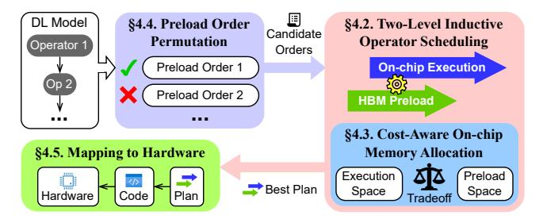

# 3.3 Larger Per-Operator Preload Space Reduces Inter-core Data Access Volume

As discussed in §2.2, data shared between cores can be either broadcasted by HBM controllers during preload or accessed from peer cores during execution. A larger preload space allows for more broadcasts at preload time and fewer on-demand accesses at execution time. Also, with fewer inter-core accesses, less memory access contention will occur on each core.

Figure 7 shows that expanding preload space reduces the intercore bandwidth demand. For each operator, we pick the fastest execution plan that fits in a given execution space  $\operatorname{size}^1$ . MinPreload lets each core access all shared data from other cores at execution time, which requires the minimum preload space. MaxPreload lets HBM controllers broadcast as much shared data as possible at preload time, which requires the largest preload space. We profile the inter-core bandwidth demand ( $\frac{\operatorname{inter-core transfer volume}}{\operatorname{per-core execution time}}$ ) of each core. MaxPreload significantly reduces the inter-core traffic.

Although more broadcasts on preload increase the HBM controller-to-core traffic, the preload traffic can be opportunistically interleaved with ongoing inter-core traffic to reduce contention. Figure 8 shows how each core's total interconnect bandwidth demand (defined as  $\frac{\text{inter-core transfer volume}}{\text{per-core execution time}} + \frac{\text{HBM-to-core transfer volume}}{\text{HBM load time}}) \text{ varies over time. Purely relying on inter-core transfer fluctuates the traffic pressure drastically, causing interconnect underutilization or}$ 

Table 1: A summary of performance tradeoffs (§3) investigated in our design (§4).

| <b>Compiler Decision</b>                | Relevant Performance Factors                                                                                                            | Relevant Design                        |  |  |
|-----------------------------------------|-----------------------------------------------------------------------------------------------------------------------------------------|----------------------------------------|--|--|
| Number of operators to preload ahead | (1) Improve HBM bandwidth utilization                                                                                                   | Two-level inductive scheduling (§4.2)  |  |  |
| Execution space size                    | (1) Accelerate per-core execution     (2) Reduce inter-core data accesses     (i.e., reduce interconnect and memory access contentions) | Cost-aware memory allocation (§4.3) |  |  |
| Preload space size of each operator     | (1) Reduce inter-core data accesses (i.e., reduce interconnect and memory access contentions)                                     | Cost-aware memory allocation (§4.3) |  |  |
| Preload order                           | (1) Reduce interconnect contention     (2) Reduce the lifespans of large     operators' preload spaces                                  | Preload order permutation (§4.4)    |  |  |

Figure 9: Overview of our Elk framework.

congestion. More broadcasts at preload time reduce fluctuation by spreading the traffic across preload and execution times.

#### 4 Design and Implementation

We design ELK, a compiler framework for exploring the efficiency of ICCA chips. ELK automatically trades-off performance factors by configuring the number of preloaded operators, the per-core execution space size, the per-operator preload space size, and the preload order of operators. We show the design overview of ELK in Figure 9. We use Table 1 to show which design component of ELK handles each performance tradeoff in §3.

#### 4.1 Design Overview

For a DL model, Elk schedules the preload and execution of operators by exploring a two-level search space. First, for each operator, Elk explores all possible numbers of future operators to preload before or during this operator's execution (§4.2). Second, for each number of preload operators, Elk optimizes on-chip memory allocation by trading off between execution and preload spaces (§4.3).

To reduce the inter-core data exchange overhead and enable larger execution space, Elk allows operators to be preloaded in a different order. Elk finds the optimal preload order by searching through all promising orders. For each order, Elk applies operator scheduling policies and conducts a performance estimation. To reduce the search overhead, Elk prunes orders that will overflow the on-chip memory (§4.4). Finally, Elk generates an optimized end-to-end plan for the entire model. The plan specifies the preload and execution plan of each operator. A code generator then translates this plan into an executable program for the hardware (§4.5).

 $^1\mathrm{For}$  each run, we use the optimal execution space size that gives the smallest total inference latency. See the description of the  $\mathit{Static}$  setup in §6.1.

(a) The state before scheduling Op5. The preload and execution of operators after Op5 are already scheduled.

(b) Schedule the execution of Op5 by finding the optimal preload number with the shortest current-to-end time.

Figure 10: Select the preload number that minimizes the "current-to-end" time.

