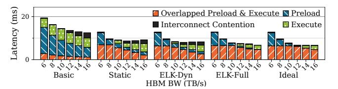
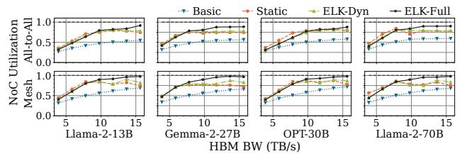
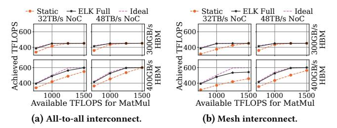

# 6.2 End-to-end Performance

Figure 17 shows the per-token generation latency of LLM decoding on our emulator. On average, *Elk-Full* outperforms *Basic* by **1.87**× (up to **1.93**×), *Static* by **1.37**× (up to **1.49**×), and achieves **94.84**% of the ideal performance. The performance of Elk also scales well with increasing batch size and sequence length. Notably, Gemma2-27B

Top column parts are inter-core data execution of each model. sharing; bottom are operator preload.

(c) Average interconnect utilization. (d) Average TFLOPS throughout the

Figure 18: Execution breakdown and resource utilization. In (a), we categorize total time into preload (HBM is busy), execute (cores are busy), overlapped execute/preload, and interconnect (execute/preload stopped by busy interconnect).

Figure 19: Per-token latency at varied HBM bandwidths.

and Llama2-70B can achieve latencies similar to those of smaller LLMs, since they use Grouped-Query Attention [5].

Inference latency breakdown. In Figure 18 (a), we break total time into four categories: (1) preload (HBM is loading), (2) execute (cores are computing/sending data), (3) overlapped preload & execute, and (4) interconnect (HBM/cores are stalled by interconnect contention). We only show batch size 32 and sequence length 2048 due to space limits. Basic always poorly overlaps preload and percore execution. By preloading more operators, Static increases the overlap time by 11.26×, but is limited by fixed preload and execution space sizes. *ELK-Dyn* overlaps better by adjusting the on-chip memory allocation based on operators' demands, but suffers from interconnect congestion and misses preload opportunities (when the available preload space is too small for the next operator, but can fit a future operator). By reordering preloads with an average edit distance of 2.9 steps, ELK-Full eliminates 87.65% of interconnect congestion overhead over ELK-Dyn. ELK-Full also reduces the non-overlapped preload time to 0.037% of the total, because of reduced on-chip memory contention.

#### Hardware Resource Utilization

HBM bandwidth. Figure 18 (b) shows the average HBM bandwidth utilization for each design. Basic uses 34.7% of the bandwidth. It only preloads the next operator, causing HBM idleness. Static utilizes 46.42% by preloading multiple operators in advance, but the fixed-size preload space limits the preload opportunity and fails to keep HBM busy. ELK-Dyn achieves 51.97% utilization by allowing larger preload spaces. ELK-Full further achieves 62.40% utilization with preload reordering, which is close to the 64.38% utilization of Ideal. Note that Ideal does not fully utilize HBM bandwidth, as

Figure 20: Breakdown of LLama2-13B per-token latency with varied HBM bandwidths on all-to-all network. We categorize total time into preload (HBM is loading), execute (cores are computing or sending data), overlapped preload/execute, and interconnect contention (preload/execute stopped by busy interconnect). We only show one case due to space limits.

there is more bandwidth available than necessary to load the entire model during execution.

Interconnect bandwidth. Figure 18 (c) shows the interconnect bandwidth utilization for each design. Basic only utilizes 57.25% of the bandwidth. Static and ELK-Dyn can better overlap execute and preload, but their utilizations are still only 76.33% and 78.28%. ELK-Full achieves 89.52% utilization, since preloads with low interconnect traffic can be reordered to match operator execution periods with high traffic. This alleviates interconnect contention. We cannot make a fair comparison with Ideal, because Ideal is modeled using two separate interconnects for preload and execute. FLOPS. In Figure 18 (d), ELK-Full achieves 81.06 TFLOPS. Though our emulator theoretically offers 1000 TFLOPS for MatMuls or 31.2 TFLOPS for other operations, LLM inference is bandwidth-bound, and actual TFLOPS is limited by on-chip data transfer (the interconnect utilization is already as high as 90%). ELK-Full's TFLOPS is already close to that of Ideal.

#### 6.4 Design Space Exploration for ICCA Chips

To understand how to scale future ICCA chips, we use our ICCA chip simulator (§5) to explore the performance impacts of different network topologies, interconnect bandwidths, HBM bandwidths, and compute capabilities (FLOPS).

(1) Higher HBM bandwidth improves the per-token latency, but the benefit will diminish due to higher interconnect contention. In Figure 19, we examine ELK with various HBM bandwidths and interconnect topologies. When HBM bandwidth is low, all designs are bounded by HBM. With more HBM bandwidth (e.g.,  $\approx$ 8TB/s for Llama2-70B), the performance becomes bounded by the interconnect and per-core execution. Also, since mesh-based network takes multiple hops to deliver HBM data to cores, it suffers higher interconnect contention than all-to-all network. Thus, it is harder for ELK-Full to match with Ideal on mesh, especially for non-GQA models like Llama2-13B and OPT-30B, as they fetch more KV cache data from HBM.

In Figure 20, we show the latency breakdown of the interconnect contention. For Basic/Static/ELK-Dyn, contention increases with higher HBM bandwidth, as faster HBM needs more interconnect bandwidth to deliver data to cores. ELK-Full's reordering allows more preload opportunities which better utilize the faster HBM to eliminate the contention.

In Figure 21, we compare the interconnect utilization between the all-to-all and mesh topologies. While achieving similar serving

Figure 21: Interconnect utilization at varied HBM bandwidths.

Figure 22: Llama2-70B latency of at varied NoC bandwidths.

Figure 23: Per-token latency at varied core counts.

latencies, mesh chips always experience higher interconnect utilization than all-to-all, since mesh takes multiple hops to deliver HBM data to cores. For both topologies, *ELK-Full* is the only design that can almost fully utilize the interconnect. In other designs, HBM data delivery often occupies the interconnect and stalls the execution.

- (2) The interconnect and HBM bandwidths should scale together to avoid performance bottlenecks. In Figure 22, we examine how the interconnect bandwidth impacts the performance under different HBM bandwidths. When the HBM bandwidth is low (e.g., 8TB/s per 4 chips), increasing the interconnect bandwidth beyond a certain point (e.g., 40TB/s) has no benefit, since HBM is the bottleneck. With higher HBM bandwidth, performance scales with the interconnect bandwidth, and *ELK-Full* can best utilize both bandwidths to achieve near-*Ideal* performance. Compared with all-to-all, the performance of mesh is more sensitive to the interconnect bandwidth. This matches the finding that mesh-based ICCA chips utilize the interconnect more heavily (Figure 21).
- (3) ELK enables scalable performance for ML inference workloads as we scale the ICCA chip. In Figure 23, we change the number of cores while setting the HBM bandwidth to 2.7GBps/core to match prior setups. *ELK-Full* significantly outperforms other designs regardless of core counts. *ELK-Full* reduces the average latency by 1.71× over *Basic* and 1.36× over *Static*. We also examine DiT-XL, a state-of-the-art stable diffusion model, on one ICCA chip (up to 1472 cores). *ELK-Full*'s benefit on DiT-XL is less obvious than on LLMs, since DiT-XL is compute-intensive and less affected by preload efficiency. However, *ELK-Full* still outperforms other designs on DiT-XL and achieves near-ideal performance.

Figure 24: Average TFLOPS during the training of Llama2-13B, given varied amount of computation resources.

(4) ICCA chips can also benefit ML training by properly tuning the compute, communication, and off-chip memory access. In Figure 24, we examine the forward pass of training Llama2-13B with varied available FLOPS and interconnect/HBM bandwidths (the backward pass has similar trends). Unlike decoding, training is compute-intensive, scaling only interconnect/HBM bandwidth has little impact. With 400GB/s HBM bandwidth, it is sufficient to fulfill more than 600 TFLOPS. Thus, for compute-intensive workloads, the ICCA chips should focus on scaling the FLOPS, and can therefore be paired with cheaper memory (e.g., GDDR/LPDDR/DDR) to reduce manufacturing costs. Note that the achieved FLOPS is often lower than the peak FLOPS of the hardware, because only MatMul operators with perfect shapes can fully utilize the FLOPS of specialized tensor cores.

#### 7 Discussion and Future Work

Apply ELK to GPUs. The latest NVIDIA GPU also uses inter-core links to connect its stream multiprocessors (SMs) [2]. It groups SMs into clusters. SMs in the same cluster are connected via direct inter-SM links, while different clusters can only exchange data via the global L2 cache. On current GPUs like H100 [42], the aggregated inter-SM bandwidth is close to the HBM bandwidth, so it will suffer from significant interconnect contention (② in Figure 2). As future work, we wish to extend ELK to GPU and investigate the design space for optimizing GPU's interconnect architecture.

Apply Elk to MoE. Elk can support dynamic mixture-of-experts (MoE) models. In MoE, an operator may choose different parameter tensors (i.e., experts) based on the input token. At compile time, as all experts have the same shape, Elk will optimize the execution plan based on a generic expert. Elk will schedule the preload of an expert to a time after the model selects which expert to use (e.g., after the expert routing operator or the expert prediction [13]). On execution, the chip preloads expert tensors using the partition plans given by Elk and the expert indices selected at runtime.

**Apply ELK to other optimization objectives.** While ELK currently optimizes the performance, it can be adapted to support optimizing for a wide variety of objectives, by replacing the performance-based cost model in §4.3 with others (e.g., optimize power by adapting a cost model that estimates power usage).

**Apply ELK to other execution models.** For different ICCA chip implementations, they may have different execution models [7, 34, 47]. For example, SambaNova chips [46] support a spatial pipeline execution model that runs different operators on different sets of cores [47]. The pipelined execution keeps model weights stationary on each core and lets activation tensors flow through

cores. This enables significantly higher serving throughput, though the latency of each serving request may increase if there are too many pipeline stages. This execution model also experiences the resource constraints in [§2.3.](#page-2-2) Specifically, it still needs to use HBM to swap the model weights inside each core's SRAM, unless it uses the SRAM of hundreds of chips to store an entire LLM. Thus, the pipelined execution has to (1) reserve SRAM for both currently executing data and newly preloaded data and (2) use the interconnect for both inter-core data transfer and HBM data loading, requiring the compiler to consider the resource constraints in [§2.3.](#page-2-2) To optimize for this spatial pipeline execution model, we can modify Elk's search algorithm to explore the new scheduling space of this model (e.g., decide the number of pipeline stages per chip and the number of cores per stage). We wish to explore the optimization space of various execution models as future work.

