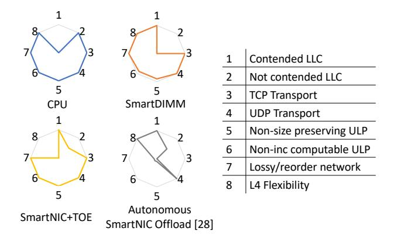

# *D. Area and Power*

We use Xilinx Vivado 2019.2 Power analyzer [\[83\]](#page-16-7) for estimating the power of SmartDIMM. Our FPGA prototype consumes 4.78 Watts of dynamic power when SmartDIMM is fully utilized, meaning that the DDR channel reaches its full capacity. Our experimental results show less than 30% of memory channel utilization when offloading TLS for different applications. On average, across all three benchmarks operating at maximum sustainable load, SmartDIMM increases the power consumption of AxDIMM by ∼0.92 Watts. Implementing the TLS offload on SmartDIMM takes ∼21.8% of the FPGA resources.

#### VIII. DISCUSSION

In the current landscape of ULP acceleration, SmartDIMM demonstrates robust performance amidst contended LLC, maintains efficiency despite network packet losses, and adapts to

**Fig. 13. Comparison of the current ULP processing design space. The relative performance of each processing option is compared with respect to the following metrics: performance in the face of low or high LLC contention, compatibility with underlying transport protocols (TCP and UDP), ability to target diverse (non-size preserving and non-incrementally computable) ULPs, resistance to performance degradation when packets are lost or reordered, and the flexibility of the layer-4 transport protocol.**

various underlying transport layer protocols. This performance is depicted in Fig[.13,](#page-11-0) where different ULP processing options are compared across various criteria.

We note that a SmartNIC offering autonomous ULP offload with an optimized (zero copy) software stack shares many benefits, particularly when the underlying transport layer, such as UDP, does not guarantee reliable delivery of ULP messages and experiences minimal packet drops. However, previous SmartNICs that accelerate processing via TCP Offload Engines (TOEs) bypass out-of-order network stack processing by offloading both TCP/IP and ULP tasks to the SmartNIC. As illustrated in Fig[.13,](#page-11-0) this approach can limit optimizations at the transport layer software and efforts to address emerging vulnerabilities [\[84,](#page-16-8) [85\]](#page-16-9).

While the CPU provides the flexibility to offload any ULP in conjunction with any software or network stack, it comes at the cost of increased LLC contention and limited on-chip resources. This, in turn, adversely affects applications that depend on ULP processing.

ULP acceleration represents a dynamic and evolving design space. Employing an accelerator requires system designers to carefully consider its placement, ensuring alignment with the application needs and network transport protocol characteristics. SmartDIMM represents an alternative option in the future of compute-everywhere data centers.

#### IX. RELATED WORK

Accelerating data transformations. Accelerating I/O-related datacenter taxes is becoming a priority for datacenter service providers. This has sparked the development of hardware accelerators for ULPs and microservices accessible via RPCs. Previous works have evaluated different solutions for accelerating data transformations.

Pourhabibi et al. [\[52,](#page-14-18) [53\]](#page-14-15) designed hardware accelerators for serialization frameworks like Google's protobuf, proposing solutions for accelerating data transformations on-chip and on SmartNIC. Karandikar et al. [\[51\]](#page-14-19) also designed an on-chip accelerator for accelerating (de)serialization related to Google's protobuf. Hu et al. [\[86\]](#page-16-10) construct an asynchronous framework for event-driven web services (e.g., Nginx) by creating an OpenSSL engine that utilizes asynchronous communication with Intel's QuickAssist PCIe accelerators. Pismenny et al. [\[26\]](#page-13-7) implement inline TLS encryption/decryption and NVMe-TCP acceleration on Mellanox ConnectX6 NICs without offloading layers 4 and below. Lazarev et al. [\[50\]](#page-14-20) introduce a reconfigurable FPGA accelerator to offload the entire RPC stack using fast memory interconnects. SmartDIMM complements these works by providing an alternative location to process ULPs inside the memory, preventing cache thrashing at high loads, and enabling hardware offload for a larger range of ULPs.

Near-memory processing. There are a myriad of prior works on various near-memory processing architectures [\[73,](#page-15-16) [75,](#page-15-18) [76,](#page-16-0) [87–](#page-16-11)[97\]](#page-16-12). SmartDIMM is unique because it removes the need for a synchronization mechanism between the CPU and nearmemory accelerator, does not require a separate memory controller for the near-memory accelerator, and implements an API to reuse the existing software stack and programming models.

#### X. CONCLUSION

Restricting accelerator placement for ULPs to CPUs and SmartNICs limits both the variety of ULPs that can be accelerated and the overall performance. Specifically, such placements do not take into account the opportunity to accelerate ULPs operating on top of a stateful transport protocol, especially in scenarios with high cache contention. At high network rates, the frequent DRAM accesses and SmartNIC-CPU synchronization outweigh the benefits of hardware acceleration. In this work, we introduce SmartDIMM, an architecture and programming model designed for accelerating ULPs near the memory. SmartDIMM enables accelerator placement on the buffer device of commodity DIMMs, thereby unleashing the potential to accelerate ULPs that operate on stateful transport protocols and suffer from poor cache performance. We have prototyped SmartDIMM using Samsung's AxDIMM and evaluated its effectiveness with two important ULPs.

#### ACKNOWLEDGMENTS

This work was supported in part by grants from National Science Foundation (CCF-2239020 and DGE-1565570), Samsung's Open Innovation Contest, and ACE, one of the seven centers in JUMP 2.0, a Semiconductor Research Corporation (SRC) program sponsored by DARPA. We thank NVIDIA Academic Hardware Grant Program and Ampere Computing for their hardware donations. We also thank Ramesh Ganapam for his circuit models used in our evaluations.

#### APPENDIX

#### *A. Abstract*

This artifact appendix describes how to use the publicly available scripts to reproduce the sensitivity analysis and evaluations in Section 7 of this paper. We use a publicly available HTTP web server (Nginx), compression corpora, and software compression algorithms available online. Results reproduced will include web server and system performance for different accelerator and CPU configurations offloading ULPs including compression and encryption.

#### *B. Artifact check-list (meta-information)*

- Algorithm: SmartDIMM
- Program: Nginx, SmartDIMM-compatible nginx compression module (source provided)
- Compilation: gcc 8.4.0 (Ubuntu 8.4.0-3ubuntu2)
- Run-time environment: Tested on Ubuntu 20.04
- Hardware: Intel c6250 Server
- Experiments: As described in Sec. [VII-B.](#page-9-3)
- Publicly available?: [https://github.com/architecture-research](https://github.com/architecture-research-group/SmartDIMM_ArtifactEvaluation.git)[group/SmartDIMM\\_ArtifactEvaluation.git](https://github.com/architecture-research-group/SmartDIMM_ArtifactEvaluation.git)
- Code licenses (if publicly available)?: MIT
- Archived (provide DOI)?: [https://doi.org/10.5281/zenodo.](https://doi.org/10.5281/zenodo.10278844) [10278844](https://doi.org/10.5281/zenodo.10278844)

#### *C. Description*

*1) How to access*

See github link above.

*2) Hardware dependencies*

Some experiments depend on access to two servers. They can be multi-core servers allocated as r650 nodes available through cloudlab. This hardware is sufficient to reproduce CPU and SmartNIC results.

*3) Software dependencies* See github link above.

#### *D. Installation*

Obtain the code and sub-modules from github and run corresponding fetch and run scripts. Instructions for each experiment are provided in each subdirectory of the repository. Scripts for running each experiment are provided as bash shell scripts.

#### *E. Experiment workflow and expected results*

Use build scripts (e.g., build.sh) to compile various nginx versions, and acquire any required dependencies. Use shell scripts (e.g., compressed\_http\_run.sh and tls\_http\_run.sh) to generate needed server's files files and reproduce results. Normalize and plot them using gnuplot scripts. (Experimentspecific instructions provided in the Github repository provided above).

#### REFERENCES

- [1] Alex Guzman, Kyle Nekritz, and Subodh Iyengar. Deploying tls 1.3 at scale with fizz, a performant open source tls library. *Facebook Engineering*, August 2018. URL [https://engineering.fb.com/2018/08/06/security/fizz/.](https://engineering.fb.com/2018/08/06/security/fizz/)
- [2] Tim Anderson, Ken Beer, Min Hyun, and Mark Ryland. Encrypting data-at-rest and -in-transit. *Amazon Web Services*, 2007. URL [https://doi.org/10.6028/NIST.SP.800-](https://doi.org/10.6028/NIST.SP.800-38D) [38D.](https://doi.org/10.6028/NIST.SP.800-38D) NIST Special Publication 800-38D.
- [3] Matt Silverlock and Gabriel Redner. Bringing modern transport security to google cloud with tls 1.3. Technical report, *Google*, June 2020.

- URL [https://cloud.google.com/blog/products/networking/](https://cloud.google.com/blog/products/networking/tls-1-3-is-now-on-by-default-for-google-cloud-services) [tls-1-3-is-now-on-by-default-for-google-cloud-services.](https://cloud.google.com/blog/products/networking/tls-1-3-is-now-on-by-default-for-google-cloud-services)
- [4] Mark Slee, Aditya Agarwal, and Marc Kwiatkowski. Thrift: Scalable cross-language services implementation. *Facebook white paper*, 5(8):127, 2007. URL [https:](https://thrift.apache.org/static/files/thrift-20070401.pdf) [//thrift.apache.org/static/files/thrift-20070401.pdf.](https://thrift.apache.org/static/files/thrift-20070401.pdf)
- [5] Protocol buffers | google developers. [https://developers.](https://developers.google.com/protocol-buffers) [google.com/protocol-buffers.](https://developers.google.com/protocol-buffers)
- [6] Cap'n proto. [https://capnproto.org/.](https://capnproto.org/)
- [7] finagle-rpc. [https://twitter.github.io/finagle/.](https://twitter.github.io/finagle/)
- [8] zstd. [https://github.com/facebook/zstd,](https://github.com/facebook/zstd) 2022.
- [9] brotli. [https://github.com/google/brotli,](https://github.com/google/brotli) 2022.
- [10] Svilen Kanev, Juan Pablo Darago, Kim Hazelwood, Parthasarathy Ranganathan, Tipp Moseley, Gu-Yeon Wei, and David Brooks. Profiling a warehouse-scale computer. In *2015 ACM/IEEE 42nd Annual International Symposium on Computer Architecture (ISCA)*, pages 158–169, 2015. doi: 10.1145/2749469.2750392.
- [11] Akshitha Sriraman and Abhishek Dhanotia. Accelerometer: Understanding Acceleration Opportunities for Data Center Overheads at Hyperscale. In *Proceedings of the Twenty-Fifth International Conference on Architectural Support for Programming Languages and Operating Systems*, ASPLOS '20, pages 733–750, New York, NY, USA, March 2020. Association for Computing Machinery. ISBN 978-1-4503-7102-5. doi: 10.1145/3373376.3378450. URL [https://doi.org/10.1145/3373376.3378450.](https://doi.org/10.1145/3373376.3378450)
- [12] Geonhwa Jeong, Bikash Sharma, Nick Terrell, Abhishek Dhanotia, Zhiwei Zhao, Niket Agarwal, Arun Kejariwal, and Tushar Krishna. Characterization of data compression in datacenters. In *2023 IEEE International Symposium on Performance Analysis of Systems and Software (ISPASS)*, pages 1–12, 2023. doi: 10.1109/ISPASS57527.2023. 00010.
- [13] Sagar Karandikar, Aniruddha N. Udipi, Junsun Choi, Joonho Whangbo, Jerry Zhao, Svilen Kanev, Edwin Lim, Jyrki Alakuijala, Vrishab Madduri, Yakun Sophia Shao, Borivoje Nikolic, Krste Asanovic, and Parthasarathy Ranganathan. CDPU: Co-designing compression and decompression processing units for hyperscale systems. In *Proceedings of the 50th Annual International Symposium on Computer Architecture*, ISCA '23, New York, NY, USA, 2023. Association for Computing Machinery. ISBN 9798400700958. doi: 10.1145/3579371.3589074. URL [https://doi.org/10.1145/3579371.3589074.](https://doi.org/10.1145/3579371.3589074)
- [14] Abraham Gonzalez, Aasheesh Kolli, Samira Khan, Sihang Liu, Vidushi Dadu, Sagar Karandikar, Jichuan Chang, Krste Asanovic, and Parthasarathy Ranganathan. Profiling hyperscale big data processing. In *Proceedings of the 50th Annual International Symposium on Computer Architecture*, ISCA '23, New York, NY, USA, 2023. Association for Computing Machinery. ISBN 9798400700958. doi: 10.1145/3579371.3589082. URL [https://doi.org/10.1145/3579371.3589082.](https://doi.org/10.1145/3579371.3589082)
- [15] Keynote by Bill Dally (NVIDIA): Accelerator Clusters. [https://www.youtube.com/watch?v=napEsaJ5hMU.](https://www.youtube.com/watch?v=napEsaJ5hMU)

- [16] NVIDIA. Nvidia bluefield-3 dpu datasheet. [https://resources.nvidia.com/en-us-accelerated](https://resources.nvidia.com/en-us-accelerated-networking-resource-library/datasheet-nvidia-bluefield?lx=LbHvpR&topic=networking-cloud)[networking-resource-library/datasheet-nvidia](https://resources.nvidia.com/en-us-accelerated-networking-resource-library/datasheet-nvidia-bluefield?lx=LbHvpR&topic=networking-cloud)[bluefield?lx=LbHvpR&topic=networking-cloud,](https://resources.nvidia.com/en-us-accelerated-networking-resource-library/datasheet-nvidia-bluefield?lx=LbHvpR&topic=networking-cloud) 2023.
- [17] J. Dastidar, D. Riddoch, J. Moore, S. Pope, and J. Wesselkamper. The amd 400-g adaptive smartnic system on chip: A technology preview. *IEEE Micro*, 43(03):40–49, may 2023. ISSN 1937-4143. doi: 10.1109/MM.2023. 3260186.
- [18] Data Processing Units (DPU) | Empowering 5G Carrier, Enterprise and Cloud Data Services - Marvell — marvell.com. [https://www.marvell.com/products/data](https://www.marvell.com/products/data-processing-units.html)[processing-units.html.](https://www.marvell.com/products/data-processing-units.html)
- [19] Broadcom Inc. | Connecting Everything — broadcom.com. [https://www.broadcom.com/company/news/](https://www.broadcom.com/company/news/product-releases/53106) [product-releases/53106.](https://www.broadcom.com/company/news/product-releases/53106)
- [20] Brian Will, Andrea Grandi, and Nicolas Salhuana. Intel® QuickAssist Technology OpenSSL-1.1.0: Performance. Technical report, Intel, 01 2017.
- [21] AMD GZIP Compression & Decompression xilinx.com. [https://www.xilinx.com/products/acceleration](https://www.xilinx.com/products/acceleration-solutions/xilinx-gzip-compression-decompression.html)[solutions/xilinx-gzip-compression-decompression.html.](https://www.xilinx.com/products/acceleration-solutions/xilinx-gzip-compression-decompression.html)
- [22] Ben Casey. DirectCompress Accelerator Packs More into FlashArray//XL, March 2023. URL [https:](https://blog.purestorage.com/purely-technical/directcompress-accelerator-packs-more-data-into-flasharray-xl/) [//blog.purestorage.com/purely-technical/directcompress](https://blog.purestorage.com/purely-technical/directcompress-accelerator-packs-more-data-into-flasharray-xl/)[accelerator-packs-more-data-into-flasharray-xl/.](https://blog.purestorage.com/purely-technical/directcompress-accelerator-packs-more-data-into-flasharray-xl/)
- [23] Bulent Abali, Bart Blaner, John Reilly, Matthias Klein, Ashutosh Mishra, Craig B. Agricola, Bedri Sendir, Alper Buyuktosunoglu, Christian Jacobi, William J. Starke, Haren Myneni, and Charlie Wang. Data compression accelerator on ibm power9 and z15 processors. In *Proceedings of the ACM/IEEE 47th Annual International Symposium on Computer Architecture*, ISCA '20, page 1–14. IEEE Press, 2020. ISBN 9781728146614. doi: 10.1109/ISCA45697.2020.00012. URL [https://doi.org/10.](https://doi.org/10.1109/ISCA45697.2020.00012) [1109/ISCA45697.2020.00012.](https://doi.org/10.1109/ISCA45697.2020.00012)
- [24] Nevine Nassif, Ashley O. Munch, Carleton L. Molnar, Gerald Pasdast, Sitaraman V. Lyer, Zibing Yang, Oscar Mendoza, Mark Huddart, Srikrishnan Venkataraman, Sireesha Kandula, Rafi Marom, Alexandra M. Kern, Bill Bowhill, David R. Mulvihill, Srikanth Nimmagadda, Varma Kalidindi, Jonathan Krause, Mohammad M. Haq, Roopali Sharma, and Kevin Duda. Sapphire rapids: The next-generation intel xeon scalable processor. In *2022 IEEE International Solid- State Circuits Conference (ISSCC)*, volume 65, pages 44–46, 2022. doi: 10.1109/ISSCC42614.2022.9731107.
- [25] Ilias Marinos, Robert N.M. Watson, Mark Handley, and Randall R. Stewart. Disk|crypt|net: Rethinking the stack for high-performance video streaming. In *Proceedings of the Conference of the ACM Special Interest Group on Data Communication*, SIGCOMM '17, page 211–224, New York, NY, USA, 2017. Association for Computing Machinery. ISBN 9781450346535. doi: 10.1145/3098822. 3098844. URL [https://doi.org/10.1145/3098822.3098844.](https://doi.org/10.1145/3098822.3098844)
- [26] Boris Pismenny, Haggai Eran, Aviad Yehezkel, Liran

- Liss, Adam Morrison, and Dan Tsafrir. Autonomous nic offloads. In *Proceedings of the 26th ACM International Conference on Architectural Support for Programming Languages and Operating Systems*, ASPLOS 2021, page 18–35, New York, NY, USA, 2021. Association for Computing Machinery. ISBN 9781450383172. doi: 10.1145/3445814.3446732. URL [https://doi.org/10.1145/](https://doi.org/10.1145/3445814.3446732) [3445814.3446732.](https://doi.org/10.1145/3445814.3446732)
- [27] Jung-Sik Kim, Kyungwoo Nam, Chi Sung Oh, Han Gu Sohn, Donghyuk Lee, Sooyoung Kim, Jong-Wook Park, Yongjun Kim, Mi-Jo Kim, Jin-Guk Kim, Hocheol Lee, Jinhyoung Kwon, Dong Il Seo, Young-Hyun Jun, and Kinam Kim. A 512 mb two-channel mobile dram (onedram) with shared memory array. *IEEE Journal of Solid-State Circuits*, 43(11):2381–2389, 2008. doi: 10.1109/JSSC.2008.2004523.
- [28] Donghyuk Lee, Lavanya Subramanian, Rachata Ausavarungnirun, Jongmoo Choi, and Onur Mutlu. Decoupled direct memory access: Isolating cpu and io traffic by leveraging a dual-data-port dram. In *2015 International Conference on Parallel Architecture and Compilation (PACT)*, pages 174–187, 2015. doi: 10.1109/PACT.2015.51.
- [29] Benjamin Y. Cho, Yongkee Kwon, Sangkug Lym, and Mattan Erez. Near data acceleration with concurrent host access. In *Proceedings of the ACM/IEEE 47th Annual International Symposium on Computer Architecture*, ISCA '20, page 818–831. IEEE Press, 2020. ISBN 9781728146614. doi: 10.1109/ISCA45697.2020.00072. URL [https://doi.org/10.1109/ISCA45697.2020.00072.](https://doi.org/10.1109/ISCA45697.2020.00072)
- [30] Sukhan Lee, Shin-haeng Kang, Jaehoon Lee, Hyeonsu Kim, Eojin Lee, Seungwoo Seo, Hosang Yoon, Seungwon Lee, Kyounghwan Lim, Hyunsung Shin, Jinhyun Kim, O Seongil, Anand Iyer, David Wang, Kyomin Sohn, and Nam Sung Kim. Hardware architecture and software stack for pim based on commercial dram technology : Industrial product. In *2021 ACM/IEEE 48th Annual International Symposium on Computer Architecture (ISCA)*, pages 43– 56, 2021. doi: 10.1109/ISCA52012.2021.00013.
- [31] Jin Hyun Kim, Shin-Haeng Kang, Sukhan Lee, Hyeonsu Kim, Yuhwan Ro, Seungwon Lee, David Wang, Jihyun Choi, Jinin So, YeonGon Cho, JoonHo Song, Jeonghyeon Cho, Kyomin Sohn, and Nam Sung Kim. Aquabolt-xl hbm2-pim, lpddr5-pim with in-memory processing, and axdimm with acceleration buffer. *IEEE Micro*, 42(3): 20–30, 2022. doi: 10.1109/MM.2022.3164651.
- [32] Inc. OpenSSL Foundation. /docs/man1.1.1/man1/opensslengine.html — openssl.org. [https://www.openssl.org/docs/](https://www.openssl.org/docs/man1.1.1/man1/openssl-engine.html) [man1.1.1/man1/openssl-engine.html.](https://www.openssl.org/docs/man1.1.1/man1/openssl-engine.html)
- [33] Eric Rescorla. The Transport Layer Security (TLS) Protocol Version 1.3. RFC 8446, August 2018. URL [https://www.rfc-editor.org/info/rfc8446.](https://www.rfc-editor.org/info/rfc8446)
- [34] Morris Dworkin (NIST). Recommendation for block cipher modes of operation: Galois/Counter Mode (GCM) and Galois Message Authentication Code (GMAC). Technical Report NIST Special Publication 800-38D, U.S.

- Department of Commerce, Washington, D.C., 2007.
- [35] P. Deutsch. Deflate compressed data format specification version 1.3. [https://www.rfc-editor.org/rfc/rfc1951.](https://www.rfc-editor.org/rfc/rfc1951)
- [36] Content-Encoding - HTTP | MDN — developer.mozilla.org. [https://developer.mozilla.org/en-](https://developer.mozilla.org/en-US/docs/Web/HTTP/Headers/Content-Encoding)[US/docs/Web/HTTP/Headers/Content-Encoding.](https://developer.mozilla.org/en-US/docs/Web/HTTP/Headers/Content-Encoding) [Accessed 23-12-2023].
- [37] J. Ziv and A. Lempel. A universal algorithm for sequential data compression. *IEEE Transactions on Information Theory*, 23(3):337–343, 1977. doi: 10.1109/TIT.1977. 1055714.
- [38] David A. Huffman. A method for the construction of minimum-redundancy codes. *Proceedings of the IRE*, 40(9):1098–1101, 1952. doi: 10.1109/JRPROC.1952. 273898.
- [39] Intel data direct i/o technology (intel ddio): A primer. [https://www.intel.com/content/www/us/en/io/data](https://www.intel.com/content/www/us/en/io/data-direct-i-o-technology-brief.html)[direct-i-o-technology-brief.html.](https://www.intel.com/content/www/us/en/io/data-direct-i-o-technology-brief.html)
- [40] ARM. Arm DynamIQ Shared Unit Technical Reference Manual r3p0. [https://developer.arm.com/documentation/](https://developer.arm.com/documentation/100453/0300/) [100453/0300/.](https://developer.arm.com/documentation/100453/0300/)
- [41] Amin Tootoonchian, Aurojit Panda, Chang Lan, Melvin Walls, Katerina Argyraki, Sylvia Ratnasamy, and Scott Shenker. ResQ: Enabling SLOs in network function virtualization. In *15th USENIX Symposium on Networked Systems Design and Implementation (NSDI 18)*, pages 283–297, Renton, WA, April 2018. USENIX Association. ISBN 978-1-939133-01-4. URL [https://www.usenix.org/](https://www.usenix.org/conference/nsdi18/presentation/tootoonchian) [conference/nsdi18/presentation/tootoonchian.](https://www.usenix.org/conference/nsdi18/presentation/tootoonchian)
- [42] Mohammad Alian, Siddharth Agarwal, Jongmin Shin, Neel Patel, Yifan Yuan, Daehoon Kim, Ren Wang, and Nam Sung Kim. Idio: Network-driven, inbound network data orchestration on server processors. In *2022 55th IEEE/ACM International Symposium on Microarchitecture (MICRO)*, pages 480–493, 2022. doi: 10.1109/MICRO56248.2022.00042.
- [43] Shay Gueron. Intel advanced encryption standard (aes) new instructions set, 2010.
- [44] Intel. Intel quickassist adapter 8970. URL [https://www.](https://www.intel.com/content/www/us/en/products/sku/125200/intel-quickassist-adapter-8970/specifications.html) [intel.com/content/www/us/en/products/sku/125200/intel](https://www.intel.com/content/www/us/en/products/sku/125200/intel-quickassist-adapter-8970/specifications.html)[quickassist-adapter-8970/specifications.html.](https://www.intel.com/content/www/us/en/products/sku/125200/intel-quickassist-adapter-8970/specifications.html)
- [45] B. Kaliski J. Jonsson A. Rusch K. Moriarty, Ed. PKCS 1: RSA Cryptography Specifications Version 2.2. RFC 8017, November 2016. URL [https://datatracker.ietf.org/](https://datatracker.ietf.org/doc/html/rfc8017) [doc/html/rfc8017.](https://datatracker.ietf.org/doc/html/rfc8017)
- [46] M. Salter D. McGrew, K. Igoe. Fundamental Elliptic Curve Cryptography Algorithms. RFC 6090, February 2011. URL [https://datatracker.ietf.org/doc/html/rfc6090.](https://datatracker.ietf.org/doc/html/rfc6090)
- [47] Amirhossein Mirhosseini, Hossein Golestani, and Thomas F. Wenisch. Hyperplane: A scalable low-latency notification accelerator for software data planes. In *2020 53rd Annual IEEE/ACM International Symposium on Microarchitecture (MICRO)*, pages 852–867, 2020. doi: 10.1109/MICRO50266.2020.00074.
- [48] Yifan Yuan, Jinghan Huang, Yan Sun, Tianchen Wang, Jacob Nelson, Dan R. K. Ports, Yipeng Wang, Ren Wang,

- Charlie Tai, and Nam Sung Kim. Rambda: Rdma-driven acceleration framework for memory-intensive µs-scale datacenter applications. In *2023 IEEE International Symposium on High-Performance Computer Architecture (HPCA)*, pages 499–515, 2023. doi: 10.1109/HPCA56546. 2023.10071127.
- [49] Mohammad Alian and Nam Sung Kim. NetDIMM: Lowlatency near-memory network interface architecture. In *Proceedings of the 52nd Annual IEEE/ACM International Symposium on Microarchitecture*, pages 699–711. ACM, 2019.
- [50] Nikita Lazarev, Shaojie Xiang, Neil Adit, Zhiru Zhang, and Christina Delimitrou. Dagger: Efficient and fast rpcs in cloud microservices with near-memory reconfigurable nics. In *Proceedings of the 26th ACM International Conference on Architectural Support for Programming Languages and Operating Systems*, ASPLOS 2021, page 36–51, New York, NY, USA, 2021. Association for Computing Machinery. ISBN 9781450383172. doi: 10.1145/3445814.3446696. URL [https://doi.org/10.1145/](https://doi.org/10.1145/3445814.3446696) [3445814.3446696.](https://doi.org/10.1145/3445814.3446696)
- [51] Sagar Karandikar, Chris Leary, Chris Kennelly, Jerry Zhao, Dinesh Parimi, Borivoje Nikolic, Krste Asanovic, and Parthasarathy Ranganathan. A hardware accelerator for protocol buffers. In *MICRO-54: 54th Annual IEEE/ACM International Symposium on Microarchitecture*, MICRO '21, page 462–478, New York, NY, USA, 2021. Association for Computing Machinery. ISBN 9781450385572. doi: 10.1145/3466752.3480051. URL [https://doi.org/10.1145/3466752.3480051.](https://doi.org/10.1145/3466752.3480051)
- [52] Arash Pourhabibi, Mark Sutherland, Alexandros Daglis, and Babak Falsafi. Cerebros: Evading the rpc tax in datacenters. In *MICRO-54: 54th Annual IEEE/ACM International Symposium on Microarchitecture*, MICRO '21, page 407–420, New York, NY, USA, 2021. Association for Computing Machinery. ISBN 9781450385572. doi: 10.1145/3466752.3480055. URL [https://doi.org/10.1145/](https://doi.org/10.1145/3466752.3480055) [3466752.3480055.](https://doi.org/10.1145/3466752.3480055)
- [53] Arash Pourhabibi, Siddharth Gupta, Hussein Kassir, Mark Sutherland, Zilu Tian, Mario Paulo Drumond, Babak Falsafi, and Christoph Koch. Optimus prime: Accelerating data transformation in servers. In *Proceedings of the Twenty-Fifth International Conference on Architectural Support for Programming Languages and Operating Systems*, ASPLOS '20, page 1203–1216, New York, NY, USA, 2020. Association for Computing Machinery. ISBN 9781450371025. doi: 10.1145/3373376.3378501. URL [https://doi.org/10.1145/3373376.3378501.](https://doi.org/10.1145/3373376.3378501)
- [54] Yifan Yuan, Mohammad Alian, Yipeng Wang, Ren Wang, Ilia Kurakin, Charlie Tai, and Nam Sung Kim. Don't forget the i/o when allocating your llc. In *2021 ACM/IEEE 48th Annual International Symposium on Computer Architecture (ISCA)*, pages 112–125. IEEE, 2021.
- [55] Minhu Wang, Mingwei Xu, and Jianping Wu. Understanding I/O Direct Cache Access Performance for

- End Host Networking. *Proceedings of the ACM on Measurement and Analysis of Computing Systems*, 6(1): 22:1–22:37, February 2022. doi: 10.1145/3508042. URL [https://dl.acm.org/doi/10.1145/3508042.](https://dl.acm.org/doi/10.1145/3508042)
- [56] Donghun Lee, Jinin So, MINSEON AHN, Jong-Geon Lee, Jungmin Kim, Jeonghyeon Cho, Rebholz Oliver, Vishnu Charan Thummala, Ravi shankar JV, Sachin Suresh Upadhya, Mohammed Ibrahim Khan, and Jin Hyun Kim. Improving in-memory database operations with acceleration dimm (axdimm). In *Data Management on New Hardware*, DaMoN'22, New York, NY, USA, 2022. Association for Computing Machinery. ISBN 9781450393782. doi: 10.1145/3533737.3535093. URL [https://doi.org/10.1145/3533737.3535093.](https://doi.org/10.1145/3533737.3535093)
- [57] Xilinx. Ultrascale architecture-based fpgas memory ip v1.4, 2022. URL [https://www.xilinx.com/content/dam/](https://www.xilinx.com/content/dam/xilinx/support/documents/ip_documentation/ultrascale_memory_ip/v1_4/pg150-ultrascale-memory-ip.pdf) [xilinx/support/documents/ip\\_documentation/ultrascale\\_](https://www.xilinx.com/content/dam/xilinx/support/documents/ip_documentation/ultrascale_memory_ip/v1_4/pg150-ultrascale-memory-ip.pdf) [memory\\_ip/v1\\_4/pg150-ultrascale-memory-ip.pdf.](https://www.xilinx.com/content/dam/xilinx/support/documents/ip_documentation/ultrascale_memory_ip/v1_4/pg150-ultrascale-memory-ip.pdf)
- [58] R. N. Mahapatra and R. V.C. TCAM architecture for ip lookup using prefix properties. *IEEE Micro*, 24(02): 60–69, March 2004. ISSN 1937-4143. doi: 10.1109/MM. 2004.1289292.
- [59] Dimitris Fotakis, Rasmus Pagh, Peter Sanders, and Paul G. Spirakis. Space efficient hash tables with worst case constant access time. In *Proceedings of the 20th Annual Symposium on Theoretical Aspects of Computer Science*, STACS '03, page 271–282, Berlin, Heidelberg, 2003. Springer-Verlag. ISBN 3540006230.
- [60] Dimitrios Skarlatos, Apostolos Kokolis, Tianyin Xu, and Josep Torrellas. *Elastic Cuckoo Page Tables: Rethinking Virtual Memory Translation for Parallelism*, page 1093–1108. Association for Computing Machinery, New York, NY, USA, 2020. ISBN 9781450371025. URL [https://doi.org/10.1145/3373376.3378493.](https://doi.org/10.1145/3373376.3378493)
- [61] JEDEC Standard: DDR4 SDRAM, 2012.
- [62] Mengjia Yan, Read Sprabery, Bhargava Gopireddy, Christopher Fletcher, Roy Campbell, and Josep Torrellas. Attack directories, not caches: Side channel attacks in a non-inclusive world. In *2019 IEEE Symposium on Security and Privacy (SP)*, pages 888–904, 2019. doi: 10.1109/SP.2019.00004.
- [63] Alex Markuze, Adam Morrison, and Dan Tsafrir. True iommu protection from dma attacks: When copy is faster than zero copy. In *Proceedings of the Twenty-First International Conference on Architectural Support for Programming Languages and Operating Systems*, ASPLOS '16, page 249–262, New York, NY, USA, 2016. Association for Computing Machinery. ISBN 9781450340915. doi: 10.1145/2872362.2872379. URL [https://doi.org/10.1145/2872362.2872379.](https://doi.org/10.1145/2872362.2872379)
- [64] Jonathan Corbet. Zero-copy tcp receive. [https://lwn.net/](https://lwn.net/Articles/752188/) [Articles/752188/.](https://lwn.net/Articles/752188/)
- [65] Alex Markuze, Igor Golikov, and Chen Dar. Rethinking Zero-Copy Networking with MAIO. URL [https://netdevconf.info/0x15/session.html?Rethinking-](https://netdevconf.info/0x15/session.html?Rethinking-Zero-Copy-Networking-with-MAIO)[Zero-Copy-Networking-with-MAIO.](https://netdevconf.info/0x15/session.html?Rethinking-Zero-Copy-Networking-with-MAIO)

- [66] Morris J Dworkin. Sp 800-38d. recommendation for block cipher modes of operation: Galois/counter mode (gcm) and gmac. Technical report, 2007. URL [https:](https://csrc.nist.gov/pubs/sp/800/38/d/final) [//csrc.nist.gov/pubs/sp/800/38/d/final.](https://csrc.nist.gov/pubs/sp/800/38/d/final)
- [67] Jeremy Fowers, Joo-Young Kim, Doug Burger, and Scott Hauck. A scalable high-bandwidth architecture for lossless compression on fpgas. In *2015 IEEE 23rd Annual International Symposium on Field-Programmable Custom Computing Machines*, pages 52–59, 2015. doi: 10.1109/FCCM.2015.46.
- [68] Weikang Qiao, Jieqiong Du, Zhenman Fang, Libo Wang, Michael Lo, Mau-Chung Frank Chang, and Jason Cong. High-throughput lossless compression on tightly coupled cpu-fpga platforms: (abstract only). In *Proceedings of the 2018 ACM/SIGDA International Symposium on Field-Programmable Gate Arrays*, FPGA '18, page 291, New York, NY, USA, 2018. Association for Computing Machinery. ISBN 9781450356145. doi: 10.1145/3174243. 3174987. URL [https://doi.org/10.1145/3174243.3174987.](https://doi.org/10.1145/3174243.3174987)
- [69] Dave Watson. Ktls: Linux kernel transport layer security. *Proposal by Facebook Engineer*, 2016.
- [70] ULP Framing for TCP. [https://datatracker.ietf.org/doc/](https://datatracker.ietf.org/doc/draft-ietf-tsvwg-tcp-ulp-frame/) [draft-ietf-tsvwg-tcp-ulp-frame/,](https://datatracker.ietf.org/doc/draft-ietf-tsvwg-tcp-ulp-frame/) 2023.
- [71] Peter Pessl, Daniel Gruss, Clémentine Maurice, Michael Schwarz, and Stefan Mangard. DRAMA: Exploiting DRAM addressing for cross-cpu attacks. In *25th USENIX Security Symposium (USENIX Security 16)*, pages 565–581, Austin, TX, August 2016. USENIX Association. ISBN 978-1-931971-32-4. URL [https://www.usenix.org/conference/usenixsecurity16/](https://www.usenix.org/conference/usenixsecurity16/technical-sessions/presentation/pessl) [technical-sessions/presentation/pessl.](https://www.usenix.org/conference/usenixsecurity16/technical-sessions/presentation/pessl)
- [72] Jim Reece published. DDR DRAM FAQs And Troubleshooting Guide, June 2015. URL [https://www.](https://www.tomshardware.com/reviews/ddr-dram-faq,4154.html) [tomshardware.com/reviews/ddr-dram-faq,4154.html.](https://www.tomshardware.com/reviews/ddr-dram-faq,4154.html)
- [73] Mohammad Alian, Seung Won Min, Hadi Asgharimoghaddam, Ashutosh Dhar, Dong Kai Wang, Thomas Roewer, Adam McPadden, Oliver O'Halloran, Deming Chen, Jinjun Xiong, et al. Application-transparent near-memory processing architecture with memory channel network. In *2018 51st Annual IEEE/ACM International Symposium on Microarchitecture (MICRO)*, pages 802–814. IEEE, 2018.
- [74] Alexandar Devic, Siddhartha Balakrishna Rai, Anand Sivasubramaniam, Ameen Akel, Sean Eilert, and Justin Eno. To pim or not for emerging general purpose processing in ddr memory systems. In *Proceedings of the 49th Annual International Symposium on Computer Architecture*, ISCA '22, page 231–244, New York, NY, USA, 2022. Association for Computing Machinery. ISBN 9781450386104. doi: 10.1145/3470496.3527431. URL [https://doi.org/10.1145/3470496.3527431.](https://doi.org/10.1145/3470496.3527431)
- [75] Weiyi Sun, Zhaoshi Li, Shouyi Yin, Shaojun Wei, and Leibo Liu. Abc-dimm: alleviating the bottleneck of communication in dimm-based near-memory processing with inter-dimm broadcast. In *2021 ACM/IEEE 48th Annual International Symposium on Computer Architecture*

- *(ISCA)*, pages 237–250. IEEE, 2021.
- [76] Zhe Zhou, Cong Li, Fan Yang, and Guangyu Sun. Dimmlink: Enabling efficient inter-dimm communication for near-memory processing. In *2023 IEEE International Symposium on High-Performance Computer Architecture (HPCA)*, pages 302–316, 2023. doi: 10.1109/HPCA56546. 2023.10071005.
- [77] Will Reese. Nginx: The high-performance web server and reverse proxy. *Linux J.*, 2008(173), sep 2008. ISSN 1075- 3583. URL [https://www.linuxjournal.com/article/10108.](https://www.linuxjournal.com/article/10108)
- [78] Shay Gueron. Intel advanced encryption standard instructions (aes-ni), 2010. URL [https:](https://www.intel.com/content/dam/doc/white-paper/advanced-encryption-standard-new-instructions-set-paper.pdf) [//www.intel.com/content/dam/doc/white-paper/advanced](https://www.intel.com/content/dam/doc/white-paper/advanced-encryption-standard-new-instructions-set-paper.pdf)[encryption-standard-new-instructions-set-paper.pdf.](https://www.intel.com/content/dam/doc/white-paper/advanced-encryption-standard-new-instructions-set-paper.pdf)
- [79] Mellanox. Kernel transport layer security (ktls) offloads, 2020.
- [80] wrk - a HTTP benchmarking tool. [https://github.com/wg/](https://github.com/wg/wrk) [wrk,](https://github.com/wg/wrk) 2023. [].
- [81] Khang T Nguyen. Cache Allocation Technology in Intel® Xeon® Processor. [https://www.intel.com/content/](https://www.intel.com/content/www/us/en/developer/articles/technical/introduction-to-cache-allocation-technology.html) [www/us/en/developer/articles/technical/introduction-to](https://www.intel.com/content/www/us/en/developer/articles/technical/introduction-to-cache-allocation-technology.html)[cache-allocation-technology.html.](https://www.intel.com/content/www/us/en/developer/articles/technical/introduction-to-cache-allocation-technology.html)
- [82] Spec cpu® 2017. [https://www.spec.org/cpu2017/.](https://www.spec.org/cpu2017/)
- [83] Vivado Design Suite User Guide: Getting Started (UG910). 2021.
- [84] Jake Edge. The tcp sack panic, 2005. URL [https://lwn.](https://lwn.net/Articles/791409/) [net/Articles/791409/.](https://lwn.net/Articles/791409/)
- [85] CVE-2019-11478. Available from NIST, CVE-ID CVE-2019-11478., 3 2019. URL [https://nvd.nist.gov/vuln/](https://nvd.nist.gov/vuln/detail/CVE-2019-11478) [detail/CVE-2019-11478.](https://nvd.nist.gov/vuln/detail/CVE-2019-11478)
- [86] Xiaokang Hu, Changzheng Wei, Jian Li, Brian Will, Ping Yu, Lu Gong, and Haibing Guan. Qtls: Highperformance tls asynchronous offload framework with intel® quickassist technology. In *Proceedings of the 24th Symposium on Principles and Practice of Parallel Programming*, PPoPP '19, page 158–172, New York, NY, USA, 2019. Association for Computing Machinery. ISBN 9781450362252. doi: 10.1145/3293883.3295705. URL [https://doi.org/10.1145/3293883.3295705.](https://doi.org/10.1145/3293883.3295705)
- [87] Amin Farmahini-Farahani, Jung Ho Ahn, Katherine Morrow, and Nam Sung Kim. Nda: Near-dram acceleration architecture leveraging commodity dram devices and standard memory modules. In *2015 IEEE 21st International Symposium on High Performance Computer Architecture (HPCA)*, pages 283–295, 2015. doi: 10.1109/HPCA.2015.7056040.
- [88] Jaeyoung Jang, Jun Heo, Yejin Lee, Jaeyeon Won, Seonghak Kim, Sung Jun Jung, Hakbeom Jang, Tae Jun Ham, and Jae W. Lee. Charon: Specialized nearmemory processing architecture for clearing dead objects in memory. In *Proceedings of the 52nd Annual IEEE/ACM International Symposium on Microarchitecture*, MICRO '52, page 726–739, New York, NY, USA, 2019. Association for Computing Machinery. ISBN 9781450369381. doi: 10.1145/3352460.3358297. URL [https://doi.org/10.1145/3352460.3358297.](https://doi.org/10.1145/3352460.3358297)

- [89] Youngeun Kwon, Yunjae Lee, and Minsoo Rhu. Tensordimm: A practical near-memory processing architecture for embeddings and tensor operations in deep learning. In *Proceedings of the 52nd Annual IEEE/ACM International Symposium on Microarchitecture*, MICRO '52, page 740–753, New York, NY, USA, 2019. Association for Computing Machinery. ISBN 9781450369381. doi: 10.1145/3352460.3358284. URL [https://doi.org/10.1145/](https://doi.org/10.1145/3352460.3358284) [3352460.3358284.](https://doi.org/10.1145/3352460.3358284)
- [90] Gagandeep Singh, Juan Gómez-Luna, Giovanni Mariani, Geraldo F. Oliveira, Stefano Corda, Sander Stuijk, Onur Mutlu, and Henk Corporaal. Napel: Near-memory computing application performance prediction via ensemble learning. In *2019 56th ACM/IEEE Design Automation Conference (DAC)*, pages 1–6, 2019.
- [91] Amirali Boroumand, Saugata Ghose, Youngsok Kim, Rachata Ausavarungnirun, Eric Shiu, Rahul Thakur, Daehyun Kim, Aki Kuusela, Allan Knies, Parthasarathy Ranganathan, and Onur Mutlu. *Google Workloads for Consumer Devices: Mitigating Data Movement Bottlenecks*, page 316–331. Association for Computing Machinery, New York, NY, USA, 2018. ISBN 9781450349116. URL [https://doi.org/10.1145/3173162.3173177.](https://doi.org/10.1145/3173162.3173177)
- [92] Liu Ke, Udit Gupta, Benjamin Youngjae Cho, David Brooks, Vikas Chandra, Utku Diril, Amin Firoozshahian, Kim Hazelwood, Bill Jia, Hsien-Hsin S Lee, et al. Recnmp: Accelerating personalized recommendation with near-memory processing. In *2020 ACM/IEEE 47th Annual International Symposium on Computer Architecture (ISCA)*, pages 790–803. IEEE, 2020.
- [93] Christina Giannoula, Nandita Vijaykumar, Nikela Papadopoulou, Vasileios Karakostas, Ivan Fernandez, Juan Gómez-Luna, Lois Orosa, Nectarios Koziris, Georgios Goumas, and Onur Mutlu. Syncron: Efficient synchronization support for near-data-processing architectures. In *2021 IEEE International Symposium on High-Performance Computer Architecture (HPCA)*, pages 263– 276. IEEE, 2021.
- [94] Xinfeng Xie, Zheng Liang, Peng Gu, Abanti Basak, Lei Deng, Ling Liang, Xing Hu, and Yuan Xie. Spacea: Sparse matrix vector multiplication on processing-in-memory accelerator. In *2021 IEEE International Symposium on High-Performance Computer Architecture (HPCA)*, pages 570–583. IEEE, 2021.
- [95] Gagandeep Singh, Mohammed Alser, Damla Senol Cali, Dionysios Diamantopoulos, Juan Gómez-Luna, Henk Corporaal, and Onur Mutlu. Fpga-based near-memory acceleration of modern data-intensive applications. *IEEE Micro*, 41(4):39–48, 2021.
- [96] Bahar Asgari, Ramyad Hadidi, Jiashen Cao, Sung-Kyu Lim, Hyesoon Kim, et al. Fafnir: Accelerating sparse gathering by using efficient near-memory intelligent reduction. In *2021 IEEE International Symposium on High-Performance Computer Architecture (HPCA)*, pages 908–920. IEEE, 2021.
- [97] Siying Feng, Xin He, Kuan-Yu Chen, Liu Ke, Xuan Zhang,

David Blaauw, Trevor Mudge, and Ronald Dreslinski. Menda: A near-memory multi-way merge solution for sparse transposition and dataflows. In *Proceedings of the 49th Annual International Symposium on Computer*

*Architecture*, ISCA '22, page 245–258, New York, NY, USA, 2022. Association for Computing Machinery. ISBN 9781450386104. doi: 10.1145/3470496.3527432. URL [https://doi.org/10.1145/3470496.3527432.](https://doi.org/10.1145/3470496.3527432)