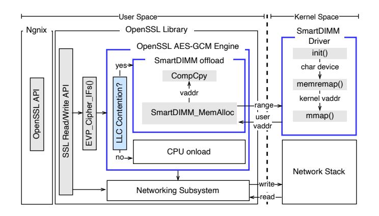
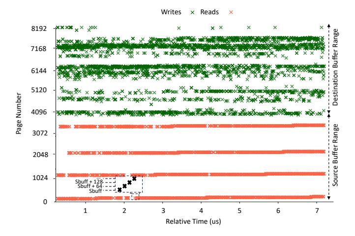
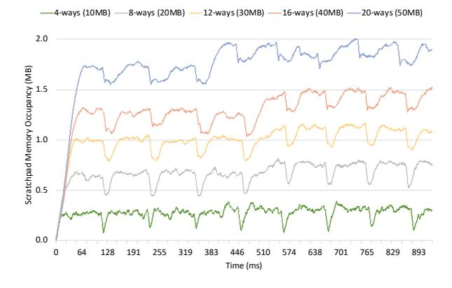
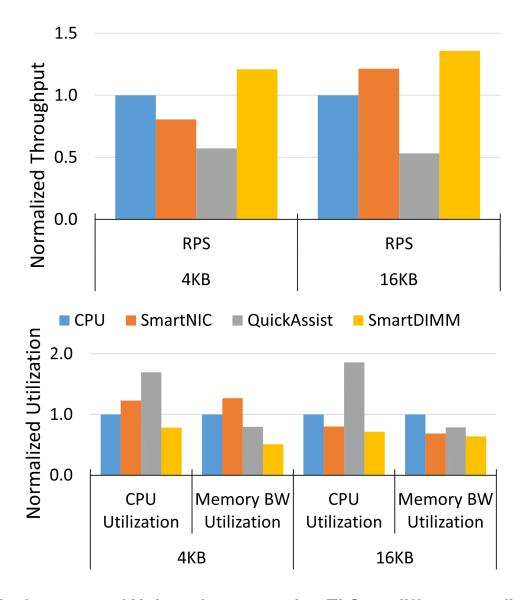

# *E. Discussion*

The offload model described and implemented in this section is meticulously designed to be compatible with off-the-shelf CPU and DRAM components. Given the opportunity to modify the memory controller and introduce new DDR commands, it would be possible to devise a more optimized offload model that could eliminate cache pollution entirely. Referring to Fig[.4a,](#page-3-0) a DDR command that directs DRAM data solely to DSA– without bringing data to the CPU memory controller – could conserve DDR data bandwidth and avoid populating the on-chip caches. In such a setup, the memory controller would maintain the addresses of the currently offloaded memory in a hardware table (akin to extended directories [\[62\]](#page-15-6)), assigning a timer value for eventual eviction back to DRAM. This eviction would entail issuing a special DDR command to SmartDIMM, prompting the writeback of the Scratchpad's data to DRAM.

The current CompCpy API supports offloading ULPs that do not utilize a zero-copy software stack. While zero-copy software stacks can enhance performance, they often complicate buffer recycling within the kernel, disrupt the separate development of ULPs and applications, and pose security risks for communication [\[63](#page-15-7)[–65\]](#page-15-8). Nonetheless, CompCpy could be expanded to incorporate near-memory acceleration on DMA

Fig. 7. Encryption offload of an example TLS record smaller than 8KB and larger than 4KB to SmartDIMM. We use the same notations as explained in [66].

accesses. For instance, a CompCpy augmented with *Compute DMA* support could transform data while an I/O device is DMAing data to or from SmartDIMM.

Overall, SmartDIMM is well-suited for accelerating operations involving memory-resident data and exhibiting poor cache behavior, such as streaming operations. The current incarnation of SmartDIMM provides an end-to-end nearmemory acceleration framework compatible with unmodified, commodity hardware and software stacks. Introducing new DDR commands to allow SmartDIMM direct access to DRAM and expanding interfaces beyond the CompCpy API detailed in this work would broaden the potential application domains for SmartDIMM.

#### V. TLS & COMPRESSION OFFLOAD ON SMARTDIMM

The CompCpy offload model imposes the following requirements on the design of the DSA and its corresponding offload software: Firstly, the latency of DSA should align with the time constraints of consecutive rdCAS and wrCAS commands to the same cacheline, to minimize notification overhead (§IV-D). Secondly, each CompCpy call must be stateless, with any necessary context or state transmitted to the DSA by the CPU via MMIO writes prior to the commencement of an offload. Thirdly, the required state for each offload should be contained within a single Config Memory page. This section explains the process of offloading TLS (de/en)cryption and (de)compression to SmartDIMM, adhering to the aforementioned stipulations. It is important to note that our prototype of SmartDIMM is based on Samsung's AxDIMM, which operates in a single channel mode. Consequently, in Sec.V-A and Sec.V-B, we presume that 4KB of physical addresses are sequentially allocated to a single SmartDIMM. Sec.V-D discusses the effects of finegrain memory channel interleaving on SmartDIMM's offload scheme.

## A. Transport Layer Security (TLS) Protocol

The physical proximity of the the CPU to SmartDIMM enables a fine-grain division of operations between CPU and SmartDIMM. Fig.7 illustrates the DSA architecture and the interactions between the CPU and SmartDIMM when

offloading TLS. As illustrated in the figure, the hash subkey (H) and encrypted initialization vector (EIV) are computed on the CPU and provided to the TLS DSA via an MMIO write to the Config Memory page associated with the sbuff pages. This is a crucial design decision since offloading the computation of H and EIV to SmartDIMM complicates the DSA design and provides no benefit. This is because the CPU can compute H and EIV by executing a single AES-NI instruction operating on an immediate value without any data dependencies. Since rdCAS commands of a sbuff range can be received out of order at SmartDIMM, the DSA pre-computes the ith powers of H in strides of 4 to remove the dependency chain between GHASH calculations of different 64-byte cachelines within the sbuff range.

The pre-calculation of powers of H for the binary Galois Field of 2128 elements (GF Multiplier) starts as soon as the sbuff is registered as an acceleration range. The powers of H are stored in the Config Memory and are later read by the GHASH module to calculate the partial authentication tag. The final tag should be stored in the trailer of the TLS record. On each rdCAS from the sbuff range, the TLS DSA reads the partial tag from the Scratchpad and XORs it with the output of the GHASH module before storing the result back to the Scratchpad. The final value of tag will be stored in the trailer after the entire sbuff is encrypted.

#### B. Layer-5 (De)Compression Protocol

The implementation of the Deflate compression algorithm in SmartDIMM is a specialized adaptation of the fully pipelined hardware implementation as explained in [67]. SmartDIMM utilizes Config Memory to store candidates for matching substrings. This Config Memory is designed as an 8-bank memory array, each equipped with eight read and write ports. As described in prior work [67], deflate compression can be parallelized by executing the algorithm on consecutive bytes within a contiguous parallelization window. We have configured this window to 8 bytes. Although increasing the size of the parallelization window marginally improves the compression ratio and bandwidth, it also exponentially raises the memory requirements and the logic complexity of the Deflate DSA [68].

In each clock cycle, SmartDIMM compresses 64 bytes of data in a best-effort manner. This means that if bank conflicts occur in the Config Memory, the candidate substrings from the affected bank will be discarded. Additionally, as CompCpy primarily focuses on small-sized ULP message offloads, we have designed the Config Memory to accommodate a hash table covering a 4KB window. When a new substring candidate is inserted and the hash table is full, the oldest substring gets replaced. Such design choices may slightly reduce the compression ratio but are intended to simplify the design and guarantee deterministic latency for the Deflate DSA. Even with a moderate compression ratio, the Deflate DSA in Smart-DIMM can significantly mitigate data movement overhead in transmission-intensive network applications, thereby saving on DRAM, PCIe, and Ethernet bandwidth.

#### C. Software Stack

Figure 8 illustrates the software stack that facilitates adaptive TLS offloading on SmartDIMM. SmartDIMM includes a driver that initializes a character device and maps the physical memory space of SmartDIMM to kernel virtual addresses. These virtual addresses can then be allocated to userspace applications as needed. In our implementation, the userspace library manually allocates and deallocates ranges of addresses on SmartDIMM from the driver. Ideally, SmartDIMM's address space would be managed by the OS memory manager, and the allocated addresses would be utilized by the application to perform CompCpy.

As depicted in Figure 8, we have modified the OpenSSL AES-GCM Cipher engine to selectively offload TLS to Smart-DIMM or process it on the CPU based on the level of LLC contention. LLC contention is assessed by frequently sampling the miss rate of the LLC, with the contention threshold set as a configurable parameter. Cache partitioning could affect this threshold, and service providers are advised to adjust it according to their specific system configurations.

Compression is made more complex by the fact that the compressed size is not predetermined. Consequently, we register the same number of pages for the destination buffer as for the source buffer. To further streamline the software stack and reduce the complexity of the Deflate DSA, we compress exclusively at 4KB page granularity. This approach necessitates multiple CompCpy calls for messages larger than 4KB, with each compressed page being individually written to the TCP socket. Given that the maximum transmission unit size of TCP is smaller than 4KB, this design choice does not adversely affect the TCP layer's performance.

Although we have discussed TLS offloading within the context of the userspace OpenSSL framework, the addition of in-kernel TLS (e.g., Linux kTLS [69]), allows SmartDIMM to perform offloading in kernel space as well.

The existing TCP ULP infrastructure [70] in the Linux kernel facilitates the verification of TLS offloading prior to copying received packets into userspace, offering an entry for offloading to accelerators in addition to SmartNIC. Furthermore, TCP ULP is invoked before and after the TCP layer during transmission and reception, respectively. This makes it suitable for SmartDIMM acceleration to be initiated before or after the packet is transferred to the remaining network stack or userspace.

#### D. Memory Channel Interleaving

Multi-channel memory systems in modern servers typically utilize fine-grain interleaving, with only 1-4 consecutive cachelines mapped to the same DIMM [71]. Such memory channel interleaving results in internally fragmented ULP messages for non-size preserving ULPs, potentially impairing the performance of data transformations that depend on the state generated from previously processed data (e.g., LZ77 dictionary-based (de)compression used in the Deflate algorithm). To mitigate this, 4KB OS pages corresponding to source and destination buffers for such ULPs can be

Fig. 8. Software stack for adaptive TLS offloading to SmartDIMM. Modifications and additions to the default software stack are highlighted in blue.

mapped to a single memory channel. This can be achieved by operating SmartDIMM in single channel mode, flex channel mode [72], or by utilizing a memory channel interleaving-aware memory mapping in the software stack [73, 74]. Hardware schemes that enable information sharing between DIMMs across channels [75, 76] may also be employed in these scenarios.

SmartDIMM remains resilient to fine-grain memory channel interleaving for size-preserving ULPs. The only additional requirement is for each SmartDIMM to have its own copy of the configuration data, such as keys and IVs for TLS. We address this requirement by writing the configuration data to each SmartDIMM during the source buffer registration step.

#### VI. METHODOLOGY

To evaluate SmartDIMM, we take two approaches: an actual FPGA implementation and emulation. For the actual FPGA implementation, we use AxDIMM [31], a DIMM-based nearmemory processing product from Samsung. We implement SmartDIMM as explained in Sec.IV on the AxDIMM FPGA and integrate the DSA discussed in Sec.V to support TLS and compression offloads. We hypothesize that the performance of TLS offload on SmartDIMM is equal to performing a CompCpy (without actual implementation of SmartDIMM in hardware) and commenting out the software functionalities to be offloaded. We validate this assumption using our AxDIMM prototype by showing that the TLS offload hardware can sustain the DDR line rate. Pismenny et al. [26] used a similar methodology for evaluating the performance of ULP offload on a SmartNIC. We implement the complete software stack in our emulation methodology, including the SmartDIMM kernel driver to support userspace offloads, page registration in CompCpy, lock acquisition, and cache flushes. In our experimental setup, we use two servers equipped with Intel Xeon Scalable Gold 6242 CPUs, 6× DIMMs of 16 GB memory at 3200 MHz (96 GB) connected using NVIDIA/Mellanox BlueField-2 ConnectX-6 100Gbe DPUs.

We compare the performance of SmartDIMM against three configurations when running an Nginx [77] web server with

Fig. 9. Memory traces collected from SmartDIMM when having 4 cores concurrently offloading computation to memory. The read commands belong to the source addresses in the current CompCpy and write commands belong to self-recycle of destination buffer addresses accessed earlier.

ten threads: a *CPU* configuration that executes ULPs on the CPU2, a *QuickAssist* configuration that offloads the ULP to an Intel QuickAssist 8970 PCIe Adapter [44], and a *SmartNIC* configuration that offloads TLS to an NVIDIA ConnectX-6 SmartNIC [79]. Note that the *SmartNIC* configuration cannot offload (de)compression because these operations are non-size preserving. We experimentally find 10 threads to be the minimum number required to saturate the link with unencrypted HTTP responses. We therefore attribute any performance degradation to TLS encryption operations performed by the design under test. The workload generator runs the wrk [80] traffic generator, maintaining 1024 persistent connections to make HTTP requests.

Unless stated otherwise, we use the following configuration parameters for SmartDIMM: 8MB Scratchpad size, 8MB Config Memory, 4KB page size, and 12288 number of entries in the Translation Table (3-ary cuckoo hash table with 3× more entries). In the experiments, we consider scenarios with high LLC contention (i.e., a large number of connections and high network rates); otherwise, it is optimal to run ULPs to the CPU.

#### VII. EVALUATION

#### A. Effectiveness of the Offload Model

Figure 9 presents the rdCAS and wrCAS traces collected from the SmartDIMM prototype when four cores concurrently execute CompCpy calls. Each red and green dot represents a 64-byte read or write request from/to DRAM, respectively. Due to the sparsity of the addresses in each CompCpy call (spaced 32MB apart), it is not immediately apparent that the addresses are incrementally increasing. A magnified section of the trace shows the monotonic address increase throughout a CompCpy call.

Fig. 10. Scratchpad utilization for different LLC provisionings. In each configuration shown, Scratchpad utilization reaches an equilibrium state in which writebacks from the LLC recycle pages in the Scratchpad, freeing space for new offloads. The equilibrium state is reach at a lower occupancy when LLC is more contended.

Figure 10 illustrates the Scratchpad occupancy in MB during the trace collection as shown in Fig.9. We employ Cache Allocation Technology (CAT) [81] to reduce the size of the LLC by limiting the number of ways utilized by CompCpy. As illustrated, Scratchpad utilization quickly stabilizes at an equilibrium after the start of the offload, where writebacks from the LLC recycle pages in the Scratchpad, thereby freeing space for new offloads. As outlined in Sec.IV-B, Force-Recycles become rare once this equilibrium is achieved, with writebacks efficiently managing the self-recycle operations.

As anticipated, reducing the size of the LLC results in a proportional decrease in Scratchpad occupancy due to increased LLC contention. For instance, with a contended 50MB and 10MB LLC, the occupancy of the Scratchpad remains below 2MB, and 500KB, respectively.

#### B. Performance Comparison

Figure 11 shows the requests per second (RPS), CPU utilization, and memory bandwidth utilization of an Nginx HTTP server providing web pages to clients over a secure connection (i.e., uses TLS), where TLS is executed on *SmartNIC*, *QuickAssist*, and SmartDIMM. All the data points are normalized to the *CPU* configuration.

As shown in the figure, SmartDIMM delivers 21.0% and 35.8% higher RPS than the *CPU* configuration for TLS offload of 4KB and 16KB message sizes, respectively. At the same time, SmartDIMM reduces the CPU and memory bandwidth utilization of the server by 21.8% and 49.1% for 4KB TLS message offloading. Such reduction in the memory bandwidth utilization is due to moving the computation to memory and preventing the cache thrashing caused by processing TLS on the CPU. *SmartNIC* and *QuickAssist* configurations both fail to provide any RPS improvement for 4KB messages due to high overhead for initializing the offload. For example, *QuickAssist* fails to deliver comparable RPS to other configurations because the overhead of setting up a PCIe offload overshadows all the benefits of hardware acceleration for fine-grain kernel launches.

&lt;sup>2CPU configuration uses Intel Advanced Encryption Standard New Instructions (AES-NI) [78] to accelerate encryption

**Fig. 11. Performance of Nginx when executing TLS on different configurations with 4KB and 16KB message sizes. Higher is better for RPS and lower is better for CPU and memory utilization. All the results are normalized to that of the** *CPU* **configuration.**

The *SmartNIC* configuration does outperform the CPU baseline for 16KB message sizes as opposed to shorter 4KB messages. We also note that even for a 64KB message size, SmartDIMM is capable of maintaining 11.9% higher RPS at 10.8% lower CPU utilization and 7.6% lower memory bandwidth utilization than that of a *SmartNIC*.

Figure [12](#page-10-1) compares SmartDIMM performance with *CPU* and *QuickAssist* for offloading compression. Since compression is non-size preserving and cannot be autonomously offloaded to SmartNIC, we do not compare against a *SmartNIC* configuration. The RPS benefits of offloading compression to hardware are higher than TLS offload, as the AES-NI instructions significantly improve CPU performance for symmetric encryption. Offloading compression of 4KB and 16KB Nginx HTTP responses to SmartDIMM yields 6.09× and 11.28× higher RPS compared to *CPU* baseline while reducing the CPU and memory bandwidth utilization by 88.9% and 23.6%, respectively. As expected, *QuickAssist* is unsuitable for finegrain offloading of small messages and does not provide RPS improvements. It also increases memory and CPU utilization due to high notification and memory copy overheads.

