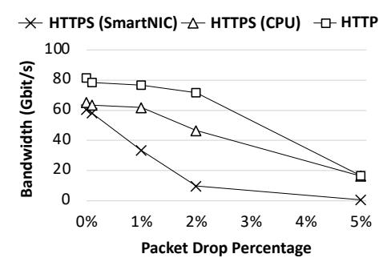

# II. BACKGROUND

Upper-layer protocols (ULPs) – also known as layer-5 network protocols – are widespread, seeing use across the Internet and in production environments. They often reside on top of the TCP/IP layer, providing additional services to applications. (de/en)cryption and (de)compression are two important ULPs that consume a significant number of cycles in datacenters [\[14\]](#page-12-9). In this section we provide background on these two ULPs.

(De/en)cryption. The Transport Layer Security (TLS) [\[33\]](#page-13-13) protocol provides privacy over a reliable, yet insecure, network connection between two clients. TLS is often added on top of TCP/IP, with messages being encrypted or decrypted before they are sent to or received from the TCP layer.

AES-GCM [\[34\]](#page-13-14) is an authenticated encryption algorithm, widely adopted as the block cipher in TLS 1.2 and TLS 1.3. It encrypts plaintext messages by performing bitwise XOR operations with an encrypted stream. This stream is generated by incrementing and encrypting a counter value, which is initially combined with an initialization vector (IV). To provide authentication, a GHASH function is applied, and its result is appended to the TLS record as an authentication tag. AES-GCM is widely used due to its performance, as it can be effectively pipelined in hardware and parallelized.

(De)compression. Dictionary-based compression algorithms, such as Deflate [\[35\]](#page-14-0), are employed to compress HTTP responses from clients [\[36\]](#page-14-1). Deflate operates in two stages: compression and encoding. Initially, the data stream is processed using the dictionary-based LZ77 algorithm [\[37\]](#page-14-2). In this phase, input data is compared with entries in a dynamically updated dictionary, based on the contents of a sliding history window. When a match is found in the dictionary, the matching data is replaced with an LZ symbol that indicates the length of the duplicate string and the distance from its previous occurrence. Following the LZ77 match-finding phase, the data undergoes Huffman encoding [\[38\]](#page-14-3), where input symbols are replaced with shorterlength codes.

System-level Data Movement with ULPs. As illustrated in Fig[.1,](#page-0-0) before a network message is processed by a ULP, it is cloned into another buffer designated to hold the ULP's result (e.g., encrypted text). In addition to ULP processing, there are at least two more data copies in an optimized software stack related to the DMA transactions from NIC and storage devices. Modern CPUs implement Direct Cache Access technology (e.g., Intel DDIO [\[39\]](#page-14-4) and ARM Cache Stashing [\[40\]](#page-14-5)), routing DMA data through the Last-Level Cache (LLC) to minimize memory bandwidth usage. However, if the usage distance of the DMA data is long – which is often the case for ULP processing as the software stack and DMA accesses are asynchronous – the DMA data may leak to DRAM before the CPU utilizes it [\[41,](#page-14-6) [42\]](#page-14-7).

**Fig. 2. Achievable bandwidth over an encrypted connection for SmartNIC and CPU under packet drops.**

#### III. MOTIVATION

In this section, we discuss several observations that informed SmartDIMM's design. The observations are either generallyaccepted design decisions discussed in previous studies or made by experimental data we collected.

Observation 1: ULP offload on SmartNIC can be suboptimal. Ethernet is the backbone of datacenter networks, where packet loss and reordering are expected. It is the job of the TCP protocol to recover from these events and provide reliability to the upper layers. ULP processing takes place before/after TCP processing on the TX/RX path, while the SmartNIC sees TX/RX data after/before it is processed by the TCP stack. Offloading a ULP to a SmartNIC without also offloading TCP/IP processing limits the types of data transformations that can be performed. In particular, SmartNICs require that the ULP preserves the payload size as shrinking or expanding the payload interferes with the TCP state machine. This makes it challenging to offload non-size preserving ULPs such as (de)compression to a SmartNIC [\[26\]](#page-13-7).

NVIDIA SmartNICs implement autonomous TLS offloading, which speculatively offloads symmetric cipher computations to the NIC while running the TCP/IP stack on the CPU [\[16,](#page-13-0) [26\]](#page-13-7). As shown in Fig[.1b,](#page-0-0) autonomous SmartNIC ULP offloading requires the ULP library to skip performing the offloaded operation in software, passing the plaintext payload down the network stack before the NIC performs the accelerated computation. The SmartNIC driver performs hardware resynchronization and falls back to CPU computation in the presence of packet reordering or loss. Using an NVIDIA ConnectX-6 SmartNIC, we offload TLS computation of an HTTPS stream to the NIC and inject packet drops using a programmable switch. For detailed information on our experimental methodology, refer to Sec[.VI.](#page-8-0) Surprisingly, as shown in Fig[.2,](#page-2-0) we see the same, or even lower, throughput when offloading TLS to the SmartNIC. We suspect that this is due to the performance improvement of AES-NI in Xeon CPUs [\[43\]](#page-14-8) [1](#page-0-1) . More importantly, the benefits of SmartNIC offloading fade away as soon as there are packet drops.

**Fig. 3. HTTPS memory bandwidth utilization normalized to HTTP for different numbers of concurrent connections.**

Observation 2: PCIe-based offload is suitable for latencyinsensitive, coarse-grain offloads. PCIe accelerators, such as Intel QuickAssist[\[44\]](#page-14-9), can offload costly key derivations using RSA [\[45\]](#page-14-10) and ECDH [\[46\]](#page-14-11), as well as symmetric encryption and decryption operations, from the host CPU. However, the need for frequent PCIe transactions to transfer data and notifications between the accelerator and the CPU renders PCIe accelerators less appealing for latency-sensitive data transformations, especially when the offload size is small. Additionally, the notification mechanism between the CPU and accelerator, whether interrupt or polling, significantly bottlenecks PCIe-attached acceleration [\[47,](#page-14-12) [48\]](#page-14-13). Due to these overheads, various techniques and system configurations have been proposed to minimize PCIe traversals [\[11,](#page-12-7) [49–](#page-14-14)[53\]](#page-14-15).

Observation 3: DIMM is on the path of ULP processing at high LLC contention. Direct Cache Access technology does not always eliminate DRAM access, and during LLC contention, DRAM accesses become inevitable [\[41,](#page-14-6) [42,](#page-14-7) [54,](#page-14-16) [55\]](#page-14-17). This issue is further compounded by the presence of ULPs. Since buffers are DMAed to/from the LLC without being immediately consumed, they are at risk of being evicted back to DRAM [\[25\]](#page-13-6).

Fig[.3](#page-2-1) compares the memory bandwidth utilization of HTTP and HTTPS web servers with varying numbers of concurrent connections. As the number of connections increases, the memory bandwidth utilization of the HTTPS web server significantly rises, showing up to a 2.5× increase compared to a server performing equivalent encrypted file transfers. The cache thrashing caused by ULP processing not only reduces the packet processing rate but also causes interference with co-running applications and generates unnecessary DRAM bandwidth.

