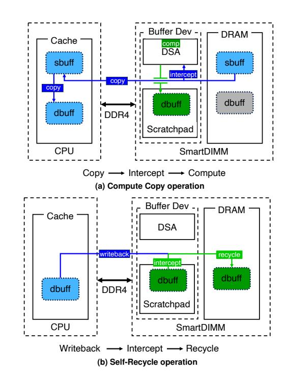
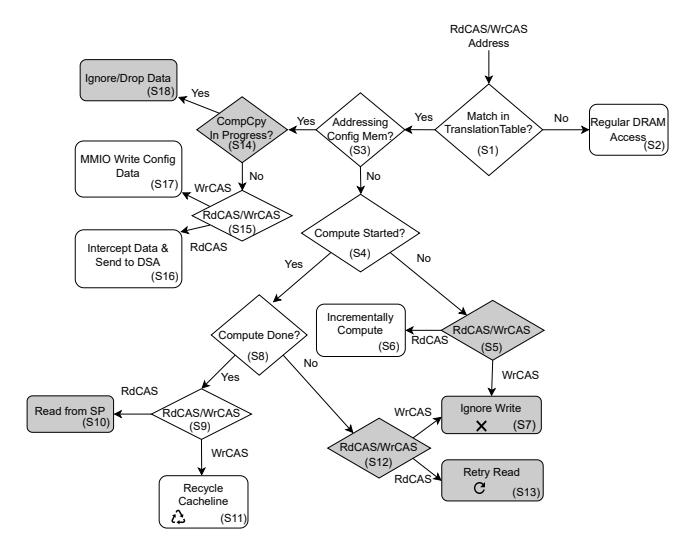

# Observation 4: ULPs are often incrementally computable. Many ULP data transformations can be computed over arbitrary byte ranges of a message as it is sequentially received or transmitted from or to the network. For example, the

AES-GCM cipher can encrypt or decrypt messages without performing cipher block-chaining operations. Any range of bytes can be XORed with a pre-generated stream to produce the (de/en)crypted message data. In the case of (de)compression, the LZ77-based deflate algorithm consumes or emits an input or output stream byte by byte, allowing streaming (de)compression

<sup>1</sup>Bluefield 2 SmartNIC and Intel Xeon Gold CPU we tested on were launched the same year (2020)

operations over any sequentially received or transmitted portion of a ULP message.

This property enables ULP processing to commence even before the complete ULP message has transitioned from or to the application layer of the network stack, as is often the case when a single message is encapsulated across multiple TCP segments.

The Case for In-Memory Acceleration of ULPs. Leveraging the commercial availability of DIMM-based near-memory processing products [\[31\]](#page-13-11), we introduce SmartDIMM. This innovation enables the use of DIMMs as an alternative location for ULP computation. SmartDIMM embodies a bump-inthe-DDR architecture that can be dynamically configured to perform ULP computations within the buffer device of DIMMs as data traverses through the DDR channels.

<span id="page-3-2"></span>The following section details how we implement Smart-DIMM through a co-design of hardware and software.

## IV. SMARTDIMM ARCHITECTURE

We design SmartDIMM for accelerating ULPs with the following goals in mind:

- *Adaptive, per message offload*: SmartDIMM enables the software stack to adaptively switch between offloading ULPs to the near-memory accelerator or on-loading ULP processing to the CPU based on the current LLC miss rate at the granularity of 4KB OS pages.
- *Inline offload*: SmartDIMM removes the need for a synchronization mechanism between the CPU and nearmemory accelerator in the common case.
- *Minimized data movement*: SmartDIMM does not introduce extra memory copies when processing ULPs and piggybacks on the existing memory copies in the software stack to perform the offload.
- *Application readiness*: SmartDIMM does not require new programming interfaces and leverages the existing programming style and Linux APIs.
- *Preserved processing order*: SmartDIMM preserves the processing order within the network stack and nonspeculatively offloads ULPs to the near-memory accelerator.
- *Minimal changes to the processor and DRAM architecture*: SmartDIMM works with current CPU architectures without requiring hardware support. Additionally, SmartDIMM leaves the DRAM devices unmodified, isolating changes to the DIMM's buffer device.
- *Preservation of host accesses to DRAM*: SmartDIMM minimizes changes to the datapath for reads and writes from the host, preserving performance for regular accesses.

<span id="page-3-1"></span>We design SmartDIMM to satisfy the above goals by implementing the Compute Copy (CompCpy) API. In this section, we first explain the offload model of CompCpy and then explain the hardware and software architecture of SmartDIMM that realizes CompCpy.

<span id="page-3-0"></span>

**Fig. 4. CompCpy inline offload model.**

#### *A. Offload Model*

At a high level, as a source buffer (sbuff) is copied to a destination buffer (dbuff), sbuff is fed to a Domain-Specific Accelerator (DSA), and the result is stored on SmartDIMM's buffer device. We introduce CompCpy, a modified memory copy API that performs the above sequence of actions and hides the hardware implementation details from the user.

Before starting an offload, the user must register both sbuff and dbuff to SmartDIMM as acceleration ranges and flush sbuff to DRAM. SmartDIMM registers a range at 4KB OS page granularity. SmartDIMM only performs computation on the data accessed within the acceleration range; otherwise, SmartDIMM will operate in non-acceleration mode like a regular DIMM. Note that the software stack periodically measures the LLC contention and enables SmartDIMM offload on-demand. Therefore, when SmartDIMM offload is enabled, sbuff is likely to be in DRAM and the overhead of the cache flush is minimal. Our experimental results show that flushing 4KB data is 50% faster when the data is already in DRAM. While registering the addresses, the application also writes any configuration and context (e.g., the key and initialization vector for TLS offload) required for computation to SmartDIMM.

Next, the CompCpy API will copy sbuff to dbuff (Fig[.4a\)](#page-3-0). As sbuff is read from DRAM, SmartDIMM intercepts the data that passes through the DIMM buffer device and sends it to the DSA. Since the CPU memory controller synchronously controls SmartDIMM's local DRAM devices, we cannot write the output of the DSA directly to DRAM. Thus, the DSA stores the results in a temporary on-chip memory called the Scratchpad. This staging buffer is essential to avoid an

Algorithm 1: Force-Recycle method reads the list of pending pages from SmartDIMM's MMIO config space and explicitly flushes those addresses to DRAM. This method is rarely called.

```
1 Force-Recycle(requiredToBeFree)
2 pendingList = readPendingList(SmartDIMMConfig)
3 for page in pendingList do
4
```

<span id="page-4-0"></span>additional DIMM-side memory controller.

Letting the CPU memory controller manage SmartDIMM's address space provides four **B**enefits: (B1) the OS can manage SmartDIMM's address space like any regular DIMM, (B2) SmartDIMM's capacity counts towards the total system memory, (B3) memory access latency to the non-acceleration range is not increased, and (B4) the hardware complexity of the buffer device is reduced by precluding an additional DIMM-side memory controller and CPU-DIMM synchronization mechanisms.

#### <span id="page-4-2"></span>B. Scratchpad Recycling: Self- vs. Force-Recycling

The offload model, as explained in Sec.IV-A, introduces a challenge: the Scratchpad space is limited and requires frequent recycling. To recycle a page in the Scratchpad, its contents must be written back to the corresponding addresses in DRAM. The offload model of SmartDIMM capitalizes on an opportunity to automatically recycle buffers by utilizing the inevitable writeback of dbuff cachelines to DRAM, as shown in Fig.4a. Specifically, when a write Column Address Strobe (wrCAS) to a cacheline stored in Scratchpad is received at the buffer device (triggered by an LLC writeback), SmartDIMM replaces the wrCAS data with the data stored in the Scratchpad and invalidates the corresponding cacheline in the Scratchpad. Once all the cachelines of a page are written back to DRAM (i.e., invalidated), the Scratchpad page is freed and becomes available for another offload. This automatic recycling of the Scratchpad is referred to as Self-Recycle.

While LLC writebacks can opportunistically recycle Scratchpad buffers, there is no guarantee that the buffers will be recycled in time. In the rare instance that the Scratchpad is full during a new offload attempt, a Force-Recycle function is invoked by CompCpy. As detailed in Algorithm 1, the Force-Recycle method reads the addresses of pending pages from SmartDIMM and explicitly issues write-requests to the physical address ranges of those pending pages. Sec.VII-A presents experimental evidence showing that calls to Force-Recycle are infrequent. This low frequency is due to SmartDIMM being utilized primarily when LLC contention is high.

<span id="page-4-1"></span>

Fig. 5. SmartDIMM's buffer device architecture.

#### C. Hardware Architecture

SmartDIMM is solely controlled by read (i.e., read Column Address Strobe (rdCAS)) and write (i.e., write Column Address Strobe (wrCAS)) commands received at the DIMM's buffer device. SmartDIMM integrates the following logic within the buffer device: an Arbiter, Scratchpad, DSA, Config Memory, DDR PHY, and MIG PHY. These components are highlighted in red in Fig.5. The Arbiter decodes rdCAS and wrCAS commands from DDR PHY, determines whether the commands target SmartDIMM's MMIO config space or acceleration range, and coordinates near-memory computation and recycling of Scratchpad. Fig.6 summarizes the decision-making process of the arbiter logic upon receiving a CAS command. The flowchart in Fig.6 is referenced while discussing the hardware and software architecture of SmartDIMM in this section and in Sec.IV-D.

DDR PHY and MIG PHY provide high-speed physical interfaces to the host memory controller and SDRAM, respectively. The DDR PHY buffers 512-bit data bursts received from the host memory controller and forwards them to the Arbiter. The MIG PHY then relays the DDR4 signals from the DDR PHY to the DRAM chips to perform memory accesses. Similar to Samsung's AxDIMM [56], SmartDIMM's buffer device operates at one-fourth the DRAM clock frequency. Consequently, the DDR PHY encodes four DRAM commands within a single SmartDIMM clock cycle, while the MIG PHY serially issues them on consecutive DDR4 clock cycles to the DRAM chips. Therefore, each clock cycle contains four slots, each decoding a different DDR command [57]. The command in slot 0 is issued to the DRAM chips first, followed sequentially up to the command in slot 3.

As illustrated in Fig.5, DDR PHY sends Address (A), Chip Select (CS), Bank Group (BG), and Bank Address (BA) signals to the Slot Decoder. The Slot Decoder then decodes the commands within each slot, generates Row, BA, and BG for each respective slot, and forwards them to the Bank Table.

The Bank Table is a memory array consisting of N entries, where N represents the total number of banks in each SmartDIMM rank. Each entry in the Bank Table records the ID of the active row within its corresponding bank. The contents of the Bank Table are updated upon receiving a

<span id="page-5-0"></span>

Fig. 6. Arbiter logic operation. The gray symbols show the unlikely states. A read or write command to a cacheline with pending computation is ignored (S7 and S13). S13 utilizes the ALERT\_N signal to inform the memory controller to retry the rdCAS.

RAS command (to activate a row) or a Precharge command (to close a row). For example, if a RAS command targeting BGBA 8 with Row ID 10 is received, the value 10 will be recorded in the eighth row of the Bank Table.

When a rdCAS or wrCAS command is received from DDR PHY, the SmartDIMM must determine whether the CAS command targets an acceleration range (S1 in Fig.6). To achieve this, the Row ID from the CAS is retrieved from the Bank Table and provided to an Addr Remap module, along with BG, BA, and Co1 information, to regenerate the physical address of the CAS command. Knowing the physical address is essential because it is impossible to determine the range of addresses within an OS page solely with knowledge of BG, BA, Row, and Co1. The physical address is then input into a Translation Table. If a match is found in the Translation Table, it returns a mapping to an offset within a Config Memory (S3 $\rightarrow$ Yes in Fig.6) or Scratchpad (S3 $\rightarrow$ No in Fig.6).

The size of the Translation Table is contingent on the number of pages and entries in the Scratchpad and Config Memory. We have configured the Scratchpad and Config Memory sizes to minimize the occurrence of Force-Recycle method calls. Our experimental results indicate that sizing the Scratchpad and Config Memory to 2048 pages effectively leads to nearly zero Force-Recycle method calls (§VII-A). The Translation Table operates at page granularity for mapping memory addresses, thus requiring 4096 translation entries to cover both the Config Memory and Scratchpad. It is important to note that a single Translation Table is utilized to maintain mappings for both the Scratchpad and Config Memory, differentiated by a single-bit flag.

A naive implementation for the Translation Table involves using a Content Addressable Memory (CAM) to

match physical page numbers in a single cycle. However, CAMs are expensive and power-hungry [58], and given that the Translation Table is accessed every clock cycle, a CAM implementation could exceed the power and thermal limits of the buffer device in the DIMM. Instead, we implement the Translation Table as a 3-ary cuckoo hash table [59], utilizing three distinct hash functions for indexing. It has been experimentally demonstrated that at low occupancy (less than 50%), a 3-ary cuckoo hash table typically inserts a translation either on the first attempt or with a single displacement. Furthermore, at an occupancy of less than 50%, the probability of insertion failure is effectively zero [60]. To ensure low occupancy, we size the Translation Table to be three times larger than the total required entries (i.e., 12K entries), maintaining the occupancy of the cuckoo hash table below 33% and thereby reducing the probability of displacement. Additionally, we incorporate an 8-entry CAM array for immediate mapping insertions and execute cuckoo hash table insertions outside the critical path.

A new entry is inserted into the Translation Table when the user registers new source and destination pages for acceleration (S17 in Fig.6). SmartDIMM features an MMIO register designed to capture the source page number, destination page number, and any additional context required for the offload, all within a 64-byte MMIO write. Upon receiving a write to the MMIO register, the SmartDIMM registers both the source and destination pages by creating translation entries in the Translation Table for each. The translation entry for the source page includes the address of the destination page (or multiple pages if the computation does not preserve size) and an offset in Config Memory where the context for processing the source page is stored. Software can further write additional context into Config Memory using the same mechanism. The translation entry for the destination page specifies a Scratchpad offset where the DSA's output (results) will be stored.

The Scratchpad is a local SRAM implemented in Smart-DIMM to temporarily store DSA's output on the buffer device without writing it back to the DRAM chips. This design allows the CPU to manage the entire SmartDIMM address space, akin to a regular DIMM. The Scratchpad is organized as a 64-byte addressable memory array and allocated at 4KB page granularity. Config Memory is also a 64-byte addressable block memory that holds a fixed context space for each source page (sbuff) upon which the DSA operates. The size of the context is dependent on the application; for instance, the context size for TLS offloading is 1KB per source page (Sec.V-A).

## <span id="page-5-1"></span>D. Software Architecture

Algorithm 2 outlines the high-level implementation of CompCpy. CompCpy extends the standard memory copy API. Beyond merely copying a source buffer (sbuff) to a destination buffer (dbuff), CompCpy also configures SmartDIMM to process the data from the source buffer before saving it to the dbuff's physical DRAM addresses. Prior to initiating inline acceleration, CompCpy must verify whether the limited space of

#### Algorithm 2: CompCpy inline acceleration.

```
1 global variable: freePages = -1
2 CompCpy(uint8_t * dbuff, uint8_t * sbuff, uint16_t size, uint8_t
    *context, bool ordered)
3 // Check to ensure data and dbuff are 4KB page aligned
4 if !PageAligned(dbuff) OR !PageAligned(sbuff) then
5 return "Not Aligned"
6 end
7 lock.lock()
8 if freePages <= (size / 4KB) then
9 freePages = SmartDIMMConfig[0]
10 // Unlikely condition
11 if unlikely(freePages <= (size / 4KB)) then
12 Force-Recycle(size)
13 end
14 end
15 // reserve the required pages
16 freePages -= (1 + size / 4KB)
17 lock.release()
18 // flush sbuff to DRAM
19 flush(sbuff, size)
20 // register both sbuff and dbuff address ranges in acceleration range
21 for pages in sbuff and dbuff do
22 register(sbuff, dbuff, context)
23 end
24 if ordered then
25 for i in (0, (size / 64)) do
26 memcpy(dbuff, sbuff, 64)
27 membar()
28 end
29 else
30 memcpy(dbuff, sbuff, size)
31
32 USE(uint8_t* dbuff)
33 flush(dbuff)
34 return dbuff
```

<span id="page-6-0"></span>the Scratchpad would preclude SmartDIMM from accepting a new offload.

CompCpy monitors the available Scratchpad space using a global variable (freePages in Algorithm [2\)](#page-6-0), which is protected by a lock. CompCpy lazily updates the freePages variable only when the number of pages needed for an offload exceeds the current value of freePages (lines 8–9). Due to the Self-Recycling facilitated by LLC writebacks (see Sec[.IV-B\)](#page-4-2), our experiments indicate that the Scratchpad rarely runs out of space. On the rare occasion that there is not enough space in the Scratchpad, CompCpy invokes the Force-Recycle method to free up some pages in the Scratchpad (see Algorithm [1\)](#page-4-0). After securing the necessary number of pages in the Scratchpad, CompCpy registers the pages spanned by sbuff and dbuff as acceleration ranges by writing their page numbers and the required context for offloading into the MMIO config register (lines 21–22).

SmartDIMM receives memory read and write requests at a 64-byte granularity from the CPU. Typically, the CPU memory controller reorders these requests before dispatching them to DRAM. If DSA needs to process data in the order it was generated by the application, then CompCpy must insert a memory fence between each 64-byte segment during the memory copy to SmartDIMM. The if condition on line 24 of Algorithm [2](#page-6-0) checks for the ordering requirement specified as an argument to CompCpy and, if necessary, breaks the memory copy into 64-byte segments, inserting a memory barrier between each (lines 25–28).

DSA processes 64-byte data chunks as they are read from DRAM (S6 in Fig[.6\)](#page-5-0) and stores the results in the Scratchpad. Before an application can read the result, it must ensure that DSA has completed the computation. A straightforward, yet naive, approach would require applications to poll the dbuff to confirm completion. However, we observed that the time lag between the first read command from sbuff and the first write command to dbuff usually provides enough buffer to allow for the completion of a ULP operation on a 64-byte cacheline. This slack arises from the batching of write requests in the memory controller, the intricacies of the cache coherency protocol, and the overhead of toggling DDR channels between read and write modes. Our measurements using Samsung's AxDIMM on an Intel Broadwell server indicate this time budget exceeds 1µs. Consequently, rather than resorting to polling, we optimistically assume that SmartDIMM completes the computation on a cacheline before its consumption (i.e., before being read by the CPU). In the rare instance that the computation is not finished, SmartDIMM employs the ALERT\_N signal from the DDR standard [\[61\]](#page-15-5) to prompt the memory controller to retry the read request (S13 in Fig[.6\)](#page-5-0).

The gray-shaded states in Fig[.6](#page-5-0) represent scenarios that are unlikely to occur. One such unlikely event is if a cacheline in dbuff is written back before DSA completes its computation. In this situation, the wrCAS command is disregarded, and the cacheline in the Scratchpad is not recycled (S7 in Fig[.6\)](#page-5-0). Consequently, the computed cacheline must be read from the Scratchpad when the dbuff is subsequently accessed (S10 in Fig[.6\)](#page-5-0).

