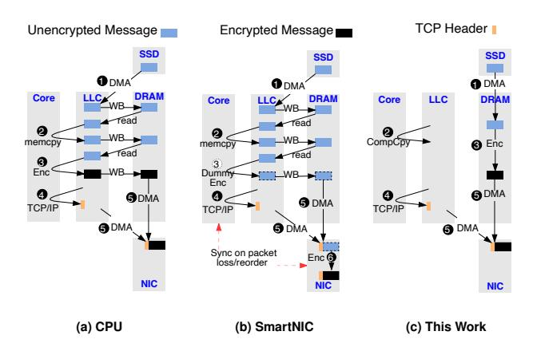

# SmartDIMM: In-Memory Acceleration of Upper Layer Protocols

Neel Patel Amin Mamandipoor Mohammad Nouri Mohammad Alian University of Kansas

{nmpatel,amin.mamandi, mohammadnouri,alian}@ku.edu

Abstract—There has been significant focus on offloading upperlayer network protocols (ULPs) to accelerators located on CPUs and SmartNICs. However, restricting accelerator placement to these locations limits both the variety of ULPs that can be accelerated and the overall performance. In particular, it overlooks the opportunity to accelerate ULPs running atop a stateful transport protocol in the face of high cache contention. That is, at high network rates, the frequent DRAM accesses and SmartNIC-CPU synchronizations outweigh the benefits of hardware acceleration. This work introduces SmartDIMM, which unlocks the opportunity for accelerating ULPs running atop stateful transport protocols that primarily operate on data stored in DRAM. We prototyped SmartDIMM using Samsung's AxDIMM and implemented endto-end offloading of (de/en)cryption and (de)compression- two ULPs widely employed in datacenters. We then compared the performance of SmartDIMM with accelerator placements on the CPU, SmartNIC, and PCIe cards. Our results demonstrate that ULP offloading on SmartDIMM outperforms CPU, SmartNIC and PCIe-based offload configurations. In comparison to a server executing (de/en)cryption and (de)compression on the CPU, SmartDIMM achieves 21.0% to  $10.28\times$  higher requests per second and 36.3% to 88.9% lower memory bandwidth utilization.

#### I. Introduction

Upper Layer Network Protocols (ULPs) are widely deployed at scale for data protection via encryption [1–3], facilitating communication in heterogeneous software deployments via serialization [4-7], and reducing data transfer times via compression [8, 9]. Such operations, often referred to as datacenter taxes, consume a significant number of datacenter cycles [10, 11], with (de)compression and (de/en)cryption consuming up to 14% and 23% of datacenter cycles for top Google and Meta services [12–14].

With the effective end of Dennard's scaling and the exponential increase in network bandwidth requirements in datacenters [15], supplying the compute demand of ULPs is only possible through hardware acceleration. Current platforms for accelerating (de/en)cryption and (de)compression include SmartNICs [16-19], PCIe cards [20-22], and CPU chips [23, 24]. However, these accelerator placements are sub-optimal for accelerating ULPs operating atop the layered network software stack, which can exhibit several hundred milliseconds of latency between software layers. That is, the excessive data movement over PCIe and DDR channels [25] and frequent SmartNIC-CPU synchronizations [26] diminishes the benefits of hardware acceleration.

Figure 1a shows a sub-optimal configuration in which the CPU is responsible for ULP processing. In this example, a

Fig. 1. System-level data movement in a web server that encrypts web pages stored on a storage device before packetizing them and sending them over TCP connections to clients. At high request rates, (a) on-chip encryption acceleration is hindered by frequent DRAM accesses, and (b) autonomous NIC offloading [26] of encryption is limited by both CPU side memory copies as well as costly synchronizations between the NIC and CPU during packet reorderings and losses. (c) SmartDIMM unleashes the full potential of ULP acceleration by minimizing system-level data movement, without disrupting the layered storage and network software stack.

web-server application encrypts websites before sending them through TCP connections to clients. Owing to the streaming nature of data serving, the large working set of the web server, and the asynchronicity between the storage stack, encryptionlayer protocol, and TCP/IP packet processing, data read from storage frequently exhibits a ping-pong access pattern between on-chip caches and DRAM before being sent over the network. Fig.1b demonstrates the offloading of encryption to a SmartNIC, where the encryption of TCP payloads is postponed until the payload reaches the SmartNIC accelerator, while the TCP header is constructed using the TCP/IP stack on the CPU. Although SmartNIC offloading can free CPU cycles, it may still be subject to the ping-pong data movement between caches and DRAM, as well as synchronization overheads between the CPU and SmartNIC following packet reordering or losses [26].

In this work, we introduce SmartDIMM that enables finegrain, adaptive offloading of ULP processing to memory. SmartDIMM implements a domain-specific accelerator on the buffer device of a Dual In-line Memory Module (DIMM) and synchronously transforms data as it traverses the DDR channel. Additionally, SmartDIMM's software stack dynamically probes the LLC contention and adaptively enables or disables

offloading of ULP processing to memory. Fig[.1c](#page-0-0) illustrates how SmartDIMM eliminates cache thrashing by rerouting outbound network data to directly pass through DRAM, while the unmodified TCP/IP stack operates on the CPU.

Adaptively offloading computation to memory Requires (R1) sharing the address space between the CPU and SmartDIMM, (R2) operating SmartDIMM as a regular DIMM when ULPs are processed on the CPU, and (R3) implementing a lightweight synchronization mechanism between the CPU and near-memory processors. Meeting requirements R1 and R2 is challenging with JEDEC-compliant DDR-attached DIMMs, as only one memory controller can be used to maintain the status of each DRAM bank [\[27](#page-13-8)[–29\]](#page-13-9). Fulfilling R3 through conventional polling or interrupt mechanisms introduces significant overhead. Although prior work [\[30\]](#page-13-10) eliminates the notification overhead by performing computation synchronously with memory accesses, it does not share the address space and tends to use memory modules more as accelerators than as memory devices.

To meet the aforementioned requirements, we introduce the concept of Compute Copy (CompCpy). CompCpy is an API that transforms data within SmartDIMM while concurrently copying it from a source buffer to a destination buffer. This approach enables ULP offloading without requiring extensive code changes in existing software stacks and ULP frameworks. As offloads are performed synchronously, the software does not need to depend on polling or interrupts to synchronize with the near-memory processor, thus satisfying requirement R3.

We developed a SmartDIMM prototype capable of offloading Transport Layer Security (TLS) processing using Samsung's AxDIMM [\[31\]](#page-13-11). To facilitate application-layer access to SmartDIMM, we implemented an OpenSSL engine [\[32\]](#page-13-12) which utilizes the CompCpy API to skip the library's on-CPU (de/en)cryption routines and instead pass (un)encrypted TLS messages to the (de/en)cryption engine on SmartDIMM.

Offloading (de/en)cryption and (de)compression as representative ULPs to SmartDIMM results in 21.0%-10.28× and 11.9%-50.3% higher requests per second, respectively, compared to a server executing them on the CPU and Smart-NIC. Additionally, SmartDIMM achieves 36.3%-88.9% and 7.6%-59.9% lower memory bandwidth utilization, respectively, compared with CPU and SmartNIC implementations.

In this work we make the following contributions:

- Identify that DRAM is on the processing path of ULPs running atop the layered software stack in the era of high-throughput network devices.
- Introduce SmartDIMM, a bump-in-the-DDR near-memory processing architecture for in-line acceleration of ULPs.
- Utilize the on-chip caches to implement a novel selfrecycling mechanism, autonomously recycling a nearmemory scratchpad.
- Introduce CompCpy API that transforms data within memory while concurrently copying it from a source buffer to a destination buffer.
- Prototype SmartDIMM on Samsung's AxDIMM to accelerate two widely used ULPs, (de/en)cryption and (de)compression, without modifying the cost-sensitive

DRAM devices, the CPU memory controller, or the synchronous JEDEC-compliant DDR interface.

