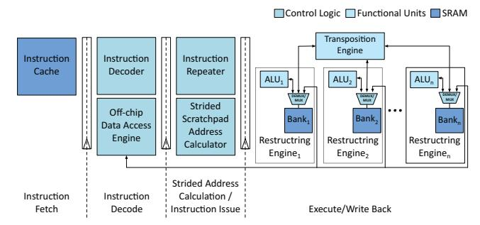
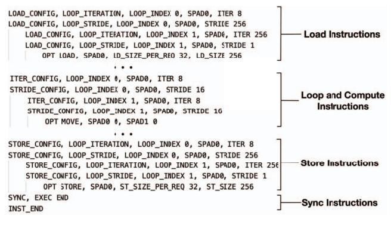
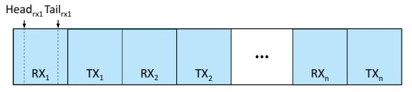
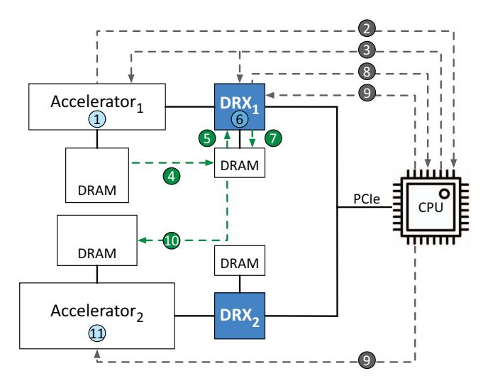

# *B. DRX Hardware Architecture*

We use the above insights to design a programmable DRX that specializes in the data restructuring domain. The main observations driving DRX design are the abundance of data-level parallelism, streaming access pattern, and nontrivial operations of data restructuring. Figure 6 overviews the architecture of DRX hardware.

DRX uses a decoupled access-execute architecture that consists of a programmable front-end specialized for walking over multi-dimensional data structures, and a configurable number of interleaved vector processing units dubbed Restructuring Engine (RE) in the same pipeline. It also includes a Transposition Engine for data transposition operations and a programmable Off-chip Data Access Engine for off-chip load/store which also houses a DMA engine that initiates data movement with other accelerators. For evaluation, we configure the DRX to contain 128 lanes of RE, a 64KB instruction cache, a 64KB data scratchpad, and 8GB of DDR4 DRAM. A DDR4 3200 memory channel sustains ∼25GBps, therefore DRX implements a single DDR4 channel to match the bandwidth of an x8 PCIe Gen 4 link.

Fig. 6: DRX Hardware Architecture.

**DRX ISA.** The DRX ISA and hardware architecture are optimized based on the observation that data restructuring workloads consist of known-shape, pre-located multidimensional arrays. Such arrays can be indexed using a set of loops. As shown in Figure 7, the DRX ISA includes specialized loop, compute, off-chip memory access, and synchronization instructions for vector operations while preserving the option for scalar operations, enabling serial tasks like pointer dereferencing.

The DRX ISA significantly departs from traditional SIMD semantics, offering optimizations for memory, loops, and data packing. For memory optimization, DRX employs software-managed on-chip scratchpads instead of vector register files and the conventional cache hierarchy found in common SIMD ISAs. Memory instructions configure the Off-chip Data Access Engine to fetch data directly from DRAM to the on-chip scratchpads. For loop optimization, DRX utilizes hardware loops within an Instruction Repeater unit to reduce branch instruction overhead. Loop instructions configure the Instruction Repeater based on the dimensions of the kernel's multidimensional arrays. For data packing optimization, the DRX compiler partitions the kernel's multidimensional arrays across the REs, eliminating the need for pack/unpack instructions.

During the vector execution, loop instructions first configure the Off-chip Data Access Engine and Strided Scratchpad Address Calculator with sets of <Base, Stride, Iteration> configurations that correspond to the input/output loop dimensions and data location. After the Off-chip Data Access Engine loads the data to scratchpad banks, compute instruction is issued with scratchpad addresses calculated by the Instruction Repeater by traversing the dimensions of multidimensional arrays based on the configurations in the Strided Scratchpad Address Calculator. This data access scheme significantly reduces memory and address calculation overhead and is applied to all operations on multidimensional arrays such as data transformation, memory access, and compute operations. Finally, synchronization instructions are issued at the start and the end of the instruction stream to ensure proper program order. For scalar execution, DRX turns off all but one REs and operates as a scalar in-order CPU.

**DRX compiler.** Inspired from prior works [104–106] in other domains, DRX compiler compiles high-level data restructuring kernels into DRX instructions based on the DRX ISA. The DRX compiler takes two inputs: a high-level representation of

|                 | 2 bits   | 4 bits   | 26 bits                         |
|-----------------|----------|----------|---------------------------------|
| Loop            | Operaton | Function | Loop Dims, Base, Iter, Stride   |
| Compute         | Operaton | Function | Dest Addr, Src1 Addr, Src2 Addr |
| Off-chip Memory | Operaton | Function | Base/Tile Control, Req Size     |
| Synchronization | Operaton | Function | Instruction Group, Start/Done   |

Fig. 7: DRX instruction types.

the data restructuring kernel and an architecture configuration file that defines the DRX hardware configurations such as the number of REs and on-chip scratchpad size. The compiler first maps the data restructuring kernel to the intermediate representation of the kernel operations. It then optimizes tiling and relaxes dependency on the intermediate representation based on the hardware configuration and the dimension of multidimensional arrays. Finally, it generates instructions based on DRX ISA from the optimized intermediate representation. Figure 8 shows a sample of the DRX kernel.

#### V. SYSTEM INTEGRATION AND PROGRAMMABILITY

In this section we discuss the system integration and programmability of DMX with Bump-in-the-Wire DRX placement. The system integration of other DRX placements share many similarities with Bump-in-the-Wire DRX.

**Programming model.** DMX implements an OpenCL-style programming model that has a host program on the CPU and kernels on accelerators or DRX. Application kernels are executed on accelerators while data restructuring kernels are executed on DRX. Because DMX runs the control plane on the CPU, it does not compromise the programmer's productivity and does not incur any additional accelerator orchestration overhead compared to the baseline multi-acceleration system.

The host program creates an execution context for each instance of the application kernel or data restructuring kernel. The context includes (1) the hardware – e.g. the accelerator or DRX– involved in the applications, (2) application or data restructuring kernels, and (3) a per accelerator *command queue* that is mapped to the global host address space. The command queue is used for buffering the output of the application kernels and the restructured input of the next application kernel before being transferred to the destination.

The host program uses user-level OpenCL API to create the execution context. It also uses the API to interact with the accelerators and DRXs through their own *command queue* on each device. The command queue accepts commands to enqueue kernels for execution, transfer data, or synchronize memory buffers. The execution of a command can be blocking or non-blocking. Blocking execution does not return to the host program before the current command completes. Non-blocking execution, on the other hand, requires a detailed description of the dependency between kernels and data restructuring programs. For a single command queue, the queued commands are executed in the order they are enqueued.

The application kernels execute domain-specific kernels of the end-to-end application on different accelerators. The data restructuring kernels perform the required data restructuring

**Fig. 8: Sample DRX kernel.**

**Fig. 9: RX/TX data queue pair architecture in Bump-in-the-Wire DRX. DRX uses the data queue as a circular buffer with head and tail pointers. The output of the accelerator that is destined for** *Acceleratori* **is enqueued in** *RXi* **before being restructured and stored in** *T Xi* **for transmission to** *Acceleratori***. Current DRX implementation supports up to a total** *n* = 40 **accelerators.**

operations when two accelerators are communicating. The host program executes the serial portion of the application and runs a daemon to orchestrate the execution of application and data restructuring kernels running on accelerators and DRXs, respectively. The data restructuring kernels are shipped to DRXs that understand the exact input and output format of each accelerator. The data restructuring kernels are engaged to ensure that properly structured input/output data is moved directly between accelerators and DRX.

Driver support for DMX. At a high level, DMX enumerates both accelerators and DRXs as PCIe devices connected to the CPU. Each DRX unit has a driver to initialize the command queues, exchange the start and end pointers of the queue to other DRXs at the start, and orchestrate data restructuring operations. The drivers use GEM [107, 108] for command executions and memory-related operations. DRX driver executes commands and reads/writes/maps operations using ioctl syscall. For setting up point-to-point DMA between DRX and accelerators, the drivers use dma-buf API [109]. The vendor-specific accelerator drivers should support point-to-point DMA in order to work with DMX. By default, we operate accelerators and DRXs in interrupt mode for sending notifications to the CPU. The interrupt handling of the drivers utilizes interrupt coalescing for the bursty arrival of interrupts. If the arrival rate of interrupts exceeds a certain threshold, the drivers switch to polling. This design is similar to Linux NAPI design [110].

Although Bump-in-the-Wire DRX is attached to each accelerator, each DRX unit should be able to set up a point-to-point connection with all the other accelerators and DRXs in the system. The memory address space of each DRX is statically partitioned between all the accelerators as well as DRXs in the system to implement two pairs of RX/TX *data queues*

**Fig. 10: Point-to-point DMA workflow involves two accelerators and the sending side DRX. The DMA bypasses the receiving side DRX. DMX supports other communication patterns such as broadcast and multicast among DRXs and between DRXs and accelerators.**

per accelerator on each DRX: one pair of queues for direct DRX-accelerator communication and another pair of queues for DRX-DRX communication.

The number of accelerators is determined at PCIe enumeration time when it discovers connected accelerators that need data restructuring. We provision 8GB of memory space for implementing data queues on each DRX. The size of each data queue pair is 100MB. This will enable DMX to support up to 40 accelerators on a server. DRX driver maintains a head and tail pointer for each data queue to keep track of the data that is enqueued for restructuring. RX and TX data queues on a DRX are shown in Figure 9. A point-to-point DMA moves data between data queue pairs and accelerator memory.

GEM allocates and frees data buffers opaquely because it is agnostic to the data content in the buffer. The allocated data buffers are referred to by their handle, which is equivalent to a file descriptor.

End-to-end data motion acceleration. Figure 10 shows the interactions between accelerators, CPU, and Bump-inthe-Wire DRX when *Accelerator*1 tries to communicate with *Accelerator*2. Although Figure 10 depicts the accelerator and its DRX as separate chips with separate DRAM modules, DRX can be integrated into the accelerator chip and share its physical DRAM modules. YesWhen *Accelerator*1 completes kernel execution in step 1 , it raises an interrupt to the CPU in step 2 . The driver of *Accelerator*1 captures the interrupt and setup a point-to-point DMA between *Accelerator*1 and the TX data queue corresponding to *Accelerator*2 on *DRX*1. *DRX*1's driver shares the offset of *RX*2 data queue (i.e., RX data queue corresponding to *Accelerator*2) in step 3 with *Accelerator*1. This enables the *Accelerator*1 to access and write to the *RX*2 data queue on *DRX*1. A DRX driver then configures *Accelerator*1 to perform a point-to-point DMA and move data from *Accelerator*1's memory to the next available

| Benchmark            | Kernel 1    | Kernel 1 Accelerator    | Data Restructuring       | Kernel 2        | Kernel 2 Accelerator    | Input Dimension |
|----------------------|-------------|-------------------------|--------------------------|-----------------|-------------------------|-----------------|
| Video                | H.264 Codec | Xilinx Video            | Mul, MaxPool,            | Object          | DNN Accelerator [13]    | (960, 540, 3)   |
| Surveillance [84]    | H.264 CodeC | Codec Unit [111]        | Reshape, Cast            | Detection       |                         |                 |
| Sound                | FFT         | Xilinx Vitis            | Pow, Add, Mul,           | Support Vector  | Xilinx Vitis Data       | (8192, 768)     |
| Detection [85]       | FFI         | DSP Library [112]       | Div, Log10, Cast         | Machine         | Analytics Library [113] |                 |
| Brain                | FFT         | Xilinx Vitis            | Pow, Div, Mul,           | Proximal Policy | DNN Accelerator [13]    | (256, 1024, 8)  |
| Stimulation [86]     | FFI         | DSP Library [112]       | Cast                     | Optimization    |                         |                 |
| Personal Information | AES-GCM     | Xilinx Vitis            | Concat, Flatten          | Regular         | Xilinx Vitis Data       | (4, 2048, 768)  |
| Redaction [87]       | AES-GUIVI   | Security Library [114]  | Concat, Flatteri         | Expression      | Analytics Library [113] |                 |
| Database Hash Join   | Gzip        | Xilinx Vitis Data [115] | Concat, Reshape, Cast | Hash Join       | Xilinx Vitis            | (4, 1024, 512)  |
| [82]                 |             | Compression Library     |                          |                 | Database Library [116]  |                 |

TABLE I: End-to-end benchmarks

buffer in  $RX_2$  data queue on  $DRX_1$  in step ④. The DRX processing unit on  $DRX_1$  reads the output on  $Accelerator_1$ 's memory from  $RX_2$  data queue, performs data restructuring, and writes the output to the next available buffer in  $TX_2$  data queue as shown in step ⑤ to ⑦. In step ⑧,  $DRX_1$  raises an interrupt to the CPU to notify the  $DRX_1$  driver about the completion of data restructuring. Next, a point-to-point DMA is configured between  $DRX_1$  and  $Accelerator_2$  in step ⑨. In step ①, point-to-point DMA between  $DRX_1$  and  $Accelerator_2$  passes through an internal PCIe multiplexer without invoking  $DRX_2$  because it does not need further data restructuring on it. In step ①,  $Accelerator_2$  runs the kernel on its DRAM.

One-to-many and many-to-one data movement. Supporting broadcast and multicast between the accelerator chain is necessary for load balancing as well as efficient collective communication implementation. The workflow of such movement patterns is similar to that of Figure 10, except that for one-to-many, the source DRX transfers the restructured output of the source accelerator to multiple accelerators (or DRXs) using multiple back-to-back point-to-point DMA transfers. Variations of many-to-one data movement can be used to implement reduction collectives by setting up direct data transfer from multiple source DRXs to a single destination DRX that also performs the reduction operation. The DMX support for broadcast and multicast facilitates the efficient implementation of various collective operations.

