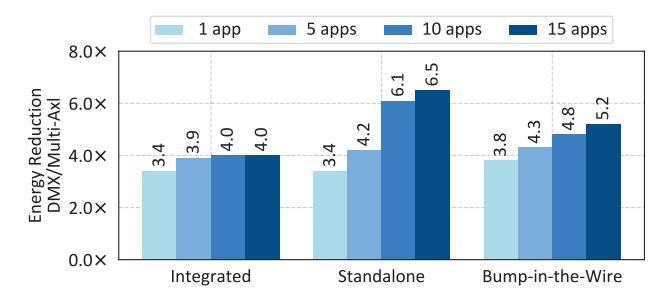
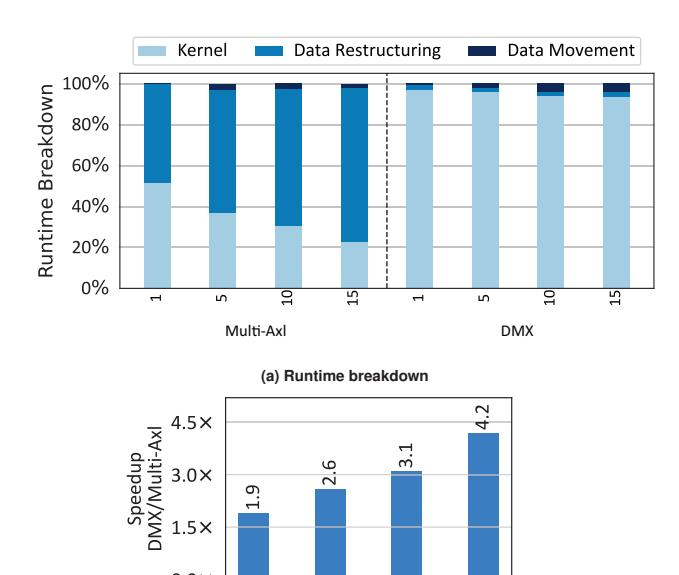
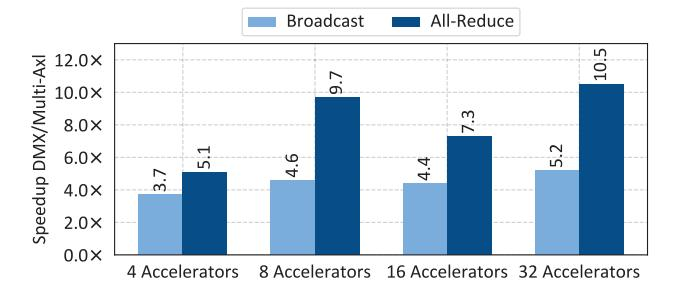
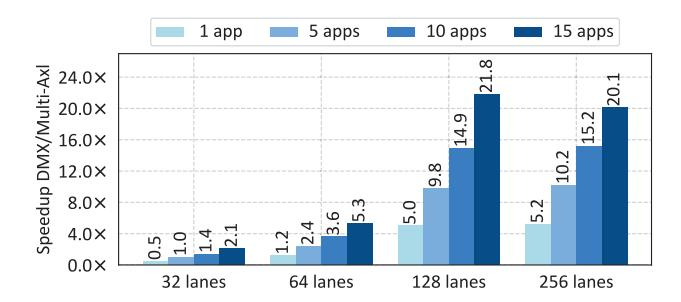
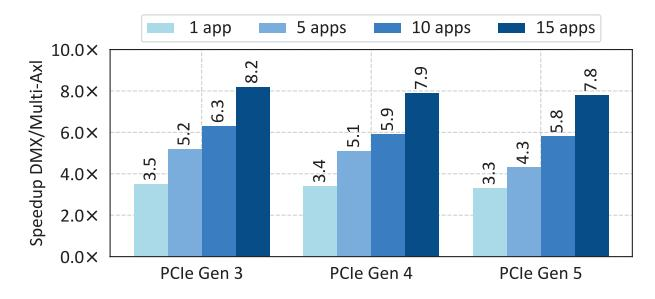

# B. DRX Placement Analysis

One of the critical design decisions in DMX is the location of the DRX in the system: Integrated, Standalone, Bump-in-the-Wire, PCIe-Integrated. This is because the placement of DRX impacts the data movement and the overall system design. **Speedup with different DRX placements.** Figure 14 compares the latency speedup between Integrated DRX, Standalone DRX, Bump-in-the-Wire DRX, and PCIe-Integrated DRX. The figure reports the average speedup across the five benchmarks for one to 15 concurrent applications. For all setups from one through 15 concurrent applications, the results show that the speedups compared to the Multi-Axl baseline are in the following order: Integrated  $\leq$  Standalone  $\leq$  Bump-in-the-Wire  $\leq$  PCIe-Integrated.

Integrated DRX shows 4.4× speedup with 15 concurrent applications compared to the baseline where data restructuring is performed on the CPU. However, when running more than one application in Integrated DRX, the concurrent applications contend for the shared DRX computation resources on the CPU and the PCIe bandwidth to access the shared DRX. The upstream port of the PCIe switch connecting to the CPU uses a single link (8 lanes) while the downstream ports connecting to accelerators use multiple links. Also, a PCIe transaction pays 110 ns or more port-to-port latency tax to get through a PCIe switch [123]. Despite the significant overhead from the contended PCIe links, Integrated DRX's speedup relative to the baseline increases as we add more accelerators. This demonstrates the benefits of using DRX instead of general-purpose CPU cores for data restructuring operations.

Standalone DRX shows 3% and 48% improvements compared to the Integrated for one and 15 concurrent applications, respectively. In the Integrated DRX, we have a single DRX that is integrated to the CPU for the entire system. On the other hand, the Standalone configuration scales the number of DRX with the number of concurrent applications by inserting more DRX PCIe cards. Therefore, the speedup compared to Integrated DRX can be attributed to the larger number of DRX in the system.

Bump-in-the-Wire DRX achieves 33%, 17%, and 26% higher speedup for 5, 10, and 15 concurrent applications compared with Standalone DRX. Bump-in-the-Wire DRX keeps its point-to-point DMA traffic between accelerators and DRX under the same PCIe multiplexer so the accelerators do not need to contend for PCIe bandwidth as in Standalone DRX placement on the CPU.

PCIe-Integrated DRX shows the highest speedup. The improvement of PCIe-Integrated DRX against Bump-in-the-Wire DRX comes from the saving of a round-trip between the source DRX and the source PCIe multiplexer and a pass-through of the destination PCIe multiplexer. However, it is important to note that the integration of DRX with a PCIe switch requires in-depth modification to make the PCIe switch programmable and process data at the line rate. In other words, despite the luring benefits, the prohibitive level of engineering effort to achieve it makes the Bump-in-the-Wire a reasonable choice of DMX design that can achieve significant speedup with relatively affordable engineering efforts.

Energy reduction with different DRX placements. Figure 15 shows system-wide energy reduction provided by different DRX placements compared to Multi-Axl baseline. Integrated DRX provides  $3.4\times$ ,  $3.9\times$ ,  $4.0\times$ , and  $4.0\times$  of energy reduction.

Fig. 15: System-wide energy reduction, including host CPU cores, accelerators, and DRXs. Bump-in-the-Wire DRX achieves less reduction than Standalone DRX due to its internal PCle multiplexer shown in Fig. 4d. Integrated, Standalone, and Bump-in-the-Wire DRX draw up to 26%, 23% and 28% more power than the *Multi-AxI* baseline. PCle-Integrated is not included because we are not able to estimate the power of a DRX-integrated PCle switch.

The energy reduction does not scale with the number of concurrent applications because it only benefits from the energy efficiency of the DRX hardware acceleration for data restructuring operations. Standalone DRX and Bump-in-thewire DRX provide energy reduction scaling with the increased number of concurrent applications. Bump-in-the-wire DRX placement delivers the best energy reduction of 3.8× and  $4.3\times$  for 1 and 5 concurrent applications. Standalone DRX delivers the best energy reduction of  $6.1 \times$  and  $6.5 \times$  for 10 and 15 concurrent applications because of the reduced bandwidth contention on PCIe links. This is because the extra glue logic and the dual-port PCIe multiplexer are replicated in each Bumpin-the-Wire DRX placement, while such overhead is amortized across the applications on a large Standalone DRX. PCIe-Integrated is not evaluated for energy reduction because of the difficulty of estimating the energy consumption of a PCIe switch integrated with DRX.

#### C. Sensitivity Studies

Speedup with more than two kernels. As real-world applications can consist of multiple kernels across domains, it is important for DMX to scale beyond two kernels. To evaluate DMX's scalability with multiple application kernels, we add a third application kernel to the Personal Info Redaction benchmark, along with its additional data restructuring kernel consisting of reshaping and typecasting. This third kernel is a Transformer model fine-tuned for Named Entity Recognition (NER). NER identifies personal and sensitive information that is hard to capture for regular expression kernel [125]. We use an open-source BERT implementation for the kernel [126]. Figure 16(a) shows the runtime breakdown of this three-kernel benchmark. Although the benchmark included the computeintensive NER kernel, the runtime is still dominated by the data restructuring kernels for the Multi-Axl baseline. DMX alleviates the bottleneck of data motion and restores kernel to be the largest contributor that represents 97.2% to 93.7% of the end-to-end execution time for one to 15 concurrent applications. As such, DMX provides  $1.9 \times$  to  $4.2 \times$  speedup for one to 15 concurrent applications shown in Figure 16(b).

(b) Speedup

Fig. 16: DMX reduces data motion overhead to less than 5% for Personal Info
Redaction benchmark extended with Named Entity Recognition kernel.

5 apps 10 apps 15 apps

0.0×

1 app

One-to-many and many-to-one data movement. Crossdomain multi-acceleration of end-to-end applications entails using multiple accelerators. The data movements in multiacceleration, however, are not necessarily always one-to-one but likely include one-to-many and/or many-to-one data movement between accelerators. Therefore, we want to analyze whether DMX design can cope with the one-to-many and/or manyto-one data movements in multi-acceleration. To this end, we compare Bump-in-the-Wire DRX against the Multi-Axl baseline for one-to-many (i.e., broadcast) and many-to-one (all-reduce) data movement using 4 to 32 accelerators. For broadcast, the baseline first passes the output of the source accelerators to the main memory of the CPU using DMA. After data restructuring on the CPU, the driver then copies the restructured data and initiates N DMA transfers sequentially to the destination accelerators. All-reduce has two stages: scatterreduce and all-gather. Both require similar DMA transfers between CPU and accelerators; however, scatter-reduce entails additional steps to first sum the inputs from sources and then scatter the outputs to all destinations. On the contrary, DMX's implementation of broadcast and all-reduce utilizes the Bumpin-the-Wire DRX for data restructuring and data movement.

Figure 17 shows that the DMX achieves  $3.7 \times$  to  $5.2 \times$  speedup on broadcast and  $5.1 \times$  to  $10.5 \times$  speedup for all-reduce on 4 to 32 accelerators. This is because DMX utilizes DRXs to (1) perform data restructuring and the DMA transfers in parallel and (2) eliminate the extra DMA transfers between the accelerators and the CPU. Furthermore, for all-reduce, DMX uses DRX to accelerate the summation operations. The speedup also scales with the number of accelerators because the amount of data restructuring and data movement scale accordingly to the number of accelerators. There is a dip

**Fig. 17: DMX eliminates redundant DMA transfers and performs DMA in parallel for broadcast and all-reduce on multi-accelerator setup.**

**Fig. 18: Data restructuring latency speedup with different numbers of RE lanes on DRX. The increase of speedup is limited after 128 lanes. which is our default configuration.**

**Fig. 19: DMX speedup across generations of PCIe. PCIe Gen4 and Gen5 result in a slight decrease of speedup because their corresponding** *Multi-Axl* **baselines improve more than their DMX counterparts.**

when using 16 or more accelerators, but this is due to the additional latency on the PCIe switches that scales with the number of accelerators. DMX achieved higher speedup in allreduce compared to broadcast because all-reduce involves more DMA transfers and data restructuring which provided more acceleration opportunity using DRX.

DRX hardware configurations. To understand the sensitivity of DMX to the amount of compute resources in DRX, we sweep the number of RE lanes for DRX and compare its performance to the *Multi-Axl* baseline that performs data restructuring on CPU. Figure 18 shows the speedup achieved for the different number of lanes for DRX: from 32 to 256. The speedup improves with the number of lanes increasing up to 128 lanes by taking advantage of available data parallelism in data restructuring operations. However, the increase of speedup

of DRX is limited after 128 RE lanes, and increasing the lanes to 256 does not provide noticeable benefits. Therefore, we use 128 RE lanes as the default configuration for DRX throughout the experiments.

Different PCIe generations. Newer PCIe generation provides significantly more bandwidth and the increased bandwidth can potentially negate the performance benefit of DMX. To understand the impact of different generations of PCIe, we compare the Bump-in-the-Wire DRX latency speedup on PCIe Gen 3 with PCIe Gen 4 and Gen 5. Figure 19 shows that using PCIe Gen 4 and Gen 5 resulted in a slight decrease of speedup because their corresponding *Multi-Axl* baselines improve more than their DMX counterparts. Across PCIe generations, the baselines and DMX show different levels of improvement only in data movement latency. Such differences come from the following two reasons. First, the baselines face more bandwidth contention than the DMX and thus benefit more from the increased PCIe bandwidth per lane. Second, the baselines are able to use more PCIe lanes to reduce bandwidth contention from accelerators to CPUs with PCIe Gen 4 and Gen 5 compared to CPUs with PCIe Gen 3 [127–129]. The results shown in Figure 19 suggests that the bottleneck of *Multi-Axl* configuration is not just the PCIe interconnect, but also the data restructuring computation.

## VIII. RELATED WORK

Real-world applications span multiple domains, posing a challenge for end-to-end acceleration. While the research community has explored accelerators across diverse domains [56– 63, 80–84], the adoption of these heterogeneous accelerator to accelerate a single end-to-end application is challenging. The challenge arises due to the diverse data formats generated and consumed by each accelerator. This necessitates restructuring inputs and outputs across accelerators. While some prior works have focused on performed data restructuring using CPUs, this paper introduces the concept of Data Motion Acceleration (DMX) for efficient cross-domain multi-acceleration with heterogeneous DSAs. We review the most relevant related work in three areas: data movement, data restructuring, and interconnect fabrics integration below.

Data movement. Prior works studied point-to-point data movement between GPUs [130], between GPU and storage [131– 133], between NIC and accelerator [134–136], and between on-chip accelerators [137]. Prior works have used various techniques such as scheduling [135, 136, 138–140] to co-locate multiple domains on the same system. While these works only optimize the data movement, non-trivial operations of the data restructuring still consumes a significant fraction of the data motion. Intel Data Stream Accelerator [141] and DCS [142, 143] share a similar insight, both lack programmability and hence have limited capacity to optimize data restructuring. This work in contrast leverages DRXs as a compute-enabled glue that links different heterogeneous accelerators together and makes them appear as a monolithic but composable accelerator for the application.

**Data restructuring.** For message serialization, Optimus Prime [144] and Protobuf accelerator [145] design an accelerator for RPC message serialization. HGum [146] and Fletcher [147] implement serialization on FPGAs for acceleration. For machine learning pipelines, tf.data [148], DSI [149], DALI [150] optimize data restructuring on GPU with programmable operations. In contrast to these prior works that only optimize data restructuring for a single accelerator, this paper investigates data restructuring and movement for multi-acceleration with heterogeneous devices.

Interconnect fabrics. Previous works have used PCIe's Non-Transparent Bridge (NTB) to enable PCIe to support multiple hosts with more than one root complex, which performs address translation for operations in a specific memory range [151, 152]. Point-to-point DMA over PCIe fabric is enabled by a shared address space across all devices [153]. CXL 3.0 or later allows accelerators on different servers to be connected seamlessly by using fabric switching to link racks of devices and accelerators [88]. DUA [154] creates an overlay fabric on top of the existing physical communication stacks, such as PCIe, Ethernet, DDR, etc. These works can connect accelerators without addressing data restructuring for multi-acceleration. This work, however, tackles data motion challenges to maximize the performance of multi-acceleration.

#### IX. CONCLUSION

In this work, we quantified the data motion cost of chaining heterogeneous Domain-Specific Architectures (DSAs) for cross-domain multi-acceleration. The results showed that the data motion overhead curtails the end-to-end speedup of accelerating each domain on a set of heterogeneous DSAs. The paper introduced DMX that seamlessly weaves together multiple accelerators that deliver the performance of a large, monolithic cross-domain accelerator. On average, Data Motion Acceleration (DMX) provides between  $3.4\times$  to  $8.2\times$  speedup,  $3.0\times$  to  $13.6\times$  higher throughput, and  $3.8\times$  to  $5.2\times$  energy reduction.

Even with current single-domain DSAs, overheads of moving data on- and off-chip is presently a dominant factor that limits the performance and energy efficiency of gains [89, 155]. The impact of the data motion-highlighted in this paper-will worsen when cross-domain accelerators are chained in future datacenters to cater to the requirements of emerging end-to-end applications. This even includes the multimodal generative AI applications that use multiple models and require acceleration beyond neural networks (e.g., vector database lookups, search, etc.). Heterogeneous/3D integration coupled with emerging high-bandwidth chiplet-to-chiplet interconnects such as UCIe can improve data movement, but not data restructuring that requires computation. As such, embedding our DMX concept and architecture within these interconnects can synergistically unlock the the potential of cross-domain multi-acceleration for next-generation dataceneters.

#### ACKNOWLEDGMENT

This work was in part supported by generous gifts from Google, Microsoft, Samsung, Qualcomm, AMD Xilinx as

well as the National Science Foundation (NSF) awards CCF#2107598, CNS#1822273, National Institute of Health (NIH) award #R01EB028350, Defense Advanced Research Project Agency (DARPA) under agreement number #HR0011-18-C-0020, and Semiconductor Research Corporation (SRC) award #2021-AH-3039. This work was also supported in part by ACE, one of the seven centers in JUMP 2.0, a Semiconductor Research Corporation (SRC) program sponsored by DARPA. The U.S. Government is authorized to reproduce and distribute reprints for Governmental purposes not withstanding any copyright notation thereon. The views and conclusions contained herein are those of the authors and should not be interpreted as necessarily representing the official policies or endorsements, either expressed or implied of Google, Qualcomm, Microsoft, Xilinx, Samsung, IBM, NSF, SRC, NIH, DARPA or the U.S. Government.

#### REFERENCES

- [1] Abraham Gonzalez, Aasheesh Kolli, Samira Khan, Sihang Liu, Vidushi Dadu, Sagar Karandikar, Jichuan Chang, Krste Asanovic, and Parthasarathy Ranganathan. Profiling hyperscale big data processing. In *Proceedings of the 50th Annual International Symposium on Computer Architecture*, ISCA '23, New York, NY, USA, 2023. Association for Computing Machinery. ISBN 9798400700958. doi: 10.1145/3579371.3589082. URL https://doi.org/10.1145/3579371.3589082.
- [2] R. H. Dennard, F. H. Gaensslen, V. L. Rideout, E. Bassous, and A. R. LeBlanc. Design of ion-implanted MOSFET's with very small physical dimensions. *JSSC*, 1974
- [3] Hadi Esmaeilzadeh, Emily Blem, Renée St. Amant, Karthikeyan Sankaralingam, and Doug Burger. Dark silicon and the end of multicore scaling. In 2011 38th Annual International Symposium on Computer Architecture (ISCA), pages 365–376, 2011.
- [4] N. Hardavellas, M. Ferdman, B. Falsafi, and A. Ailamaki. Toward dark silicon in servers. *IEEE Micro*, 31(4):6–15, July–Aug. 2011.
- [5] Ganesh Venkatesh, Jack Sampson, Nathan Goulding, Saturnino Garcia, Vladyslav Bryksin, Jose Lugo-Martinez, Steven Swanson, and Michael Bedford Taylor. Conservation cores: Reducing the energy of mature computations. In Proceedings of the Fifteenth International Conference on Architectural Support for Programming Languages and Operating Systems, 2010.
- [6] Tianshi Chen, Zidong Du, Ninghui Sun, Jia Wang, Chengyong Wu, Yunji Chen, and Olivier Temam. Diannao: a small-footprint high-throughput accelerator for ubiquitous machine-learning. In ASPLOS, 2014.
- [7] Chen Zhang, Peng Li, Guangyu Sun, Yijin Guan, Bingjun Xiao, and Jason Cong. Optimizing fpgabased accelerator design for deep convolutional neural networks. In *FPGA*, 2015.
- [8] Daofu Liu, Tianshi Chen, Shaoli Liu, Jinhong Zhou, Shengyuan Zhou, Olivier Teman, Xiaobing Feng, Xuehai

- Zhou, and Yunji Chen. Pudiannao: A polyvalent machine learning accelerator. In *ASPLOS*, 2015.
- [9] Zidong Du, Robert Fasthuber, Tianshi Chen, Paolo Ienne, Ling Li, Tao Luo, Xiaobing Feng, Yunji Chen, and Olivier Temam. Shidiannao: shifting vision processing closer to the sensor. In *ISCA*, 2015.
- [10] Shaoli Liu, Zidong Du, Jinhua Tao, Dong Han, Tao Luo, Yuan Xie, Yunji Chen, and Tianshi Chen. Cambricon: An instruction set architecture for neural networks. In *ISCA*, 2016.
- [11] Shijin Zhang, Zidong Du, Lei Zhang, Huiying Lan, Shaoli Liu, Ling Li, Qi Guo, Tianshi Chen, and Yunji Chen. Cambricon-x: An accelerator for sparse neural networks. In *MICRO*, 2016.
- [12] Lili Song, Ying Wang, Yinhe Han, Xin Zhao, Bosheng Liu, and Xiaowei Li. C-brain: A deep learning accelerator that tames the diversity of cnns through adaptive data-level parallelization. In *DAC*, 2016.
- [13] Hardik Sharma, Jongse Park, Divya Mahajan, Emmanuel Amaro, Joon Kim, Chenkai Shao, Asit Misra, and Hadi Esmaeilzadeh. From high-level deep neural models to fpgas. In *MICRO*, 2016.
- [14] Manoj Alwani, Han Chen, Michael Ferdman, and Peter Milder. Fused-layer cnn accelerators. In *MICRO*, 2016.
- [15] Divya Mahajan, Jongse Park, Emmanuel Amaro, Hardik Sharma, Amir Yazdanbakhsh, Joon Kyung Kim, and Hadi Esmaeilzadeh. Tabla: A unified template-based framework for accelerating statistical machine learning. In *HPCA*, 2016.
- [16] Yongming Shen, Michael Ferdman, and Peter Milder. Escher: A cnn accelerator with flexible buffering to minimize off-chip transfer. In *FCCM*, 2017.
- [17] Linghao Song, Xuehai Qian, Hai Li, and Yiran Chen. Pipelayer: A pipelined reram-based accelerator for deep learning. In *HPCA*, 2017.
- [18] Angshuman Parashar, Minsoo Rhu, Anurag Mukkara, Antonio Puglielli, Rangharajan Venkatesan, Brucek Khailany, Joel Emer, Stephen W Keckler, and William J Dally. SCNN: An Accelerator for Compressed-sparse Convolutional Neural Networks. In *ISCA*, 2017.
- [19] Norman P. Jouppi, Cliff Young, Nishant Patil, David Patterson, Gaurav Agrawal, Raminder Bajwa, Sarah Bates, Suresh Bhatia, Nan Boden, Al Borchers, Rick Boyle, Pierre-luc Cantin, Clifford Chao, Chris Clark, Jeremy Coriell, Mike Daley, Matt Dau, Jeffrey Dean, Ben Gelb, Tara Vazir Ghaemmaghami, Rajendra Gottipati, William Gulland, Robert Hagmann, C. Richard Ho, Doug Hogberg, John Hu, Robert Hundt, Dan Hurt, Julian Ibarz, Aaron Jaffey, Alek Jaworski, Alexander Kaplan, Harshit Khaitan, Daniel Killebrew, Andy Koch, Naveen Kumar, Steve Lacy, James Laudon, James Law, Diemthu Le, Chris Leary, Zhuyuan Liu, Kyle Lucke, Alan Lundin, Gordon MacKean, Adriana Maggiore, Maire Mahony, Kieran Miller, Rahul Nagarajan, Ravi Narayanaswami, Ray Ni, Kathy Nix, Thomas Norrie, Mark Omernick, Narayana Penukonda, Andy Phelps,

- Jonathan Ross, Matt Ross, Amir Salek, Emad Samadiani, Chris Severn, Gregory Sizikov, Matthew Snelham, Jed Souter, Dan Steinberg, Andy Swing, Mercedes Tan, Gregory Thorson, Bo Tian, Horia Toma, Erick Tuttle, Vijay Vasudevan, Richard Walter, Walter Wang, Eric Wilcox, and Doe Hyun Yoon. In-datacenter performance analysis of a tensor processing unit. In *ISCA*, 2017.
- [20] Yongming Shen, Michael Ferdman, and Peter Milder. Maximizing cnn accelerator efficiency through resource partitioning. In *ISCA*, 2017.
- [21] Hyoukjun Kwon, Ananda Samajdar, and Tushar Krishna. Maeri: Enabling flexible dataflow mapping over dnn accelerators via reconfigurable interconnects. *ASPLOS*, 2018.
- [22] Jinmook Lee, Changhyeon Kim, Sanghoon Kang, Dongjoo Shin, Sangyeob Kim, and Hoi-Jun Yoo. Unpu: A 50.6 tops/w unified deep neural network accelerator with 1b-to-16b fully-variable weight bit-precision. In *ISSCC*, 2018.
- [23] Yu-Hsin Chen, Tien-Ju Yang, Joel Emer, and Vivienne Sze. Eyeriss v2: A flexible accelerator for emerging deep neural networks on mobile devices. *JETCAS*, 2019.
- [24] Yakun Sophia Shao, Jason Clemons, Rangharajan Venkatesan, Brian Zimmer, Matthew Fojtik, Nan Jiang, Ben Keller, Alicia Klinefelter, Nathaniel Pinckney, Priyanka Raina, Stephen G. Tell, Yanqing Zhang, William J. Dally, Joel Emer, C. Thomas Gray, Brucek Khailany, and Stephen W. Keckler. Simba: Scaling deep-learning inference with multi-chip-module-based architecture. In *MICRO*, 2019.
- [25] Mingyu Gao, Xuan Yang, Jing Pu, Mark Horowitz, and Christos Kozyrakis. Tangram: Optimized coarse-grained dataflow for scalable nn accelerators. In *ASPLOS*, 2019.
- [26] Tong Geng, Ang Li, Runbin Shi, Chunshu Wu, Tianqi Wang, Yanfei Li, Pouya Haghi, Antonino Tumeo, Shuai Che, Steve Reinhardt, and Martin C. Herbordt. Awb-gcn: A graph convolutional network accelerator with runtime workload rebalancing. In *MICRO*, 2020.
- [27] Mingyu Yan, Lei Deng, Xing Hu, Ling Liang, Yujing Feng, Xiaochun Ye, Zhimin Zhang, Dongrui Fan, and Yuan Xie. Hygcn: A gcn accelerator with hybrid architecture. In *HPCA*, 2020.
- [28] Soroush Ghodrati, Byung Hoon Ahn, Joon Kyung Kim, Sean Kinzer, Brahmendra Reddy Yatham, Navateja Alla, Hardik Sharma, Mohammad Alian, Eiman Ebrahimi, Nam Sung Kim, Cliff Young, and Hadi Esmaeilzadeh. Planaria: Dynamic architecture fission for spatial multitenant acceleration of deep neural networks. In *MICRO*, 2020.
- [29] Eric Qin, Ananda Samajdar, Hyoukjun Kwon, Vineet Nadella, Sudarshan Srinivasan, Dipankar Das, Bharat Kaul, and Tushar Krishna. Sigma: A sparse and irregular gemm accelerator with flexible interconnects for dnn training. *HPCA*, 2020.
- [30] Shengwen Liang, Ying Wang, Cheng Liu, Lei He, Huawei LI, Dawen Xu, and Xiaowei Li. Engn: A high-

- throughput and energy-efficient accelerator for large graph neural networks. *TC*, 2021.
- [31] Jiajun Li, Ahmed Louri, Avinash Karanth, and Razvan Bunescu. Gcnax: A flexible and energy-efficient accelerator for graph convolutional neural networks. In *HPCA*, 2021.
- [32] Tae Jun Ham, Lisa Wu, Narayanan Sundaram, Nadathur Satish, and Margaret Martonosi. Graphicionado: A highperformance and energy-efficient accelerator for graph analytics. In *MICRO*, 2016.
- [33] Jinho Lee, Heesu Kim, Sungjoo Yoo, Kiyoung Choi, H. Peter Hofstee, Gi-Joon Nam, Mark R. Nutter, and Damir Jamsek. Extrav: Boosting graph processing near storage with a coherent accelerator. *PVLDB*, 2017.
- [34] Pengcheng Yao, Long Zheng, Xiaofei Liao, Hai Jin, and Bingsheng He. An efficient graph accelerator with parallel data conflict management. In *PACT*, 2018.
- [35] Anurag Mukkara, Nathan Beckmann, Maleen Abeydeera, Xiaosong Ma, and Daniel Sanchez. Exploiting locality in graph analytics through hardware-accelerated traversal scheduling. In *MICRO*, 2018.
- [36] Mingxing Zhang, Youwei Zhuo, Chao Wang, Mingyu Gao, Yongwei Wu, Kang Chen, Christos Kozyrakis, and Xuehai Qian. Graphp: Reducing communication for pim-based graph processing with efficient data partition. In *HPCA*, 2018.
- [37] Linghao Song, Youwei Zhuo, Xuehai Qian, Hai Li, and Yiran Chen. Graphr: Accelerating graph processing using reram. In *HPCA*, 2018.
- [38] Dan Zhang, Xiaoyu Ma, Michael Thomson, and Derek Chiou. Minnow: Lightweight offload engines for worklist management and worklist-directed prefetching. In *ASPLOS*, 2018.
- [39] Amirali Boroumand, Saugata Ghose, Minesh Patel, Hasan Hassan, Brandon Lucia, Rachata Ausavarungnirun, Kevin Hsieh, Nastaran Hajinazar, Krishna T. Malladi, Hongzhong Zheng, and Onur Mutlu. Conda: Efficient cache coherence support for near-data accelerators. In *ISCA*, 2019.
- [40] Anurag Mukkara, Nathan Beckmann, and Daniel Sanchez. Phi: Architectural support for synchronizationand bandwidth-efficient commutative scatter updates. In *MICRO*, 2019.
- [41] Shafiur Rahman, Nael Abu-Ghazaleh, and Rajiv Gupta. Graphpulse: An event-driven hardware accelerator for asynchronous graph processing. In *MICRO*, 2020.
- [42] Yu Zhang, Xiaofei Liao, Hai Jin, Ligang He, Bingsheng He, Haikun Liu, and Lin Gu. Depgraph: A dependencydriven accelerator for efficient iterative graph processing. In *HPCA*, 2021.
- [43] Shafiur Rahman, Mahbod Afarin, Nael Abu-Ghazaleh, and Rajiv Gupta. Jetstream: Graph analytics on streaming data with event-driven hardware accelerator. In *MICRO*, 2021.
- [44] Jin Zhao, Yu Zhang, Xiaofei Liao, Ligang He, Bingsheng He, Hai Jin, and Haikun Liu. Lccg: A locality-centric

- hardware accelerator for high throughput of concurrent graph processing. In *SC*, 2021.
- [45] Yatish Turakhia, Gill Bejerano, and William J. Dally. Darwin: A genomics co-processor provides up to 15,000x acceleration on long read assembly. In *ASPLOS*, 2018.
- [46] Daichi Fujiki, Arun Subramaniyan, Tianjun Zhang, Yu Zeng, Reetuparna Das, David Blaauw, and Satish Narayanasamy. Genax: A genome sequencing accelerator. In *ISCA*, 2018.
- [47] Jason Cong, Licheng Guo, Po-Tsang Huang, Peng Wei, and Tianhe Yu. Smem++: A pipelined and time-multiplexed smem seeding accelerator for genome sequencing. In *FPL*, 2018.
- [48] Subho Sankar Banerjee, Mohamed El-Hadedy, Jong Bin Lim, Zbigniew T. Kalbarczyk, Deming Chen, Steven S. Lumetta, and Ravishankar K. Iyer. Asap: Accelerated short-read alignment on programmable hardware. *IEEE Transactions on Computers*, 2019.
- [49] Anirban Nag, C. N. Ramachandra, Rajeev Balasubramonian, Ryan Stutsman, Edouard Giacomin, Hari Kambalasubramanyam, and Pierre-Emmanuel Gaillardon. Gencache: Leveraging in-cache operators for efficient sequence alignment. In *MICRO*, 2019.
- [50] Wenqin Huangfu, Xueqi Li, Shuangchen Li, Xing Hu, Peng Gu, and Yuan Xie. Medal: Scalable dimm based near data processing accelerator for dna seeding algorithm. In *MICRO*, 2019.
- [51] Damla Senol Cali, Gurpreet S. Kalsi, Zülal Bingöl, Can Firtina, Lavanya Subramanian, Jeremie S. Kim, Rachata Ausavarungnirun, Mohammed Alser, Juan Gomez-Luna, Amirali Boroumand, Anant Norion, Allison Scibisz, Sreenivas Subramoneyon, Can Alkan, Saugata Ghose, and Onur Mutlu. Genasm: A high-performance, lowpower approximate string matching acceleration framework for genome sequence analysis. In *MICRO*, 2020.
- [52] Yeseong Kim, Mohsen Imani, Niema Moshiri, and Tajana Rosing. Geniehd: Efficient dna pattern matching accelerator using hyperdimensional computing. In *DATE*, 2020.
- [53] Wenqin Huangfu, Krishna T. Malladi, Shuangchen Li, Peng Gu, and Yuan Xie. Nest: Dimm based near-dataprocessing accelerator for k-mer counting. In *ICCAD*, 2020.
- [54] Ann Franchesca Laguna, Hasindu Gamaarachchi, Xunzhao Yin, Michael Niemier, Sri Parameswaran, and X. Sharon Hu. Seed-and-vote based in-memory accelerator for dna read mapping. In *ICCAD*, 2020.
- [55] Daichi Fujiki, Shunhao Wu, Nathan Ozog, Kush Goliya, David Blaauw, Satish Narayanasamy, and Reetuparna Das. Seedex: A genome sequencing accelerator for optimal alignments in subminimal space. In *MICRO*, 2020.
- [56] Abbas Haghi, Santiago Marco-Sola, Lluc Alvarez, Dionysios Diamantopoulos, Christoph Hagleitner, and Miquel Moreto. An fpga accelerator of the wavefront

- algorithm for genomics pairwise alignment. In *FPL*, 2021.
- [57] Nika Mansouri Ghiasi, Jisung Park, Harun Mustafa, Jeremie Kim, Ataberk Olgun, Arvid Gollwitzer, Damla Senol Cali, Can Firtina, Haiyu Mao, Nour Almadhoun Alserr, Rachata Ausavarungnirun, Nandita Vijaykumar, Mohammed Alser, and Onur Mutlu. Genstore: A high-performance in-storage processing system for genome sequence analysis. In *ASPLOS*, 2022.
- [58] Damla Senol Cali, Konstantinos Kanellopoulos, Joël Lindegger, Zülal Bingöl, Gurpreet S. Kalsi, Ziyi Zuo, Can Firtina, Meryem Banu Cavlak, Jeremie Kim, Nika Mansouri Ghiasi, Gagandeep Singh, Juan Gómez-Luna, Nour Almadhoun Alserr, Mohammed Alser, Sreenivas Subramoney, Can Alkan, Saugata Ghose, and Onur Mutlu. Segram: A universal hardware accelerator for genomic sequence-to-graph and sequence-to-sequence mapping. In *ISCA*, 2022.
- [59] Onur Kocberber, Boris Grot, Javier Picorel, Babak Falsafi, Kevin Lim, and Parthasarathy Ranganathan. Meet the walkers: Accelerating index traversals for inmemory databases. In *MICRO*, 2013.
- [60] Sean Murray, William Floyd-Jones, Ying Qi, George Konidaris, and Daniel J. Sorin. The microarchitecture of a real-time robot motion planning accelerator. In *MICRO*, 2016.
- [61] Jacob Sacks, Divya Mahajan, Richard C Lawson, and Hadi Esmaeilzadeh. Robox: an end-to-end solution to accelerate autonomous control in robotics. In *ISCA*, 2018.
- [62] Yujun Lin, Zhekai Zhang, Haotian Tang, Hanrui Wang, and Song Han. Pointacc: Efficient point cloud accelerator. In *MICRO*, 2021.
- [63] Sabrina M. Neuman, Brian Plancher, Thomas Bourgeat, Thierry Tambe, Srinivas Devadas, and Vijay Janapa Reddi. Robomorphic computing: A design methodology for domain-specific accelerators parameterized by robot morphology. In *ASPLOS*, 2021.
- [64] Swagath Venkataramani, Vijayalakshmi Srinivasan, Wei Wang, Sanchari Sen, Jintao Zhang, Ankur Agrawal, Monodeep Kar, Shubham Jain, Alberto Mannari, Hoang Tran, Yulong Li, Eri Ogawa, Kazuaki Ishizaki, Hiroshi Inoue, Marcel Schaal, Mauricio Serrano, Jungwook Choi, Xiao Sun, Naigang Wang, Chia-Yu Chen, Allison Allain, James Bonano, Nianzheng Cao, Robert Casatuta, Matthew Cohen, Bruce Fleischer, Michael Guillorn, Howard Haynie, Jinwook Jung, Mingu Kang, Kyuhyoun Kim, Siyu Koswatta, Saekyu Lee, Martin Lutz, Silvia Mueller, Jinwook Oh, Ashish Ranjan, Zhibin Ren, Scot Rider, Kerstin Schelm, Michael Scheuermann, Joel Silberman, Jie Yang, Vidhi Zalani, Xin Zhang, Ching Zhou, Matt Ziegler, Vinay Shah, Moriyoshi Ohara, Pong-Fei Lu, Brian Curran, Sunil Shukla, Leland Chang, and Kailash Gopalakrishnan. RaPiD: AI accelerator for ultra-low precision training and inference. In *Proceedings of the 48th Annual International Sym-*

- *posium on Computer Architecture*, ISCA '21, page 153–166. IEEE Press, 2021. ISBN 9781450390866. doi: 10.1109/ISCA52012.2021.00021.
- [65] AWS inferentia, . URL https://aws.amazon.com/ machine-learning/inferentia/.
- [66] AWS trainium, . URL https://aws.amazon.com/machinelearning/trainium/.
- [67] Andrew Putnam, Adrian Caulfield, Eric Chung, Derek Chiou, Kypros Constantinides, John Demme, Hadi Esmaeilzadeh, Jeremy Fowers, Gopi Prashanth, Jan Gray, Michael Haselman, Scott Hauck, Stephen Heil, Amir Hormati, Joo-Young Kim, Sitaram Lanka, James R. Larus, Eric Peterson, Aaron Smith, Jason Thong, Phillip Yi Xiao, and Doug Burger. A reconfigurable fabric for accelerating large-scale datacenter services. In *ISCA*, 2014.
- [68] Adrian M. Caulfield, Eric S. Chung, Andrew Putnam, Hari Angepat, Jeremy Fowers, Michael Haselman, Stephen Heil, Matt Humphrey, Puneet Kaur, Joo-Young Kim, Daniel Lo, Todd Massengill, Kalin Ovtcharov, Michael Papamichael, Lisa Woods, Sitaram Lanka, Derek Chiou, and Doug Burger. A cloud-scale acceleration architecture. In *MICRO*, 2016.
- [69] Jeremy Fowers, Kalin Ovtcharov, Michael Papamichael, Todd Massengill, Ming Liu, Daniel Lo, Shlomi Alkalay, Michael Haselman, Logan Adams, Mahdi Ghandi, Stephen Heil, Prerak Patel, Adam Sapek, Gabriel Weisz, Lisa Woods, Sitaram Lanka, Steven K. Reinhardt, Adrian M. Caulfield, Eric S. Chung, and Doug Burger. A configurable cloud-scale dnn processor for real-time ai. In *ISCA*, 2018.
- [70] Rohan Mahapatra, Soroush Ghodrati, Byung Hoon Ahn, Sean Kinzer, Shu ting Wang, Hanyang Xu, Lavanya Karthikeyan, Hardik Sharma, Amir Yazdanbakhsh, Mohammad Alian, and Hadi Esmaeilzadeh. Domain-specific computational storage for serverless computing. *arXiv*, 2023.
- [71] Joon Kyung Kim, Byung Hoon Ahn, Sean Kinzer, Soroush Ghodrati, Rohan Mahapatra, Brahmendra Yatham, Shu-Ting Wang, Dohee Kim, Parisa Sarikhani, Babak Mahmoudi, Divya Mahajan, Jongse Park, and Hadi Esmaeilzadeh. Yin-yang: Programming abstractions for cross-domain multi-acceleration. *IEEE Micro*, 42(5):89–98, 2022. doi: 10.1109/MM.2022.3189416.
- [72] Azure zipline, . URL https://azure.microsoft.com/enus/blog/improved-cloud-service-performance-throughasic-acceleration/.
- [73] Norman P. Jouppi, Doe Hyun Yoon, Matthew Ashcraft, Mark Gottscho, Thomas B. Jablin, George Kurian, James Laudon, Sheng Li, Peter Ma, Xiaoyu Ma, Thomas Norrie, Nishant Patil, Sushma Prasad, Cliff Young, Zongwei Zhou, and David Patterson. Ten lessons from three generations shaped google's tpuv4i : Industrial product. In *ISCA*, 2021.
- [74] Parthasarathy Ranganathan, Daniel Stodolsky, Jeff Calow, Jeremy Dorfman, Marisabel Guevara, Clin-

- ton Wills Smullen IV, Aki Kuusela, Raghu Balasubramanian, Sandeep Bhatia, Prakash Chauhan, Anna Cheung, In Suk Chong, Niranjani Dasharathi, Jia Feng, Brian Fosco, Samuel Foss, Ben Gelb, Sara J. Gwin, Yoshiaki Hase, Da-ke He, C. Richard Ho, Roy W. Huffman Jr., Elisha Indupalli, Indira Jayaram, Poonacha Kongetira, Cho Mon Kyaw, Aaron Laursen, Yuan Li, Fong Lou, Kyle A. Lucke, JP Maaninen, Ramon Macias, Maire Mahony, David Alexander Munday, Srikanth Muroor, Narayana Penukonda, Eric Perkins-Argueta, Devin Persaud, Alex Ramirez, Ville-Mikko Rautio, Yolanda Ripley, Amir Salek, Sathish Sekar, Sergey N. Sokolov, Rob Springer, Don Stark, Mercedes Tan, Mark S. Wachsler, Andrew C. Walton, David A. Wickeraad, Alvin Wijaya, and Hon Kwan Wu. Warehouse-scale video acceleration: Co-design and deployment in the wild. In *ASPLOS*, 2021.
- [75] Amin Firoozshahian, Joel Coburn, Roman Levenstein, Rakesh Nattoji, Ashwin Kamath, Olivia Wu, Gurdeepak Grewal, Harish Aepala, Bhasker Jakka, Bob Dreyer, Adam Hutchin, Utku Diril, Krishnakumar Nair, Ehsan K. Aredestani, Martin Schatz, Yuchen Hao, Rakesh Komuravelli, Kunming Ho, Sameer Abu Asal, Joe Shajrawi, Kevin Quinn, Nagesh Sreedhara, Pankaj Kansal, Willie Wei, Dheepak Jayaraman, Linda Cheng, Pritam Chopda, Eric Wang, Ajay Bikumandla, Arun Karthik Sengottuvel, Krishna Thottempudi, Ashwin Narasimha, Brian Dodds, Cao Gao, Jiyuan Zhang, Mohammed Al-Sanabani, Ana Zehtabioskuie, Jordan Fix, Hangchen Yu, Richard Li, Kaustubh Gondkar, Jack Montgomery, Mike Tsai, Saritha Dwarakapuram, Sanjay Desai, Nili Avidan, Poorvaja Ramani, Karthik Narayanan, Ajit Mathews, Sethu Gopal, Maxim Naumov, Vijay Rao, Krishna Noru, Harikrishna Reddy, Prahlad Venkatapuram, and Alexis Bjorlin. Mtia: First generation silicon targeting meta's recommendation systems. In *Proceedings of the 50th Annual International Symposium on Computer Architecture*, ISCA '23, New York, NY, USA, 2023. Association for Computing Machinery. ISBN 9798400700958. doi: 10.1145/3579371.3589348. URL https://doi.org/10.1145/3579371.3589348.
- [76] Rohit Badlaney. How IBM is helping clients deploy foundation models and AI workloads with new GPU offering on IBM cloud, 2023. URL https: //newsroom.ibm.com/How- IBM-is- Helping-Clients-Deploy-Foundation-Models-and-AI-Workloads-with-New-GPU-Offering-on-IBM-Cloud.
- [77] T. Gershon, B. Karacali-Akyamac, S. Seelam, D. Thorstensen, and R. Badlaney. Supercharging IBM's cloud-native AI supercomputer, 2023. URL https://research.ibm.com/blog/vela-ai-supercomputerupdates.
- [78] Jeffrey Burns and Leland Chang. IBM artificial intelligence unit, 2022. URL https://research.ibm.com/blog/ ibm-artificial-intelligence-unit-aiu.
- [79] Gene M. Amdahl. Validity of the single processor

- approach to achieving large scale computing capabilities. In *Proceedings of the April 18-20, 1967, Spring Joint Computer Conference*, AFIPS '67 (Spring), page 483–485, New York, NY, USA, 1967. Association for Computing Machinery. ISBN 9781450378956. doi: 10.1145/1465482.1465560. URL https://doi.org/10.1145/ 1465482.1465560.
- [80] Lisa Wu, Andrea Lottarini, Timothy K. Paine, Martha A. Kim, and Kenneth A. Ross. Q100: The architecture and design of a database processing unit. In *Proceedings of the 19th International Conference on Architectural Support for Programming Languages and Operating Systems*, ASPLOS '14, page 255–268, New York, NY, USA, 2014. Association for Computing Machinery. ISBN 9781450323055. doi: 10.1145/2541940.2541961. URL https://doi.org/10.1145/2541940.2541961.
- [81] Onur Kocberber, Boris Grot, Javier Picorel, Babak Falsafi, Kevin Lim, and Parthasarathy Ranganathan. Meet the walkers: Accelerating index traversals for inmemory databases. In *Proceedings of the 46th Annual IEEE/ACM International Symposium on Microarchitecture*, MICRO-46, page 468–479, New York, NY, USA, 2013. Association for Computing Machinery. ISBN 9781450326384. doi: 10.1145/2540708.2540748. URL https://doi.org/10.1145/2540708.2540748.
- [82] David Sidler, Muhsen Owaida, Zsolt István, Kaan Kara, and Gustavo Alonso. doppiodb: A hardware accelerated database. In *FPL*, 2017.
- [83] Monica Chiosa, Fabio Maschi, Ingo Müller, Gustavo Alonso, and Norman May. Hardware acceleration of compression and encryption in sap hana. *Proc. VLDB Endow.*, 15(12):3277–3291, 2022.
- [84] Afzal Ahmad, Muhammad Adeel Pasha, and Ghulam Jilani Raza. Accelerating tiny yolov3 using fpga-based hardware/software co-design. In *IEEE ISCAS*, 2020.
- [85] Justin Salamon, Christopher Jacoby, and Juan Pablo Bello. A dataset and taxonomy for urban sound research. In *ACM Multimedia*, 2014.
- [86] Dmitrii Krylov, Remi des Combes, Romain Laroche, Michael Rosenblum, and Dmitry V Dylov. Reinforcement learning framework for deep brain stimulation study. In *IJCAI*, 2020.
- [87] Presidio: Data protection and anonymization sdk, . URL https://microsoft.github.io/presidio/.
- [88] Cxl 3.0 specification. URL https : / / www.computeexpresslink.org / download - the specification.
- [89] Mark Horowitz. 1.1 computing's energy problem (and what we can do about it). In *2014 IEEE International Solid-State Circuits Conference Digest of Technical Papers (ISSCC)*, pages 10–14, 2014. doi: 10.1109/ISSCC.2014.6757323.
- [90] Arijit Biswas. Sapphire rapids. In *Hot Chips*, 2021.
- [91] Bulent Abali, Bart Blaner, John Reilly, Matthias Klein, Ashutosh Mishra, Craig B. Agricola, Bedri Sendir, Alper Buyuktosunoglu, Christian Jacobi, William J. Starke,

- Haren Myneni, and Charlie Wang. Data compression accelerator on IBM POWER9 and z15 processors : Industrial product. In *ISCA*, 2020.
- [92] Cedric Lichtenau, Alper Buyuktosunoglu, Ramon Bertran, Peter Figuli, Christian Jacobi, Nikolaos Papandreou, Haris Pozidis, Anthony Saporito, Andrew Sica, and Elpida Tzortzatos. AI accelerator on IBM Telum processor: Industrial product. In *Proceedings of the 49th Annual International Symposium on Computer Architecture*, ISCA '22, page 1012–1028, New York, NY, USA, 2022. Association for Computing Machinery. ISBN 9781450386104. doi: 10.1145/3470496.3533042. URL https://doi.org/10.1145/3470496.3533042.
- [93] Intel built-in accelerators. URL https : / / www.supermicro.com / en / accelerators / intel / built in-on-demand.
- [94] Samuel Naffziger, Noah Beck, Thomas Burd, Kevin Lepak, Gabriel H. Loh, Mahesh Subramony, and Sean White. Pioneering chiplet technology and design for the amd epyc™ and ryzen™ processor families. In *Proceedings of the 48th Annual International Symposium on Computer Architecture*, 2021.
- [95] ODSA-BoW specifications. URL https : / / opencomputeproject.github.io / ODSA - BoW / bow\_specification.html.
- [96] UCIe 1.1 specifications. URL https : //www.uciexpress.org/specifications.
- [97] Pat Bosshart, Glen Gibb, Hun-Seok Kim, George Varghese, Nick McKeown, Martin Izzard, Fernando Mujica, and Mark Horowitz. Forwarding metamorphosis: Fast programmable match-action processing in hardware for sdn. In *Proceedings of the Conference of the ACM Special Interest Group on Data Communication*, 2013.
- [98] Sharad Chole, Andy Fingerhut, Sha Ma, Anirudh Sivaraman, Shay Vargaftik, Alon Berger, Gal Mendelson, Mohammad Alizadeh, Shang-Tse Chuang, Isaac Keslassy, Ariel Orda, and Tom Edsall. Drmt: Disaggregated programmable switching. In *Proceedings of the Conference of the ACM Special Interest Group on Data Communication*, 2017.
- [99] Amedeo Sapio, Ibrahim Abdelaziz, Abdulla Aldilaijan, Marco Canini, and Panos Kalnis. In-network computation is a dumb idea whose time has come. In *Proceedings of the 16th ACM Workshop on Hot Topics in Networks*, 2017.
- [100] Yuta Tokusashi, Huynh Tu Dang, Fernando Pedone, Robert Soulé, and Noa Zilberman. The case for innetwork computing on demand. In *Proceedings of the Fourteenth EuroSys Conference 2019*, 2019.
- [101] Ahmad Yasin. A top-down method for performance analysis and counters architecture. In *2014 IEEE International Symposium on Performance Analysis of Systems and Software (ISPASS)*, pages 35–44, 2014.
- [102] Intel vtune profiler, . URL https://www.intel.com/ content / www / us / en / developer / tools / oneapi / vtune profiler.html.

- [103] CloudSuite | A Benchmark Suite for Cloud Services. URL https://www.cloudsuite.ch/.
- [104] Tianqi Chen, Thierry Moreau, Ziheng Jiang, Lianmin Zheng, Eddie Yan, Haichen Shen, Meghan Cowan, Leyuan Wang, Yuwei Hu, Luis Ceze, et al. TVM: An automated end-to-end optimizing compiler for deep learning. In *OSDI*, 2018.
- [105] Sean Kinzer, Soroush Ghodrati, Rohan Mahapatra, Byung Hoon Ahn, Edwin Mascarenhas, Xiaolong Li, Janarbek Matai, Liang Zhang, and Hadi Esmaeilzadeh. Restoring the broken covenant between compilers and deep learning accelerators. *arXiv*, 2023.
- [106] Tianqi Chen, Lianmin Zheng, Eddie Yan, Ziheng Jiang, Thierry Moreau, Luis Ceze, Carlos Guestrin, and Arvind Krishnamurthy. Learning to optimize tensor programs. In *NeurIPS*, pages 3389–3400, 2018.
- [107] Linux kernel drm-gem drivers, . URL https:// www.kernel.org/doc/html/latest/gpu/drm-mm.html.
- [108] Lwn.net article on gem, . URL https://lwn.net/Articles/ 283798/.
- [109] dma-buf. URL https://docs.kernel.org/driver-api/dmabuf.html.
- [110] Napi. URL https://www.kernel.org/doc/html/next/ networking/napi.html.
- [111] Xilinx u30 vcu, . URL https://www.xilinx.com/ content / dam / xilinx / support / documents / data\_sheets / ds970-u30.pdf.
- [112] Xilinx vitis dsp library, . URL https://xilinx.github.io/ Vitis\_Libraries/dsp/2022.1/index.html.
- [113] Xilinx vitis data analytics library, . URL https:// xilinx.github.io/Vitis\_Libraries/data\_analytics/2022.1/ index.html.
- [114] Xilinx vitis security library, . URL https : / / xilinx.github.io / Vitis\_Libraries / security / 2022.1/index.html.
- [115] Xilinx vitis data compression library, . URL https: / / xilinx.github.io / Vitis\_Libraries / data\_compression / 2022.1/index.html.
- [116] Xilinx vitis database library, . URL https : / / xilinx.github.io / Vitis\_Libraries / database / 2022.1 / index.html.
- [117] Joseph Redmon and Ali Farhadi. Yolov3: An incremental improvement. *arXiv*, 2018.
- [118] James E. Stine, Ivan Castellanos, Michael Wood, Jeff Henson, Fred Love, W. Rhett Davis, Paul D. Franzon, Michael Bucher, Sunil Basavarajaiah, Julie Oh, and Ravi Jenkal. Freepdk: An open-source variation-aware design kit. In *2007 IEEE International Conference on Microelectronic Systems Education (MSE'07)*, pages 173–174, 2007. doi: 10.1109/MSE.2007.44.
- [119] Amazon EC2 F1 Instances. URL https : //aws.amazon.com/ec2/instance-types/f1/.
- [120] Aws vt1 instance, . URL https://xilinx.github.io/videosdk/v1.5/getting\_started\_on\_vt1.html.
- [121] Xilinx vitis libraries, . URL https://xilinx.github.io/ Vitis\_Libraries/.

- [122] Intel rapl, . URL https://www.intel.com/content/www/ us/en/developer/articles/technical/software - security guidance/advisory- guidance/running- average- powerlimit-energy-reporting.html.
- [123] Broadcom pex88000 managed pci express 4.0 switches. URL https : / / www.broadcom.com / products / pcie switches-bridges/expressfabric.
- [124] Noah Beck, Sean White, Milam Paraschou, and Samuel Naffziger. Zeppelin: An soc for multichip architectures. In *IEEE ISSCC*, 2018.
- [125] Transformers based named entity recognition models. URL https://huggingface.co/Jean-Baptiste/roberta-largener-english.
- [126] Hadi Esmaeilzadeh, Soroush Ghodrati, Jie Gu, Shiyu Guo, Andrew B. Kahng, Joon Kyung Kim, Sean Kinzer, Rohan Mahapatra, Susmita Dey Manasi, Edwin Mascarenhas, Sachin S. Sapatnekar, Ravi Varadarajan, Zhiang Wang, Hanyang Xu, Brahmendra Reddy Yatham, and Ziqing Zeng. Verigood-ml: An open-source flow for automated ml hardware synthesis. In *ICCAD*, 2021.
- [127] Intel cascade lake, . URL https://ark.intel.com/content/ www/us/en/ark/products/192447/intel-xeon-gold-6252 processor-35-75m-cache-2-10-ghz.html.
- [128] Intel ice lake, . URL https://ark.intel.com/content/ www/us/en/ark/products/212456/intel-xeon-gold-6348 processor-42m-cache-2-60-ghz.html.
- [129] Intel sapphire rapids, . URL https://ark.intel.com/content/ www/us/en/ark/products/231750/intel-xeon-platinum-8468h-processor-105m-cache-2-10-ghz.html.
- [130] Gpudirect. URL https://developer.nvidia.com/gpudirect.
- [131] Hung-Wei Tseng, Qianchen Zhao, Yuxiao Zhou, Mark Gahagan, and Steven Swanson. Morpheus: Creating application objects efficiently for heterogeneous computing. In *ISCA*, 2016.
- [132] Shai Bergman, Tanya Brokhman, Tzachi Cohen, and Mark Silberstein. SPIN: Seamless operating system integration of Peer-to-Peer DMA between SSDs and GPUs. In *ATC*, 2017.
- [133] Yu-Chia Liu and Hung-Wei Tseng. Nds: N-dimensional storage. In *MICRO*, 2021.
- [134] Ryo Nakamura, Yohei Kuga, and Kunio Akashi. How beneficial is peer-to-peer dma? In *APSys*, 2020.
- [135] Maroun Tork, Lina Maudlej, and Mark Silberstein. Lynx: A smartnic-driven accelerator-centric architecture for network servers. In *ASPLOS*, 2020.
- [136] Haggai Eran, Maxim Fudim, Gabi Malka, Gal Shalom, Noam Cohen, Amit Hermony, Dotan Levi, Liran Liss, and Mark Silberstein. Flexdriver: A network driver for your accelerator. In *ASPLOS*, 2022.
- [137] Jason Cong, Mohammad Ali Ghodrat, Michael Gill, Beayna Grigorian, and Glenn Reinman. Architecture support for accelerator-rich cmps. In *Proceedings of the 49th Annual Design Automation Conference*, 2012.
- [138] Ashraf Mahgoub, Edgardo Barsallo Yi, Karthick Shankar, Eshaan Minocha, Sameh Elnikety, Saurabh Bagchi, and Somali Chaterji. Wisefuse: Workload characterization

- and dag transformation for serverless workflows. In *SIGMETRICS*, 2022.
- [139] Rohan Mahapatra, Byung Hoon Ahn, Shu-Ting Wang, Hanyang Xu, and Hadi Esmaeilzadeh. Exploring efficient ml-based scheduler for microservices in heterogenous clusters. In *Machine Learning for Computer Architecture and Systems 2022*, 2022.
- [140] Christina Delimitrou and Christos Kozyrakis. Paragon: Qos-aware scheduling for heterogeneous datacenters. In *ASPLOS*, 2013.
- [141] Intel data streaming accelerator, . URL https://www.intel.com/content/www/us/en/develop/ articles/intel- data- streaming- accelerator- architecturespecification.html.
- [142] Jaehyung Ahn, Dongup Kwon, Youngsok Kim, Mohammadamin Ajdari, Jaewon Lee, and Jangwoo Kim. Dcs: A fast and scalable device-centric server architecture. In *MICRO*, 2015.
- [143] Dongup Kwon, Jaehyung Ahn, Dongju Chae, Mohammadamin Ajdari, Jaewon Lee, Suheon Bae, Youngsok Kim, and Jangwoo Kim. Dcs-ctrl: A fast and flexible device-control mechanism for device-centric server architecture. In *ISCA*, 2018.
- [144] Arash Pourhabibi, Siddharth Gupta, Hussein Kassir, Mark Sutherland, Zilu Tian, Mario Paulo Drumond, Babak Falsafi, and Christoph Koch. Optimus prime: Accelerating data transformation in servers. In *ASPLOS*, 2020.
- [145] Sagar Karandikar, Chris Leary, Chris Kennelly, Jerry Zhao, Dinesh Parimi, Borivoje Nikolic, Krste Asanovic, and Parthasarathy Ranganathan. A hardware accelerator for protocol buffers. In *MICRO*, 2021.
- [146] Sizhuo Zhang, Hari Angepat, and Derek Chiou. Hgum: Messaging framework for hardware accelerators. In *ReConFig*, 2017.
- [147] Johan Peltenburg, Jeroen Van Straten, Lars Wijtemans, Lars Van Leeuwen, Zaid Al-Ars, and Peter Hofstee. Fletcher: A framework to efficiently integrate fpga accelerators with apache arrow. In *FPL*.
- [148] Derek G. Murray, Jiˇrí Šimša, Ana Klimovic, and Ihor Indyk. Tf.data: A machine learning data processing framework. *Proc. VLDB Endow.*, 14(12), 2021.
- [149] Mark Zhao, Niket Agarwal, Aarti Basant, Bugra Gedik, ˘ Satadru Pan, Mustafa Ozdal, Rakesh Komuravelli, Jerry Pan, Tianshu Bao, Haowei Lu, Sundaram Narayanan, Jack Langman, Kevin Wilfong, Harsha Rastogi, Carole-Jean Wu, Christos Kozyrakis, and Parik Pol. Understanding data storage and ingestion for large-scale deep recommendation model training: Industrial product. In *ISCA*, 2022.
- [150] Nvidia dali. URL https://developer.nvidia.com/dali.
- [151] Rui Hou, Tao Jiang, Liuhang Zhang, Pengfei Qi, Jianbo Dong, Haibin Wang, Xiongli Gu, and Shujie Zhang. Cost effective data center servers. In *HPCA*, 2013.
- [152] Jonas Markussen, Lars Bjørlykke Kristiansen, Pål Halvorsen, Halvor Kielland-Gyrud, Håkon Kvale Stens-

- land, and Carsten Griwodz. Smartio: Zero-overhead device sharing through pcie networking. *ACM Trans. Comput. Syst.*, 38(1–2), 2021.
- [153] Gigaio fabrex. URL https://gigaio.com/wp-content/ uploads/2022/01/GigaIO - FabreX - composability\_v1 - 1.pdf.
- [154] Ran Shu, Peng Cheng, Guo Chen, Zhiyuan Guo, Lei Qu, Yongqiang Xiong, Derek Chiou, and Thomas Moscibroda. Direct universal access: Making data center resources available to FPGA. In *NSDI*, 2019.
- [155] Bill Dally. Accelerator clusters: the new supercomputer. In *HOTI*, 2023.