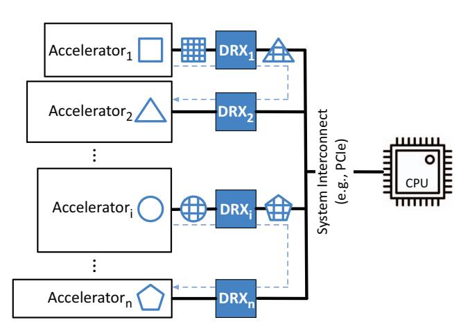
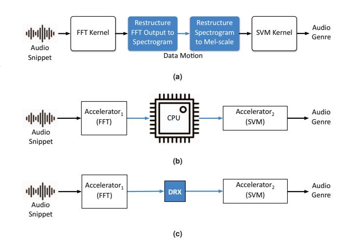
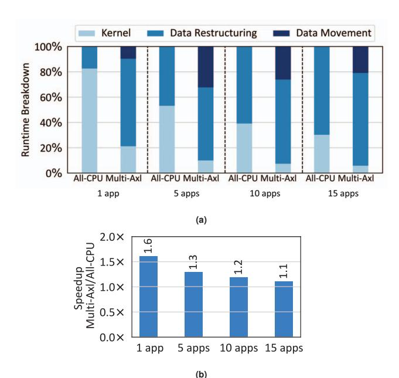

# I. INTRODUCTION

With the effective end of Dennard Scaling [2], the dark silicon [3–5] phenomenon sparked significant interest in Domain-Specific Architectures (DSAs) or accelerators. With the Cambrian explosion of research on designing accelerators [6– 64] and shifts in cloud computing [19, 65–75], it is fitting to consider the current cadence of the datacenter design as a starting point for the large-scale adoption of accelerators. For instance, Amazon Web Service (AWS) [65, 66], Microsoft Azure [67–69, 72], Google Cloud Platform (GCP) [19, 73, 74], and IBM Hybrid Multicloud [76–78] as the four providers of cloud services recently started offering accelerator equipped instances, while Meta started to use accelerators for their internal workloads [75].

To date, these early adoptions rather exclusively focus on the single domain of deep learning. Whereas, the real-world end-to-end applications cross the boundary of multiple domains (e.g., database queries, compression, encryption, video coding, signal processing, and traditional machine learning) and *may or*

**Fig. 1: Multi-accelerator systems using DMX removes the CPU from the critical path of multi-acceleration. CPU, DRX, and accelerators are connected with system interconnect, e.g., PCIe. DMX delivers the performance of a monolithic accelerator while offering the composability and programmablity of the baseline system.**

*may not* include deep neural networks. Focusing on the single domain of neural networks does not fully take advantage of the potential for acceleration. According to Amdahl's Law [79], after accelerating the neural domain, the overall speedup is and will be limited by the fraction of the code that is not accelerated. To this end, cross-domain multi-acceleration in datacenters seems to be one of the next exciting opportunities for research and development.

While the research community has explored accelerators across different domains [56–63, 80–84], the adoption of these heterogeneous accelerator in datacenters is challenging. When the application lends itself to cross-domain multi-acceleration, chaining heterogeneous accelerators seems alluring [1], yet it may not be effective. That is because each accelerator generates and consumes data in its own specific format and chaining them requires restructuring inputs and outputs. Normally, the host CPU would be responsible for this restructuring to enable *data motion* from one accelerator to another. First, this setup puts the CPU on the critical path of operand delivery as it has to carry out the data restructuring computations to effectively chain multiple accelerators. Second, the data needs to be copied to/from the CPU across the system interconnect, which causes extra traffic. We dub these data restructuring and communication overheads as the *data motion overhead*, which can hinder multi-acceleration.

To address this pain point, we propose Data Motion Acceleration (DMX) to delegate data restructuring calculations from the CPU to a specialized, yet programmable module near the accelerators. We refer to this module as Data Restructuring Accelerator (DRX) as conceptually illustrated in Figure 1. A group of DRXs acts as a compute-enabled glue that removes the CPU from the critical path of chaining heterogeneous accelerators. As such, our innovation creates the illusion of a monolithic but composable accelerator for the application. The DRXs enable the system to compose any arbitrary chain of the available accelerators or swap them with alternatives or new ones. DRX is the microarchitecture mechanism that materializes the notion of Data Motion Acceleration (DMX).

We evaluate DMX using five end-to-end applications, each of which is composed of kernels from different domains that naturally require data restructuring to use multiple accelerators. We evaluate the benefits of various DMX topologies and configurations compared to a corresponding baseline that uses the same accelerators but, executes data restructuring on the host CPU. On average, Data Motion Acceleration (DMX) provides between  $3.4\times$  to  $8.2\times$  speedup,  $3.0\times$  to  $13.6\times$  higher throughput, and  $3.8\times$  to  $5.2\times$  energy reduction. The significant additional improvements over a baseline that itself maximally speeds up an application with multiple accelerators demonstrate the importance of data motion as heterogeneous accelerators begin to take the stage in datacenters.

#### II. THE CASE FOR DATA MOTION ACCELERATION

The current accelerator cards, unlike GPUs, do not have a well-supported system around proprietary interconnection and programming interfaces such as NVLINK and CUDA. Accelerator cards are developed by individual vendors using standard interconnection technologies (i.e., PCIe) and lack a standard interface to inter-operate with each other. The vendors implicitly assume that their accelerator is the only accelerator in the system. Therefore, two DSAs implemented on different accelerator cards rely on a CPU to communicate with each other following these Steps: (S1) the CPU copies the output of the first accelerator to the system memory, (S2) the CPU transforms the output to the second accelerator's input format, (S3) the CPU copies the transformed data to the second accelerator's memory, and (\$4) the CPU fires up the computation on the second accelerator. Note that often the CPU configures a DMA device to copy data from accelerator memory to system memory. The lack of an inter-accelerator communication standard necessitates excessive data movement and data restructuring overhead for performing non-trivial data restructuring operations on general-purpose cores.

#### A. Data Restructuring Operations

In this work, we use five end-to-end applications that span multiple domains [82–87] to demonstrate the inefficiencies of cross-domain acceleration in a multi-accelerator system without

Fig. 2: (a) Data motion stands between two application kernels, i.e., Fast Fourier Transform and Support Vector Machine, of an end-to-end application. (b) Data motion is on CPU and application kernels are on their corresponding accelerators (c) For DMX, data motion is accelerated on DRX and application kernels are on their corresponding accelerators.

data motion acceleration. Each of the applications has different kernels – that span both ML and non-ML domains – and data restructuring requirements between the kernels.

Figure 2(a) illustrates the end-to-end pipeline of one of the five applications. As shown, Sound Detection is composed of two domain-specific application kernels: (1) FFT kernel performs short-time Fourier transformation for the input audio snippet, and (2) support vector machine kernel determines the genre of the audio snippet. An intermediate data motion step is required for restructuring the output of the FFT kernel to the input format of the support vector machine kernel while copying the data from the output buffer to the input buffer. In this example, data restructuring requires generating a spectrogram from the output of FFT kernels and applying mel scale transformation to the spectrogram. The mel scale transformation maps the spectrogram into mel-frequency bins which are closer to the human-perceivable scale. In a system without data motion acceleration, the CPU should perform these data restructuring operations as shown in Figure 2(b).

#### B. Data Motion Overheads

Figure 3(a) shows the geometric mean of the runtime breakdown for the five cross-domain representative applications. Refer to Sec.VI for a detailed explanation of the applications. We show the results for co-running up to 15 applications on the server while data restructuring is performed on the CPU. All-CPU configuration runs application kernels on the CPU while Multi-Axl runs the application kernels on the accelerators. Because each application consists of 2 domain-specific kernels, a 15 application setup runs on 30 accelerators.

Both *All-CPU* and *Multi-Axl* are evaluated on Intel Xeon Platinum 8260L CPU. Application kernels are run on accelerators synthesized on Xilinx UltraScale+ VU9P FPGA (See Sec.VI for the detailed setup). As Figure 3(a) shows, in the *All-CPU* setup, the execution of domain-specific kernels accounts for up to 78.5% and on average 49.1% of the total runtime.

Fig. 3: (a) Runtime breakdown for *All-CPU* configuration that runs application kernels on the CPU and *Multi-AxI* configuration that runs the application kernels on the accelerators. Both configurations perform data restructuring on CPU. (b) *Multi-AxI* speedup is constrained by data motion overhead.

However, the *Multi-Axl* setup reduces the runtime of domain-specific kernels, but at the same time amplifies the ratio of data motion within the end-to-end runtime. The ratios range from 71.3% to 97.1%, showing that data motion becomes the performance bottleneck under multi-acceleration.

Another important observation from Figure 3 is the poor scalability of multi-acceleration in the absence of data motion acceleration, particularly when multiple applications are using multiple accelerators for acceleration at the same time. The transition from a single application to five applications reveals data motion as a critical bottleneck. The limited PCIe bandwidth of CPUs becomes a constraining factor for data moving in and out of the CPU for data restructuring operations, as it cannot directly connect to all accelerators simultaneously. As the number of applications increases further to 10 and 15, the CPU's inability to manage the increased concurrency of data restructuring operations becomes apparent, even with the use of 16 Xeon cores. This bottleneck in data movement and restructuring significantly hinders the overall speedup that could be achieved through multi-acceleration at scale. As illustrated in Figure 3(b), accelerating the application kernel while depending on the CPU for data restructuring results in  $1.4\times$  and  $1.1\times$ end-to-end speedup for 1 and 10 applications respectively, even though the geometric mean of per accelerator speedup is  $6.5\times$ .

These results demonstrate the untapped potential of multi-acceleration with accelerated data motion. This significant performance difference between end-to-end and per-kernel speed-up stems from the following Insights: (I1) Using specialized accelerators reduces the runtime of kernels significantly, shifting Amdahl's bottleneck towards data motion. (I2) Host CPU engagement imposes inevitable data communication with

accelerators, adding the cost of data movement on top of data restructuring. (I3) Heterogeneity in the architecture of both accelerators and CPU demands additional arithmetic operations, data type conversions, and layout transformation for data restructuring, further amplifying the cost of data motion. By heeding these insights, this work makes an initial step towards devising the concept of data motion acceleration for next-generation multi-acceleration systems.

#### C. DMX: Accelerating the Data Motion

DMX accelerates data restructuring and bypasses CPU for data movement between accelerators via integrating a purposefully-built Data Restructuring Accelerator (DRX) into the system (Figure 2(c)). Realizing DMX requires synergistic design considerations at the following levels:

- DRX Placement. An important design decision in DMX is the location of the DRX. The placement of DRX impacts the data movement and the overall system design. We consider four different placements for DRX: integration on the CPU, standalone PCIe-attached card, per accelerator bump-in-the-wire placement, and integration on the PCIe switches.
- Specialized Hardware Acceleration. We need to design DRX to be programmable and support a range of data restructuring operations. As Figure 3(a) shows, data restructuring accounts for 57.7%~73.2% of end-to-end runtime, therefore efficient execution of data restructuring is critical for multi-acceleration.
- System Integration and Programmability. To minimize data movement, the CPU should be removed from the critical path of accelerator-to-accelerator communication. However, the control plane should run on the CPU, otherwise, it requires a completely new programming interface that stifles interoperability of DMX across arbitrary accelerators. In Sec.V we explain a programming interface built atop an existing programming framework and show how DMX offloads the data motion to the hardware without changing the CPU-centric control plane.

In Sec.III we explore various placements for DRX and study their trade-offs. Our results show a tight integration of DRX and accelerators in a bump-in-the-wire fashion minimizes the data movement and delivers the optimal performance and energy efficiency at scale. Next, we demystify the data restructuring operations in Sec.IV and introduce a programmable accelerator specialized for the data restructuring domain. Lastly in Sec.V, we discuss the runtime and drivers that coordinate the offload of data restructuring to bump-in-the-wire DRX while still running the control plane on the CPU.

