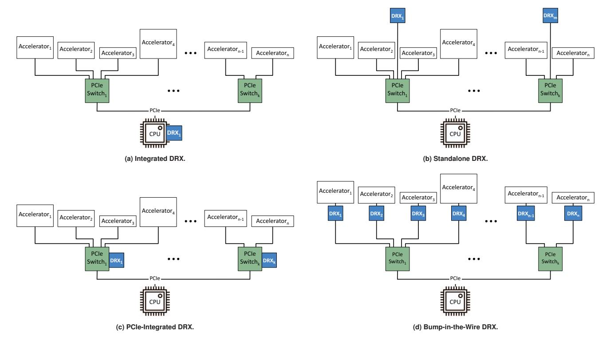
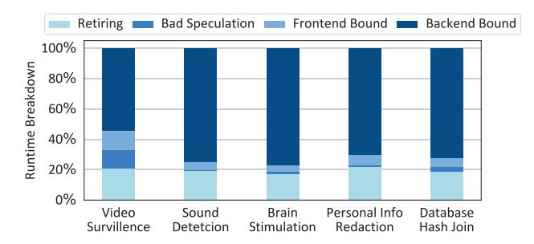

# III. DRX PLACEMENT

The key design considerations in designing DMX are the placement of DRX and interconnection between DRX, accelerator, and CPU in the system. Since DMX is to enable interoperability between accelerators designed by different vendors, DRX's interconnect should be standard and well adopted. As such, the current incarnation of DMX considers

Fig. 4: DRX placement. Number of DRX units in Standalone placement (b) is configurable, and the illustration represents just one possible configuration.

PCIe as the standard interconnect to connect accelerators to CPU and DRX. PCIe is a well-established standard of interconnect and serves as the basis for future interconnects such as CXL [88].

The placement of DRX ideally should (1) scale with the capacity of associated accelerators, (2) avoid being the bandwidth bottleneck when accelerators transfer/receive data from it, and (3) minimize data movement as data movement is the main performance and energy bottleneck in today and future system [89].

**Integrated DRX into CPU.** This configuration considers integrating DRX with the CPU as illustrated in Figure 4(a). The integrated accelerators become more common recently as Intel Sapphire Rapids, IBM z15, POWER9, and Telum offer them in their CPU products [90–92]. Integrated accelerators are efficient in performing computation on the data that is on the CPU chip. However, integrated accelerators are going to eat up the already limited CPU power budget [3, 4]. Such power and thermal constraints limit the performance of integrated accelerators on the CPU.

DMX considers a fixed power budget for an integrated accelerator and design an Integrated DRX to operate within this power limit [91, 93]. This fixed power budget limits the performance of DRX. As we will show in Sec.VII, Integrated DRX becomes the performance bottleneck when scaling the number of accelerators to more than 8. Although integrating DRX using die-to-die interconnects like UCIe could alleviate the affect, integrated DRX still become the performance

bottleneck with excessive data movement [94–96]. Moreover, Integrated DRX has the same data movement as the baseline CPU without DRX. Such design requires all accelerators to send their data to the CPU which makes the PCIe link connecting the CPU to the accelerators the bandwidth bottleneck when multiple accelerators use DRX at the same time. Such data movement is also the main source of system energy consumption.

Standalone DRX as a PCIe card. This configuration considers implementing DRX as a standalone PCIe card that is installed just like any other accelerator on a PCIe slot. Without using an external power supply cable, the performance of a single Standalone DRX PCIe card is limited by the PCIe power supply standard, which is 25 Watts. Nevertheless, as illustrated in Figure 4(b), installing multiple Standalone DRX cards can scale DRX performance with the number of accelerators. However, this Standalone DRX still incurs bandwidth oversubscription as the PCIe link to a shared, Standalone DRX card can become the bottleneck.

Compared to Integrated DRX, a Standalone DRX has the potential to reduce the data movement if DMX implements a point-to-point PCIe connection between DRX card and accelerator cards. This way, a Standalone DRX can localize the communication under the PCIe switch to which other accelerator cards are installed.

**PCIe-Integrated DRX.** This configuration integrates DRX onto a PCIe switch (Shown in Figure 4(c)). Compared to a Standalone DRX, A PCIe-Integrated DRX saves a round-trip between DRX and the PCIe switch. However, PCIe-

**Fig. 5: Top-down breakdown of stall cycles for data restructuring operations.**

Integrated DRX requires DRX to operate at the aggregated rate of all downstream PCIe ports, which adds considerable hardware complexity. Also, computation on switches only permits limited memory usage and a limited number of instructions per packet [97–100]. This configuration requires significant engineering effort to redesign the PCIe hardware and related software stack.

Bump-in-the-Wire DRX. Lastly, we introduce a Bump-inthe-Wire DRX configuration inspired by Catapult [67] that connects an exclusive DRX to each accelerator (Figure 4(d)).

Bump-in-the-Wire configuration avoids overprovisioning of PCIe links and DRX resources for a multi-accelerator system and enables DMX to scale with the hardware resources compared with the other configurations. More importantly, Bump-in-the-Wire DRX placement reduces the data movement to a minimum when accelerators communicate with each other. Coupled with a programmable DRX that enables offloading of any data restructuring operation (c.f., Sec.IV), Bump-inthe-Wire DRX serves as an option to build future scalable multi-accelerator systems.

