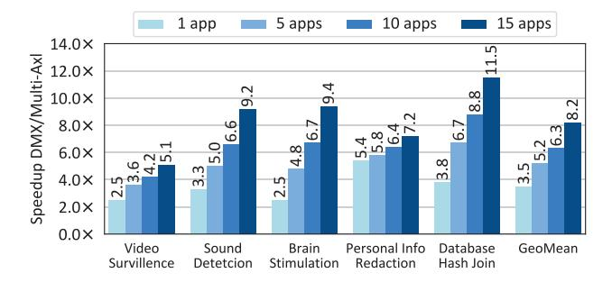

# VI. EXPERIMENTAL METHODOLOGY

Benchmarks. We create five diverse cross-domain and end-toend applications inspired by real-world scenarios. Table I lists the five benchmark applications, their cross-domain kernels and corresponding accelerators, the data restructuring operations needed to chain the kernels, and the dimensions of the input data. Each application is a pipeline of two kernels, where the first kernel outputs intermediate data, which requires restructuring before it can be processed by the second kernel. The Video Surveillance decodes input video streams into video frames and passes them to an object detection kernel [117]. Sound Detection performs Fast Fourier Transform (FFT) on audio snippets and use the transformed snippets to determine the genre of input audio [85]. Brain Stimulation receives electromagnetic input signal generated from a brain simulation model, processes it with FFT and data restructuring operations before outputting the data to reinforcement learning kernel [86]. Personal Information

Redaction decrypts privacy-sensitive text and uses a regular expression kernel to detect personally identifiable information and redact them from the text with blanks [87]. Database Hash Join decompresses database tables and hash joins the tables [82, 83]. To exercise the system performance with respect to resource contention on interconnect bandwidth and compute for data restructuring, we use 1, 5, 10, to 15 concurrent running applications for the benchmarks.

**DRX hardware implementation.** We implement DRX using Verilog in RTL and synthesize it on Xilinx UltraScale+VU9P FPGA using Xilinx Vivado 2022.2. The synthesized design achieves an operating frequency of 250 MHz. We also synthesize an ASIC version of DRX using Synopsys Design Compiler R-2020.09-SP4 with the FreePDK 15nm standard cell library [118]. The ASIC implementation achieves a 1 GHz operating frequency.

Baseline FPGA-based multi-acceleration system. Beside DRX, we also synthesize application kernels discussed earlier in this section on FPGA to implement a baseline multi-acceleration system without data motion acceleration (i.e., that uses CPU for performing data motion). This setup consists of multiple AWS Xilinx UltraScale+ VU9P FPGAs [119] connected through PCIe x16 to Intel Xeon Platinum 8260L CPUs operating at 2.4 GHz with 64 GB of memory and hyperthreading disabled.

We implement the application kernels on the FPGA using the following methods: hard-IP blocks, High-Level Synthesis (HLS), or Register-Transfer Level (RTL) implementation. For the video codec kernel, we use a pre-existing hard-IP available on the VT1 instance of AWS [120]. We use Xilinx's Vitis libraries [121], which provide HLS implementations, for kernels such as FFT, support vector machine, AES-GCM, Gzip decompression, regular expression, and database hash join. We use the RTL implementation from open-sourced accelerators [13] for the remaining kernels that use deep neural networks such as object detection and proximal policy optimization. We synthesize both the HLS and RTL implementations on the FPGAs operating at 250 MHz clock frequency.

In this FPGA multi-acceleration implementation the host CPU runs the control plane (refer to Sec.V) and performs the data restructuring operations while the FPGAs accelerate the application kernels.

**Performance evaluation.** We use the FPGA setup to collect cycle-level latency of executing end-to-end applications on a

**Fig. 11: DMX speedup over** *Multi-Axl* **configuration that uses CPU for data motion between accelerators. DMX performance scales with the number of concurrent applications by using Bump-in-the-Wire DRX placement.**

baseline without data motion acceleration (we refer to this baseline as *Multi-Axl* configuration in Sec.VII). We then scale the performance of FPGA acceleration using scaling factors based on ASIC implementation and clock frequency (250 MHz to 1GHz). We develop an end-to-end system emulation infrastructure to compare the performance of various DMX configurations with a multi-acceleration baseline without DMX. The input to the emulation setup are cycle-level latency numbers for executing application kernels, data restructuring on the CPU or DRX, communication over PCIe, and software stack overheads for interrupt and polling.

Energy evaluation. We measure the energy of the CPU using Intel RAPL [122]. We use the post-synthesis power of the FPGA and multiply it by the execution time of the kernels to estimate the energy consumption for the accelerators. We also include the energy consumption of the PCIe switch [123] and the energy for data transfer over PCIe [124].

