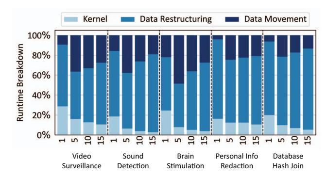
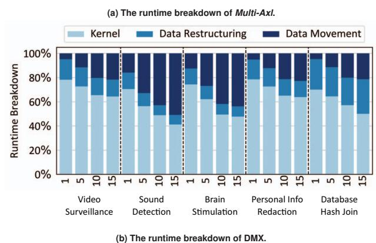
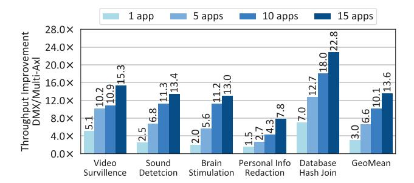
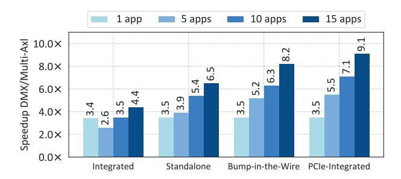

# VII. EXPERIMENTAL RESULTS

## *A. End-to-end Performance Improvement*

Speedup. Figure 11 compares the end-to-end execution time of cross-domain applications withiout (*Multi-Axl*) and with DMX. Note that uses Bump-in-the-Wire DRX placement. On average, accelerating the data motion provides 3.5× to 8.2× speedup for running one to 15 concurrent applications. The higher the number of accelerators in use, the greater the data motion between the accelerators. Therefore, as DRX accelerates the data restructuring portion of the end-to-end application, the speedup grows as the number of concurrent applications increases. DMX yields less end-to-end speedup for Video Surveillance because the accelerator used for Video Surveillance provides less speedup compared to the other benchmarks. The speedup of DMX is more pronounced for Database Hash Join because the data restructuring takes up the majority of the runtime for this benchmark which is significantly being accelerated by DRX.

To better understand the sources of benefits, Figure 12(a) and Figure 12(b) report the runtime breakdown for *Multi-Axl* baseline and DMX across the three main runtime components: accelerated kernels time, data restructuring, and data movement time between CPU and accelerator for *Multi-Axl* and between

**Fig. 12: The latency breakdown of the** *Multi-Axl* **baseline and DMX. DMX shrinks data restructuring ratio from 64.1% to 14.1% in average.**

accelerators for DMX. Kernel execution latencies are the same for both *Multi-Axl* and DMX. However, after we apply DMX (Figure 12(b)), the kernel execution takes up larger portion of the runtime breakdown compared to the baseline (Figure 12(a)).

As shown in Figure 12(a), data restructuring accounts for the largest portion of the end-to-end runtime for the baseline. Data restructuring is on average 66.8%, 55.7%, 64.7%, and 71.7% of multi-acceleration end-to-end latency for 1, 5, 10, and 15 concurrent applications, respectively. Using DRX significantly accelerates data restructuring and shrinks data restructuring overhead to 17.0%, 15.3%, 13.5%, and 7.2% of DMX endto-end latency for 1, 5, 10, and 15 concurrent applications, respectively, as shown in Figure 12(b). Increasing the number of concurrent applications requires more accelerators, meaning more computation for data restructuring operations between accelerators. Furthermore, the data movement in the baseline system increases due to the bandwidth bottleneck caused by multiple accelerators sharing the PCIe switch's upstream bandwidth. On the contrary, DMX accompanies each accelerator with its own local DRX and therefore avoids bandwidth contention on shared PCIe links.

Throughput improvement. Although the end-to-end execution latency of each request is important, in a real world setup, an application receives back to back requests that need to be processed in the cross-domain application pipeline. Therefore, assuming that each application consists of three pipeline stages

Fig. 13: DMX throughput improvement over *Multi-Axl*. DMX resolves the throughput bottleneck of data restructuring and shifts the throughput bottleneck to the accelerated kernel.

Fig. 14: Comparison of end-to-end latency speedup with different DRX placements: Integrated DRX integrates a shared DRX on the CPU. Standalone DRX implements DRX as a standalone PCle card shared by accelerators. Bump-in-the-Wire DRX is an exclusive DRX to each accelerator. PCle-Integrated DRX integrates shared DRXs with PCle switches connecting accelerators.

(first kernel, data motion, and second kernel as shown in Figure 2), the throughput of an application is determined by the latency of the slowest stage. We compare the throughput of *Multi-Axl* baseline and DMX assuming continuous arrival of requests for each application.

Figure 13 shows the throughput improvement of DMX over the multi-acceleration baseline. On average, DMX achieves from  $3.0 \times$  to  $13.6 \times$  throughput improvements when running one to 15 concurrent applications, respectively. Data restructuring is the slowest stage of the application pipeline in the Multi-Axl baseline as demonstrated in Figure 12(a). Hence it is the throughput bottleneck for all benchmarks, especially as the number of concurrent applications increases. DMX leverages DRX to address this bottleneck and shifts the throughput bottleneck to the accelerated kernel. Personal Info Redaction shows relatively low improvement on the throughput as its throughput is limited by its regular expression kernel accelerator. Data movement is not the throughput bottleneck for the Multi-Axl baseline because the PCIe bandwidth never gets saturated due to the poor throughput of data restructuring operations on the CPU.

