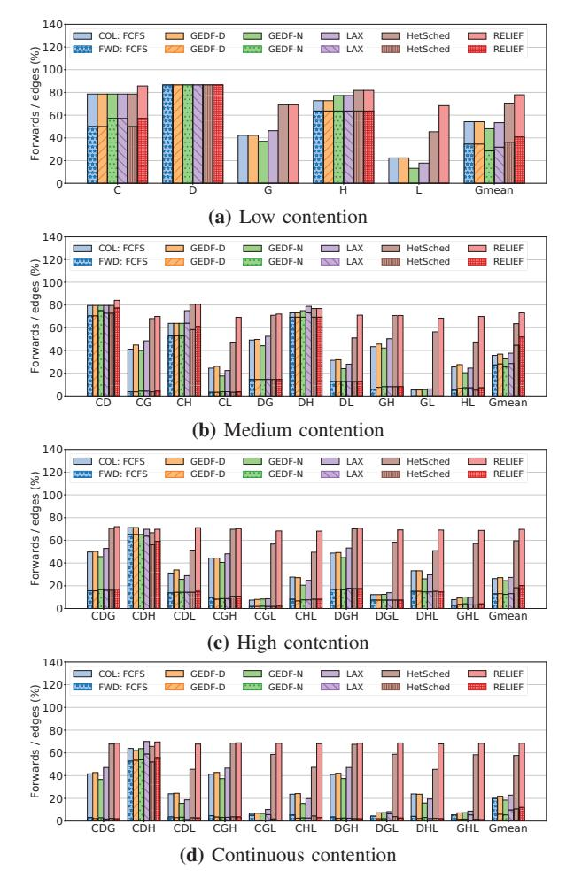
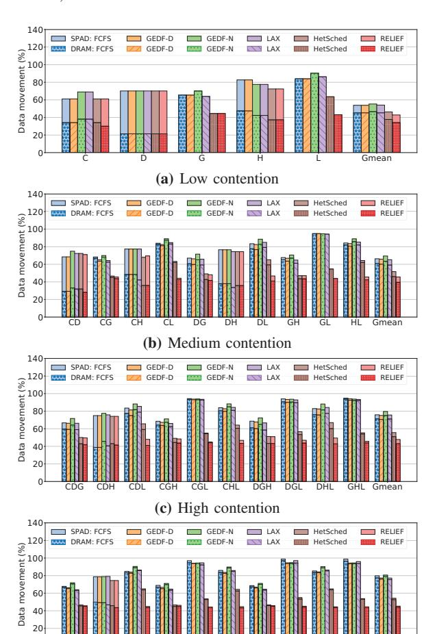
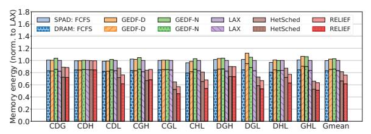
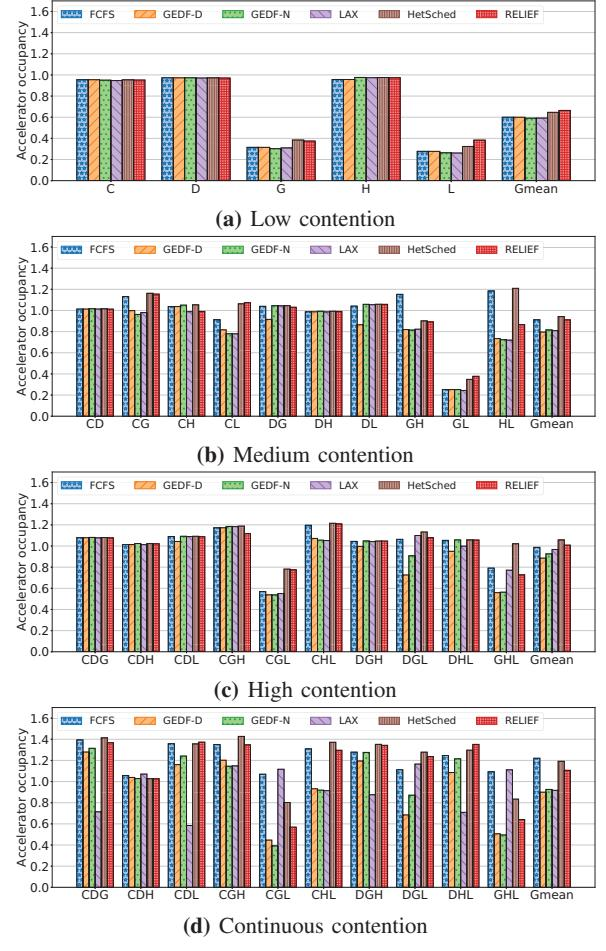
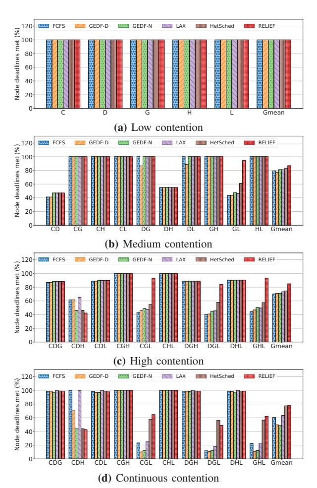
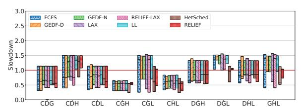
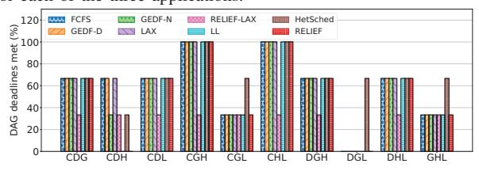
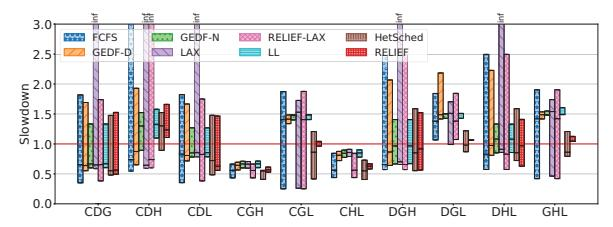
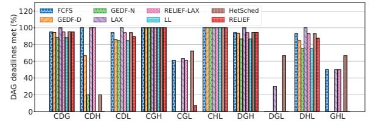

# *A. Data forwards*

Our primary design goal with RELIEF is producing more data forwards than SOTA policies. We quantify this increase in Figure 4.

Observation 1: SOTA policies under-utilize forwarding mechanisms. In contrast, RELIEF consistently achieves

Fig. 4: Percent of total forwards and colocations, computed as the ratio of the total number of forwards/colocations to the total number of edges in the mix.

>65% of all possible forwards, on average. This is clear from Figure 4, which shows the percentage of total data forwards and colocations, computed as the ratio of number of forwards/colocations to the total number of edges in the mix. We can see how SOTA policies' obliviousness to data forwarding mechanisms leads to their under-utilization, achieving as little as 8% of all forwards possible. In contrast, RELIEF improves over HetSched, the leading SOTA policy, by nearly 1.2x on average under continuous contention.

We observe two trends across all three four of contention in Figure 4: 1) RNN applications (GRU and LSTM) are the biggest contributors to colocations, and 2) application mixes with more RNN applications achieve better forwarding with RELIEF than others. The first observation is unsurprising given that all RNN tasks map onto a single resource. For the second observation, we attribute the gains with RNN applications to the fact that they contain long, linear chains (up to 9 nodes) that have the same structure and node deadlines. Having the same node deadlines means that deadline-aware policies schedule each

of those chains in a round-robin fashion, thus forfeiting any forwarding opportunities. FCFS has a similar problem of being locality oblivious. HetSched is able to achieve significantly more forwards than other baseline policies. These gains stem primarily from HetSched's ability to prioritize GRU's critical path, which happens to contain most of its forwards.

#### *B. Data movement*

To understand each policy's data movement behavior, Figure 5 plots the percentage of data transfers (in bytes) that materialize as main memory accesses, scratchpad-to-scratchpad transfers, and colocations.

Fig. 5: Breakdown of data movement into main memory traffic (lower bars), SPAD-to-SPAD traffic (upper bars), and colocations (empty space). Data is normalized to total data movement when all loads and stores go to main memory.

CDG CDH CDL CGH CGL CHL DGH DGL DHL GHL Gmean 0

(d) Continuous contention

Observation 2: RELIEF reduces main memory traffic by up to 32% compared to HetSched, under each level of contention. The average reduction compared to HetSched rests at 10%, 14%, 16%, and 16%, for low, medium, high, and continuous contention, respectively. This is a key result and highlights how simple changes to the scheduler can yield significant reductions in memory traffic.

The percentage of forwards that materialize as colocations in a mix is a function of its application composition. As explained before and evident from Figure 5a, all GRU and LSTM forwards are colocations since these applications map to a single accelerator. In contrast, the vision applications are more diverse in their resource needs and exhibit a greater degree of scratchpad-to-scratchpad data movement. The behavior of single applications impacts the behavior of entire mixes. Mixes CD, CH, and DH (medium contention), for instance, have fewer colocations than other mixes. The same is true for mix CDH (high/continuous contention).

The reduction in data movement traffic reduces energy consumption for both the main memory *and* scratchpad memories. We quantify this reduction for the high contention scenario in Figure 6.

Fig. 6: Total main memory and scratchpad memories' energy consumption under high contention using gem5-SALAM's energy models.

Observation 3: RELIEF reduces main memory and scratchpad memory energy consumption by up to 18% and 8%, respectively, compared to HetSched under high contention. The average main memory and scratchpad energy reduction compared to HetSched is 7% and 4%, respectively. Forwards reduce main memory traffic while colocations eliminate both main memory and scratchpad memory traffic. While forwards cause an increase in scratchpad activity, colocations more than make up for the increase. RELIEF has the same scratchpad energy consumption as LAX for CDH, for instance, but reduces it by 24% for CGL.

#### *C. Accelerator utilization*

Figure 7 shows accelerator utilization (or occupancy), defined as the sum, across all accelerators, of the fraction of total execution time for which each accelerator was busy. Accelerator occupancy provides a measure of degree of parallelism in each scenario. Note that while the numerator is relatively constant under the low, medium, and high contention scenarios, the denominator, which is total execution time, is impacted both by the degree of computational parallelism and by the data movement cost resulting from the use of each policy. For the continuous contention scenario, the denominator remains constant, while the numerator is impacted by the number and type of nodes executed, the data movement cost, and the degree of computational parallelism, all of which vary by policy.

Observation 4: RELIEF improves accelerator utilization by up to 41%, compared to LAX under high contention, with an average improvement of 4%. HetSched, in turn,

Fig. 7: Accelerator occupancy is defined as ratio of the sum of total of all accelerators' compute time to the the end-to-end system execution time, measured from the initiation of all applications to the completion of the last application. Higher is better.

results in best case and average improvements of 41% and 5% relative to RELIEF, respectively. RELIEF's improvements over LAX are a result of increased number of forwards, resulting in lower execution time. In its attempt to increase forwards, RELIEF can sometimes hinder the progress of tasks whose children map to different accelerators, resulting in a lower degree of parallelism. This is especially evident in mixes CGL and GHL under continuous contention, where GRU and LSTM tasks, all of which map to elem-matrix, get promoted frequently, limiting the time they execute in parallel with the vision tasks, which utilize a variety of accelerators. HetSched and LAX's gains over RELIEF for these application mixes are primarily attributed to RELIEF's lower accelerator-level parallelism and increased scheduling latency (Section V-G).

While RELIEF's promotions reduce the degree of parallelism on average relative to HetSched, they do not cause unfairness. In fact, it is a fairer policy when compared to LAX and HetSched, as we will see in Section V-E.

#### *D. Node deadlines met*

RELIEF integrates a feasibility check (Section III) that makes a best-effort to minimize missed deadlines. To evaluate its efficacy, we compute the percentage of node deadlines met in each application mix and present the results in Figure 8.

Observation 5: RELIEF meets up to 70% more node deadlines compared to HetSched, under high contention, with an average improvement of 14%. More importantly, RELIEF rarely *reduces* the number of deadlines met compared to SOTA. This highlights the effectiveness of the feasibility check in throttling priority elevations to prevent deadline violations.

Fig. 8: Percent of node deadlines met

The only instance where RELIEF performs worse than existing policies is in the high contention mix CDH. We observe that GEDF-N and RELIEF prioritize Deblur nodes over Canny and Harris nodes since the former have a lower deadline and laxity. This causes nearly all of the Canny and Harris nodes to miss their deadlines. Furthermore, not all Deblur nodes meet their deadlines either because of high contention. HetSched has a similar story of prioritizing Deblur due to its longer critical path. LAX's ability to de-prioritize applications with negative

| Policy     | C | D | G  | C | D | H | C | D | L  | C | G  | H | C  | G | L | C | H | L  | D | G  | H | D | G | L | D | H | L  | G | H | L |
|------------|---|---|----|---|---|---|---|---|----|---|----|---|----|---|---|---|---|----|---|----|---|---|---|---|---|---|----|---|---|---|
| FCFS       | 8 | 1 | 11 | 4 | 0 | 4 | 8 | 1 | 8  | 5 | 11 | 5 | 11 | 3 | 4 | 5 | 5 | 8  | 1 | 11 | 5 | 2 | 3 | 4 | 1 | 5 | 8  | 3 | 7 | 4 |
| GEDF-D     | 5 | 1 | 12 | 3 | 1 | 2 | 3 | 2 | 9  | 5 | 11 | 4 | 2  | 4 | 4 | 3 | 3 | 9  | 1 | 11 | 3 | 1 | 4 | 4 | 1 | 3 | 9  | 4 | 2 | 4 |
| GEDF-N     | 4 | 2 | 11 | 2 | 1 | 2 | 3 | 2 | 8  | 4 | 11 | 4 | 2  | 4 | 4 | 3 | 3 | 8  | 1 | 11 | 3 | 1 | 4 | 4 | 1 | 3 | 8  | 4 | 2 | 4 |
| LAX        | 5 | 0 | 11 | 5 | 0 | 5 | 3 | 0 | 8  | 4 | 11 | 4 | 12 | 3 | 4 | 3 | 3 | 8  | 0 | 11 | 4 | 3 | 3 | 4 | 0 | 3 | 8  | 3 | 7 | 4 |
| RELIEF-LAX | 8 | 1 | 11 | 4 | 0 | 4 | 8 | 1 | 8  | 5 | 11 | 5 | 11 | 3 | 4 | 5 | 5 | 8  | 1 | 11 | 5 | 2 | 3 | 4 | 1 | 5 | 8  | 3 | 7 | 4 |
| LL         | 4 | 2 | 11 | 2 | 1 | 2 | 3 | 2 | 8  | 4 | 11 | 4 | 2  | 4 | 4 | 3 | 3 | 8  | 1 | 11 | 3 | 1 | 4 | 4 | 1 | 3 | 8  | 4 | 1 | 4 |
| HetSched   | 6 | 1 | 14 | 2 | 1 | 2 | 6 | 1 | 10 | 6 | 14 | 5 | 6  | 7 | 5 | 6 | 5 | 10 | 1 | 14 | 3 | 3 | 7 | 5 | 1 | 3 | 10 | 7 | 3 | 5 |
| RELIEF     | 5 | 1 | 14 | 2 | 1 | 2 | 5 | 2 | 12 | 5 | 14 | 5 | 2  | 6 | 6 | 5 | 4 | 12 | 1 | 14 | 3 | 2 | 6 | 6 | 1 | 3 | 12 | 6 | 2 | 6 |

laxity allows it to de-prioritize Deblur, allowing all Canny and Harris nodes to make progress. FCFS does not suffer from this problem either because it does not prioritize DAGs and nodes. GEDF-D has the same schedule as FCFS given that all the DAGs in this mix have the same deadline. RELIEF also performs worse than HetSched in DGL, but the latter achieves the gains by unfairly slowing down LSTM. We will explore fairness in more detail in Section V-E.

Continuous contention has a different setup compared to the other three scenarios, as described in Section IV-C. Under continuous contention, each mix executes a different number and type of nodes under different policies for a fixed period of time. In the other three scenarios, each application in a given application mix runs to completion and executes exactly once, so the number of nodes executed is constant across policies with the execution time depending on the policy's scheduling decisions. This different simulation setup results in what looks like anomalous behavior of a higher percentage of deadlines met under continuous contention compared to high contention (e.g., CDG), but in reality they cannot be directly compared. This hints at a tradeoff between deadlines met and fairness that we explore in the next section.

#### *E. Quality-of-Service and Fairness*

An important aspect of RELIEF's design is fairness: increased forwards for one application should not come at the cost of excessive slowdown for others. Figure 9a shows a box plot of application slowdown in each mix under high contention. The figure also shows the results for LL and *RELIEF-LAX*, a variant of RELIEF that integrates LAX's de-prioritization mechanism (Section II-C). Figure 9b, meanwhile, plots the percent of DAG deadlines met under high contention.

Figure 9a shows how RELIEF reduces maximum slowdown and variance by up to 17% and 93%, respectively, compared to HetSched. The latter meets the same or more DAG deadlines across the board, however (Figure 9b). The two results highlight a key tradeoff: HetSched meets more DAG deadlines by unfairly slowing down one application over another, as evident from its wider slowdown spread, while RELIEF attempts to distribute slowdowns and allows each DAG to make progress commensurate with its deadline. This tradeoff is made even more evident under continuous contention, as shown in Figures 10a and 10b.

Observation 6: RELIEF improves fairness, reducing worst-case deadline violation and variance by up to 14% and 98%, respectively, compared to HetSched under

(a) Slowdown is defined as the ratio of an application's runtime to its deadline. The box edges and the median represent the slowdown for each of the three applications.

(b) Percent of DAG deadlines met.

Fig. 9: Slowdown (a) and DAG deadlines met (b) under high contention.

(a) Slowdown is defined as the ratio of an application's runtime to its deadline. The box edges and the median represent the geometric mean slowdown for each of the three applications. Infinite values represent starved applications.

(b) Percent of DAG deadlines met.

Fig. 10: Slowdown (a) and DAG deadlines met (b) under continuous contention.

TABLE VIII: Accuracy of compute time and data movement predictors, along with the accuracy and performance of memory bandwidth predictors. Negative error values represent underestimation of true value while positive error values represent overestimation. The geometric mean uses absolute error values.

|       | Compute   | Memory DM |        |        | Memory BW error (%) |       |     |      | Forwards |      | Node deadlines met |      |         |      |  |  |
|-------|-----------|-----------|--------|--------|---------------------|-------|-----|------|----------|------|--------------------|------|---------|------|--|--|
| Mix   | error (%) | error (%) | Max    | Last   | Average             | EWMA  | Max | Last | Average  | EWMA | Max                | Last | Average | EWMA |  |  |
| CDG   | 0.06      | -0.95     | -56.33 | 5.85   | -1.24               | 1.1   | 139 | 138  | 138      | 139  | 136                | 136  | 136     | 136  |  |  |
| CDH   | 0         | -8.06     | -59.03 | -19.42 | -3.95               | -4.68 | 46  | 46   | 47       | 47   | 22                 | 22   | 22      | 22   |  |  |
| CDL   | -0.05     | -0.88     | -56.47 | 5.19   | -1.27               | 2.02  | 155 | 155  | 155      | 155  | 160                | 160  | 160     | 160  |  |  |
| CGH   | 0.1       | -1.01     | -55.7  | 7.13   | -1.18               | 2.19  | 130 | 130  | 130      | 130  | 150                | 150  | 150     | 150  |  |  |
| CGL   | 0.02      | 0.59      | -55.39 | 11.23  | 0.42                | 4.37  | 230 | 230  | 232      | 231  | 257                | 255  | 254     | 252  |  |  |
| CHL   | 0.05      | -0.93     | -56.63 | 5.93   | -0.64               | 2.79  | 143 | 143  | 143      | 143  | 174                | 174  | 174     | 174  |  |  |
| DGH   | 0.03      | -3.14     | -56.94 | 4.26   | -1.33               | 0.96  | 142 | 142  | 142      | 142  | 142                | 142  | 142     | 142  |  |  |
| DGL   | -0.02     | -2.15     | -55.5  | 8.95   | -0.07               | 2.67  | 244 | 245  | 244      | 245  | 240                | 242  | 239     | 242  |  |  |
| DHL   | 0         | -3.33     | -56.7  | 3.65   | -1.36               | 1.31  | 156 | 156  | 157      | 157  | 166                | 166  | 166     | 166  |  |  |
| GHL   | -0.05     | -0.57     | -55.41 | 11.13  | 0.09                | 3.06  | 237 | 238  | 239      | 238  | 263                | 261  | 260     | 258  |  |  |
| Gmean | 0.03      | 1.47      | 56.4   | 7.31   | 0.68                | 2.22  | -   | -    | -        | -    | -                  | -    | -       | -    |  |  |

continuous contention. HetSched is able to meet more DAG deadlines (Figure 10b) and improve accelerator utilization (Section V-C) by unfairly favoring some applications over others. For instance, HetSched meets 10 DAG deadlines in DGL while RELIEF meets 0, but it does so by slowing down one application (LSTM) by 22%. In contrast, every application suffers a slowdown of <7% under RELIEF , accompanied by a 98% reduction in variance.

We also see how LAX's de-prioritization mechanism causes significant unfairness in mixes CGL, DGL, and GHL. In all three cases, the RNN applications start missing deadlines early on due to contention and are de-prioritized by LAX and RELIEF-LAX in favor of the vision applications, causing significant unfairness. This is especially troublesome considering that they have lower deadlines compared to vision applications (Table V). In contrast, RELIEF allows the RNN applications to progress alongside the vision applications, ensuring more deadlines are met while reducing unfairness.

LAX also has a starvation problem, as is made evident from Figure 10a and Table VII. The table lists the number of completed DAG iterations for each application in each continuous contention mix. We see how Deblur is starved in every mix it is in except DGL. Deblur is extremely sensitive to queuing delays given its laxity of just 0.2ms (Table V). Combined with its linear task graph, this means that if even a single Deblur node is delayed by more than 0.2ms, the node's laxity will drop below 0 and it will get deprioritized by LAX. This is precisely what happens when Deblur contends with other vision applications for the convolution accelerator: if any node is launched on the convolution accelerator while a Deblur node is waiting, the latter will be stalled for at least 1.5ms (Table II), causing starvation. This stalls any progress for Deblur until the system has no other node to offload to the convolution accelerator. DGL does not suffer from this problem because GRU and LSTM do not use the convolution accelerator. FCFS also has 0 finished Deblur iterations in CDH, but our experiments show that it is not starved; rather it is making slow progress.

