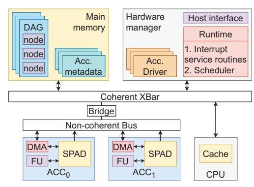

# *A. Scheduling algorithm*

We now present RELIEF, *RElaxing Least-laxIty to Enable Forwarding*, our proposed LL-based policy that attempts to maximize the number of data forwards while delivering QoS. The key idea behind the policy is to promote nodes whose parents have just finished execution, ensuring that the children can forward the data from the producer before it is overwritten. To reduce unfairness and missed deadlines such promotions might cause, RELIEF employs a laxity-driven approach that

throttles priority escalations when deadlines could potentially be missed. By combining priority elevations with laxity-driven throttling, RELIEF achieves the ideal schedule shown in Figure 2b as well as the ideal data movement time in Table II. We can see from the figure how RELIEF's behavior deviates from LAX, another LL-based policy, at timestep 7, where RELIEF favors the second DAG's newly ready child over existing ready nodes with lower laxity and deadlines.

The RELIEF algorithm is presented in Algorithm 1. Newly ready nodes whose parents have just finished execution are called *forwarding nodes*, since they can potentially forward data from the producer's local memory. RELIEF schedules these forwarding nodes immediately if there are resources available, bypassing nodes with lower laxity if they can meet their deadline under a LL scheme. If no priority escalation is possible, the algorithm proceeds in a vanilla LL fashion. We also experiment with LAX's de-prioritization mechanism that allows tasks with non-negative laxity to bypass those with negative laxity in the ready queue (Section II-C). While this mechanism can improve the number of tasks that complete by their deadline (Section V-D), we show that it can lead to unfairness in Section V-E.

#### Algorithm 1: RELIEF

```
1 Function RELIEF(finishing node):
2 for child ∈ finishing node.children do
3 child.cmplt parents += 1
4 if child.cmplt parents == child.num parents then
5 child.runtime = predict runtime(child)
6 child.laxity = child.deadline - child.runtime
7 index = find pos(fwd nodes[child.acc id], child)
8 fwd nodes[child.acc id].insert(index, child)
9 for each acc id do
10 max forwards = num idle accelerators[acc id]
11
12 while not fwd nodes[acc id].empty() do
13 node = fwd nodes[acc id].pop front()
14 index = find pos(ready queue[acc id], node)
15
16 if max forwards > 0 and
            is feasible(ready queue[acc id], node, index)
            then
17 ready queue[acc id].push front(node)
18 node.is fwd = true
19 max forwards -= 1
20 update fwd metadata(finishing node, child)
21 else
22 ready queue[acc id].insert(index, node)
23 node.is fwd = false
```

RELIEF works by creating a laxity-sorted list of candidate forwarding nodes, called *fwd nodes*, from newly ready nodes (Algorithm 1, lines 2-8). We store laxity as *deadline - runtime*, subtracting the current time from it when manipulating the ready queue (Algorithm 2, line 6). The candidate nodes are then inserted into the ready queue at either the front (Algorithm 1, line 17) or at the position dictated by their laxity (Algorithm 1, line 22). A candidate node is escalated in priority only if 1) the number of forwarding nodes in the ready queue for an accelerator type is less than the number of idle instances of that type (controlled by max\_forwards), and 2) the function is\_feasible() returns true. The first condition ensures that forwarding nodes are always the next to run, ensuring their input data is still live in its producer's local memory. is\_feasible() returns true if the priority escalation of the candidate node is unlikely to cause deadline misses. Our evaluation shows that predicting node *runtime* once at the time of insertion into the ready queue has sufficient accuracy (Section V-F).

The key to minimizing missed deadlines is is\_feasible()'s ability to predict which node promotions might cause them. It takes three arguments: the ready queue, the candidate forwarding node, and its position in the ready queue based on laxity. In our implementation, presented in Algorithm 2, we use a laxity-driven approach. For each node in the ready queue that has a higher priority than the candidate node, we ensure that its laxity is more than the candidate node's run time. That is, each of those nodes can tolerate the additional latency of the candidate node without missing their deadline. Since the queue is already sorted by laxity, we start at the head of the queue and find the first node that is 1) itself not a forwarding node, and 2) has positive laxity. If the node thus found has laxity greater than the candidate node's runtime, then every following node does too and the candidate node's priority can be safely escalated. The first condition here ensures that existing forwarding nodes do not prevent escalation of other nodes, while the second is an optimization that lets us bypass negative laxity nodes since they are not expected to meet their deadlines even without the promotion.

### Algorithm 2: is feasible

```
1 Function is_feasible(ready queue, fnode, index):
2 can forward = True;
3 for node ∈ ready queue do
4 if ready queue.index(node) == index then
5 break;
6 curr laxity = node.laxity - curTick();
7 if not node.is fwd and curr laxity > 0 then
8 can forward = curr laxity > fnode.runtime;
9 break;
10 if can forward then
11 for node ∈ ready queue do
12 if ready queue.index(node) == index then
13 break;
14 node.laxity -= fnode.runtime;
15 return can forward
```

## *B. Execution time prediction*

Since RELIEF and its feasibility check are laxity-driven, they require an estimate of each node's execution time. We accomplish that by predicting the compute time and memory access time of each task separately.

Compute time prediction: The compute time of fixedfunction accelerators, such as the ones used in this study, is largely a function of the input size and the requested computation, owing to the data-independent nature of their control flow [14]. The compute time of such devices can, therefore, be profiled just once at either design time or system boot-up since there will be very little variation. Our evaluation shows that this scheme has an average error of just 0.03% (Section V-F).

Memory time prediction: The memory access time prediction works by predicting two values: the available bandwidth and the amount of data movement. For the former, we experiment with three different predictors based on prior work [18]: *Last value*, *Average*, which computes the arithmetic mean of the bandwidth of *n* previous tasks, and *Exponentially Weighted Moving Average (EWMA)*, that computes a weighted sum of the most recently achieved bandwidth (*bw*) and historical data, as shown below:

$$pred_n = \alpha \times bw + (1 - \alpha) \times pred_{n-1}$$
 (3)

The data movement predictor works by analyzing the graph and observing node states. For predicting input data movement, we need to predict if a node can be colocated with its parent, since colocations eliminate producer/consumer data movement. Given that the scheduler performs colocations by tracking the previously executed node on an accelerator, only one child can be colocated. We predict that the child with the earliest deadline of a set of newly ready children will colocate with the parent if they use the same accelerator type.

For predicting output data movement, we need to predict the number of forwards. If all children can forward from the node, then we will not need to write results back to the main memory. This will be true if a) all the children map to a unique accelerator, and b) all the children will be ready when the node finishes. The former is a simple comparison between the number of tasks mapping to an accelerator type and the instances of that type, while the latter is achieved by ensuring that the node is the latest finishing parent based on its deadline.

The accuracy and performance of bandwidth predictors compared to a *Max* prediction scheme, where the maximum available bandwidth is used, are presented in Section V-F. We also compare the data movement predictor to a *Max* prediction scheme where maximum data movement is assumed.

#### *C. System architecture*

We present the system architecture that we assume in Figure 3. The accelerators are modeled to directly access physical memory without address translation, like some existing designs [39]. We propose exposing the entire scratchpad memory in each accelerator to the rest of the system via a non-coherent read-only port. The newly exposed scratchpad memories are not mapped to user address space and access is hidden behind device drivers, ensuring secure access. We also use a discrete hardware manager that is coherent with the CPUs (Section II-B), responsible for scheduling nodes onto accelerators as well as for orchestration of data movement between producers and consumers.



Fig. 3: System architecture depicting the hardware manager and the interconnect.

The CPUs, the hardware manager, and the accelerators communicate via shared main memory and interrupts. The CPU informs the hardware manager of new DAGs by writing the root nodes into shared queues in the main memory. Each node is a structure that represents a task for an accelerator, as shown in Table III. The hardware manager parses each node to push them onto ready queues, and launches them on the accelerators via driver functions. The accelerators inform the manager of the completion of each task by raising an interrupt. When a node completes, the manager updates its status field to inform the host CPU program of its completion and pushes its children onto ready queues if their dependencies are satisfied. The user program can learn of the completion of an entire DAG by reading the status of leaf nodes.

TABLE III: DAG node data structure

| struct node                          |
|--------------------------------------|
| uint32_t acc_id;                     |
| void *acc_inputs[NUM_INPUTS];        |
| node *children[NUM_CHILDREN];        |
| node *parents[NUM_INPUTS];           |
| uint8_t status;                      |
| uint32_t deadline;                   |
| acc_state *producer_acc[NUM_INPUTS]; |
| uint32_t producer_spm[NUM_INPUTS];   |
| uint32_t completed_parents;          |

The node structure contains a few more synchronization and bookkeeping fields that we hide for brevity. The size of the structure depends on the number of parents and children each node has, along with the pointer size. Assuming 32-bit pointers, the base size of the structure with a single parent and child is 72 bytes, with each additional parent and child adding 12 bytes and 4 bytes, respectively. The largest node we see in our applications is 96 bytes. While we show the arrays to be of a constant size, this implementation choice may be replaced with dynamic structures.

*1) Forwarding mechanism:* Exposing accelerator private scratchpad memories onto the system interconnect allows consumer DMA engines to perform reads from producer scratchpads without having to go to the main memory. Such

a modification should be fairly straightforward in modern SoCs [52], exposing the scratchpad memories to the system interconnect on the DMA plane. This is what we assume in our evaluation. It also possible to leverage PCIe resizable-BAR support [2], which enables exposure of multiple gigabytes of private accelerator memory into the CPU address space, and Linux P2PDMA interface [31], [50], which allows for direct DMA transfers between PCIe devices.

*2) Hardware manager:* We now detail the data structures maintained and runtime executed by the hardware manager described in Section II-B. We chose a microcontroller-based implementation for our work since it offers sufficient performance (Section V-G).

Manager data structures: The hardware manager maintains metadata for each accelerator to track its state and to manage synchronization of data between producers and consumers. Table IV presents the key metadata fields. In addition to maintaining the address for accelerator and DMA engine MMRs (acc\_mmr and dma\_mmr), the metadata also holds the address of the scratchpad memory partitions (spm\_addr), the state of the accelerator (status, e.g., idle or running), and the number of accelerators currently reading from each of its scratchpad partitions (ongoing\_reads). Scratchpad partitions are used to implement multi-buffering.

TABLE IV: Accelerator metadata

| struct acc state                            |
|---------------------------------------------|
| uint8_t *acc_mmr;                           |
| uint8_t *dma_mmr;                           |
| uint8_t *spm_addr[NUM_SPM_PARTITIONS];      |
| uint8_t status;                             |
| node *output[NUM_SPM_PARTITIONS];           |
| uint32_t ongoing_reads[NUM_SPM_PARTITIONS]; |

The scratchpad partition addresses are physical addresses used by consumer DMA engines to perform direct data transfers. The field ongoing\_reads is used to keep track of how many consumers are reading from a scratchpad partition of the accelerator to avoid overwriting the data. The manager increments the count before a consumer starts transferring the data to its local scratchpad memory and reduces the count after it is done, thus ensuring that write-after-read dependencies are respected when data is being forwarded.

The metadata size for each accelerator in our implementation, assuming 32-bit pointers and a maximum of 3 scratchpad partitions (NUM\_SPM\_PARTITIONS), is 32 bytes, totaling to 236 bytes for the 7 accelerators our system simulates.

Manager runtime: Alongside launching tasks onto accelerators, the manager runtime implements an interrupt service routine (ISR) and the scheduler. The ISR is triggered every time an accelerator finishes a *job*, where a job could be a DMA operation or computation.

Once an accelerator finishes execution and the scheduler is run, the field output[p] (Table IV) is set to point to the node that just finished, denoting that partition *p* holds the node's output. The producer\_acc and producer\_spm fields are also set in the child nodes to inform their drivers of which producer accelerator and partition to read from. When

child nodes are launched, their driver checks if the data is still present in the producer's scratchpad and forwards it if it is. In addition, if all the child nodes are not at the head of their respective ready queue (i.e., not next in line for execution), or the parent node does not have any children, the runtime calls the producer driver to write the results back to main memory immediately.

