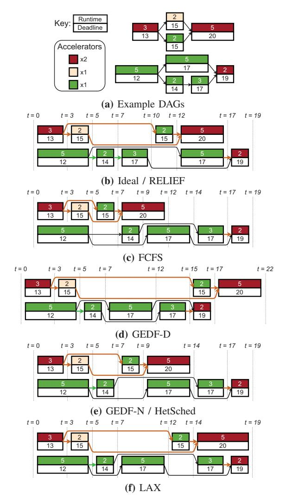

# *C. Limitations of SOTA scheduling policies*

To illustrate how contemporary accelerator scheduling policies underutilize forwarding mechanisms, consider the two DAGs presented in Figure 2a. The number of each accelerator type available is indicated in the "Accelerators" box. The color inside each node represents the type of resource it requires. The upper number is the execution time of the node while the lower number is the deadline. The node deadlines have been computed using critical-path method assuming both DAGs arrive at time 0 and have deadlines of 16 and 15 time units, respectively.

We compare the schedules generated by four SOTA policies to an ideal schedule. Each of the policies presented below work by sorting a per accelerator-type ready queue based on the described criteria. As an accelerator of a given type becomes available, the manager runtime pops the head of the queue for execution.

1) *First Come First Serve (FCFS)*: Simplest baseline policy where incoming tasks are appended to the tail of the

1We use the terms node and task interchangeably.

Fig. 2: Comparison of FCFS, GEDF-D, GEDF-N, LAX, and HetSched to an ideal schedule. RELIEF achieves the ideal schedule. Brown and green arrows represent forwarding and colocation, respectively. The "Accelerators" box indicates the available number of each accelerator type.

ready queue. FCFS represents the non-preemptive version of round-robin scheduling used in GAM+ [15].

- 2) *Global Earliest Deadline First (GEDF)*: A straightforward extension of the uniprocessor optimal Earliest Deadline First (EDF) policy, where the tasks are sorted based on increasing deadline. There are two variants depending on how the task deadlines are computed:
  - a) *GEDF-DAG (GEDF-D)*: Uses the deadline of the DAG that the task belongs to as the task deadline. This was previously used in VIP [38].
  - b) *GEDF-Node (GEDF-N)*: Sets the task deadline by performing critical-path analysis on the DAG. This is amongst the most well-studied policies in realtime literature [51], [56], [60].
- 3) *Least Laxity First (LL)*: Another uniprocessor optimal

scheme [17], this policy works by sorting tasks in increasing order of their *laxity*, which is defined below in Equation 1. The deadline used here is set using the critical-path method.

$$laxity = deadline - runtime - current\_time$$
 (1)

- 4) *LAX [59]*: A variant of LL that de-prioritizes tasks with a negative laxity in favor of tasks with a non-negative laxity to improve the number of tasks that meet their deadline. We use this variant of LL for comparison in the rest of the paper.
- 5) *HetSched [3]*: A least-laxity first policy that assigns task deadlines using the following equation:

$$deadline_{task} = SDR \times deadline_{DAG} \tag{2}$$

Here, *sub-deadline ratio (SDR)* quantifies the contribution of a task to the execution time of the path it is on.

Figure 2 shows the possible schedules generated by each of the policies above. The figures shows both cases, one where data is forwarded from producer to consumer (brown arrow), and another when computation is colocated, putting the consumer computation on the same accelerator as the producer, thereby eliminating all data movement (green arrow). For the same number of forwards, the policy that generates more colocations is therefore the better one. Note that intermediate results are dispensable; we only care about the final output. Looking at the ideal schedule in Figure 2b, we observe that it not only meets deadlines, but also achieves 5 forwards and 2 colocations. The ideal policy is able to achieve these forwards and colocations by running the consumer nodes immediately after producer nodes, allowing for better utilization of the aforementioned forwarding techniques. To the best of our knowledge, this is an optimization that no current scheduling policy performs. All other policies, barring GEDF-D, meet the deadline but miss out on forwarding opportunities. FCFS achieves 5 forwards, but performs no colocations. GEDF-D achieves better forwarding with 5 forwards and 1 colocation but misses deadlines. GEDF-N and HetSched produce the same schedule where they meet deadlines but with sub-optimal number of colocations. LAX has a different schedule than GEDF-N/HetSched, but achieves the same number of forwards. We, therefore, need a scheduling policy that exploits forwarding opportunities while being deadline aware.

