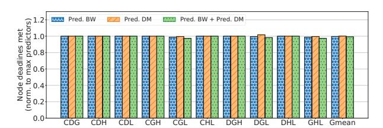
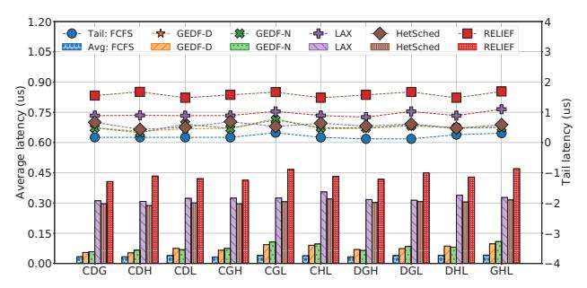

# *F. Prediction accuracy*

The feasibility check presented in Section III utilizes a predictor to estimate compute and memory access times for accelerators. Table VIII presents the error in the compute time, the data movement, and the different memory bandwidth predictors under high contention, along with the latter's impact on the number of forwards and node deadlines met. We empirically chose *n=15* for *Average* and α = 0.25 for *EWMA* for the best accuracy.

Observation 7: Compute time prediction has a maximum error of just 0.03%. This validates prior observations that compute time can be defined as a function of input size and requested operation for fixed function accelerators [14].

Data movement prediction also works well, with an average error of 1.35%. Memory bandwidth predictors, meanwhile, exhibit a range of accuracies, with *Average* performing the best both in terms of mean (0.68%) and maximum (3.95%) error. Their accuracy has little to no impact on performance, however. We can see from Table VIII how each policy achieves essentially the same number of forwards and deadlines met.

To understand the incremental impact of data movement and memory bandwidth predictors, Figure 11 plots the performance impact of the two predictors in isolation and combined, normalized to having *Max* predictor for both. The bandwidth predictor here is *Average*. We can see how little impact the accuracy of the predictor has on RELIEF's ability to meet deadlines. Their impact on forwards (not shown) is similar.

Fig. 11: Impact of memory predictors on missed deadlines under high contention.

Observation 8: RELIEF does not benefit from dynamic memory time prediction. Each application has several forwarding chains, which are contiguous sequence of forwarding producers/consumers. The laxity calculation based on the memory time prediction decides how these chains get broken up into sub-chains and interleaved. We notice that the number of sub-chains produced by each predictor does not differ

significantly, which is why they all achieve similar overall performance. Given this observation, we have used the baseline *Max* predictors for all our evaluations since they offer the same performance for negligible overhead.

#### *G. Scheduler execution time*

The execution time of a scheduling policy is an important factor in choosing one, since a better schedule may not offset the overhead of preparing the schedule itself. Figure 12 plots the average and tail latency of pushing a task into the ready queue for each policy on a Cortex-A7 based microcontroller.

Fig. 12: Average (bars) and tail (lines) latency of the scheduler with different policies on a Cortex-A7 based microcontroller, under high contention.

Observation 9: RELIEF has higher overhead than existing policies, but is easily overlapped with accelerator execution. Looking at Figure 12 and Table II, we can see that RELIEF's modest scheduling overhead can be easily overlapped with computation, minimizing its contribution to the critical path.

