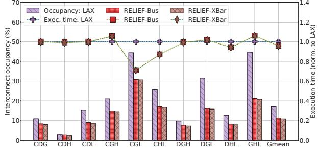

# *H. Impact of interconnect topology*

A crossbar is a high-throughput switch allowing up to n×m concurrent transactions for *n* requesters and *m* responders. This should benefit RELIEF since it permits concurrent transactions between independent producer/consumer pairs. Figure 13 shows RELIEF's sensitivity to the interconnect in terms of interconnect occupancy and the total execution time, under high contention.

Fig. 13: RELIEF's sensitivity to system interconnect under high contention. Interconnect occupancy is defined as the percentage of cycles for which the interconnect had at least one transaction going through.

Observation 10: RELIEF reduces interconnect occupancy by up to 49% compared to LAX, with an average reduction of 33%. It does not, however, benefit from high-performance interconnects. RELIEF's low interconnect occupancy is a result of its reduction in data movement (Section V-B) as well as a lack of accelerator-level parallelism (Section V-C). This indicates that these applications are not interconnect-bound, an observation further supported by the fact that the average queuing delay for the bus is less than a cycle (not shown). We expect applications with more varied resource needs and larger input sizes to benefit more from complex interconnects.

#### VI. RELATED WORK

GPU Scheduling: Prior work in GPU scheduling has looked at co-scheduling and distributing work across CPUs and GPUs to reduce synchronization and data-movement overhead [23], [34]. PTask [48] optimizes for fairness and tries to reduce data movement by scheduling child tasks onto the same device as the producer when possible. Cilk [9] also implements a childfirst scheduling policy that improves locality but it optimizes primarily for improved hardware utilization. While being childfirst, both PTask and Cilk are deadline blind, rendering them unsuitable for real-time applications. Zahaf et al. [60] use an EDF policy to determine which device each node should be mapped to (e.g., GPU, DSP) such that all DAG deadlines are met. Their work can be extended by optimizing for better colocation using RELIEF.

Baymax [12] and Prophet [11] use online statistical and machine learning approaches, respectively, to predict whether an accelerator can be shared by user-facing applications and throughput-oriented applications at the same time, without violating the former's QoS requirements. RELIEF can be extended with Baymax and Prophet to efficiently utilize multitenant accelerators like GPUs.

Menychtas et al. [37] present a fair queuing-based scheme where the OS samples each process' use of accelerators in fixed time quanta and throttles their access to provide fairness.

Accelerator scheduling: Gao et al. [21] batch identical task DAGs across multiple user-facing RNN applications together for simultaneous execution on a GPU, thereby improving GPU utilization and reducing inference latency. PREMA [14] utilizes a token-based scheduling policy for preemptive neural processing units (NPUs) that distributes tokens to each task based on its priority and the slowdown experienced due to contention, balancing fairness with QoS. While both policies are QoS-aware, neither of them optimize for data movement across multiple accelerators.

GAM+ [15] is a hardware manager that decomposes algorithms into accelerator tasks and schedules them onto physical accelerator instances using a preemptive round-robin policy. The hardware manager we used is based on GAM+. VIP [38] is an accelerator virtualization framework that uses a hardware scheduler at each accelerator to arbitrate among different applications' tasks. The authors use an EDF scheme where the FPS of the application serves as the deadline. Yeh et al. [59] propose exposure of performance counters in GPUs that drives

LAX, a non-preemptive least laxity-based scheduling policy. HetSched [3] is another laxity-driven scheduling policy for autonomous vehicles that takes task criticality and placement into account. The scheduling policies underlying these systems are used in our comparative evaluation in Section V.

Real-time scheduling: Optimal scheduling using a job-level fixed priority algorithm is provably impossible [27], unless task release times, execution times, and deadlines are known *a priori* [17]. Baruah presented optimal but NP-complete integerlinear programming formulations [7] along with approximate linear-programming relaxations [8] for scheduling real-time tasks on heterogeneous multiprocessors. Previous work also exists on providing tighter bounds on the response time of the system under both preemptive and non-preemptive variants of GEDF [51], [56]. These mathematically sound formulations provide strong performance guarantees but tend to be infeasible in an online setting. RELIEF's goal is to meet applicationspecified deadlines while minimizing data movement using a fast, online heuristic approach.

3DSF [49] is a hierarchical scheduler for cloud clusters that integrates three schedulers. The top layer avoids missed deadlines by using a least-laxity (LL) scheme to prioritize deadline constraint jobs over regular ones when necessary, the middle layer minimizes data movement by queuing tasks on servers that have the most inputs available locally, and the bottom layer allocates server resources to each running job proportional to its requirements. Although locality aware, 3DSF has multiple optimization targets that come with execution time overheads untenable for micro-second latency tasks.

