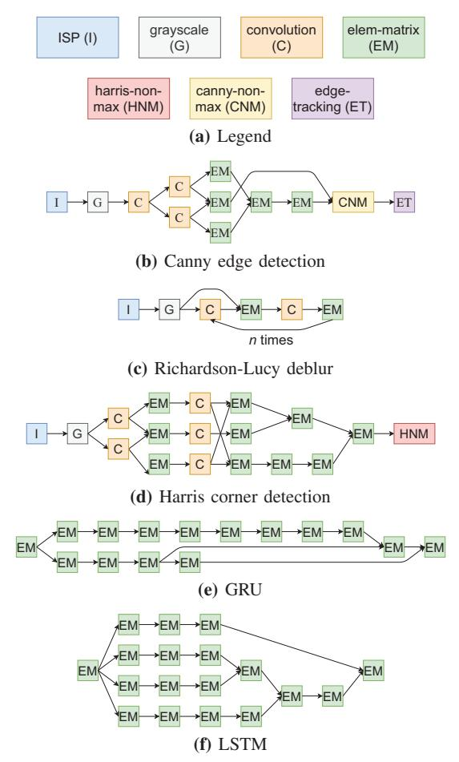

# I. INTRODUCTION

Modern smartphone systems-on-chip (SoCs) comprise of several dozens of domain-specific hardware accelerators dedicated to processing audio, video, and sensor data [42]. These accelerators, which sit outside the CPU pipeline, are referred to as *loosely-coupled accelerators* (LCAs). They appear as programmable I/O devices to the OS and communicate with the CPU using memory-mapped registers and shared main memory, sometimes connecting to the last-level cache [16]. To maximize performance and accelerator-level parallelism [43], applications can request a chain of accelerators running in producer/consumer fashion [38]. The speedups these chains provide, however, is limited by the fact that the accelerators communicate via the main memory, creating contention at the memory controller and the interconnect. This bottleneck will worsen as SoCs become more heterogeneous and incorporate accelerators for more elementary operations [15].

Techniques to reduce this contention include 1) *forwarding* data from the producer to the consumer, i.e., moving data from the producer's local memory directly to the consumer's, and 2) *colocation* of consumer tasks with producer tasks, thus eliminating all data movement. Examples of *forwarding* techniques include insertion of intermediate buffers between producer and

consumer accelerators (VIP [38], [58]) or optimizing the cache coherence protocol to proactively move data from producer's cache to the consumer's cache directly (FUSION [28]). The former requires design-time determination of communicating accelerator pairs, while the latter requires that the accelerators use caches and be part of the same coherence domain, limiting their scalability and flexibility. More recent techniques include ARM AXI-stream [4], [6], which allows multiple producer/consumer buffers to be connected over a crossbar switch, and Linux P2PDMA [31], [50], which enables direct DMA transfers between PCIe devices without intermediate main memory accesses. Unlike VIP and FUSION, they allow for dynamic creation of producer/consumer pairs at run time in order to move data between them. Efficient utilization of such *forwarding* techniques, however, remains a challenge.

Existing systems expect software to explicitly utilize the forwarding mechanism to move data between producer and consumer [36], [38], [40], requiring knowledge of task mapping to accelerators. Distributed management of tasks by each accelerator, however, results in the accelerator's inability to utilize forwarding mechanisms due to the lack of knowledge of task mappings to other accelerators. A centralized accelerator manager has a global view of the system, allowing implementation of policies that opportunistically employ forwarding mechanisms to improve accelerator utilization and application performance. Unfortunately, the scheduling policies employed thus far [15], [20] by these managers are not designed to efficiently utilize forwarding hardware.

Scheduling policies typically prioritize tasks using arrival time, deadline, or laxity. Such policies can be extended to prioritize tasks that may forward data from a producer, similar to FR-FCFS scheduling in memory systems [46], where row buffer hits are prioritized over older tasks. However, this can lead to unfairness where an application with more forwards can starve others with fewer forwards. Therefore, we need a scheduling policy that can opportunistically perform data forwards while still providing fairness and quality of service (QoS).

In this paper, we introduce RELIEF, an online accelerator scheduling policy that has forwarding, QoS, and fairness as first-class design principles. RELIEF prioritizes newly ready tasks over existing ones since they can move data directly from the producer's memory using forwarding mechanisms. RELIEF provides QoS in terms of meeting task deadlines and

fairness in terms of reducing variance in application slowdown due to contention. It achieves both by tracking task laxity and throttling priority elevations if they can cause missed deadlines. These properties matter where tail-latency is important, such as user-in-the-loop smartphone and client-server applications. We evaluate RELIEF on a suite of vision and machine learning benchmarks with strict latency constraints on a mobile platform. Our key contributions are:

- An evaluation of data movement overheads for low-latency accelerator chains used in deadline-constrained vision and machine learning applications. We observe that some of these applications spend as much as 75% of their execution time on data movement.
- A novel scheduling policy, called RELIEF, that maximizes\nutilization of existing forwarding hardware. RELIEF can
  be easily integrated into existing hardware managers and\nis agnostic of both the forwarding mechanism and the
  specific definition of laxity, allowing for wider adoption.
- Extensive evaluation of RELIEF on a simulated mobile SoC, encompassing performance improvements, implementation overheads, and sensitivity to microarchitectural design decisions. RELIEF achieves up to 50% more forwards compared to state-of-the-art (SOTA) policies, resulting in 32% and 18% lower main memory traffic and energy consumption, respectively. Simultaneously, RELIEF improves QoS by meeting 14% more task deadlines on average, and improves fairness by reducing the worst-case deadline violation by 14%.

## II. BACKGROUND

General-purpose processors and domain-specific accelerators represent two ends of a spectrum of performance and flexibility, with the latter trading off the former's versatility for improved performance. A middle ground between the two approaches is to have a set of accelerators for elementary operations that can be stitched together dynamically by each application to serve its needs [15]. This is supported by the observation that applications across domains are often composed of similar kernels [22]. Such an approach eliminates redundancy of hardware functional units along with greatly minimizing the need for a specialized accelerator for each new application.

In this section, we present a suite of real-time smartphone workloads that are widely used in modern devices and discuss how they can be broken down into a set of elementary accelerators. We quantify how memory-bound these accelerators are, motivating the need for techniques to reduce data movement costs. Next, we discuss the functionality of an accelerator manager [15] and why they are well-equipped to improve hardware utilization and provide QoS. Finally, we present examples to explain how SOTA accelerator scheduling policies fall short in utilizing forwarding hardware.

#### A. Modern smartphone workloads

We study two important classes of modern smartphone workloads in this paper: vision and recurrent neural networks.

Fig. 1: Kernels in different image processing and RNN applications

Both classes together represent a wide variety of computeintensive user-facing applications, making them suitable for hardware acceleration.

Computer vision: Mobile visual computing applications have exploded in popularity in recent years, ranging from complex photography algorithms to AR/VR applications [19]. These applications often utilize several common image processing kernels. One example is *Canny edge detection* [10], which is used in face detection, either alone [35] or as part of a neural network pipeline [54]. Another example is *Harris corner detection* [24], which is used for feature extraction in panorama stitching algorithms [30], especially in VR applications [32]. *Richardson-Lucy deconvolution* [33], [45] is an image deblurring algorithm that sharpens shaky camera images. These three applications are commonly fed images directly from an image signal processor (ISP) that captures raw camera output and performs preprocessing operations like demosaicing, color correction, and gamma correction [25].

**Recurrent neural networks (RNNs):** These are a class of machine learning kernels used for time-series data, wherein the inference at a time step can affect the inference at a later time. This makes them particularly well-suited for speech

recognition [41] and language translation [55] applications in modern phones. We evaluate two different RNN applications: *long short-term memory (LSTM)* [26] and *gated recurrent unit (GRU)* [13]. Given their widespread use, RNNs have been the subject of prior work in low-latency accelerator design [21] and accelerator scheduling [14], [59].

Details about these benchmarks, including their deadline and input size, are listed in Table V. These applications can be represented as directed acyclic graphs (DAGs) of seven compute kernels, each of which can be implemented as a separate hardware accelerator, as shown in Figure 1. The description of each accelerator is listed in Table I. These accelerators are ultra low-latency, spending significant time moving data to/from memory. The data movement overhead for each accelerator and each application is quantified in Table II. For each application, the table compares the memory time without forwarding hardware to an ideal scenario where forwarding hardware is used whenever possible.

TABLE I: Elementary accelerators

| Accelerator (SPAD size in B) | Description                                                                                 |  |  |  |  |  |  |
|------------------------------------|---------------------------------------------------------------------------------------------|--|--|--|--|--|--|
| canny-non-max                      | Suppress pixels that likely don't belong to                                                 |  |  |  |  |  |  |
| (262,144)                          | edges.                                                                                      |  |  |  |  |  |  |
| convolution (196,708)              | Convolution with a max. filter size of 5x5.                                                 |  |  |  |  |  |  |
| edge-tracking                      | Mark and boost edge pixels based on a                                                       |  |  |  |  |  |  |
| (98,432)                           | threshold.                                                                                  |  |  |  |  |  |  |
| elem-matrix (262,144)              | Element-wise matrix operations including add, mult, sqr, sqrt, atan2, tanh, and sigmoid. |  |  |  |  |  |  |
| grayscale (180,224)                | Convert RGB image to grayscale.                                                             |  |  |  |  |  |  |
| harris-non-max                     | Enhance maximal corner values in 3x3 grids                                                  |  |  |  |  |  |  |
| (196,608)                          | and suppress others.                                                                        |  |  |  |  |  |  |
|                                    | Perform demosaicing, color correction, and                                                  |  |  |  |  |  |  |
| ISP (115,204)                      | gamma correction on raw images.                                                             |  |  |  |  |  |  |

The percentage of time spent on data movement by each accelerator is primarily a function of its operational intensity. Accelerators like convolution have abundant data reuse, which leads to high operational intensity and a higher computeto-memory access time ratio. Meanwhile, elem-matrix has little to no data reuse depending on the operation requested, which causes its run time to be dominated by memory access latency. The frequency of use of each accelerator type dictates how much time each application spends on data movement. GRU and LSTM, which exclusively use elem-matrix, spend nearly 75% of their run time moving data between accelerators while Deblur, which relies heavily on convolution, spends a mere 3%. More importantly, we can see how efficient use of forwarding hardware can significantly reduce data movement overheads, especially for memory heavy RNN applications.

## *B. Accelerator manager*

The use of dedicated hardware to manage the execution of accelerators frees up the host cores from performing scheduling and serving frequent interrupts from accelerators [15], especially for applications with thousands of low latency nodes. 1 The manager implements a runtime consisting of a host

TABLE II: Absolute time spent in compute vs data movement. These are sum totals and do not account for computation/communication overlap.

|                |           | Time (us) |              |             |  |  |  |  |  |  |  |  |
|----------------|-----------|-----------|--------------|-------------|--|--|--|--|--|--|--|--|
| Accelerator    | Compute   |           | Memory       |             |  |  |  |  |  |  |  |  |
| canny-non-max  | 443.02    |           |              | 30.45       |  |  |  |  |  |  |  |  |
| convolution    | 1545.61   |           |              | 18.25       |  |  |  |  |  |  |  |  |
| edge-tracking  | 324.73    |           |              | 13.56       |  |  |  |  |  |  |  |  |
| elem-matrix    | 10.94     |           | 30.44        |             |  |  |  |  |  |  |  |  |
| grayscale      | 10.26     |           |              | 15.23       |  |  |  |  |  |  |  |  |
| harris-non-max | 105.01    |           |              | 13.77       |  |  |  |  |  |  |  |  |
| ISP            | 34.88     |           |              | 8.71        |  |  |  |  |  |  |  |  |
|                | Time (us) |           |              |             |  |  |  |  |  |  |  |  |
| Application    | Compute   |           | Mem (no fwd) | Mem (ideal) |  |  |  |  |  |  |  |  |
| canny          | 3539.37   |           | 237.74       | 173.29      |  |  |  |  |  |  |  |  |
| deblur         | 15610.58  |           | 509.80       | 420.06      |  |  |  |  |  |  |  |  |
| gru            | 1249.31   |           | 3343.72      | 1608.01     |  |  |  |  |  |  |  |  |
| harris         | 6157.30   |           | 372.19       | 303.16      |  |  |  |  |  |  |  |  |
| lstm           | 1470.02   |           | 3879.98      | 1797.77     |  |  |  |  |  |  |  |  |

interface, a scheduler, and driver functions for each accelerator type.

Host interface: The CPU and the hardware manager communicate via shared main memory, with user programs submitting tasks to the manager via either a system call or user-space command queues [29], [44].

Scheduler: The submitted tasks are written into queues in the main memory that can be read directly by the hardware manager. The hardware manager performs sorted insertion of these tasks into their respective accelerator's ready queue using a scheduling policy. These policies typically sort using arrival time, deadline, or laxity.

Drivers: Tasks from ready queues are then launched onto accelerators via driver functions. Drivers manipulate accelerators or their DMA engine's memory-mapped registers (MMRs) to launch computations or load/store data, respectively.

Hardware managers can be realized as an accelerator themselves or as a microcontroller, with the latter trading off latency for ease of implementation and flexibility [20].

