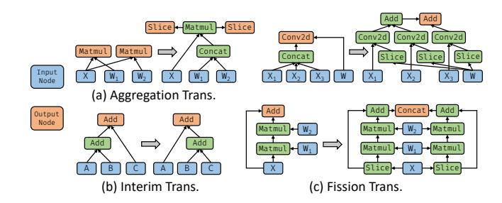
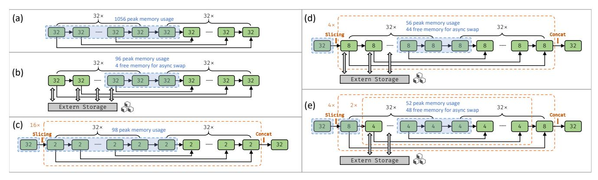
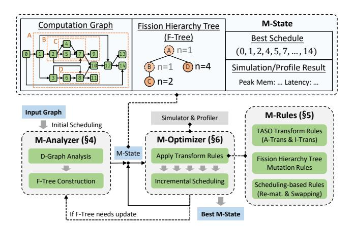
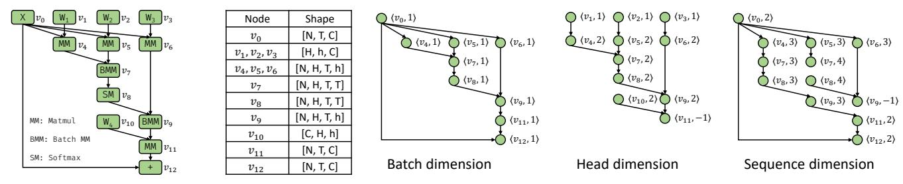
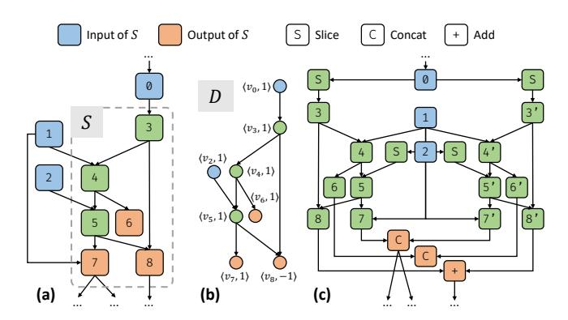
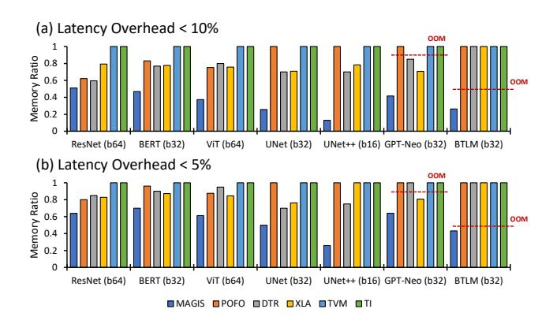
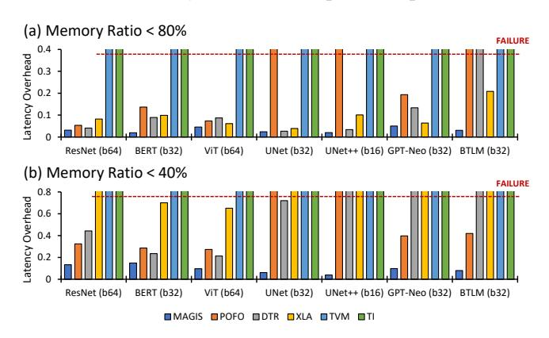

# 1 Introduction

As deep neural networks (DNNs) become more complex in terms of topology and size, the memory consumption of DNNs keeps growing, which poses great challenges for both training and inference. The memory consumption turns out to be more important when larger models come to stage [7, 12, 51]. The memory consumption increase can be attributed to two main factors. First, there are numerous tensors with long lifetimes, such as model parameters [7, 12, 15, 40, 51], activations during the training's forward pass [5, 10, 38, 42], and intermediate tensors in complex networks [44, 73, 75]. Second, many tensors have large shapes, including large batch sizes for efficient training/inference, long sequence lengths in language models [7, 12, 51], and high resolutions in image-related models [21, 40, 45].

<sup>∗</sup>Work done while the author was a student at Peking University.

<sup>†</sup>Corresponding author.

<sup>1</sup> In this paper, the terms "performance" and "latency" are interchangeably used, both referring to the time taken by a DNN to complete one inference/training epoch.

Optimizing memory usage for DNNs becomes crucial for both server and mobile computing devices. GPUs, for instance, NVIDIA GeForce RTX 3090, provide only tens to dozens of GB of memory, while the large-batch training or inference sometimes requires several tens or even hundreds of GB of memory. Memory optimization is beneficial for executing large DNN, enabling co-location of multiple tasks in memory [32], and reducing cross-card communications in distributed learning. Similarly, mobile CPUs such as Qualcomm Snapdragon 888 provide only a few tens of GB of memory and many background applications may reside in memory, which greatly limits the space for DNN. Memory optimization is beneficial for deploying DNNs on mobile devices without consuming too much background memory.

Graph scheduling is a class of widely used memory optimization techniques for DNNs, mainly including rematerialization [5, 10, 17, 18, 24, 27–29, 37, 38, 47], swapping [5, 20, 22, 30, 37–39, 41, 42, 57], and re-ordering [3, 22, 58, 72]. Its core idea is to manipulate the lifetimes of tensors by scheduling when each operator/tensor computes, evicts, recomputes, offloads, and reloads, thereby reducing the peak amount of tensors simultaneously residing in memory. However, because of the overhead introduced by re-computation or data transfer, it frequently leads to a notable reduction in performance. Moreover, although it operates the lifetimes of tensors, it does not affect the tensor shapes, which limits its potential optimization space.

On the other hand, graph transformation is a class of optimization techniques based on equivalent transformations of graphs. Existing works have achieved good results in optimizing DNN performance [25, 26, 54, 56, 62]. They employ rule-based sub-graph substitution technique, which can be roughly divided into two types: Aggregation Transformation (A-Trans), like Figure 1 (a), which enhances hardware utilization to improve performance by aggregating small operators into larger ones at the cost of temporally increased memory usage; Interim Transformation (I-Trans), such as Figure 1 (b), which generally exploits algebraic equivalence to provide opportunities for other graph transformations. In addition, we find that the dual of A-Trans, which we call Fission Transformation (F-Trans), like Figure 1 (c), can effectively reduce memory at the cost of lower hardware utilization by splitting some large operators into smaller ones and executing only one of the split parts at a time.

However, graph transformation for memory optimization poses two main challenges. (1) Complexity introduced by F-Trans. On one hand, F-Trans leads to rapid growth in the size of the graph (as shown in Figure 1 (c), where the number of nodes almost doubles after transformation), which hinders subsequent optimization; on the other hand, F-Trans itself has a vast search space, as it can be applied to almost every sub-graph. (2) Correlated graph transformation and graph scheduling. Graph transformation involves a trade-off between memory and performance (e.g.,



Figure 1. Examples of graph transformations. (a) and (b) are transformations borrowed from TASO [25], which are used to optimize performance. (c) is the dual of Aggregation Trans. and can effectively trade memory with performance.

A-Trans trades memory for performance, and F-Trans does the opposite), but the final memory usage and performance are also traded by graph scheduling. This necessitates the need for efficient coordinated optimization between graph transformation and scheduling, which is challenging since both of them are complicated optimization.

To tackle these challenges, we propose MAGIS, a DNN memory optimization framework through coordinated graph transformations and scheduling. To address the complexity problem of F-Trans, we propose Fission Hierarchy Tree (F-Tree) to express the graph structure after F-Trans, without actually transforming the graph into a complex structure. Although such design somehow limits the search space, it keeps the complexity low, making it easier for subsequent transformation and scheduling to search for better solutions. We then propose analytic methods to select proper sub-graphs and dimensions for F-Trans to construct a light-weight F-Tree, effectively reducing the search space of F-Trans.

To address the second challenge, our goal is to alleviate the complexity of graph scheduling after each graph transformation step. We firstly decompose re-materialization and swapping into graph transformations and re-ordering, where re-materialization and swapping are two important scheduling techniques which can trade memory with performance, while re-ordering is a scheduling method that optimize memory without hurting performance. Such decomposition moves the memory & performance trade-off completely to the transformation phase, and the scheduling phase can only focus on memory optimization through re-ordering. It makes the scheduling after each graph transformation step much simpler, and fuses the memory & performance trade-offs into the unified search space of graph transformation. Then, we design an incremental graph scheduling algorithm that efficiently obtains a new schedule based on the previous schedule and the current transformation, further reducing scheduling time.

Our contributions can be summarized as follows:

• We design and implement MAGIS, a memory optimization framework based on coordinated graph transformation and graph scheduling.

- We formalize graph fission transformation, represent it based on hierarchy tree, and use graph analysis to reduce its search space.
- We propose transformations and algorithms that efficiently coordinate graph transformation and graph scheduling for memory optimization.

We compare MAGIS with state-of-the-art graph scheduling-based memory optimization frameworks on various DNNs. Experimental results demonstrate that MAGIS can optimize original peak memory usage to 15%~50% with no more than 10% latency overheads. Compared to state-of-the-art methods, MAGIS can optimize peak memory to only 15%~85% of theirs with the same latency constraint, and can achieve a 1.25× speedup over them under the same memory constraint, obtaining a better Pareto boundary in dual-objective optimization of memory and latency. Our code is now available at https://github.com/pku-liang/MAGIS.

#### 2 Background & Motivation

**Table 1.** Notations

| Notation                         | Description/Definition                                      |  |  |
|----------------------------------|-------------------------------------------------------------|--|--|
| $\mathcal{V}(G), \mathcal{E}(G)$ | operators, dependencies of <i>G</i>                         |  |  |
| $\mathcal{D}(G), \mathcal{T}(G)$ | dimension graph, dominator tree of $G$                      |  |  |
| cost(G), cost(v)                 | execution latency of $G$ and $v \in \mathcal{V}(G)$         |  |  |
| size(v)  or   v                  | output tensor size of operator v                            |  |  |
| G.pre(v), G.suc(v)               | predecessors, successors of $v \in \mathcal{V}(G)$          |  |  |
| G.anc(v), G.des(v)               | ancestors, descendants of $v \in \mathcal{V}(G)$            |  |  |
| inps(G), outs(G)                 | inputs, outputs of <i>G</i>                                 |  |  |
| G.sub(S) or $G[S]$               | sub-graph of $G$ induced from $S \subseteq \mathcal{V}(G)$  |  |  |
| G.inps(S)                        | nodes consumed by $S \subseteq \mathcal{V}(G)$ from outside |  |  |
| G.outs(S)                        | nodes produced by $S \subseteq \mathcal{V}(G)$ for outside  |  |  |

#### 2.1 Computation Graph

**Graph Structure.** DNN during training or inference process is often represented as "computation graph" G (abbreviated as "graph").  $V = \mathcal{V}(G)$  is the set of operators, each of which has several input tensors and one output tensor, and E = $\mathcal{E}(G) \subseteq V \times V$  is the set of data dependencies between operators.  $(v_1, v_2) \in E$  means that the output tensor of  $v_1$ is one of the input tensors of  $v_2$ . Related notations used in this paper are shown in Table 1. In cases where there is no ambiguity, we use xxx(v) as an abbreviation for G.xxx(v). Some notations can be derived from other notations, for example,  $G.inps(S) = (\bigcup_{v \in S} G.pre(v)) \setminus S$ , and G.outs(S) = $(\mathsf{outs}(G) \cup \bigcup_{v \in \mathcal{V}(G) \setminus S} G.\mathsf{pre}(v)) \cap S.$  A node *u* dominates node v if every path from the entry node to v must go through u; and then u is v's dominator. The intermediate dominator of a node v is the dominator of v that is dominated by all the dominators of v except v itself. The dominator tree [4] is the tree where each node's parent is its intermediate dominator in the graph. A computation graph usually has many input nodes (e.g., input tensor, label tensor, and weight tensors), so

the dominator tree we use here usually takes the input tensor as the entry. Note that for  $T = \mathcal{T}(G)$ , T itself is also a graph, and the operations in Table 1 are also applicable to it. For example, the set of child nodes of a node v in T is T.suc(v). The nodes of T also belong to T, i.e., T is T.

**Execution Latency.** In single machine situation (e.g., single-card GPU), the operators in the graph are generally executed in order, and the order  $s = (v_1, v_2, ..., v_n)$  must satisfy the data dependencies between operators. The graph execution latency can be estimated as the sum of the latency of the operators:  $cost(G) \approx \sum_{v \in V(G)} cost(v)$ .

**Memory Usage.** Given a topo-order  $s = (v_1, v_2, ..., v_n)$ , assuming that i is the timestamp when the  $i^{th}$  operator is finished, we can calculate the lifetime of the output tensor of each operator  $v_i$ : the start timestamp is  $S_i = i - 1$ , and the free timestamp is  $F_i = \max_{v_j \in suc(v_i)} j$ . Based on the lifetime of each tensor, the set of tensors that are active during the execution of  $v_i$  is  $A_i = \{v_j \mid S_j \le i \le F_j\}$ . Then the **active memory usage** during  $v_i$ 's execution is  $M_i = \sum_{u \in A_i} |u|$ , and the **peak memory usage** during the execution of graph G is:  $M_{peak} = \max_i M_i$ . We define **memory hot-spots** as the set of tensors that contribute to the peak memory usage, that is, the tensors that are active when peak memory usage is reached:  $H = \bigcup \{A_i \mid i \in \{1, 2, ..., n\} \land M_i = M_{peak}\}$ .

#### 2.2 Graph Scheduling and Transformation

Graph scheduling is a class of widely used DNN memory optimization techniques, which manipulates the lifetimes of tensors to schedule when to execute (re-ordering [3, 58]), evict & re-compute (re-materialization [5, 10, 18, 24, 27, 37, 38]), and offload & reload (swapping [5, 20, 22, 37, 38, 41, 42, 57]) each operator/tensor without influencing tensor shapes.

Graph transformation is a class of techniques to optimize computation graphs by mutating their structures while preserving semantics. Existing works [25, 26, 56, 62] mainly optimize latency via rule-based sub-graph substitution, which can be categorized into two types: Aggregation Transformation (A-Trans), aggregating small operators into larger ones to trade memory for latency; Interim Transformation (I-Trans), mostly based on algebraic equivalence to provide opportunities for other transformations.

#### 2.3 Motivation

We find that appropriate graph transformations can also improve the memory usage of graphs. For example, as shown in Figure 2 (c), splitting operators reduces peak memory usage at the cost of more operator calls and decreased hardware utilization. With the help of graph transformation, memory optimization of DNNs can be greatly enhanced. For example, in Figure 2 (a), there's a simplified graph structure commonly observed in DNN training or some DNNs with long skipconnections [23, 44, 73, 75]. It has a peak memory usage of 1056 since 33 tensors with size 32 are alive when computing the 33-th operator, which exceeds the memory limit of



**Figure 2.** Motivation examples with memory limit of 100. (a) Without any optimization. (b) Using swapping. (c) Using fission transformation. (d)(e) Using fission transformation and swapping.

100. In Figure 2 (b), although graph scheduling alone can restrict memory usage to 100 by swapping temporally unused tensors into external storage , it causes long latency due to data transfer. However, incorporating graph transformations, as shown in Figure 2 (d), more memory is saved and asynchronous swapping can be utilized to hide data transfer latency. Although the hardware utilization decreases, the latency penalty can be compensated by the efficiency gain provided by asynchronous swapping in this case.

We name the transformation used in Figure 1 (c) and Figure 2 (c) (d) (e) as **Fission Transformation** (F-Trans), which is the dual of A-Trans and can effectively optimize the memory usage by splitting operators. However, the existing graph transformation techniques based on rule-based sub-graph substitution [25, 26, 56, 62] can not be used for F-Trans. First, F-Trans often greatly increases the graph complexity, hindering subsequent optimization. Second, F-Trans involves a vast search space, since it can be applied to almost any sub-graph. For example, Figure 2 (e) uses two different F-Trans, and even for such a simple network in this example, the search space for feasible F-Trans is huge. Finding efficient ways to represent and search for F-Trans is a challenge.

In addition, coordinating graph transformations with graph scheduling is critical for optimizing memory usage with graph transformations. Figure 2 (c) shows that applying graph transformations alone can optimize memory usage, but excessively fine-grained operator splitting may result in high performance costs. Instead, combining graph transformation and graph scheduling as in Figure 2 (d) can significantly reduce memory usage and achieve shorter latency by jointly balancing the memory and performance trade-offs of both transformation and scheduling.

#### 3 Design Overview

Figure 3 shows the overall design of MAGIS. It accepts a DNN graph and outputs the optimized graph and schedule. MAGIS has four main components: M-State, M-Analyzer, M-Rules, and M-Optimizer.



**Figure 3.** Overview of MAGIS.

M-State represents the optimization status, including computation graph, fission hierarchy tree (F-Tree), best schedule, and simulation & profile result. F-Tree represents the hierarchical search space of fission transformation (F-Trans), where a node with n = 1 represents a potential sub-graph & dimension candidate for F-Trans, and a node with n > 1 represents a sub-graph already been split via F-Trans along some dimension into n parts. M-Analyzer generates the search space of fission transformation (F-Trans), by constructing the fission hierarchy tree (F-Tree) according to the computation graph. M-Optimizer coordinates the graph transformations (including F-Trans) and scheduling to optimize the latency & memory. M-Rules provide the transformations for M-Optimizer, including "TASO rules" used in previous works [25, 26, 56, 62], F-Tree mutation rules for manipulating F-Tree to reflect F-Trans applications on the graph (§5.1), and scheduling-based rules decomposed from graph scheduling. Note that F-Trans is decoupled as F-Tree and mutation rules applied on the F-Tree. These rules are integrated with others (e.g., TASO rules, scheduling-based rules) in M-Rules, forming a unified optimization space explored by the M-Optimizer.



(a) Graph G of self-attention (b) Shapes of each node in G

(c) Some sub-graphs of G's D-Graph

**Figure 4.** Example of D-Graph. *N*, *T*, *C*, *H*, *h* represents batch-size, seq-len, hidden-dim, num-heads, head-dim respectively.



**Figure 5.** F-Trans f = (S, D, n) (n = 2) in graph G, which is simplified from the training-graph of an MLP. **(a)** Sub-graph  $S = \{v_3, v_4, v_5, v_6, v_7, v_8\}$ . **(b)** D-Graph D, which represents the batch-dim of S's activation. **(c)** Result graph after F-Trans.

MAGIS takes a computation graph as input. The graph and its initial schedule are analyzed by M-Analyzer, which constructs the F-Tree, outputs the initial M-State and sends the M-State to the M-Optimizer, M-Optimizer applies M-Rules to produce new M-States by mutating some sub-graphs or sub-F-trees. Note that the rules will not choose the subgraph spanning the boundary of the sub-graphs affected by F-Trans (the sub-graph belonging to the F-Tree node with n > 1) for transformation. This is because for a region R already affected by F-Trans, the rules will not transform the sub-graph S that partly intersects with R, as some nodes of S will be split during execution while some not. It then performs fast incremental scheduling on these new graphs, utilizing the mutated graph region of the transformation and prior schedules, to quickly derive near-optimal schedules and associated profile results. Effective M-States are iteratively fed back to M-Optimizer. Besides, if a graph transformation is applied on a sub-graph that has not been affected by F-Trans, M-optimizer will query M-Analyzer to update the F-Tree in the new M-States.

The remainder of this paper is structured as follows: §4 introduces M-Analyzer of MAGIS, §5 discusses M-Rules, and §6 details M-Optimizer.

#### 4 M-Analyzer

In this section, we will first introduce Dimension Graph (D-Graph) and use it to define F-Trans. Then we propose F-Tree as an abstraction of the optimization space/state of F-Trans, and provide an algorithm to construct a light-weight F-Tree considering F-Trans only on some sub-graphs that are selected based on dominator tree and memory hot-spots.

#### 4.1 Dimension Graph

Intuitively, an F-Trans splits a sub-graph along a "dimension" running through it. Therefore, we propose Dimension Graph (D-Graph) to identify the graph-level dimensions.

Given a graph G where  $v \in \mathcal{V}(G)$  has  $s_v$  dimensions in its output tensor and  $r_v$  reduce-axes in its computation, we define D-Graph  $D = \mathcal{D}(G)$  where for each  $v \in \mathcal{V}(G)$  and  $i = -r_v, ..., -2, -1, 1, 2, ..., s_v$ , there's  $\langle v, i \rangle \in \mathcal{V}(D)$ . For each  $(u, v) \in \mathcal{E}(G)$ , if the  $i^{th}$  dimension of u and  $j^{th}$  dimension of v correspond to the same spatial-axis², then there's  $(\langle u, i \rangle, \langle v, j \rangle) \in \mathcal{E}(D)$ ; and if the  $i^{th}$  dimension of u corresponds to the  $j^{th}$  reduce-axis of v's computation, then there's  $(\langle u, i \rangle, \langle v, -j \rangle) \in \mathcal{E}(D)$ . For instance, a MatMul operator v (expressed as v v v v v v v v v v

**Example.** Figure 4 (a) illustrates graph G, extracted from a transformer block [55], with shapes detailed in part (b). Part (c) depicts some sub-graphs of  $\mathcal{D}(G)$ , like one with batch-dimensions from tensors excluding  $v_1, v_2, v_3, v_{10}$ , one with head-dimensions from tensors excluding  $v_0, v_{12}$ , and another with sequence-dimensions from tensors except  $v_1, v_2, v_3, v_{10}$ .

#### 4.2 Fission Transformation

With the help of D-Graph, we can define an F-Trans of graph G as f = (S, D, n), where  $S \subseteq \mathcal{V}(G)$ , D is the D-Graph to split sub-graph G[S] along, n is the fission number. It has the following constraints: (1) G[S] is weakly connected. (2) G[S] is convex:  $G.\mathsf{inps}(S) \cap \bigcup_{v \in G.\mathsf{outs}(S)} G.\mathsf{des}(v) = \emptyset$ . (3) The graph after fission has no redundant computation, requiring

 $<sup>^2\</sup>text{Here}$  we do not consider spatial-axis with sliding-window, such as the height axis of a 3  $\times$  3 convolution; we will improve it in future work.

#### **Algorithm 1:** M-Analyzer: F-Tree Construction

```
input : graph: G; max-level: L
   output: fission hierarchy tree: F
1 F := 0:
2 H := MemoryHotspots(G);
3 for D \in connected components of \mathcal{D}(G) do
         G' := \text{subgraph of } G \text{ induced from } D;
4
         T := \mathcal{T}(G');
         s := GetScores(G', T, H);
         s_{max} = \max_{v \in V(G')} s[v];
         if s_{max} \leq 0 then continue;
         for i \in \{1, 2, ..., L\} do
               V := \{ v \in \mathcal{V}(G') \mid i/L \le s[v]/s_{max} < (i+1)/L \};
10
               for v_{dom} \in \{v \in V \mid T.des(v) \cap V = \emptyset\} do
11
                     S \coloneqq T.\mathsf{des}(v_{dom}) \setminus \{v_{dom}\};
12
                     D' := \text{subgraph of } D \text{ induced from } S;
13
                     f \coloneqq (S, D', 1);
14
                     if f is valid then F := F \cup \{f\};
16 return F;
```

that  $\forall v \in S$ , there's exact one  $i \in \mathbb{Z}$  s.t.  $\langle v, i \rangle \in \mathcal{V}(D)$ , and  $\forall (u, v) \in \mathcal{E}(G[S]), \exists i, j \in \mathbb{Z}$  s.t.  $(\langle u, i \rangle, \langle v, j \rangle) \in \mathcal{E}(D)$ .

Given an F-Trans f=(S,D,n) of G, the result graph after F-Trans is a graph with n split parts of G[S].  $\forall u \in G.\mathsf{inps}(S)$ , if  $\exists i>0$  s.t.  $\langle u,i\rangle \in \mathcal{V}(D)$ , then u will be sliced for each split part, otherwise shared by them.  $\forall v \in G.\mathsf{outs}(S)$ , if  $\exists i>0$  s.t.  $\langle v,i\rangle \in \mathcal{V}(D)$ , then v will be computed by merging the related outputs of split parts, otherwise reducing them. Note that, the split parts are executed sequentially to save memory by timely freeing intermediate tensors of each part at the cost of lower hardware utilization (e.g., parallelism, locality) due to smaller operator shapes.

**Example.** Figure 5 demonstrates an example of F-Trans f = (S, D, n) with n = 2.  $v_1$  is a weight tensor, so there's no  $\langle v_1, i \rangle \in \mathcal{V}(D)$ ; so in the result graph  $v_1$  is shared by each split part. Other inputs,  $v_0$  and  $v_2$ , are sliced for each part.  $v_8$  is the gradient of  $v_1$ , computed by adding along batch-dim, so  $\langle v_8, -1 \rangle \in \mathcal{V}(D)$ ; so in the result graph  $v_8$  is computed by adding the outputs of each split part. Other outputs,  $v_6$  and  $v_7$ , are computed by concatenating the outputs of each part.

#### 4.3 Fission Hierarchy Tree

Directly applying F-Trans to a graph will significantly increase the complexity, especially when the fission number is large. Since each F-Trans divides a graph into several isomorphic sub-graphs, we can save only one of them. Instead of transforming the original graph directly, we construct a fission hierarchy tree (F-Tree). Each tree-node in the F-Tree records a F-Trans f=(S,D,n). For any tree-node f=(S,D,n) and its parent f'=(S',D',n'), we have  $S\subseteq S'$ . Figure 3 displays an example of F-Tree, where each node represents a sub-graph surrounded by a dashed box in the

left-side graph and the n next to the node is the fission number. When n = 1, it indicates that the node is an fission candidate, and when n > 1, it indicates that the subgraph of the node has been split into n parts by F-Trans. Such abstraction significantly reduces the complexity of subsequent graph transformation and scheduling.

However, the search space for F-Trans on graph G is still large, reaching up to  $O(2^{|\mathcal{V}(G)|^2})$  since almost any convex sub-graph can be a fission candidate. Indeed, arbitrarily applying F-Trans does not guarantee peak memory reduction. Effective memory saving can be achieved only when F-Trans targets sub-graphs containing memory hot-spots (§2.1).

**Analysis.** For an F-Trans f = (S, D, n) of graph G, with memory hot-spots as H and I = G.inps(S).  $M_0$  and  $M_f$  represent the peak memory usages before and after F-Trans, shown in Equation (1). Since inputs I reside in memory when executing split sub-graphs,  $M_f$  should combine their sizes  $\sum_{v \in I} |v|$  with  $\sum_{v \in H \setminus S} |v|$  (sizes of memory hot-pots beyond S) into  $\sum_{v \in (H \setminus S) \cup I} |v|$ . The peak memory reduction after F-Trans, i.e.,  $M_0 - M_f$ , is shown in Equation (2).

$$M_0 = \sum_{v \in H} |v|$$
  $M_f \approx \sum_{v \in (H \setminus S) \cup I} |v| + \sum_{v \in H \cap S} \frac{|v|}{n}$  (1)

$$M_0 - M_f = \sum_{v \in H \cap S} (1 - \frac{1}{n})|v| - \sum_{v \in I \setminus H} |v|$$
 (2)

**Metric.** We can observe that to make  $M_0 - M_f$  larger, we need to ensure that S includes more memory hot-spots, while I consumes less memory. To minimize input memory usage of F-Trans, we select a node and consider the subgraph dominated by it as the fission candidate, ensuring the sub-graph has only one entry node <sup>3</sup>. We define a metric called "memory heat", representing the total size of hot-spots in a sub-graph dominated by a node. Given the graph G with dominator tree  $T = \mathcal{T}(G)$  and memory hot-spots H, we calculate v's memory heat with Equation (3), where  $H \cap$ T.des(v) are the memory hot-spots dominated by v. We then assign a score for each node v as shown in Equation (4), estimating the potential peak memory reduction after F-Trans on the sub-graph dominated by v, where the first term is the reduction of the sizes of memory hot-spots, and the second term is the sizes of input nodes which should reside in memory during the execution of each split part after F-Trans. We typically set n = 2 to ensure that just splitting the sub-graph into two parts also yields benefits.

$$heat(v) = \sum_{w \in H \cap T. des(v)} |w|$$
 (3)

$$score(v) = (1 - \frac{1}{n}) heat(v) - \sum_{u \in G.inps(T.des(v)) \setminus H} |u|$$
 (4)

**Algorithm.** Based on the metrics discussed above, we propose Algorithm 1 to construct an F-Tree. The main idea is identifying nodes with scores (Equation (4)) distributed in different intervals, since a higher score indicates more peak memory reduction of F-Trans, but may also imply larger latency overhead. The hyper-parameter L controls the number of intervals and the F-Tree's max-level. This algorithm

<sup>&</sup>lt;sup>3</sup>Strictly, weight tensors may also be input nodes, as discussed in §2.1

**Figure 6.** Example of F-Tree construction based on Algorithm 1 (with L = 5). Each tensor has a size of 1. (a) G' in Algorithm 1 line 4. (b) Dom  $T = \mathcal{T}(G')$ . (c) Scores calculated based on Equation (3) (4), where nodes in orange boxes are selected dominators ( $v_{dom}$  in Algorithm 1 line 11). (d) Selected sub-graphs (S in Algorithm 1 line 12). (e) Constructed F-Tree.

inputs graph G and max-level L, iterating over connected components D of  $\mathcal{D}(G)$  (line 3), extracting sub-graph G' and its dominator tree T (lines 4-5), then calculating scores based on Equation (3) (4) (line 6). Upon obtaining the maximum score  $s_{max}$  (line 7), it segments [0,1] into L intervals, selecting nodes in different intervals based on normalized scores  $s[v]/s_{max}$  (lines 10-11), and generating fission candidates from sub-graphs dominated these nodes (lines 12-15). The F-Tree is constructed from these sub-graphs.

**Example.** Figure 6 gives an example of F-Tree construction for a computation graph simplified from the training graphs of various models. For demonstration, we only show one connected component  $D \in \mathcal{D}(G)$  here. Part (a) is the G' in Algorithm 1 at line 4. Part (b) shows dominator tree  $T = \mathcal{T}(G')$ . Part (c) shows the calculated results of heat and score based on Equation (3) (4). Here L = 5, so there are 5 normalized score intervals [0.2, 0.4), [0.4,0.6), [0.6,0.8), [0.8,1), [1,1], and the nodes in dashed boxes are selected. Part (d) shows the selected sub-graph nodes as fission-candidates. Part (e) shows the finally constructed F-Tree.

#### 5 M-Rules

M-Rules in MAGIS borrow the rules of Aggregation Transformation (A-Trans) and Interim Transformation (I-Trans) from previous works like TASO [25], shown by Figure 1 (a) (b). We call these TASO Rules, which can be used to optimize latency. Beside of these, in this section, we will introduce F-Tree Mutation Rules and Scheduling-based Rules to further optimize memory and latency.

#### 5.1 Fission Hierarchy Tree Mutation Rules

All tree-nodes f = (S, D, n) of the initial F-Tree constructed by Algorithm 1 have n = 1. We refer them as disabled nodes, whose sub-graphs have not performed F-Trans. Node with n > 1 is called enabled node, which means its sub-graph has already performed F-Trans and is split into n parts. The F-Tree Mutation Rules mainly change the n of the F-Tree node to apply F-Trans to the graph. They include:

• Enabling Rule. It enables a disabled leaf node of F-Tree or a parent node of an enabled node without enabled ancestors, as shown in Figure 7 (a).

- Lifting Rule. It disables an enabled node without enabled ancestors and enables its parent node, as shown in Figure 7 (b).
- **Disabling Rule.** It disables an enabled node that has no enabled descendant node, as shown in Figure 7 (c).
- Mutating Rule. It increases an enabled node's fission number n to the next number that can divide the dimension length, as shown in Figure 7 (d).

With the help of M-Analyzer and above rules, we decouple F-Trans into F-Tree construction before optimization phase and F-Tree mutation during optimization phase. It can be observed that we actually start enabling leaf nodes first and gradually move towards nodes closer to the root. Since applying fission on the nodes closer to the root has a greater impact on memory and latency, we start from the leaves for smaller mutation steps and smoother search.

#### 5.2 Scheduling-based Rules

We introduce two additional operators, Store and Load, to represent swapping behaviour in graph scheduling. Based on this, we add four rules as follows:

- **Re-materialization Rule.** It separates one user B from an operator A with multiple users and lets it use a recalculated operator A', as shown in Figure 8 (a) (b).
- **De-re-materialization Rule.** It is the dual of the rematerialization rule and combines two operators A and A' of the same type with the same inputs into a single operator, as shown in Figure 8 (c) (d).
- **Swapping Rule.** It inserts Store and Load between an operator A and one of its users B to represent that A will be swapped-out to external storage first, and then swapped-in when B needs to use it, as shown in Figure 8 (e).
- **De-swapping Rule.** It is the dual of the swapping rule and removes Store and Load between two operators, as shown in Figure 8 (f).

With the help of the rules above, we can decompose graph scheduling into graph transformation and re-ordering, where transformation phase decides what operators need to be recomputed / swapped, and re-ordering decides when to recompute / swap. Then the trade-offs between memory and latency can be moved to graph transformation phase, and


**Figure 7.** Illustrations of F-Tree Mutation Rules. (a) Enable an F-Tree node. (b) Lift an F-Tree node. (c) Disable an F-Tree node. (d) Increase the fission number n (with dimension length N = 12).


**Figure 8.** Scheduling-based Rules, representing the transformations decomposed from graph scheduling. The edges marked with an asterisk (\*) represent zero or multiple edges

#### Algorithm 2: M-Optimizer: Incremental Scheduling input : old, new graph: $G_{old}$ , $G_{new}$ ; old mutated sub-graph nodes: *Sold*; schedule of old graph: $\psi_{old}$ **output** : schedule of new graph: $\psi_{new}$ 1 **function** GetRescheduleInterval( $G, S, \psi$ ): function ExtendBound(i, d): 3 $\hat{n} = \infty$ ; $v := \psi[i]$ ; l := 0; while $l < 20 \land (\hat{n} > 10 \lor \mathsf{nw}(v) < 4) \land \mathsf{nw}(v) < \hat{n}$ do $\hat{n} := \text{nw}(v); i := i + d; v := \psi[i]; l := l + 1;$ 5 return i: $I_S := \{i \mid i = 1, ..., |\psi| \text{ if } \psi[i] \in S\};$ **return** ExtendBound(min $I_S$ , -1), ExtendBound(max $I_S$ , 1); 9 beg,end := GetRescheduleInterval( $G_{old}, S_{old}, \psi_{old}$ ); 10 $S_{new} := \mathcal{V}(G_{new}) \setminus (\psi_{old}[: \text{beg}] \cup \psi_{old}[\text{end}:]);$ 11 $\Psi := \{ DpSchedule(S) \mid S \in GraphPartition(S_{new}) \};$ return Merge( $\psi_{old}$ [: beg], MergeSubSched( $\Psi$ ), $\psi_{old}$ [end:]);

graph scheduling phase only needs to consider re-ordering that generally has no effect on total execution latency. Such decomposition makes the scheduling after each graph transformation step much simpler.

**Heuristic.** Considering the Re-materialization Rule and Swapping Rule can be applied to almost any operator, resulting in a large search space that slows down optimization, in the actual sub-graph pattern-matching process, these two rules can be selectively applied, *filtering out sub-graphs that do not contain memory hot-spots*.

#### 6 M-Optimizer

In this section, we first introduce incremental scheduling, to efficiently generate the optimal schedule for the transformed graph using information from the mutated sub-graph and the previous schedule. We then present the top-level search algorithm, which prioritizes M-States based on both memory and latency and transforms current best M-States using M-Rules to generate new M-States.

#### 6.1 Incremental Scheduling

To obtain memory usage and performance of a graph, we need to perform graph scheduling. Performing full graph scheduling after each graph transformation is expensive. To address this issue, we design an incremental scheduling algorithm that determines the subset of the graph that needs to be rescheduled based on the previous scheduling and the subgraph scope impacted by the previous graph transformation. This approach allows us to perform scheduling only on the necessary sub-graphs, reducing the overhead of scheduling.

Algorithm 2 presents the details. It first obtains the sequence of operators that need to be rescheduled in the original graph by using GetRescheduleInterval (line 9). Next, the corresponding sub-graph  $S_{new}$  is obtained for this sequence in the new graph (line 10), which is then partitioned into several sub-graphs that can be independently scheduled using GraphPartition (line 11). The scheduling of each subgraph is performed using the dynamic programming-based algorithm in previous work [3] (line 11), and finally, the resulting schedules are combined to form the schedule for the new graph, which is integrated with the schedule for the original graph (line 12).

GetRescheduleInterval is a crucial processes in Algorithm 2, designed to find the interval in the original schedule that needs to be rescheduled. The interval should not be too small, otherwise the rescheduled result would be suboptimal or even incorrect. Also, the interval should not be too large, otherwise the rescheduling process will consume too much time. Trading between the optimization quality and time cost is important.

We introduce narrow waist (NW) value nw(v) of a node v to solve it. For a graph G and a node  $v \in \mathcal{V}(G)$ , nw(v) is defined as  $|\mathcal{V}(G)| - |G.anc(v)| - |G.des(v)| - 1$ , i.e.,  $|\mathcal{V}(G)| = |G.anc(v)| - 1$ . The NW value can be used to measure the number of nodes that are independent of the given node. A lower nw(v) implies that more nodes are dependent on v and v depends on more nodes, which makes

#### **Algorithm 3:** M-Optimizer: Search Algorithm

```
:input graph G; memory constraint M;
    input
                 F-Tree max-level L:
    output : optimized M-State \mu_{best}
 1 function BetterThan(\mu_1, \mu_2, \delta = 1):
          return (\max(\mu_1.\mathsf{mem}, M), \mu_1.\mathsf{lat}) <
            (\max(\delta \times \mu_2.\text{mem}, M), \delta \times \mu_2.\text{lat});
3 function GraphHash(G):
          \mathbf{for}\;v\in\mathsf{topo\text{-}order}(G)\;\mathbf{do}
             | \quad x_v \coloneqq \mathsf{hash}(\mathsf{hash}(v) \oplus (\bigoplus_{u \in G.\mathsf{pre}(v)} x_u)); 
          return hash(\sum_{v \in G} x_v);
7 μ_{best} := InitState(G); <math>X := \emptyset;
8 Q := PriorityQueue(\{\mu_{best}\}, BetterThan);
   while Q \neq \emptyset do
          \mu := Q.pop(); x := GraphHash(\mu.G);
          if x \in X then continue;
11
          X := X \cup \{x\};
12
          if \mu's F-Tree needs update then
13
            \mu := Analyze(\mu, L); # Algorithm 1
14
          for \mu' \in ApplyTransformRules(\mu) do
15
                \mu' := ApplyIncrementalSchedule(\mu'); # Algorithm 2
                if BetterThan(\mu', \mu_{best}) then \mu_{best} \coloneqq \mu';
17
                if BetterThan(\mu', \mu_{best}, 1.1) then Q.push(\mu');
19 return μ<sub>best</sub>;
```

v a suitable dividing point for topological ordering problem. Specifically, all the nodes that v depends on should be scheduled before v, and all the nodes that are dependent on v should be scheduled after v, providing a natural partition of the scheduling problem. Also, after we find the optimal schedules separately for G.anc(v) and G.des(v), the peak memory consumption is guaranteed to be less than  $M_{opt} + \sum_{v \in \mathcal{V}(G) \setminus G.\mathsf{anc}(v) \setminus G.\mathsf{des}(v)} |v|$ , where  $M_{opt}$  represents the peak memory achieved under the optimal scheduling of G. If nw(v) = 0, then the scheduling problem for the graph can be divided into two completely independent subproblems at v. We design a heuristic algorithm based on the NW value to select interval whose boundary NW values are as small as possible (line 2-6), where the constants 20, 10, 4 are empirical hyper-parameters which perform well in practical. The idea behind GraphPartition is to use nodes with  $nw(v) \le 1$  as dividing points to partition each connected component of the given graph into multiple sub-graphs.

#### 6.2 Top-level Search Algorithm

MAGIS adopts a greedy search algorithm to optimize graphs. There are two modes of optimization supported by MAGIS: optimizing latency given memory limit or optimizing memory given latency limit. Algorithm 3 shows the search algorithm for the former mode.

The inputs of Algorithm 3 consist of a graph G, a given memory limit M, and F-Tree max-level L. We first schedule and analyze the given graph to obtain an initial M-State (line

Table 2. Workloads for Evaluation

| Name             | Batch | Other Configuration           |  |  |  |
|------------------|-------|-------------------------------|--|--|--|
| ResNet-50 [19]   | 64    | image-size=224                |  |  |  |
| BERT-base [12]   | 32    | sequence-length=512           |  |  |  |
| ViT-base [15]    | 64    | image-size=224, patch-size=16 |  |  |  |
| U-Net [45]       | 32    | image-size=256                |  |  |  |
| U-Net++ [73]     | 16    | image-size=256                |  |  |  |
| GPT-Neo-1.3B [6] | 32    | sequence-length=512           |  |  |  |
| BTLM-3B [13]     | 32    | sequence-length=512           |  |  |  |

9). Then we construct a priority queue for storing M-State (line 10) where the priority is determined by the BetterThan function (line 1-4) that compares latency first when both M-States satisfy the memory limit *M*; otherwise, it compares memory (note that we compare (a, b) < (c, d) with lexicographical order). We then iteratively pop an M-State  $\mu$  (line 12) and apply M-Rules to generate a series of new M-State (line 17). The Analyze function (line 16) will update the F-Tree in M-State  $\mu$  if its previously mutated sub-graph is not influenced by F-Trans. We perform incremental scheduling on the newly generated M-State  $\mu'$ . Then we will push  $\mu'$ to queue if it's not worse than  $\mu_{best}$  in a relaxed condition (controlled by a small coefficient  $\delta$ , empirically set to 1.1). To prevent redundant search, we borrow the idea of Weisfeiler-Lehman Test [48] to hash a given graph (line 5-8, line 12-14), where  $\oplus$  means bytes concatenation operation.

To reduce the overhead of performance measurement, we implement a simulator with an operator performance cache. It saves the actual execution latency of operators, and uses a simulation approach to obtain the overall performance and memory usage of the whole graph with a schedule. When considering asynchronous swapping, re-ordering involving Store/Load operators can also slightly affect latency. To address this, our re-ordering strategy is to place the Store as early as possible and place the Load as late as the data transfer latency can be just hidden.

#### 7 Evaluation

#### 7.1 Experiment Setup

We use rustworkx [52] to implement MAGIS's graph data structure. We implement a code generation backend to generate Python code calling PyTorch APIs based on the graph and schedule. We use PyTorch's CUDA Stream API to implement asynchronous Store and Load. The data is swapped between GPU memory and CPU memory. Although our current implementation targets NVIDIA GPU, our methods can be easily ported to other platforms.

Our main baselines for comparison are: (1) PyTorch [36]: unoptimized graphs are directly converted into PyTorch code after simple topo-order scheduling, acting as the baseline for memory usage and execution latency. Note that basic memory saving are applied for this baseline, that is, future-unused tensors are deleted immediately. (2) POFO [5]: state-of-theart work for memory optimization of networks with simple

structures and linearly connected cells, considering both re-materialization and swapping. We use the open-sourced implementation of POFO <sup>4</sup>. (3) DTR [27]: state-of-the-art work using re-materialization technology for memory optimization of arbitrary networks. We use the implementation of DTR in MegEngine [1] (its eager mode and PyTorch both call cuBLAS & cuDNN for computation on NVIDIA GPUs with the same performance). (4) XLA [46]: state-of-the-art DNN compiler using a greedy re-materialization algorithm for memory optimization. (5) TVM [9] (Relay [43]): state-of-the-art DNN compiler, performing basic memory saving to reclaim future-unused tensors. (6) Torch-Inductor [2] (TI): state-of-the-art DNN compiler leveraging OpenAI Triton [50], performing basic memory saving to recycle tensors that are no longer used in the future.

Table 2 shows the workloads we use for evaluation. We select the training processes of the following networks as experiment workloads: (1) Classic CNN classification network: ResNet [19], with linear inter-cell connection and simple intra-cell structure. (2) Classic transformer networks: BERT [12] and ViT [15], with linear inter-cell connection and complicated intra-cell structure. (3) Image segmentation networks with long skip-connections: U-Net [45] and U-Net++ [73], with complicated inter-cell connections (U-Net++ is even more complex than U-Net) and simple intracell structure. (4) Large language models: GPT-Neo-1.3B [6] and BTLM-3B [13], with much larger weights and deeper structures compared with classic transformer networks. Note that the workloads diversely span from language models to vision models, from large models to small models. The data type is bf16 for GPT-Neo & BTLM, and tf32 for others.

The platform we use for our experiments is an Intel workstation equipped with 20 Intel(R) Xeon(R) Silver 4210R CPUs, an NVIDIA GeForce RTX 3090 GPU, CUDA version 11.6, cuDNN version 8.4.0, PvTorch version 2.1.0, MegEngine version 1.12.3, TensorFlow version 2.15.0, and TVM version 0.14.0. The max-level parameter L of Algorithm 3 is 4 by default. For every optimization process, we run MAGIS with a time budget of 3 minutes. For each baseline, we first use TASO rules (mainly the A-Trans rules which merge operations like the OKV-projections in a transformer-block into a single operation and split the result later) to optimize the network to ensure a fair comparison. We measure the peak memory usage of the optimization results of MAGIS, PyTorch, POFO, and TI via torch.cuda.max\_memory\_allocated; for DTR, we use megengine.get\_max\_allocated\_memory; for XLA, we use tf.config.experimental.get\_memory\_info; for TVM, we hack the memory allocation information of its memory planner. Note that, since baseline PyTorch cannot run the workload settings of GPT-Neo and BTLM in the experiment platform because of out-of-memory, we measure its latency and peak memory using MAGIS's simulator.



**Figure 9.** Peak memory ratio compared to un-optimized PyTorch (lower is better). "OOM" means the memory usage exceeds the memory limit of our experiment platform.



**Figure 10.** Latency overhead compared to PyTorch without optimization (lower is better). "FAILURE" means the memory ratio cannot be optimized to meet the constraint.

#### 7.2 Experiment Results

