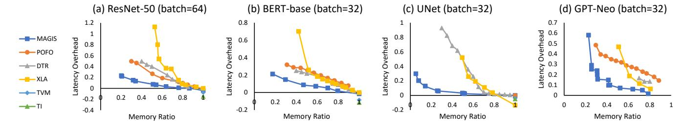

# 7.2.1 Memory Optimization with Latency Constraint.

We first evaluate the memory optimization effects of MAGIS and baselines under 10% and 5% latency overhead constraints. Results are shown in Figure 9. With 10% latency overhead limit, MAGIS optimizes peak memory to 15%~60% of Py-Torch's, outperforming other baselines (60% at best). TVM and TI only perform basic memory saving like the PyTorch baseline, so their optimized memory ratios are near to 100%. MAGIS's memory is 15%~80% of POFO's, 20%~85% of DTR's, and 15%~70% of XLA's. At 5% latency overhead limit, MAGIS optimizes peak memory to 25%~70% of PyTorch's, 25%~80% of POFO's, 35%~80% of DTR's, and 25%~80% of XLA's.

For ResNet, when the latency overhead limit is 10% (5%), MAGIS's peak memory is around 80%~85% (75%~80%) of POFO & DTR & XLA. MAGIS's results are closed to baselines', mainly because ResNet has a simple structure, and the benefits brought by our methods are limited.

For BERT and ViT, MAGIS achieves 50%~70% (65%~75%) of the baselines' memory at 10% (5%) latency overhead constraint. The relative results of MAGIS are better than ResNet

&lt;sup>4https://gitlab.inria.fr/hiepacs/rotor/-/tree/offload

Figure 11. Latency & memory curves of MAGIS and baselines. MAGIS can achieve Pareto optimal in almost all cases.

**Figure 12.** Comparing MAGIS with POFO. The network used by POFO has been pre-processed with micro-batching (with different factors).

due to more intra-cell complexity of transformer networks. MAGIS performs better on ViT than on BERT due to shorter sequence length of ViT. Sequence length has a larger impact on latency than on peak memory, making it more challenging to optimize the memory under a given latency constraint with longer sequence. For UNet and UNet++, MAGIS achieves  $15\%\sim35\%$  ( $25\%\sim70\%$ ) of baselines' memory at 10% (5%) latency overhead constraint. MAGIS performs better on these two networks compared to other networks due to more complex inter-cell structures which provide more optimization space for graph transformation. For GPT-Neo and BTLM, MAGIS maintains  $\leq 40\%$  ( $\leq 60\%$ ) of PyTorch's memory at 10% (5%) latency overhead limit. Only XLA avoids OOM among baselines for GPT-Neo. All baselines are OOM for BTLM under both constraints.

