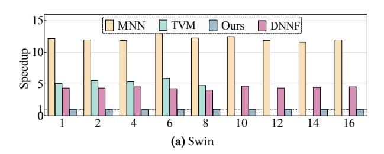
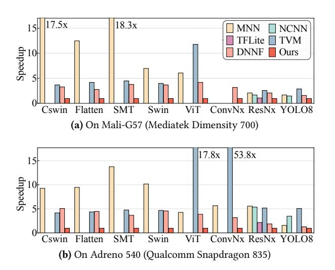
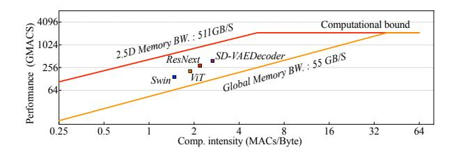

# 3.3 Mapping Tensor to Texture Memory and Other Optimizations

2.5D memory (and corresponding dedicated read-only cache) on mobile GPUs allows more flexible index computation and eliminates index linearization if a tensor's dimension is less than 3. It also facilitates better exploring data reuse opportunities for 2D and 3D tensors. Thus, SmartMem also leverages 2.5D memory to further improve our optimized tensor layout design and memory access as mentioned earlier.

Optimized tensor layout on 2.5D memory. Figure 5 shows 3 sample tensor layouts when mapping a 3D tensor with varied shapes to 2.5D memory, corresponding to  $L_0$ ,  $L_1$ , and  $L_2$  in Figure 4, respectively ( $L_3$  depends on its consumers). D1, D2, and D3 denote the dimensions of these tensors – both  $L^1$  and  $L^2$  have a dimension of size 1. Specifically, the red circles denote that these dimensions are specified as reduction dimensions by the consumer operators of this tensor, for example,  $L^0$  has two reduction dimensions, D1 and D3 decided by Reduce' and FusedConv (in Figure 4), respectively, while  $L^1$  and  $L^2$  have no reduction dimensions.

It is beneficial to store the data along a reduction dimension continuously to improve data locality and allow better SIMD load and reduction operations. Thus, to map a tensor with two reduction dimensions (e.g.,  $L^0$  with D1 and D3) to 2.5D memory, SmartMem partitions one reduction dimension (D1). Each such partition has k elements (k = 4 in this example to match the size of the 0.5D in 2.5D) and stores  $k \times$  <another reduction dimension> elements as a chunk along the dimensions of 2.5D memory that can be accessed in both directions. This layout results in efficient memory access and

Figure 6. Data access patterns comparison before and after layout and access optimizations. In left (a), two consecutive Shape operations reshape the output from LayerNorm across different dimensions.

SIMD operations for consumer operators using either *D*1 or *D*3 as their reduction dimensions.

 $L^1$  and  $L^2$  do not have any reduction dimension because they are consumed by an element-wise addition operator (Add), so theoretically we are allowed to map either D1/D3 or D2 to that 0.5 dimension of 2.5D memory. However, because  $L^1$  and  $L^2$  are used together with  $L^0$  in the FusedConv and their element-wise addition operations have been fused with the Conv, SmartMem maps them to 2.5D memory in a similar manner to  $L^0$  (i.e., mapping D1 and D3 to the 0.5D of 2.5D memory, respectively), avoiding extra index computations. Optimized memory access based on tensor layout. Figure 6 shows the high-level idea of our optimized data access on 2.5D memory by comparing the data access orders before and after this optimization. Figure 6 (a) shows the original computational graph, Figure 6 (b) shows the computational graph and data access order after the fusion and operator elimination offered by SmartMem, and Figure 6 (c) shows the computational graph and data access order after our optimized tensor layout mapping and memory access optimization. Before the optimized tensor layout mapping, although the Reshape and Transpose operations are fused (and eliminated), the memory access pattern is complex and fragmented, resulting in poor data locality (and similarly low SIMD efficiency). The optimized tensor layout mapping offers us an opportunity to access this tensor along its reduction dimension with a stride of 1, thus improving the data locality on 2.5D memory and cache, and parallel and SIMD efficiency on mobile GPUs.

Other optimizations. In addition to the previously mentioned optimizations, our framework incorporates an auto-tuning mechanism that utilizes Genetic Algorithms [51] for generating GPU execution configurations. These configurations include block dimensions, unrolling factors, and tiling shapes.

#### 4 Evaluation

This section evaluates the SmartMem by comparing it to five state-of-the-art frameworks across different models. The

objectives of this evaluation are as follows: 1) To exhibit the notable improvements SmartMem offers against existing, cutting-edge DNN frameworks on a mobile GPU, 2) To explore how various optimizations contribute to these performance enhancements, 3) To demonstrate the portability of proposed optimizations in SmartMem by evaluating the execution times on two other mobile platforms, and 4) To illustrate that our proposed optimizations enable performance improvement on a desktop-level GPU, which is less resource-constrained and has a traditional (one-dimensional) memory. Particularly, SmartMem is compared against MNN [32], NCNN [50], TFLite [1], TVM [10], and DNNFusion [51] (refers as DNNF), on the mobile GPU.

#### 4.1 Evaluation Setup

DNN Workloads: Our evaluation is conducted on 18 stateof-the-art DNN models with three different structures, including Transformer, ConvNet, and Hybrid (i.e., ones having both Transformer and ConvNet structures), as well as Stable Diffusion and LLMs. Table 7 characterizes them with a comparison of their type, attention mechanism, the number of parameters, the number of operators prior to optimizations, as well as the number of multiply-accumulate operations (MACs). We have 1) six Transformer models (Auto-Former [8, 9], CrossFormer [69], Swin [46], ViT [20], Stable Diffusion - TextEncoder [59], Pythia [6]), 2) four Convolution models (ConvNext [47], RegNet [58], ResNext [72], Yolo-V8 [33]), and 3) eight Hybrid models with both Transformer and Convolution structures (BiFormer [77], CSwin [19], EfficientVit [7], FlattenFormer [25], SMTFormer [43]), Conformer [24], StableDiffusion - UNet and VAEDecoder [59].

The Transformer structure can serve as a backbone for different CV and NLP tasks. Due to the space limitations, we report the results on the object detection task (for Yolo-V8) and image classification task (for all other models) in this evaluation. Since the training dataset has a negligible impact on the final inference latency, this section reports results from one training dataset for each model. Yolo-V8 is trained on MS COCO dataset [42]; Conformer, Stable Diffusion Models (SD-TextEncoder, SD-UNet, SD-VAEDecoder), and Pythia are from the pretrained checkpoints; other models are trained on ImageNet dataset [15]. Since the model accuracy is the same across all frameworks, our evaluation focuses only on execution latency.

**Evaluation environment.** SmartMem is built upon our previous work (DNNFusion [51]) that supports extensive operator fusion. We conduct our major experiments on a Oneplus cell phone using the high-end Qualcomm Snapdragon 8 Gen 2 platform [56], which includes a Qualcomm Kryo octa-core CPU and a Qualcomm Adreno 740 GPU with 16 GB of unified memory (shared by both CPU and GPU). In addition, to demonstrate our portability, we test SmartMem on an earlier generation of the Qualcomm platform - Snapdragon

Table 7. Model characterization and comparing the number of operators among frameworks. Hybrid means the combination of Transformer and ConvNet. "–" means the model is not supported by the framework yet.

|                                 |                                             |       |         |       |                       |     |           | #Operators with optimizations |     |         |     |     |
|---------------------------------|---------------------------------------------|-------|---------|-------|-----------------------|-----|-----------|-------------------------------|-----|---------|-----|-----|
| Model                           | Model Type Input Type Attention #Operators† |       |         |       | #Params (M) #MACs (G) |     |           | MNN NCNN TFLite TVM DNNF Ours |     |         |     |     |
| AutoFormer [8, 9]               | Transformer                                 | Image | Local   | 546   | 31.2                  | 4.7 | 449       | –                             | –   | 302     | 197 | 148 |
| BiFormer [77]                   | Hybrid                                      | Image | Local   | 2,042 | 25.5                  |     | 4.5 1,189 | –                             |     | – 1,029 | 602 | 474 |
| CrossFormer [69]                | Transformer                                 | Image | Local   | 505   | 31                    | 5   | 453       | –                             | –   | 308     | 196 | 155 |
| CSwin [19]                      | Hybrid                                      | Image | Local   | 3,863 | 34.7                  |     | 6.9 1,753 | –                             |     | – 1,480 | 933 | 604 |
| EfficientVit [7]                | Hybrid                                      | Image | Local   | 536   | 51                    | 5.2 | 489       | –                             | –   | 133     | 113 | 101 |
| FlattenFormer [25]              | Hybrid                                      | Image | Local   | 2,016 | 37.3                  |     | 7.2 1,558 | –                             | –   | 918     | 665 | 403 |
| SMTFormer [43]                  | Hybrid                                      | Image | Local   | 1,406 | 22.5                  |     | 4.9 1,905 | –                             | –   | 844     | 469 | 332 |
| Swin [46]                       | Transformer                                 | Image | Local   | 765   | 28.9                  | 4.6 | 596       | –                             | –   | 374     | 207 | 158 |
| ViT [20]                        | Transformer                                 | Image | Global  | 444   | 102.8                 | 21  | 379       | –                             | –   | 289     | 168 | 112 |
| Conformer [24]                  | Hybrid                                      | Audio | Global  | 665   | 10                    | 12  | 558       | –                             | –   | 356     | 219 | 163 |
| SD-TextEncoder [59] Transformer |                                             | Text  | Global  | 674   | 123                   | 6.7 | 601       | –                             | –   | 297     | 101 | 84  |
| SD-UNet [59]                    | Hybrid                                      | Image | Global  | 1,962 | 860                   | 91  | 1355      | –                             | –   | 889     | 436 | 322 |
| SD-VAEDecoder [59]              | Hybrid                                      | Image | Global  | 287   | 50                    | 312 | 206       | –                             | –   | 156     | 103 | 95  |
| Pythia [6]                      | Transformer                                 | Text  | Decoder | 1,853 | 1,121                 | 119 | 809       | –                             | –   | 681     | 525 | 355 |
| ConvNext [47]                   | ConvNet                                     | Image | N/A     | 292   | 28.6                  | 4.5 | 321       | –                             | –   | 185     | 96  | 81  |
| RegNet [58]                     | ConvNet                                     | Image | N/A     | 282   | 19.4                  | 3.2 | 197       | 282                           | 197 | 155     | 122 | 122 |
| ResNext [72]                    | ConvNet                                     | Image | N/A     | 122   | 25                    | 4.3 | 86        | 122                           | 73  | 58      | 55  | 55  |
| Yolo-V8 [33]                    | ConvNet                                     | Image | N/A     | 233   | 3.2                   | 4.4 | 176       | 233                           | –   | 88      | 75  | 68  |

#Operators† denotes the number of operators in the unoptimized computational graph.

835 [55], which has more limited resources, and on a MediaTek platform with Dimensity 700 SOCs. The Snapdragon 835 consists of an ARM Octa-core CPU, an Adreno 540 GPU, and 6 GB of unified memory. The MediaTek Dimensity 700 is equipped with an ARM Octa-core CPU, a Mali-G57 GPU, and 4 GB of unified memory. Furthermore, we evaluate our optimizations on an NVIDIA GPU to illustrate our generality. For this comparison, we implement our optimizations (excluding the mobile device-specific optimization for the 2.5D memory layout) in TorchInductor and compare it against the base version of TorchInductor. For all evaluated models and frameworks on mobile devices, GPU execution uses 16-bit floating-point representation. On desktop-level GPU, we use 32-bit floating-point representation for evaluation purposes. Noting that, we use 16-bit floating-point for mobile GPU because it is a common data type that all the frameworks support. Although other data types may have different accuracies, our optimizations are based on operator semantics thus not limited to specific data types. The batch size is set to 1 for all models unless otherwise specified. With the results we reported in this section, we have utilized the auto-tuning capabilities available in MNN, TVM, and TorchInductor to achieve the best possible performance. Each experiment is executed 50 times and only the average numbers are reported – as the variance was negligible, it is omitted for readability.

## 4.2 Overall Performance Comparison

Fusion rate comparison. Table 7 shows the model information with and without optimizations, including the number of

operators in the unoptimized models as well as the number of operators in optimized versions produced by each framework ("–" indicates that the model is not supported by the framework). NCNN and TFLite do not support Transformer models on mobile GPU as they either lack support for key operators and/or do not reduce the memory requirements sufficiently. SmartMem achieves higher fusion rates compared to MNN and TVM for Transformer and Hybrid models, with ratios ranging from 2.2× to 7.2×, and 1.3× to 3.5× , respectively. For ConvNet models, SmartMem achieves fewer operators as compared to MNN, NCNN, TFLite, and TVM by a factor of 1.6× to 4.0×, 2.2× to 3.4×, 1.3× to 1.6×, and 1.1× to 2.3×, respectively. SmartMem offers greater benefits for Transformer and Hybrid models (e.g., BIformer, CSwin, SMTFormer, ViT) compared to ConvNet models (ResNext, RegNet, Yolo-V8). This is because Transformer/Hybrid models require more frequent data reshaping and transposing. The significant improvement in fusion rate stems from two separate components in SmartMem: the optimization based on DNNFusion which is achieving higher fusion rates compared to other frameworks, and the novel (reduction dimension-based elimination optimizations) introduced in this paper. Separating the two, we note that SmartMem achieves a fusion rate of up to 1.7× compared to DNNFusion. For three of the ConvNets (RegNet, ResNext, Yolo-V8), SmartMem demonstrates a similar fusion rate as DNNFusion as there are fewer Reshape and Transpose operations present. However, for the more complex ConvNet model ConvNext, SmartMem achieves an additional fusion opportunity of 1.2× compared to DNNFusion.

Table 8. End-to-end latency comparison across different frameworks – execution on GPU of Snapdragon 8 Gen 2. '–' means that the model is not supported. 'SD' represents for StableDiffusion, which includes three pipelines.

| Model          | #MACs |       |      | Latency | / (ms) |       |      |      | 9    | Speed (G | MACS) |      |      | Speedup   |
|----------------|-------|-------|------|---------|--------|-------|------|------|------|----------|-------|------|------|-----------|
| Model          | (G)   | MNN   | NCNN | TFLite  | TVM    | DNNF  | Ours | MNN  | NCNN | TFLite   | TVM   | DNNF | Ours | over DNNF |
| AutoFormer     | 4.7   | 335   | _    | -       | 184    | 106   | 40.2 | 14   | _    | _        | 25    | 44   | 117  | 2.6×      |
| BiFormer       | 4.5   | 1,736 | _    | _       | 208    | 186   | 56.1 | 3    | _    | _        | 22    | 24   | 81   | 3.3×      |
| CrossFormer    | 5     | 336   | _    | -       | 156    | 121   | 38.2 | 15   | _    | _        | 32    | 41   | 130  | 3.2×      |
| CSwin          | 6.9   | 703   | _    | _       | 261    | 225   | 57.6 | 10   | _    | _        | 26    | 31   | 120  | 3.9×      |
| EfficientVit   | 5.2   | 208   | _    | _       | 243    | 112   | 22.5 | 25   | _    | _        | 21    | 47   | 232  | 5.0×      |
| FlattenFormer  | 7.2   | 492   | _    | _       | 256    | 210   | 60.1 | 15   | _    | _        | 28    | 34   | 119  | 3.5×      |
| SMTFormer      | 4.9   | 510   | _    | _       | 214    | 143   | 40   | 10   | _    | _        | 23    | 35   | 124  | 3.6×      |
| Swin           | 4.6   | 372   | _    | _       | 158    | 135   | 30.6 | 15   | _    | _        | 29    | 34   | 149  | 4.4×      |
| ViT            | 21    | 533   | _    | -       | 1,050  | 277   | 103  | 39   | _    | _        | 20    | 76   | 204  | 2.7×      |
| Conformer      | 12    | 1,736 | -    | _       | 863    | 284   | 106  | 7    | _    | _        | 14    | 42   | 113  | 2.7×      |
| SD-TextEncoder | 6.7   | 153   | _    | -       | 216    | 73    | 38   | 44   | _    | _        | 31    | 92   | 176  | 1.9×      |
| SD-UNet        | 90    | 2,172 | _    | _       | 3,969  | 1,108 | 412  | 42   | _    | _        | 23    | 82   | 219  | 2.7×      |
| SD-VAEDecoder  | 312   | 2,730 | _    | _       | 5,663  | 1,596 | 866  | 114  | _    | _        | 55    | 195  | 360  | 1.8×      |
| Pythia         | 119   | 3,034 | _    | -       | 6,602  | 1,489 | 663  | 40   | _    | _        | 18    | 80   | 180  | 2.3×      |
| ConvNext       | 4.5   | 271   | -    | _       | 5,543  | 109   | 33.4 | 17   | _    | _        | 0.81  | 41   | 135  | 3.3×      |
| RegNet         | 3.2   | 61    | 33   | 36.4    | 71     | 31    | 24.7 | 52   | 106  | 88       | 45    | 103  | 129  | 1.3×      |
| ResNext        | 4.3   | 158   | 38   | 66      | 106    | 33    | 15.7 | 27   | 111  | 64       | 40    | 129  | 271  | 2.1×      |
| Yolo-V8        | 4.4   | 32    | 28   | -       | 141    | 26    | 22   | 138  | 169  | -        | 31    | 169  | 200  | 1.2×      |
| Geo-mean (spe  | edup) | 7.9×  | 1.6× | 2.5×    | 6.9×   | 2.8×  | 1.0× | 7.9× | 1.6× | 2.5×     | 6.9×  | 2.8× | 1.0× | -         |

The results collected from MNN/TVM/DNNFusion with auto-tuning.

Furthermore, for Transformer and Hybrid models, SmartMem enables  $1.1\times$  to  $1.7\times$  more fusion opportunities through our elimination techniques when compared to DNNFusion.

End-to-end execution time comparison. Table 8 presents a comparison of overall execution latency and speed (measured in GMACS) among six frameworks on our target mobile GPU. In the case of Transformer and Hybrid models, SmartMem achieves  $3.2 \times$  to  $30.9 \times$ , and  $3.7 \times$  to  $10.8 \times$  speedups compared with MNN and TVM, respectively (NCNN and TFLite do not support Transformer and Hybrid models on mobile GPU). As for ConvNet models, SmartMem achieves  $1.5\times$  to  $10.1\times$ ,  $1.3\times$  to  $2.4\times$ ,  $1.5\times$  to  $4.2\times$ , and  $2.9\times$  to  $166\times$ compared with MNN, NCNN, TFLite, and TVM, respectively. The exceptionally large speedup on ConvNext when compared to TVM is due to TVM lacking an efficient layout design for a reduction operator GroupConvolution. For BI-Former, SmartMem significantly outperforms MNN because the token selection mechanism in BIFormer leads to more data transformation operations, resulting in more benefits from eliminating layout transformations. Compared to DNN-Fusion, SmartMem achieves 1.8× to 5.0× speed improvement for Transformer and Hybrid models, while achieving 1.2× to 3.3× improvement for ConvNets. The gains on ConvNets compared with DNNFusion are because our layout selection enables more hardware-friendly data access and computation pattern across multiple operators. It is worth noting that SmartMem delivers similar speed (around 120 GMACS)

for models with similar structures regardless of the number of operators, i.e., for AutoFormer, BIFormer, CrossFormer, CSwin, FlattenFormer, SMTFormer, and Swin. On the other hand, for EfficientViT, ViT, ResNext, and Yolo-V8 models, the speed is higher (over 200 GMACS). This is because these models either have more intensive computation in each operator (e.g., ViT and EfficientViT), which means more data reuse in computation or have a more regular computation pattern (RegNet and ResNext) with pure Convolution structure.

Memory performance (overall). Figure 7(a) compares the number of memory accesses (left) and the number of cache misses (right). The results are normalized by Ours (SmartMem) for readability. Due to space limitations, we only present results for one local attention Hybrid model (Cswin) and one ConvNet model (ResNext). Cswin execution using our framework is compared against MNN, TVM, and DNNFusion, whereas ResNext execution is compared against these as well as NCNN and TFLite. As shown in Figure 7, SmartMem utilizes 1.8× fewer memory accesses on average and achieves an average of 2.0× fewer cache misses compared to other frameworks. In the following section, we further study the impact of our key optimizations on memory accesses.

#### 4.3 Optimization Breakdown and Analysis

This section studies the impact of the key optimizations in SmartMem on execution latency. We evaluate the gains from each optimization incrementally over our baseline version

Figure 7. Memory access count and cache miss count comparison compared with other frameworks. The memory access data is collected from the hardware counter on the mobile GPU, showing the total number of data accesses happening in the global memory of the mobile GPU. All results are normalized by ours.

Figure 8. Performance breakdown analysis: speedup over baseline (DNNFusion).

DNNF (shorts for DNNFusion). Figure 8 illustrates the impact of our proposed optimizations on latency with eight models. These include five Transformer and Hybrid models (AutoFormer (AutoF), BiFormer (BiF), EfficientViT (EViT), Cswin, ViT) and three ConvNet models (ConvNext(ConvNx), RegNet (RegN), ResNext (ResNx)) on the mobile GPU. LTE shorts for Layout Transformation Elimination. Due to space limitations, we omit experiments on other models that show a similar trend. For Transformer and Hybrid, compared to DNNF, Layout Transformation Elimination (LTE) achieves a speedup of 1.5× to 2.7×. Layout Selecting brings an additional speedup of 1.4× to 1.9×, and other optimizations (texture memory-related and tuning) bring an additional speedup of 1.2× to 1.4×. For ConvNet, these numbers are 1.1× to 1.4×, 1.5× to 1.7×, and 1.1× to 1.4×, respectively. Considering Index Comprehension, for Transformer and Hybrid models, it contributes to the speedup results of Layout Transformation Elimination by 1.1× to 1.3×, while for ConvNets, it contributes between 1.1× and 1.2×.

Memory and cache breakdown. To further investigate the impact of our key optimizations on the underlying hardware, Figure 9 illustrates the breakdown of memory and cache usage in SmartMem. Figure 9 demonstrates the reduction in memory access counts (left) and cache miss counts (right) for Cswin and ResNext, respectively. Layout Transformation Elimination has a greater effect on reducing memory access count than cache miss count because it eliminates the need

Figure 9. Optimization breakdown: memory access count and cache miss count comparison.

Figure 10. Performance comparison with different batch sizes for Swin. We report the speedup for better readability.

Figure 11. Portability evaluation on Mediatek Dimensity 700 and Qualcomm Snapdragon 835. We report the speedup for better readability. Empty bar on other frameworks means the model is not supported due to lack of operator supports or insufficient memory on device.

for data reorganization and enables more fusion opportunities. On the other hand, Layout Selection has a greater impact on cache miss count than memory access count as it designs better layouts for each operator thus enabling better data access patterns.

Table 9. Comparison of end-to-end execution latency on NVIDIA GPU between PytorchInductor and SmartMem for Swin and SMTFormer. Results are collected with a batch size of 1.

| Model      | System       | Device     | TorchInductor (ms) | Ours (ms) |
|------------|--------------|------------|--------------------|-----------|
| Swin       | Ubuntu 20.04 |            |                    | 6.1       |
| AutoFormer | Ubuntu 20.04 | Tesla V100 | 5.1                | 4.6       |

#### 4.4 Performance Impact of Batch Size

Figure 10 illustrates the performance improvements achieved by SmartMem on mobile GPU, compared to MNN, TVM, and DNNF, across different batch sizes. We report the results for a representative Transformer model, Swin with batch sizes ranging from 1 to 16. Other models show a similar trend. An empty bar for other frameworks indicates that the corresponding batch size is not supported due to insufficient device memory. For different batch sizes, SmartMem shows speed improvements of 11.6× to 13.2×, 4.8× to 5.9×, and 4.1× to 4.7× compared to MNN, TVM, and DNNFusion, demonstrating its scalability.

### 4.5 Portability Evaluation

Older Mobile Platforms: Figure 11 shows the speedup achieved on Mediatek Dimensity 700 and Qualcomm Snapdragon 835. MNN and TVM do not support ConvNext on Mali-G57 due to insufficient memory (4GB unified memory). SmartMem achieves similar speedup on these platforms with limited resources, and is actually less sensitive to having fewer resources because our Layout Transformation Elimination and Layout Selection reduces the overall number of operators, resulting in lower memory and cache pressure.

Desktop-level GPU: We have implemented our Layout Transformation Elimination and Layout Selecting on TorchInductor and conducted a performance comparison. TorchInductor automatically selects the optimal implementation from either TensorRT or a Pytorch built-in or compilergenerated Triton kernel. We compared the performance of two Transformer models, Swin and AutoFormer, in this environment. As shown in Table 9, SmartMem, achieves 1.23× and 1.11× better execution efficiency than TorchInductor with data type FP32. As these results are from a quick and separate implementation, we expect that additional benefits will be possible in future work.

#### 4.6 Discussion

Limitations. While our optimizations significantly improve the performance of transformer models with many layout transformation operations, it is worth pointing out that SmartMem yields only modest performance improvements for traditional convolutional neural networks such as Yolo-V8 and RegNet, or models in general with few layout transformation operations compared to DNNF. In comparison

**Figure 12.** Roofline analysis for peak and actual performance (GMACs/s) on mobile GPU for ViT.

to DNNF (the best baseline shown in Table 8) in CNN-only models, particularly RegNet and Yolo-V8, SmartMem achieves a speedup of 1.3× and 1.2×, respectively. These two models primarily consist of computationally intensive operators (Conv2D), and the advanced operator fusion proposed in DNNF works effectively. Conversely, for CNNs with more layout transformation operations (ConvNext) or those sensitive to the data layouts like ResNext, SmartMem delivers a speedup of 3.3× and 2.1×, demonstrating the effectiveness of our optimization in eliminating layout transformations and selection for these models.

Roofline analysis for the achieved performance. To better evaluate SmartMem's optimization effect, Figure 12 shows the results from roofline analysis [70] on four models (Swin, ViT, ResNext, and SD-VAEDecoder). Here, the yellow line and red line show the theoretical peak performance assuming that all data is accessed from global memory and 2.5D texture memory, respectively. The global memory and texture memory bandwidths are 55 GB/s and 511 GB/s, respectively, and the mobile GPU's peak computation performance is 2.0 TMACs/s [41]. These models consist of various operators with different computation intensity levels. Certain operators have a low computation intensity (e.g., activation functions and elementwise arithmetic operations), while others exhibit a high computation intensity (e.g., Conv and MatMul). For ease of comparison, the x-axis in this analysis denotes the computation intensity (MACs/byte) averaged across the entire computational graph.

Figure 12 shows the analysis for Swin, ViT, ResNext, and SD-VAEDecoder, which all have different levels of computational intensity, achieve 149, 204, 271, and 360 GMACs/s, respectively. Specifically, Swin performs the worst while SD-VAEDecoder performs the best because Swin contains more low computation intensity operators whereas SD-VAEDecoder contains more high computation intensity operators. Under an unrealistic assumption that all data accesses are from 2.5D texture memory, SmartMem achieves 24%, 27%, 31%, and 35% of the theoretical peak performance. A higher computation intensity of a model implies more Conv and/or MatMul operators in the model. These operators are more likely to read data from 2.5D texture memory, thus achieving a higher percentage of the theoretical peak performance.

### Impact of redundant data copies with different layouts.

The SmartMem stores redundant copies of data, specifically intermediate results, with different layouts when an operator has multiple consumers requiring varied input data layouts. During runtime, these redundant layouts do not significantly increase memory consumption for the models we evaluated. This is primarily due to two reasons. Firstly, maintaining multiple copies of data in different layouts is not commonly seen during execution; for instance, Swin and ViT have a maximum active redundant copy size of 3.0MB and 2.3MB, respectively. Additionally, similar to TVM, our implementation allocates intermediate results from a memory pool allowing efficient reuse of memory resources by releasing data copies back into the pool when they are no longer needed by any consumers. In addition, compared to DNNFusion, eliminating kernels reduces further memory usage. Take SwinTransformer and ViT as examples: SmartMem decreases the number of operators by 24% and 33% compared to DNNF, as shows in Table 7, resulting in respective reductions in memory consumption of 14% and 15%.

## 5 Related Work

Operator fusion and layout optimizations. Operator fusion is a commonly used optimization technique in many advanced DNN inference frameworks. In the past, MNN [32], TFLite [1], NCNN [50], and Pytorch-Mobile [53] have all employed fixed-pattern fusion, which is based on identifying specific operator combinations to be fused (and thus limiting fusion for those cases). TVM [10] recently started supporting operator fusion with more general rules by classifying the operator into three categories [66]: 1) Layout agnostic (e.g., ReLU), 2) Lightly-layout sensitive (e.g., Reduce), and 3) Heavily-layout sensitive (e.g., Conv). DNNFusion [51] generates fusion plans by classifying operators and their combinations, allowing for a wider range of fusion optimizations. However, it cannot eliminate explicit data transformation operators through improved layouts. Furthermore, with our Layout Transformation Elimination, SmartMem offers even more opportunities for operator fusion compared to DNNFusion. Our evaluation demonstrates superior results in terms of fusion rate and latency. Ivanov et al. [29] aim to reduce data movement in Transformer training on desktop GPUs, and similar to TVM, they propose an optimization framework that systematically fuses operators and selects data layouts by classifying the operator into three categories. Different types of operators can only be fused if they have the exact same iteration space, except for the reduction dimension, including both the order and size of the dimensions. This approach cannot optimize (including eliminating layout transformations) cases involving frequent changes in dimension order and size, which Reshape and Transpose kind of operations explicitly do.

DNN inference frameworks on mobile. As AI applications on mobile devices continue to grow, there is a strong emphasis on optimizing DNN inference frameworks for mobile platforms. Efforts such as DeepEar [39], DeepSense [75], Mobisr [40], and others [26, 28, 38, 64, 73], have primarily focused on specific tasks or traditional convolutional neural networks, or require special hardware support. There are other research directions that target DNN scheduling for heterogeneous platforms, including Band [30], BlastNet [44], CoDL [31], and others [63, 71].

Other DNN execution optimization frameworks. The advancement of Artificial General Intelligence (AGI) has been significantly bolstered by the evolution of Transformerbased models, paralleled by notable progress in supporting acceleration frameworks like FlashAttention [13, 14], and vLLM [37]. FlashAttention improves the attention mechanism in Transformers by using tiling strategies to minimize memory access between the GPU's high bandwidth memory (HBM) and on-chip SRAM. However, FlashAttention requires extensive register usage in its kernel, which limits its effectiveness on mobile GPUs with limited register capacity [11]. SmartMem focuses on Layout Transformation Elimination, essentially complementing their work – combining two approaches could be an interesting future direction. vLLM is an efficient LLMs serving system targeting memory fragmentation issues, inspired by the classical virtual memory and paging techniques used in operating systems. vLLMs proposes PagedAttention to enhance processing throughput and capability for long sequences in LLMs, achieving near-zero waste in KV cache memory. TensorFlow-XLA [23] and TorchInductor [54] are advanced compilers that translate computational graphs and linear algebra expressions into machine code. TensorFlow-XLA uses a "pad-reshape-transpose" strategy to optimize layout transformation and tiling, which can lead to additional overhead for layout conversion. On the other hand, TorchInductor relies on pre-assigned layouts of specific operators or satisfies layout constraints from library calls (e.g., TensorRT).

