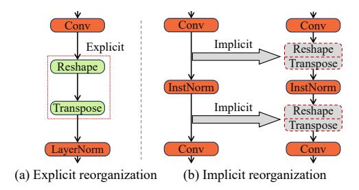
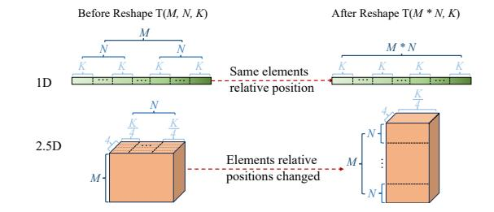

# Abstract

This work is motivated by recent developments in Deep Neural Networks, particularly the Transformer architectures underlying applications such as ChatGPT, and the need for performing inference on mobile devices. Focusing on emerging transformers (specifically the ones with computationally efficient Swin-like architectures) and large models (e.g., Stable Diffusion and LLMs) based on transformers, we observe that layout transformations between the computational operators cause a significant slowdown in these applications. This paper presents SmartMem, a comprehensive framework for eliminating most layout transformations, with the idea that multiple operators can use the same tensor layout through careful choice of layout and implementation of operations. Our approach is based on classifying the operators into four groups, and considering combinations of producer-consumer edges between the operators. We develop a set of methods for searching such layouts. Another component of our work is developing efficient memory layouts for 2.5 dimensional memory commonly seen in mobile devices. Our experimental results show that SmartMem outperforms 5 state-of-theart DNN execution frameworks on mobile devices across 18 varied neural networks, including CNNs, Transformers with both local and global attention, as well as LLMs. In particular, compared to DNNFusion, SmartMem achieves an

[This work is licensed under a Creative Commons Attribution-](https://creativecommons.org/licenses/by-nc/4.0/)NonCommercial International 4.0 License. ASPLOS '24, April 27-May 1, 2024, La Jolla, CA, USA © 2024 Copyright held by the owner/author(s). ACM ISBN 979-8-4007-0386-7/24/04. <https://doi.org/10.1145/3620666.3651384>

average speedup of 2.8×, and outperforms TVM and MNN with speedups of 6.9× and 7.9×, respectively, on average.

#### ACM Reference Format:

Wei Niu, Md Musfiqur Rahman Sanim, Zhihao Shu, Jiexiong Guan, Xipeng Shen, Miao Yin, Gagan Agrawal, and Bin Ren. 2024. Smart-Mem: Layout Transformation Elimination and Adaptation for Efficient DNN Execution on Mobile. In 29th ACM International Conference on Architectural Support for Programming Languages and Operating Systems, Volume 3 (ASPLOS '24), April 27-May 1, 2024, La Jolla, CA, USA. ACM, New York, NY, USA, 16 pages. [https:](https://doi.org/10.1145/3620666.3651384) [//doi.org/10.1145/3620666.3651384](https://doi.org/10.1145/3620666.3651384)

## 1 Introduction

As Machine Learning (ML), more specifically, Deep Learning (DL) and Deep Neural Networks (DNNs) have permeated our every day life, there is a growing need for supporting inference using DL models on the ubiquitous mobile devices. From the application side, possibility are endless and go well beyond common speech or image recognition. On the other hand, we have the growing computational capacity (and continued popularity) of smartphones.

For the past several years, inference with even fairly complex models has been feasible on mobile devices [10, 11, 23, 31, 32, 60]. Such inference has the benefit that a user's data does not need to be transmitted to a cloud or a server. This, in turn, allows ML models to execute when the device is not connected to the internet, and alleviates privacy concerns about sharing personal information that many users frequently have [16, 48].

Recently, Transformers [76] have revolutionized the fields of computer vision (CV) [3, 5, 19, 20, 46] and natural language processing (NLP) [4, 17, 21, 57, 65, 67]. Transformer-based models uniquely provide long-range dependency handling and global contextual awareness, which are driving existing popular AI applications such as ChatGPT, Bard, and Alexa.

**Table 1. Latency and transformation breakdown across various models.** 'Lat.' shorts for Latency. 'Exp.' refers to the latency associated with explicitly transforming the tensor's layout, such as Transpose and Reshape. 'Imp.' denotes the latency incurred by implicit layout transformations. 'Comp.' indicates the latency attributed to the remaining operators. 'SD' represents Stable Diffusion model. These results are collected using MNN [32] on a Snapdragon 8 Gen 2 platform. MACs means the number of multiply-accumulate operations, and GMACS represents giga MACs per second.

| Model               | #MACs (G) | #Layout transform | Lat. (ms) | 1    |      | own (%) Comp. | Speed (GMACS) |
|---------------------|--------------|----------------------|--------------|------|------|------------------|------------------|
| ResNet50 [27]       | 4.1          | 3                    | 14           | 4.8  | 0.2  | 95               | 293              |
| FST [34]            | 162          | 32                   | 1,506        | 70.7 | 1.8  | 27.5             | 108              |
| RegNet [58]         | 3.2          | 6                    | 57           | 16.7 | 0    | 83.3             | 56               |
| CrossFormer [69]    | 5.0          | 208                  | 336          | 15.3 | 55.2 | 29.5             | 15               |
| Swin [46]           | 4.6          | 242                  | 342          | 14.7 | 54.1 | 31.2             | 15.2             |
| AutoFormer [8, 9]   | 4.7          | 233                  | 335          | 13.3 | 54.2 | 32.5             | 14               |
| CSwin [19]          | 6.9          | 769                  | 703          | 14.3 | 50.2 | 35.5             | 10               |
| SD-TextEncoder [59] | 6.7          | 183                  | 133          | 15.1 | 36.3 | 48.6             | 44               |
| SD-UNet [59]        | 90           | 533                  | 2172         | 19.4 | 42.1 | 38.5             | 42               |
| Pythia-1B [6]       | 119          | 385                  | 3034         | 11.7 | 31.7 | 56.6             | 39               |

Studies assessing them as computational workloads [36] have identified that as compared to the CNN-based designs, the computation graph representations for transformers are more complex, specifically, they have more data flow splits, shuffles, and merges. One further development has been the emergence and popularity of (computationally) efficient local-attention (Swin-like) [9, 46, 69, 77] Transformers that have reduced computational complexity, though at the cost of more layout transformations.

Table 1 summarizes this aspect. Specifically, three of the older ConvNets (like ResNet50 [27]), six newer (Transformer) models, and one decoder-only LLM (Pythia [6]) are compared with respect to the time spent on implicit and explicit data layout transformations (as compared to pure computations). A majority of the older models spend a relatively small fraction of their time on (implicit or explicit) layout transformations. On the other hand, Transformer models all consistently spend between 43% to 70% of their time on data transformation. Moreover, the execution speed of these models is, on the average, around one order of magnitude slower than earlier models. It seems likely that increased numbers of data transformation (as indicated in the third column of Table 1) cause poor locality during compute-oriented operations, resulting in a significant slowdown.

In this work, we take the position that almost all *layout transformations* can be eliminated and instead, the layout of the tensor that is produced can be chosen to serve various computational operations efficiently. This paper presents a systematic framework for enabling elimination of such unnecessary memory intensive operations. Components of the work include the following:

- Careful study of the relationship between the computation and input/output data layout of DNN operators, and a high-level operator type classification based on operators' performance sensitivity to input layout and the output layout customizability.
- A procedure for layout transformation elimination and an effective heuristic method for selecting the layout for each operator that is not fused or eliminated.
- A procedure to map the chosen layout to memory hierarchy by taking 2.5D (texture) memory into consideration.
- Integration of the above into a comprehensive framework called SmartMem, which is then implemented on top of a state-of-the-art end-to-end DNN execution framework DNNFusion [51].

SmartMem has been extensively evaluated on 18 cuttingedge DNNs, including 4 ConvNet models, 6 Transformer models, and 8 Hybrid (combining ConvNet and Transformer structures) models on mobile GPUs. The evaluation demonstrates a significant speedup compared to 5 state-of-theart DNN execution frameworks (MNN [32], NCNN [50], TFLite [1], TVM [10], and DNNFusion [51]). SmartMem reduces the number of operators by 21% to 65% compared with other frameworks. In terms of latency, SmartMem achieves an average speedup of 2.8× over DNNFusion, a state-of-the-art baseline. Compared with two other popular frameworks, TVM and MNN, SmartMem achieves an average speedup of 6.9× and 7.9×, respectively. Furthermore, SmartMem enhances cache utilization and reduces memory pressure, enabling the execution of some models on resource-constrained devices while other frameworks may encounter challenges.

#### 2 Background and Motivation

#### 2.1 DNN Recent Advances: Transformers.

The Transformer architecture has become the dominant paradigm in deep learning space, leveraging attention mechanism to focus on different parts of the input sequence while generating each part of the output sequence [4, 17, 57, 67]. One notable challenge with the standard (or global) attention mechanism is its computational and space complexities, both of which are  $O(n^2)$ , where n represents the length of the input sequence. DL practitioners have built upon the foundational (vanilla) Transformer model by introducing local-attention Transformer models [8, 9, 18, 43, 46] that reduce computational complexity.

Local attention focuses on a subset of input tokens (typically within a window) at a time and requires less computation. To achieve computational reduction, frequent explicit shape/data reorganization (Reshaping, Transposing, Gathering) is used to split and transpose segments within the input data into these smaller windows. Another trend involves combining traditional ConvNets with Transformers and designing new model structures [7, 12, 19, 25, 68, 74, 77] to benefit from both structures. These new structures introduce

Figure 1. Examples of layout transformation in DNNs.

implicit data reorganization due to different layout preferences for various operators. Figure 1 shows the two types of data reorganization, which we will discuss next.

## 2.2 Motivation and Research Issues

To motivate the key optimizations we are proposing, we further discuss two examples from Figure 1. In sub-figure (a), we show two computational operations, a Conv (convolution) and a LayerNorm. In between these two, the programmer explicitly inserts two operations, a Reshape and a Transpose. A reshape operation changes the number and sizes of dimensions for the tensor – for example, a  $5 \times 5 \times 5$  3-D tensor can be recast as a  $5 \times 25$  2-D matrix. A subsequent transpose operation can next convert it to a  $25 \times 5$  matrix.

In Figure 1 (a), the Reshape and Transpose are considered *explicit*, in the sense they are inserted explicitly by a model implementer while working with a framework such as MNN [32]. In Figure 1 (b) we show what we consider as an *implicit* layout transformation. In this example, a Conv operation is followed by an InstNorm or Instance Normalization operation, which is then followed by another Conv. A framework such as MNN inserts both Reshape and Transpose examples before and after the InstNorm, aligning them with predefined input layouts.

The underlying reason behind these operations is that different operators in a DNN might require input tensors with different shapes and/or layouts. For instance, fully connected operators require a *flattened input*, whereas convolutional operators require multi-dimensional inputs to perform spatial operations. A transpose operation consumes high memory bandwidth, and furthermore, can reduce locality for the operations that follow the transpose. Eliminating reshape and transpose operations, and performing the two operations, i.e., those before and after the transpose, on the same layout should be able to improve performance. However, eliminating such layout transformation involves many important (inter-dependent) questions.

- Q1: In a large and complex computational graph capturing a large DNN, deciding when two consecutive operations should use the same layout of data.
- Q2: For two operations where we decide to use the same layout, choosing the layout that leads to efficient execution of both operands.

Table 2. Memory comparison on mobile GPUs.

|             | Characteristics            | 1D Buffer                   | 2.5D Texture     |
|-------------|----------------------------|-----------------------------|------------------|
| Computation | Acceleration engine        | N                           | Y                |
| Computation | Automatic bounds checking  | N                           | Y                |
|             | Hardware interpolation     | N                           | Y                |
|             |                            |                             |                  |
|             | Organization               | Contiguous                  | Multidimensional |
|             | Organization Addressing | Contiguous Pointer-based |                  |
| Data access |                            |                             |                  |
| Data access | Addressing                 | Pointer-based               | Coordinates      |

Figure 2. Layout transformation and 2.5D memory.

- Q3: Implementing an operation efficiently for a chosen layout (distinct from the original layout), including deciding access pattern and simplifying index computations.
- Q4: Mapping the chosen layout to memory hierarchy, especially the 2.5D memory (further discussed in Section 2.3). Many of these issues have been addressed previously in computer systems and compiler community, though not specific to our target workload. The closest work in this area is on integrating data layout selection and loop transformations [22, 35, 49, 52, 61, 62]. However, the most significant difference in our work is that prior efforts, motivated by traditional scientific workloads, have focused on one nested loop. In comparison, with transformers (or even other DNNs), the challenge is making this selection among a Directed Acyclic Graph (DAG) of operators (i.e. the computational graph). Other differences in the work involve deciding when eliminating a transpose is beneficial or not, implementing multiple operators efficiently on the same layout, and physically mapping to 2.5D memory.

#### 2.3 GPU texture memory

The GPU texture memory specializes in improving two-dimensional spatial locality. Since each cache element can be a vector with a fixed length of four, and the cache itself has two dimensions (referred to as width and height), we refer it to as 2.5D memory. Originally designed to facilitate graphical rendering processes, this design also offers significant advantages for stencil and similar computations. For instance, using 2.5D texture memory for convolution operations can result in a  $3.5\times$  reduction in latency compared to 1D buffer memory [31]. Table 2 summarizes the main differences between GPU texture memory and 1D buffer memory.

Table 3. Operator classification based on input layout dependency and output layout flexibility. 'Comp.' stands for Computation.

| Output layout Comp. performance | Variable (Computation order dependent)                                                                                                                                                                                                                                                                                                                                 | Fixed                                                                                                                                                                                                                                                                                    |
|------------------------------------------|---------------------------------------------------------------------------------------------------------------------------------------------------------------------------------------------------------------------------------------------------------------------------------------------------------------------------------------------------------------------------|------------------------------------------------------------------------------------------------------------------------------------------------------------------------------------------------------------------------------------------------------------------------------------------|
| Input layout dependent (ILD)          | $ \begin{array}{c c} \operatorname{Conv}: C_{4-d}^{l} \leftarrow A_{4-d}^{l_1} * B_{4-d}^{l_2} \\ \operatorname{MatMul}: C_{2-d}^{l} \leftarrow A_{1-d}^{l_1} \cdot B_{2-d}^{l_2} \\ \operatorname{LayerNorm}: C_{n-d}^{l} \leftarrow A_{n-d}^{l_1} \odot B_{2-d}^{l_2} \\ \operatorname{Softmax}: C_{n-d}^{l} \leftarrow A_{n-d}^{l_1} \odot B_{2-d}^{l_2} \end{array} $ | $\begin{aligned} \operatorname{Reshape}: & B_{n-d}^L \leftarrow A_{m-d}^{l_1} \\ \operatorname{Transpose}: & B_{n-d}^L \leftarrow A_{n-d}^{l_1} \\ \operatorname{DtoS}: & B_{n-d}^L \leftarrow A_{n-d}^{l_1} \\ \operatorname{StoD}: & B_{n-d}^L \leftarrow A_{n-d}^{l_1} \end{aligned}$ |
| Input layout independent (ILI)           | $\begin{aligned} & \text{Unary:} B_{n-d}^l \leftarrow A_{n-d}^{l_1} \\ & \text{Add:} C_{n-d}^l \leftarrow A_{n-d}^{l_1} + B_{n-d}^{l_1} \end{aligned}$                                                                                                                                                                                                                    |                                                                                                                                                                                                                                                                                          |

Unary refers to an operator applying a function to each element of a single input. DtoS and StoD mean DepthToSpace and SpaceToDepth, respectively.

Coupled with the advantages associated with spatial locality, there are also some challenges. Figure 2 shows an example of Reshape in 1D and 2.5D memory. As a background, reshaping a tensor involves changing its shape without altering the underlying data order. For a 1D memory, due to the linear format, reshaping simply implies interpreting the same data with a different number of dimensions. The overhead is negligible as it only involves changing the metadata of the tensor. However, for 2.5D memory, because spatial relationships between data points are important (consider image processing or matrix computations), reshaping a tensor in 2.5D memory involves more complex processes of reordering the data layout while maintaining inherent relationships within the data. Furthermore, due to the limited bandwidth, the data transformation overhead is crucial when an operation requires moving both metadata and actual data (such as explicit and implicit data transpose) in 1D linear buffer and 2.5D texture memory on mobile GPUs.

## 3 Design of SmartMem

Our framework has three components, which address the four questions listed earlier in Section 2.2: 1) an operator type classification based on operators' performance sensitivity to input layout as well as the output layout customizability, and an analysis built on this operator type classification (to answer Q1), 2) a layout transformation elimination procedure and a method for selecting the optimal layout for each (not eliminated) operator based on the operator type classification and layout transformation analysis (to answer Q2 and Q3), and 3) a further optimization procedure that maps the chosen layout to memory hierarchy by taking 2.5D memory into account (to answer Q4).

## 3.1 Operator Classification and Analysis

The foundation of our method is a novel classification system for operators commonly seen in DNNs. Any given operator in our target workload is classified along two dimensions.

Table 4. Operator type definition.

| Name                                   | Definition                                                                                                           |
|----------------------------------------|----------------------------------------------------------------------------------------------------------------------|
| Input Layout Dependent & Variable   | $B_{\sigma(i),\sigma(j),\dots,\sigma(n)} = \mathcal{O}_{\pi(i),\pi(j),\dots,\pi(m)}^{ILD-Variable}(A_{i,j,\dots,m})$ |
| Input Layout Dependent & Fixed      | $B_{i,j,\dots,n} = \mathcal{O}_{\pi(i),\pi(j),\dots,\pi(m)}^{ILD-Fixed}(A_{i,j,\dots,m})$                            |
| Input Layout Independent & Variable | $B_{\sigma(i),\sigma(j),,\sigma(n)} = \mathcal{O}^{ILI-Variable}(A_{i,j,,m})$                                        |
| Input Layout Independent & Fixed    | $B_{i,j,\dots,n} = \mathcal{O}^{ILI-Fixed}(A_{i,j,\dots,m})$                                                         |

The first dimension is whether the performance of the computation depends upon the input layout or is independent. The second dimension is whether the output layout is customizable (perhaps in view of the computation pattern chosen for operator's implementation). These two dimensions result in four quadrants and each operator can be mapped to one quadrant. In some cases, one operator may be placed in different quadrants depending on whether the layout of its different operands is the same or different. Table 3 shows sample operators for each quadrant.

To explain these quadrants, we start at the bottom left and consider the addition operation:

$$C_{n-d}^{l} \leftarrow A_{n-d}^{l_1} + B_{n-d}^{l_1}$$

In the above operation, tensors A and B have the same layout denoted as  $l_1$ . Having an identical layout, and with an addition operation needing to touch each element once, the computational performance is not sensitive to the layout  $l_1$ , i.e., addition can be performed efficiently with traversal of the two matrices matching their (identical) physical layout. At the same time, the layout of the output tensor C can be customized, for example, based on the needs of the downstream operations.

Moving clockwise, we consider matrix multiplication example  $C_{2-d}^l \leftarrow A_{2-d}^{l_1} \cdot B_{2-d}^{l_2}$ . As a multiplication operation involves temporal reuse of data, the performance of the operation is clearly sensitive to the input layouts (even if the layouts  $l_1$  and  $l_2$  are identical). At the same time, the output layout can be customized for this application. An operator like Transpose, on the other hand, has a well-defined output layout (dependent upon the input layout). Given the memory transformations involved, the performance can be sensitive to the layout of the input operand. Finally, consider an operator like Slice. Because of simple selection involved, the performance is insensitive to the layout of the input. Moreover, by definition, the output layout has to match the input layout and is therefore not customizable

We next formally define these four quadrants (or types) of operators so that we can classify and place a given operator into this table. Table 4 shows the formal definition to these four quadrants (or types) of operators so that we can classify and place a given operator into Table 3.

Table 5. Operator combination - action. ILD & Var is short for ILD & Variable.

| First       | Second | ILD & Variable | ILI & Variable | ILD & Fixed    | ILI & Fixed    |
|-------------|--------|----------------|----------------|----------------|----------------|
| ILD & Var   | Action | Keep both      | Try fuse       | Eliminate 2nd  | Eliminate 2nd  |
| ILI & Var   | Action | Try fuse       | Try fuse       | Eliminate 2nd  | Eliminate 2nd  |
| ILD & Fixed | Action | Eliminate 1st  | Eliminate 1st  | Eliminate both | Eliminate both |
| ILI & Fixed | Action | Eliminate 1st  | Eliminate 1st  | Eliminate both | Eliminate both |

Take Input Layout Dependent & Variable (ILD-Variable) as an example. Let A and B represent the input tensor and the output tensor, respectively, and  $\mathcal{O}^{ILD-Variable}$  denotes the operator. The permutations  $\pi$  and  $\sigma$  represent the flexibility in processing and generating data, respectively. More specifically, The permutation  $\pi$  represents a rearrangement of these dimensions that affects the input layout, and  $\sigma$  represents a rearrangement of the computed result's dimensions affecting the output layout. Denoting mathematically,

$$B_{\sigma(i),\sigma(j),\dots,\sigma(n)} = \mathcal{O}_{\pi(i),\pi(j),\dots,\pi(m)}^{ILD-Variable}(A_{i,j,\dots,m})$$

 $B_{\sigma(i),\sigma(j),\dots,\sigma(n)} = \mathcal{O}^{ILD-Variable}_{\pi(i),\pi(j),\dots,\pi(m)} (A_{i,j,\dots,m})$  The input tensor is accessed as  $A'_{\pi(i),\pi(j),\dots,\pi(m)} = A_{i,j,\dots,m}$ during the computation, where A' is the tensor A with its layout altered according to  $\pi$ . This rearrangement can lead to different memory access patterns, which might impact cache performance and processing speed. The computation is then performed, and the result is organized in the output tensor B as  $B'_{i,j,\dots,n} = \mathcal{O}(A'_{\pi(i),\pi(j),\dots,\pi(m)})$ . Finally, the output tensor B is produced with a layout determined by  $\sigma$ , i.e.  $B_{\sigma(i),\sigma(j),\ldots,\sigma(n)} = B'_{i,j,\ldots,n}.$ 

Each of these categories reflects a different combination of data layout considerations and computational patterns, which are crucial for optimizing the performance of DNNs. The permutation functions  $\pi$  and  $\sigma$  accommodate the flexibility in data layout and output generation, which can be exploited for performance enhancements such as minimizing memory traffic, improving cache usage, or optimizing parallel execution strategies.

#### 3.2 Layout Transformation Elimination Analysis

The aforementioned operator classification reveals the relationship between the computation and input/output layouts of an operator. As stated above, the four combinations are: input layout dependent and variable output (ILD & Variable), input layout independent and variable output (ILI & Variable), input layout dependent and fixed output (ILD & Fixed), and input layout independent and fixed output (ILI & Fixed). From a performance optimization perspective, we observe that their "optimization complexity" gradually decreases. For example, ILD & Variable requires us to be aware of both the input and output layouts while ILI & Fixed has no requirement about either of the layouts.

Based on this key insight, Table 5 summarizes SmartMem's computation optimizations (on a DNN computational graph)

Table 6. Operator combination and their corresponding design decisions.

| First | Second        | ILD & Var       | ILI & Var      | ILD & Fixed    | ILI & Fixed    |
|-------|---------------|-----------------|----------------|----------------|----------------|
|       | $\overline{}$ | J.              |                |                |                |
| ILD & | Output        | ILD & Variable* | ILD & Variable | ILD & Variable | ILD & Variable |
| Var   | Layout        | Search both     | Search fused   | Search 1st     | Search 1st     |
| ILI & | Output        | ILD & Variable  | ILI & Variable | ILI & Variable | ILI & Variable |
| Var   | Layout        | Search fused    | No search      | No search      | No search      |
| ILD & | Output        | ILD & Variable  | ILI & Variable | N/A            | N/A            |
| Fixed | Layout        | Search 2nd      | No search      | No search      | No search      |
| ILI & | Output        | ILD & Variable  | ILI & Variable | N/A            | N/A            |
| Fixed | Layout        | Search 2nd      | No search      | No search      | No search      |

\* Both operators are ILD & Variable.

for each pair of DNN operators. Specifically, SmartMem has four levels of computation optimizations (marked with different colors): keeping both operators, trying to fuse them, eliminating one operator (either the first or the second), and eliminating both operators, which represent the optimization opportunities from low to high. Correspondingly, Table 6 summarizes the resulting output type and the input/output layout search policies after the computation optimizations explained above. The resulting output type is decided by the operator with a higher optimization complexity or the preserved operator, for example, after the computation optimization of a pair of operators with ILD & Variable and ILI & Variable types, respectively, the resulting (fused) operator is ILD & Variable, and after eliminating the second operator in a pair of ILD & Variable and ILD & Fixed operators, the resulting operator is in ILD & Variable, too.

The input/output layout search also has four levels (marked with different colors): searching input and output layouts for both operators, searching input and output layouts for the fused operator, searching for either the first or the second, and no need to perform any search operation, representing the varied levels of optimization processing difficulties from high to low. It is worth noting that the layout search only happens for the operator pairs involving ILD & Variable. To explain the ideas, consider a pair of operators, i.e., Conv+Reshape (ILD & Variable + ILD & Fixed) as an example. Table 5 implies that Reshape can be eliminated1. According to Table 6, the preserved operator (Conv) is still in ILD & Variable and SmartMem needs to search for its input layout.

To achieve both computation and layout selection optimizations, SmartMem specifically answers these three ques-

- How to fuse operators? Specifically how to decide if an operator fusion is legal and profitable?
- How to correctly and effectively eliminate any operators (specifically, the layout transformation operators in the types of ILD & Fixed or ILI & Fixed)?
- How to select data layout for fused/preserved operators?

&lt;sup>1The subtle difference between operator fusion and elimination will be elaborated in Section 3.2.1

Figure 3. An example of index dependency and transformation. left: a computational graph comprising Reshape and Transpose, middle: index dependency and transformation from the input, right: index computation (no opt.).

With respect to the first question, SmartMem relies on the techniques based on the DNNFusion project [51] to decide if an operator fusion is legal. Based on DNNFusion, the subsequent operator elimination and layout selection designed in SmartMem bring more opportunities for beneficial fusions, enhancing execution performance (as we show through our evaluation results in Section 4). Thus, this section mainly focuses on the new operator elimination and layout selection techniques to answer the last two questions.

**3.2.1 Operator Elimination based on Index Comprehension.** All cases (except the first marked by red) in Table 5 can be optimized by an operator fusion (by following the rules in DNNFusion [51]). Going beyond operator fusion, it turns out that a more advanced optimization called *Operator Elimination* can be leveraged for cases involving any operator with a *Fixed* output type (i.e., the cases marked by either yellow or green) to further improve the performance of the memory access in the fused operator. More specifically, after fusing a sequence of layout transformation operators, these operators can be replaced by index computations for the operator it is fused with.

Strength reduction on index computation. To further reduce the overhead for index computation during data loading and storage, we propose the following optimizations for index computation. As a background, Reshape transforms an input with shape  $[d_1, \ldots, d_m]$  into an output with shape  $d'_1, \ldots, d'_n$ where the product of the new shape must equal to the old shape. Transpose permutes the dimensions according to a given order – formally:  $Out_{i,...,i_n} \leftarrow In_{\pi(i),...,\pi(i_m)}$ . However, it turns out that using the linear representation for all indexes directly leads to redundant computations, especially when multiple Reshape and Transpose operations are stacked together. Instead, our strength reduction strategy analyzes the index dependencies between consecutive layers. As shown in Figure 3, we define the index dependencies as identity, split, and merge based on static shape information in the computational graph. This allows us to transform indexes according to their dependency types using operands such as "//, %" (used in split) and "\*, +" (used in merge), "=" (used in *identity*). Since modular and divide operations are expensive on GPUs, we also simplify these terms by applying mathematical strength reduction rules. For example, if

 $i, (C_a, C_b)$  are a variable index and constants respectively, then  $i\%C_a\%C_b$  can be reduced to  $i\%C_b$  when  $C_a\%C_b \equiv 0$ . This reduction commonly occurs when there are layout variations involved in index computation.

An additional point to be mentioned is that before index computation simplification, the fused operator is combining the logic of multiple layout transformations, rendering memory accesses fragmented and difficult to optimize. After the simplification process described earlier, the memory access pattern is more straightforward and exposes aggressive optimization opportunities.

### 3.2.2 A Reduction Dimension Based Layout Selection.

At a high-level, we have the problem of selecting layout for all tensors throughout the computational graph. This global layout selection involves a large search space [45] and can be considered NP-hard, as evidenced by the connection to the Partitioned Boolean Quadratic Problem (PBQP) [2]. To keep the process at manageable costs, we develop a new heuristic solution based on *Reduction Dimension* that comprises two main steps. First, we conduct a local layout selection for tensors associated with individual edges in the computational graph (i.e., for pairs of operators), in which, the source operator is the producer while the sink is a consumer of a tensor. It is worth noting that we only need to handle the edges/operator pairs involving ILD&Variable (where we have denoted "search layout" in Tables 5 and 6). However, this process needs to be augmented through an additional step when we need to find the layout for producers with multiple consumers. Both steps rely on the knowledge of the reduction dimension, which we discuss next.

Our heuristic: reduction dimension. Reduction dimension(s) for an operand of an operator is the (set of) dimension along which data elements are involved in an aggregation. Take MatMul with  $A_{i,k}$  and  $B_{k,j}$  as inputs as an example. Its reduction dimension is k for both matrices A and B.

To examine how the notion of reduction dimensions is used, we revisit Tables 5 and 6. After multiple rounds of operator fusion and operator elimination, all preserved operators are ILD & Variable – this is because all operators in other types including ILI & Variable are fused into ILD & Variable eventually. The next step is to find the layout on each edge/operator pair (with ILD & Variable type). Specifically, this step forces the first operator of each edge (i.e., producer) to generate the data layout preferred by the second operator (consumer). In our approach, this preferred data layout is decided by the reduction dimension of the second operator. For example, for the above MatMul example, we should keep the elements in both  $A_{i,k}$  and  $B_{k,j}$  along the reduction dimension (*k*) continuously stored in the memory. The insight here is that forcing the producer to generate a layout based on the reduction dimension of the consumer incurs relatively low added overhead as compared to other options. Specifically, sub-optimally writing results turns out to be better

Figure 4. Examples of reduction dimensions and layout selection.  $D_0, D_1, D_2, D_3$  represent dimensions in intermediate results. RD shorts for reduction dimension, and L means the memory layout. Add broadcasts its input shapes to match the shape of the largest one.

than sub-optimally reading input data. Microbenchmarking experiments comparing two versions (a. version that optimizes read performance, and b. version that optimizes write performance) using three operators (Conv, MatMul, and Activation) show speedups of 1.7×, 1.4×, and 1.1×, respectively for version a. SmartMem also includes a set of optimized tensor (matrix) layouts that are designed for both 1D memory and 2.5D memory for the producer to select. Section 3.3 elaborates these sample optimized layouts for 2.5D memory. Global: layout selections based on reduction dimension. Searching for optimal layouts when one producer operator may have multiple consumer operators becomes challenging. We optimize the layout for the producer based on the collective needs from its consumers. Specifically, we optimize corresponding to the first k reduction dimensions required by the consumers, where k is the number of dimensions along which we can perform continuous memory access without any linearization and index computation. For example, k = 2for 2.5D memory. Section 3.3 will elaborate more details for 2.5D memory. If consumers require more than k optimized layouts, SmartMem needs to maintain several copies of data with different layouts, and each layout is in this optimized combined format.

Example. Figure 4 illustrates our reduction dimension-based layout selection approach on a simplified computation graph. Figure 4(a) shows the original computation graph with a series of operators and the dimensions of their intermediate results. Transpose and Reshape (which splits the dimension  $D_0$  into  $D_2$  and  $D_3$  for all successor operators) are inserted here for aligning the dimension for different kinds of operators (MatMul and Conv). Figure 4 (b) demonstrates an optimized computation graph with our reduction dimension-based layout selection. Transpose and Reshape are both ILD-Fixed and hence can be eliminated (as shown in Table 5). Then the output tensor of MatMul is consumed directly by Reduce, Reduce', and Conv(FusedConv); however, these operators suggest two reduction dimensions in which,

**Figure 5. Sample layouts on 2.5D memory.** Red circles denote reduction dimensions.

Reduce' has a reduction dimension of D1 while Reduce and Conv(FusedConv) have a common reduction dimension of D3. Assuming a mobile GPU with 2.5D memory (and cache), SmartMem can combine these two reduction dimension requirements (i.e., optimized layout requirements) for consumers of MatMul into an uniform data layout ( $L^0$  as shown in the figure) and preferably map D1 and D3 to the two memory dimensions that allow continuous and direct indexed memory access. The layout generations of Reduce ( $L^1$ ) and Reduce' ( $L^2$ ) are more straightforward because they have no reduction dimension requirement. We will explain more details in Section 3.3.

