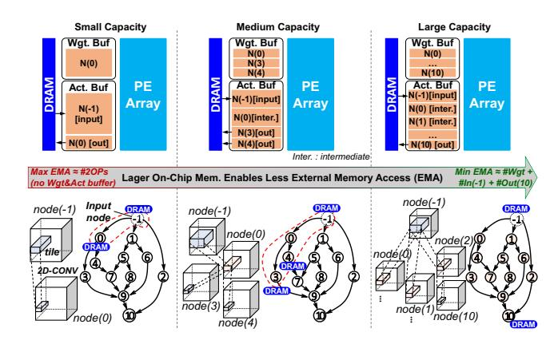
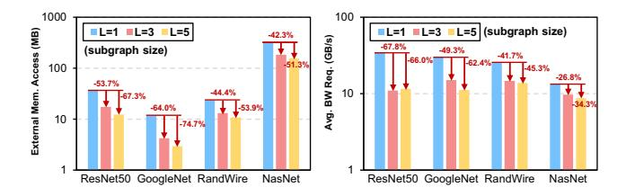
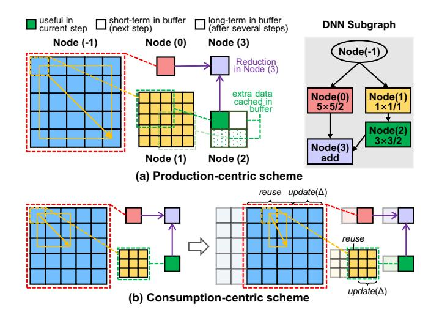
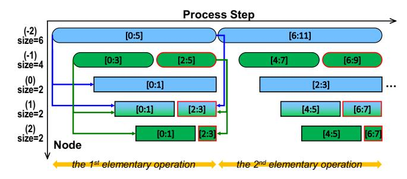

# 1 Introduction

The evolution of neural network topology has driven the remarkable progress of artificial intelligence from the early single-layer perceptron (SLP) [45, 54] and multi-layer perceptron (MLP) [17, 22, 39] to modern DNNs with plain [36, 57]/inception [59]/residual [20, 55] structures based on manual design, and even irregular structures using neural architecture search (NAS) [53, 75] or random network generation [68]. These technological innovations have resulted in increasingly complex computation graphs, which pose challenges for efficient memory design and deployment.

Memory design is crucial in the accelerator system, as it performs data preparation at the start of each processing stage according to the scheduling scheme, determining energy consumption, bandwidth requirements, and area costs. Figure 1 shows the trade-off between the on-chip memory size and the external memory access in DNN accelerators. A smaller on-chip buffer (left side) saves area but requires more data reloading. A larger buffer (right side) can reduce external memory access and save energy and bandwidth but at the cost of increasing the memory overhead. An excessively large SRAM may not be feasible due to the high silicon area cost, typically ranging from 1 to 2 mm2 /MB in 12nm, and the high energy overhead, dozens of times that of a MAC operation for a large SRAM.

Therefore, the key problem is: between the two extremes in Figure 1, how to find an appropriate memory configuration with efficient workload mapping and data management, especially under the growing complexity of neural network architectures.

**Figure 1.** The effect of different memory capacities for a computation graph. Intermediate results can be buffered in the on-chip memory if it is large enough. The on-chip memory of small capacity can only buffer two nodes (marked in the red dotted box), and the larger memory can cover a larger subgraph (right side).

The critical status of memory design has attracted extensive research. Most previous studies focus on simple layer-level optimization (the left one of Figure 1) by applying loop transformation techniques such as tiling and reordering to fit the memory size and reuse the on-chip data [23, 43, 44, 61, 70]. In addition, several works also guide the memory capacity and hierarchy design using designspace exploration [12, 32, 37, 66, 67]. However, these layerlevel optimizations are confined to the limited intra-layer reuse, which is insufficient for memory-intensive networks. A subgraph-level scheme (e.g., the middle one and the right one of Figure 1) provides a larger optimization space via inter-layer reuse [3, 4, 38, 73] to reduce the I/O overhead. Therefore, this paper aims to leverage the subgraph-level computing flow to optimize the memory capacity and external communication for networks with any topology.

However, there are **three primary challenges** to fully exploit the subgraph-level optimization.

First, we need a general execution flow for any sub-graph. Due to the various kernel sizes and strides, a parent node in a subgraph may have unbalanced data requirements from its consumers, which makes it difficult to determine the tensor tiling scheme and the memory allocation for each node (layer). In the traditional single-layer execution, we usually divide a large tensor into loop tiles, which are processed through a series of regular computing steps. Similarly, we want the sub-graph execution to be a series of elementary computing steps with a simple control flow.

Second, we require a suitable memory management method for the subgraph execution. Due to complicated dependency among nodes in a subgraph, careful management is needed to reuse overlapping and inter-layer intermediate data.

Solving these two challenges contributes to a basic hard-ware execution model compatible with subgraph-level optimization. However, we also encounter the third challenge: how to partition a model into subgraphs and how much memory to allocate. The optimization space is huge, so we need to devise a search method with high sampling efficiency to find a proper subgraph partition and memory configuration result

In this paper, we first introduce a complete graph-level scheme for memory. In particular, it contains a consumption-centric flow that enables the execution of arbitrary subgraphs with low memory footprints (*for challenge 1*). Accordingly, we provide an explicit memory dataflow and the corresponding memory management scheme for effective data reuse (*for challenge 2*). Building on the graph-level memory scheme, we propose Cocco, a hardware-mapping co-exploration framework, to establish a connection between model features and the memory configuration (*for challenge 3*).

Cocco aims to find a combination of on-chip buffers and the corresponding graph-level scheduling for lower memory and communication overhead. In particular, we develop a genetic-based algorithm to efficiently explore the search space of graph partitions and the associated memory configuration for a series of neural networks.

In summary, this work makes the following contributions:

- Subgraph execution scheme. We first introduce a consumption-centric flow to determine a low-cost execution sequence by throttling and aligning the dataflow.
- Efficient dataflow and memory management for subgraph data reuse. We propose a memory management scheme featuring multiple reconfigurable regions and the corresponding dataflow to support arbitrary subgraph execution with full data reuse.
- Hardware-mapping co-exploration framework. Based on the subgraph execution scheme and memory dataflow, we propose Cocco, a genetic-based framework combining the graph-level partition and memory design-space exploration together. Cocco achieves 1.89% to 50.33% lower costs (lower communication with a smaller size) using co-exploration in contrast to other methods.

## 2 Background and Motivation

#### 2.1 Design of Neural Network Accelerators

The DNN accelerator unit is the most basic execution unit in a computing system, on top of which, we can scale it out to many-core, many-socket, and many-drawer systems [24, 40, 48, 60]. An accelerator unit usually employs a processing element (PE) array on a sophisticated interconnection network to enable efficient tensor-level computation. Each PE typically contains local scratchpads and ALUs to process basic data packets. The global buffer and the weight buffer store activations and weights, and they are generally

\* Those designs only support INT8 precision for tensor, we scale to FP16 performance by a factor of 0.5
\*\* For most designs fabricated under 12nm (or close to) process, we align all areas to 12nm. The SRAM
area is estimated as 1.2mm2/MAR

**Figure 2.** Left: performance v.s. memory capacity of several industrial NPUs. Right: a summary of SRAM area ratio in these accelerators.

located next to the PE array to serve as the data interface and manage data between the PE array and the external memory (e.g., DRAM or other cores). Due to the limited capacity of the global buffer, the compiler has to partition the network execution into a series of elementary workloads that are scheduled along the parallel spatial resources and the temporal dimension [18, 61, 72]. The capacity of the global buffer usually dominates the external memory access and bandwidth requirements, significantly impacting system performance. If the global memory is larger, it is more likely to buffer more intermediate data and avoid data being evicted to DRAM. As shown in Figure 1, a larger buffer expands the scope of elementary workloads from a single layer to a larger subgraph, reducing the communication overhead.

However, choosing an appropriate memory specification is always a challenge. In Figure 2, we surveyed 16 popular industrial neural network processors with various memory/performance/area characteristics, where nine of them target the training domain [6, 11, 24, 34, 35, 40, 41, 48, 60, 63, 69] and seven target model inference [1, 7, 8, 26–28, 49, 65]. According to the survey, we can observe several trends as follows:

- 1. Memory occupies a significant portion of the silicon footprint on an NPU chip, ranging from 4% to 79% of the area, with capacities from 2.5MB to 896MB.
- 2. Figure 2 Left shows a trend of diminishing marginal benefit of memory capacity. This is because there is a critical capacity to meet the data reuse and bandwidth requirement at the beginning, and the increments become negligible with higher memory capacity.
- 3. We can infer that there is a saturated capacity equivalent to the ideal unlimited memory, especially for the inference design. For example, Hanguang [26] is a special SRAM-only inference system without DDR, and the 394MB buffers are large enough to hold the intermediate data in their scenarios.

**Figure 3.** Evaluations on subgraphs fusing different number of layers (denoted as L=1,3,5). Y-axis is in the log domain. The 2TOPS NPU accelerator is configured with a 1MB global buffer and a 1.125MB weight buffer. The bandwidth requirement of weights is from the prefetch of the next subgraph, while that of activations is from the inputs and outputs of each subgraph.

This survey implies a design trade-off between memory capacity and performance based on workloads and commercial considerations. Motivated by the observations above, this paper aims to provide several memory design considerations and study the connection between workload features and memory capacity in an NPU accelerator.

#### 2.2 Workload Deployment

A neural network is usually executed in a DNN accelerator with layer or graph granularities based on the buffer capacity and dataflow.

**2.2.1 Layer-level Assignment.** This manner assigns tasks layer by layer. Most previous studies employ a tiling-based layer-wise execution manner [10, 21, 30, 37, 50, 61], which elaborates the tiling sizes of tensors to fit in the accelerator buffers and maintain performance. A proper tiling scheme should overlap the data loading latency with the computing time of each tile and try to reduce the repeated access of local weight buffers. Tiles of data are transferred between the external memory and the global buffer, and PEs subsequently fetch data from the global to their local buffers. Given the larger bit-width of partial sums (e.g., 24bit partial sums v.s. 8bit inputs in Simba), the output-centric tiling scheme is more commonly used to calculate the final results before writing back to the global buffer [61].

**2.2.2 Graph-level Assignment.** Unlike the layer-level assignment that restrains from leveraging inter-layer reuse, a graph-level assignment processes several layers of a neural network as a whole. To demonstrate the effectiveness of the layer-level assignment, we evaluate four networks on a 2TOPS accelerator model, as shown in Figure 3. The results show that fusing layers into subgraphs significantly reduces external memory access by  $42.3\% \sim 74.7\%$  and average bandwidth requirements by  $26.8\% \sim 67.8\%$ . However, the improvements of larger subgraphs are marginal, indicating that there is an optimal trade-off between inter-layer

reuse and subgraph size, which determines the memory requirement. For example, executing three-layer subgraphs reduces external memory access by 53.7% in ResNet50, while executing five-layer subgraphs only further reduces it by 13.6%

Several works have studied inter-layer reuse and graph partition. However, they have several limitations in terms of performance and flexibility. LCP [42] groups similar layers into a cluster and executes them as a whole, which makes it challenging to generalize into an arbitrary graph. Fused-CNN [4] and SR-CNN [38] fuse large contiguous layers for plain networks using manually-designed strategies. Irregular-NN [73] attempts to execute a complex subgraph using a DP-based algorithm, but the constrained search space limits the exploration.

To overcome these challenges, we propose an end-to-end framework that automatically optimizes the graph partition and memory configuration for any neural network. Our framework consists of two main components: a graph-level dataflow and a hardware-mapping co-exploration algorithm. We first introduce the graph-level dataflow and its hardware implementation. Then, we present Cocco, an efficient algorithm that explores the trade-offs among memory configurations and graph partition schemes based on workload features.

## 3 The Proposed Graph-Level Scheme

To execute layers on an NPU core in a graph-level manner, we need an effective approach to reuse intermediate data and decide the memory allocation. This section presents our comprehensive scheme for subgraph execution, which addresses the first two challenges mentioned in Section 1. First, we describe a multi-layer execution flow that minimizes the memory footprint by a friendly tiling approach (for challenge 1). Second, we explain how to implement this flow on a real NPU using an efficient data reuse pattern (for challenge 2). The consistent target is to reduce the memory footprint and be friendly to implementation.

#### 3.1 Subgraph execution scheme

It is common practice for the layer-level scheduling to partition the output tensor into several tiles as layer-level elementary operations [56, 61, 72, 74], simplifying the scheduling and instruction generation. Likewise, our high-level idea is also to generate a series of explicit **subgraph-level elementary operations**. However, we need to address the challenges of various kernel sizes and strides in different paths to prevent unbalanced data production and unnecessary memory.

A model's subgraph consists of multiple layers (nodes) with dependencies. Section 4 provides detailed information on subgraph partition. In Figure 4(a), we present a straightforward **production-centric scheme** for executing a subgraph

with different kernel sizes in two branches, deriving tile sizes of the subsequent layers based on the predetermined input tile sizes. For example, we can produce a  $1 \times 1$  tile of Node(0) and a  $2 \times 2$  tile of Node(2) with a given  $5 \times 5$  feature map of input Node(-1). In this case, these intermediate results only reduce to  $1 \times 1$  in Node(3), limited by the smallest input of Node(0), so the remaining results of Node(2) can not be consumed immediately. As shown in Figure 4, three extra data of Node(2) along with sixteen extra source data of Node(1) take up extra memory space. There are more redundant cached data when the subgraph becomes larger and more complicated. Disadvantages of this manner are attributed to the production-centric idea that consumes all related activations from the producers at once.

To avoid the memory overhead of storing unused data, we propose a **consumption-centric scheme** in Figure 4(b), where results of each node are *produced on demand based on consumer(s)* (i.e., output node(s)). For example, given a  $1 \times 1$  tile of Node(3), we derive the  $1 \times 1$  tile size for Node(2), which subsequently decides a  $3 \times 3$  tile for Node(1).

The backward-derivation for each producer node is non-trivial because of diverse kernel sizes and strides in different paths. Therefore, we propose a three-stage flow to determine the behavior of each node, as illustrated in Figure 5. The high-level idea is to let output nodes drive the whole execution and match the data consumption and production in each subgraph-level elementary operation.

The stage-1 is similar to the traditional single-layer scheduling, where the tile size is optimized for higher computation utilization. In order to hold a larger subgraph, the tile size

**Figure 4.** A conceptual comparison between two manners to process a subgraph. The node marked with a negative number represents the input node. The corresponding subgraph is shown in the upper right, where  $F \times F/s$  refers to the convolution kernel size (F) and stride (s).

**Figure 5.** The flow to determine the execution scheme of a subgraph (i.e., the computed tile size of each node, the tile offset, and the processing sequence of nodes). For simplicity, we discuss the 1D-CONV in this example and it is similar in the 2D-CONV case.

tends to be smaller. In the 1D-CONV example, we set the tile size to be 2 for output nodes.

The stage-2 aims to determine the data update offset  $\Delta$  and the memory allocation size x for each node based on the consumer(s), processing in the reverse topological order. We use the least common multiply (LCM) operation to determine  $\Delta^{(u)}$  of producers for aligning different input offset requirements  $(\Delta^{(v)}s^{(v)})$  from consumers. Hence, one producer update may correspond to multiple updates of a consumer. For example,  $\Delta^{(-2)} = \text{lcm}\{\Delta^{(0)}s^{(0)}, \Delta^{(1)}s^{(1)}\} = 4 = 2\Delta^{(1)}s^{(1)}$ , one update of Node(-2) corresponds to two updates of Node(1). As for the tile size deduction,  $f_v(\Delta^{(u)}/s^{(v)})$  is to derive the required input tile size  $\chi^{(u,v)}$  for output node  $v^1$ , where  $\Delta^{(u)}/s^{(v)}$  is the consumer offset (updated data) per producer u update. The maximum result  $\chi^{(u,v)}$  of all outputs v is the tile size  $\chi^{(u)}$  of input node u. In this example,  $\chi^{(-2)} = \max\{f_0(2), f_1(4)\} = 6$  and  $\chi^{(-1)} = \max\{f_1(2), f_2(2)\} = 4$ .

As mentioned above, since we use LCM to align production and consumption, one producer update may correspond to multiple updates of a consumer. In **the stage-3**, we use  $upd\_num$  to represent the number of memory update per subgraph elementary operation. The generated result of the example in Figure 5 is shown in Figure 6.  $upd\_num$  of Node(-1), Node(1), and Node(2) are two, where the second updates are highlighted in red boxes. Note that the  $\{upd\_num^{(-2)}, \ldots, upd\_num^{(2)}\}$  solution is not unique, but the unique co-prime one  $\{1, 2, 1, 2, 2\}$  corresponds to the minimal elementary operation.

**Figure 6.** The memory snapshot during two subgraph elementary operations based on the execution scheme of Figure 5 example. The allocated memory size and update offset correspond to x and  $\Delta$ , respectively (the [m:n] notation denotes data ranging from index m to n). The arrows denote the data dependency according to the node relation in the subgraph.

The proposed flow is based on a general directed acyclic computation graph and is not limited to specific layer features. In this way, we can determine the execution scheme for any complex irregular network like NasNet [75] and RandWire [68].

