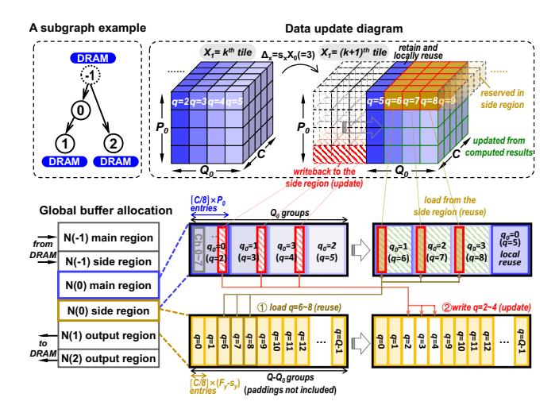

# 4 Memory Communication-Capacity Co-Exploration

The aforementioned hardware model enables arbitrary subgraph execution, but there is always limited buffer capacity

**Figure 7.** Memory allocation and data update scheme in the global buffer for full data reuse. The data layout used in our implementation is NWHC8c (aligned to 8 channels), which can be changed in another design.  $P_0$  and  $Q_0$  are the height and width of an input tile; C is the input channel size; Q is the global width-dimension index of the input tensor; and  $Q_0$  is the width-dimension index of an input tile.

**Figure 8.** Hardware implementation with the buffer region manager in our 12nm NPU as a demonstration. The layout is an NPU core extracted from part of our in-house chip.

in hardware. Therefore, we need to partition the whole computation graph into a series of subgraphs that fit the memory. Below, we move up to the optimization for graph partition and memory design-space exploration for challenge 3.

#### 4.1 Problem Formulation

**4.1.1 Graph-Level Partition.** Formally, a DNN model can be represented as a *computation graph* G = (V, E), where V is the vertex set consisting of all the layers in a DNN model, and E is the edge set that defines the structure of DNN. In particular, an edge  $(u, v) \in E$  represents that the output of layer u is an input of layer v.

We aim to find a *partition scheme*  $P:V\to\mathbb{N}$  that assigns each layer to a subgraph, where layer  $v\in V$  is computed in the P(v)-th subgraph. A valid partition scheme should satisfy that any layer is computed before use. Therefore, for any  $(u,v)\in E$ , we have  $P(u)\leq P(v)$ . Moreover, any subgraph should be connected in G, otherwise meaningless.

We cast the partition exploration as an optimization problem. The objective is to find a valid partition scheme *P* that minimizes the total cost:

$$\sum_{i} Cost_{M}(\{v \in V \mid P(v) = i\}), \tag{1}$$

where  $Cost_M$  is a cost function of a given subgraph based on a target metric M (e.g., external memory access (EMA) and energy). For each subgraph, the EMA cost contains the loading of weights and input activations and the storage of output activations3. The energy cost includes the overhead of EMA, on-chip buffers, and computation units.

**4.1.2 Design-Space Exploration (DSE).** Our work further extends the optimization to combine with the memory design-space exploration. In this paper, we focus on the global buffer and the weight buffer, given that they dominate

&lt;sup>3The nodes that are required to write-back to DRAM can be the model output layer or the layers required by the future subgraph.

the overhead of energy and area in an NPU core. As illustrated in Figure 1, a larger buffer capacity can take in more layers inside a subgraph, reducing communication costs but compromising the silicon area. To co-explore the hardware configuration and mapping, we construct an objective function by a linear combination of the hardware and mapping costs:

BUF\_SIZE + 
$$\alpha \cdot \sum_{i} Cost_{M}(\{v \in V \mid P(v) = i\}),$$
 (2)

where  $\alpha$  is a preference hyper-parameter to adjust the proportion between two costs.

#### 4.2 Baseline Methods

Several optimization methods that exist today can perform graph-level partition. However, most of them fail to directly co-explore hardware and partition. Below, we list four typical methods as our baselines and sketch their features.

**4.2.1** Enumeration-based Algorithm. Fused-CNN [4] applies a straightforward way to enumerate all possible partition schemes and return the best one. Jangda *et al.* [25] proposed state compression dynamic programming to speed up the enumeration-based algorithm. We migrate their methods as our baseline and further improve them by only recording one subgraph in the state to reduce the time complexity.

Nonetheless, there are still exponential states in the improved implementation. Let N be the number of nodes in a graph, and the enumeration-based method may explore up to  $O(2^{2N})$  states for irregular networks. Consequently, the search is hard to complete within a reasonable search time for large-scale networks, not to mention the co-exploration with DSE.

**4.2.2 Greedy Algorithm.** Halide [47] employs a greedy algorithm to perform function grouping, which can be applied to the graph-level partition. Specifically, it first assigns each layer into a single-layer subgraph. Then it iteratively fuses a pair of subgraphs contributing the greatest benefit until all benefits are negative.

Therefore, this algorithm tends to be trapped at the local minimum. Moreover, since the fusion decision rules are based on a given hardware, the greedy method cannot co-explore with DSE.

