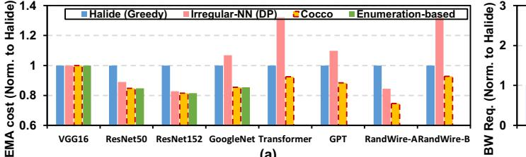
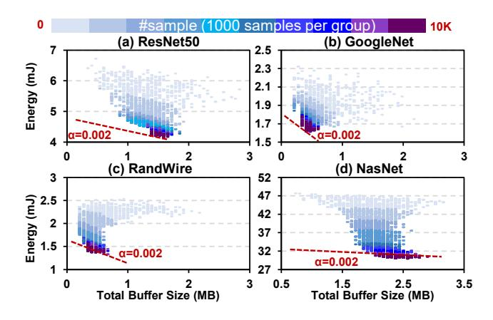

# 4.2.3 Dynamic Programming (DP)-based Algorithm.

For the irregular network scheduling problem, Zheng *et al.* [73] proposed a DP-based algorithm. They arrange the layers based on their depth and perform DP in a sequential manner.

This method is restricted to assigning layers that are contiguous in the depth order into a subgraph, hence the exploration is confined to constrained search space. It is unlikely to find the global optimum, especially for non-plain network

structures. In addition, since the state transition of DP depends on the predefined buffer size, it is also tough to carry out co-exploration.

**4.2.4 Simulated Annealing (SA).** SA [33] is a popular optimization algorithm that samples a point and updates it iteratively to improve. It adopts the new sample points with a probability affected by the performance difference and a hyper-parameter named temperature. We employ the customized mutation operations (described in Section 4.4.3) to update the sample points and implement an SA-based algorithm as a baseline.

SA is an alternative optimization method for our framework with compatible operators, but it is not stable as the genetic algorithm in a range of benchmarks, which will be shown in later experiments.

#### 4.3 Genetic Algorithm

Previous research shows competitive performance of the Genetic Algorithm (GA) in several scheduling optimization problems [30, 31]. We summarize several benefits of GA for our hardware-mapping co-exploration problem:

- White-box property: We can track and tune its optimization process conveniently. Therefore, it is easy and intuitive to understand.
- 2. **Complete search space:** It has the potential to explore the complete search space by customized mutation and crossover operations.
- 3. **Avoid local optima:** In contrast to the greedy algorithm, GA can naturally jump out of the local minimum benefiting from the diversity of the population.
- 4. **Flexible initialization:** We can use the results of other optimization algorithms to initialize GA and use GA to finetune the result.
- Co-exploration: Through the proposed GA operations and genome encoding, it can further support partition-DSE co-exploration.

We encode each candidate solution (partition scheme and the corresponding memory configuration for our problem) as a *genome*, and the *population* contains a set of genomes. The GA goes through a series of *generations* to obtain a lower cost. It performs the *crossover* and *mutation* operations on the population in each generation. Specifically, a crossover operation blends two genomes selected from the population to generate one offspring while a mutation operation modifies a genome randomly. At the end of each generation, the evaluation environment evaluates the *fitness* of each genome, and the population in the new generation is selected based on the fitness results.

#### 4.4 Cocco Optimization Framework

Cocco is a GA-based optimization framework that enables the co-exploration of memory configuration and graph-level partition, as shown in Figure 10. The core of Cocco is a

Figure 9. Illustration of crossover and mutation operations in Cocco.

series of operations that explore a complete search space. We build a genetic algorithm based on these customized operations. Fed with the neural network structure and DSE requirements, Cocco goes through several steps to get the optimization results. The execution model described in Section 3 is embedded in the evaluation environment. In the following, we introduce the five stages of Cocco.

- **4.4.1 Initialization.** The first step in Cocco is to generate the initial population, where each genome contains a partition scheme of the computation graph and a memory configuration for DSE. For the DSE part, every genome selects a capacity value in a given range following a uniform distribution. There are two options in Cocco to initialize the partition scheme P of each genome. The first option is random initialization. Precisely, we determine the P(v) for each layer  $v \in V$  in topological order, and each P(v) is selected randomly within the valid range. The other option is to initialize the partition scheme from other optimization algorithms.
- **4.4.2** Crossover. We designed a customized crossover operation to inherit and blend the features of two parents selected from the population. Specifically, each hardware configuration (i.e., memory capacity) in the offspring is the average of its parents and then rounds to the nearest candidate value. For the partition scheme, we assign layers to subgraphs in topological order. Each undecided layer chooses one parent randomly to reproduce the corresponding subgraph. If the reproduced subgraph contains layers that have been decided, we split out a new one excluding those layers, or merge it with one of the subgraphs to which the decided layers belong.

As shown in Figure 9(b), layer 1 and layer 3 select Dad as the parent to reproduce the subgraphs  $\{1, 2\}$  and  $\{3, 4\}$ , respectively. Next, layer 5 selects Mom as its parent, so it

Figure 10. Cocco framework overview.

intends to reproduce subgraph {4, 5, 6}. However, since we have already decided on layer 4 in subgraph {3, 4}, there are two alternatives: creating a new subgraph {5, 6} (Child-1) or merging with subgraph {3, 4} to obtain {3, 4, 5, 6} (Child-2).

**4.4.3 Mutation.** Four mutation operations are customized for the optimization flow to explore the search space extensively. We guarantee the validity of genomes after each mutation in the implementation. At the bottom of Figure 9,

we show a node-level operation (modify-node) and two subgraph-level ones (split-subgraph and merge-subgraph):

- modify-node (Figure 9(c)): Modify the assignment of a randomly selected node *u*: from *u* → *P(u)* to *u* → *P'(u)*, where *P'(u)* can be an existed subgraph or a new one.
- split-subgraph (Figure 9(d)): Split a randomly selected subgraph into two or more subgraphs.
- merge-subgraph (Figure 9(e)): Merge two randomly selected subgraphs into one subgraph.
- mutation-DSE (not shown): Modify the memory configuration to a random one within the range. The new values are sampled based on a normal distribution, where the average is the original value, and the variance is a hyper-parameter.

**4.4.4 Evaluation.** Since GA tries to maximize the fitness of the genomes, we set fitness to be the opposite of the cost (e.g., Formula 1 and 2). To evaluate the fitness of each genome in the population, we use our simulator (introduced in the next section) to extract the execution costs of subgraphs (e.g., EMA and energy).

During the evaluation, the simulator decodes the subgraph and hardware configuration of each genome and calculates the fitness by aggregating the cost of each subgraph. Particularly, when a large subgraph exceeds the buffer capacity, we perform the split-subgraph operation to ensure genome validity. This kind of in-situ tuning can increase the number of valid samples during the optimization operations and thus, improve the sample efficiency.

**4.4.5 Selection.** At the end of each generation, Cocco performs the tournament selection. Specifically, it holds multiple tournaments among a few randomly selected genomes, and the winners (the genome with the best fitness) of these tournaments form the population of a new generation. This operation facilitates superior fitness in the new generation. The number of genomes in each tournament is decided by a hyper-parameter. The new generation subsequently starts from the crossover step again.

#### 5 Experiments

In the evaluations, we first present the superiority of Cocco for the graph partition; and then demonstrate its outstanding stability and sample efficiency of the co-exploration for the hardware optimization, followed by additional discussions about the results under different configurations.

#### 5.1 Methodology

**5.1.1 Evaluated Models.** In the following evaluations, we consider three types of model structures: plain (VGG16 [57]), multi-branch (ResNet50, ResNet152 [20], GoogleNet [59], Transformer [64], and GPT [52]), and irregular structure (RandWire-A/B [68] and NasNet [75]). RandWire-A/B are

generated based on the small and regular regime configurations introduced in the paper [68]. FC layers are transformed to 1×1 CONV while pooling and element-wise layers are analyzed as depth-wise CONV without weights. The scalar operations (e.g., activation function) are hidden in the pipeline (e.g., the post-process module following PE in Simba [56]) and their overhead can be ignored.

**5.1.2** Accelerator Platform. As shown at the top of Figure 10, we consider a SIMBA-like hierarchical accelerator with a global buffer, a weight buffer, and a 4×4 PE array in each core used in several previous works [56, 61, 71]. Each PE contains an 8×8 MAC array to process a sub-tile from the global buffer. In particular, we model the execution flow based on the scheme described in Section 3. The parallelism of two dimensions of the PE array can be dynamically configured by the mapper results to ensure high utilization. We schedule subgraphs in topological order and prefetch weights of the next subgraph during the current computing. We also extend our platform to support fundamental multi-core studies by interconnecting cores with a crossbar. They share weights to release the burden of each core.

The arithmetic and memory overhead is extracted in a 12nm library based on the synthesized RTL implementations (SRAM based on the ARM memory compiler) with 1GHz. The DRAM energy is set as 12.5pJ/bit [70]. The extra footprint of the plug-in design is mainly a 272-Byte register file to store the head and end logical region addresses of maximal 64 nodes, which is negligible. Based on off-the-shelf evaluators Timeloop [50] and MAESTRO [37] for spatial accelerators, we developed a modified simulator that supports the evaluation of latency and energy. It employs the consumption-centric scheme to determine the tile size of each layer, and the memory access in the model is free from padding data. The latency per subgraph depends on the maximum of the calculation and external communication cycles. We allocate 16GB/s DRAM bandwidth per accelerator core for loading weights and input activations and writing back data for subsequent subgraphs. The off-chip communication consists of weight loading of each layer and the inputs and outputs of each subgraph. As described in Section 3, our subgraph execution scheme avoids recomputing of intermediate outputs.

**5.1.3 Baselines.** Three optimization baselines for graph partition are the greedy algorithm used in Halide [47], dynamic programming (DP) used in Irregular-NN [73], and the enumeration-based method as a reference.

For the DSE studies, we compare Cocco with simulated annealing (SA) [33] to demonstrate the better stability of GA. These two methods are both the co-optimization scheme that optimizes partition and hardware settings at the same time. In contrast to co-optimization, the two-step scheme is another method for design-space exploration. Specifically, we

Figure 11. The evaluation results for graph partition using the EMA-opt configuration (EMA as the optimization metric). The enumeration-based method is deterministic, which figures out the optimal solution as a reference in the first four models. It cannot complete for large-scale models (Transformer, GPT, RandWire-A, and RandWire-B) in a reasonable time because of the exponential search space.

use random search (RS) or grid search (GS) to sample memory capacity candidates and then explore the corresponding partition schemes. During the search, we evaluate 5,000 samples for each capacity candidate and keep the best candidate as the output. As for the sampling method, RS randomly samples memory capacity candidates while GS uses a coarser granularity to enumerate the candidates.

### 5.2 Graph Partition Evaluations

We start by presenting the partition performance on the single-core hardware with a 1MB global buffer and a 1.125MB weight buffer. The number of samples in Cocco is set to be 400,000. We evaluate the external memory access (EMA) and bandwidth requirements of eight models shown in Figure 11, where the results are normalized to the Halide baseline. This experiment aims to validate the effectiveness of our Cocco framework in graph partition. For networks with simpler structures, Cocco can find out the optimal solutions same as the enumeration-based results. For large-scale irregular networks (Transformer, GPT, RandWire-A, and RandWire-B), the enumeration-based method cannot complete in a reasonable time, while Cocco provides better solutions than Halide and DP. A better subgraph partition strategy helps to ease the communication burden, thus reducing the EMA cost and bandwidth requirements.

#### 5.3 Hardware-Mapping Co-Exploration

After learning the superiority of Cocco for the graph partition, we further co-explore the memory configuration and graph partition mapping as the core study of this work. Three categories of exploration methods are used, including the fixed hardware scheme, the two-step scheme as baselines, and the proposed co-optimization scheme. We set three fixed memory configurations with Small capacity, Medium capacity, and Large capacity, followed by a partition-only procedure. The two-step scheme is implemented with decoupled steps for capacity search (RS or GS) and partition (GA). The cooptimization methods include the proposed Cocco and an SA-based one as the comparison. All methods sample up to

Table 1. Hardware-mapping co-exploration for separate buffer. In this table, A refers to the global buffer, and W refers to the weight buffer. We evaluate the cost using Formula 2 (the lower cost, the better), where the metric is energy. We use RandWire-A as RandWire in the following experiments.

| Optimization |        | ResNet50      |                   |        | GoogleNet |                   |        |  |
|--------------|--------|---------------|-------------------|--------|-----------|-------------------|--------|--|
|              |        |               | Size (A) Size (W) | Cost   |           | Size (A) Size (W) | Cost   |  |
| Fixed HW  | Buf(S) | 512KB         | 576KB             | 1.04E7 | 512KB     | 576KB             | 4.07E6 |  |
|              |        | Buf(M) 1024KB | 1152KB            | 1.07E7 | 1024KB    | 1152KB            | 5.06E6 |  |
|              | Buf(L) | 2048KB        | 2304KB            | 1.24E7 | 2048KB    | 2304KB            | 7.18E6 |  |
|              | RS+GA  | 448KB         | 864KB             | 1.04E7 | 384KB     | 432KB             | 3.88E6 |  |
| Two-Step     | GS+GA  | 128KB         | 864KB             | 1.07E7 | 128KB     | 144KB             | 3.80E6 |  |
|              | SA     | 256KB         | 360KB             | 1.06E7 | 192KB     | 144KB             | 3.78E6 |  |
| Co-Opt       | Cocco  | 704KB         | 864KB             | 1.04E7 | 192KB     | 432KB             | 3.75E6 |  |
|              |        | RandWire      |                   |        |           |                   |        |  |
|              |        |               |                   |        |           | NasNet            |        |  |
| Optimization |        |               | Size (A) Size (W) | Cost   |           | Size (A) Size (W) | Cost   |  |
|              | Buf(S) | 512KB         | 576KB             | 3.23E6 | 512KB     | 576KB             | 6.14E7 |  |
| Fixed        |        | Buf(M) 1024KB | 1152KB            | 3.92E6 | 1024KB    | 1152KB            | 5.83E7 |  |
| HW           | Buf(L) | 2048KB        | 2304KB            | 6.00E6 | 2048KB    | 2304KB            | 5.66E7 |  |
|              | RS+GA  | 448KB         | 792KB             | 3.31E6 | 1152KB    | 2016KB            | 5.60E7 |  |
| Two-Step     | GS+GA  | 128KB         | 144KB             | 3.02E6 | 2048KB    | 2304KB            | 5.66E7 |  |
| Co-Opt       | SA     | 192KB         | 144KB             | 3.00E6 | 2048KB    | 1872KB            | 5.61E7 |  |

50,000 points. The energy-capacity co-optimization is used in the following evaluations.

#### 5.3.1 DSE analysis using separate and shared buffer.

We first perform the hardware-mapping co-exploration to determine the suitable memory configuration (except for the fixed-HW scheme) with = 0.0024 and then solely execute the partition-only Cocco to obtain the final cost. In particular, we also compared the results using two memory designs: separate buffer and shared buffer. For the separate buffer design, activations and weights are stored in different buffers while they share the same space in the shared buffer design. The memory capacity candidates for the global buffer

4The energy and the capacity units are pJ and Byte, respectively.

**Table 2.** Hardware-mapping co-exploration for shared buffer. We evaluate the cost using Formula 2 (the lower cost, the better), where the metric M is energy.

| Optimization |                            | ResN                                   | let50                                        | GoogleNet                               |                                              |  |
|--------------|----------------------------|----------------------------------------|----------------------------------------------|-----------------------------------------|----------------------------------------------|--|
|              |                            | Size                                   | Cost                                         | Size                                    | Cost                                         |  |
|              | Buf(S)                     | 576KB                                  | 1.01E7                                       | 576KB                                   | 3.66E6                                       |  |
| Fixed HW  | Buf(M)                     | 1152KB                                 | 1.00E7                                       | 1152KB                                  | 4.04E6                                       |  |
| 11 44        | Buf(L)                     | 2304KB                                 | 1.04E7                                       | 2304KB                                  | 5.09E6                                       |  |
| 7F 04        | RS+GA                      | 1280KB                                 | 0.98E7                                       | 640KB                                   | 3.65E6                                       |  |
| Two-Step     | GS+GA                      | 1344KB                                 | 0.98E7                                       | 512KB                                   | 3.65E6                                       |  |
|              | SA                         | 896KB                                  | 1.00E7                                       | 192KB                                   | 3.75E6                                       |  |
| Co-Opt       | Cocco                      | 1344KB                                 | 0.98E7                                       | 384KB                                   | 3.60E6                                       |  |
|              |                            |                                        |                                              |                                         |                                              |  |
| 0 11 1       |                            | Rand                                   | Wire                                         | NasN                                    | let                                          |  |
| Optimiz      | zation                     | Rand                                   | Wire Cost                                 | NasN Size                            | Tet Cost                                  |  |
|              | zation Buf(S)              |                                        |                                              |                                         |                                              |  |
| Fixed        |                            | Size                                   | Cost                                         | Size                                    | Cost                                         |  |
|              | Buf(S)                     | Size 576KB                             | Cost 2.83E6                                  | Size 576KB                              | Cost 6.36E7                                  |  |
| Fixed HW  | Buf(S) Buf(M)              | Size   576KB   1152KB                  | Cost 2.83E6 3.03E6                     | Size   576KB   1152KB                   | Cost 6.36E7 5.73E7                     |  |
| Fixed        | Buf(S) Buf(M) Buf(L)       | Size   576KB   1152KB   2304KB         | Cost 2.83E6 3.03E6 3.90E6           | Size   576KB   1152KB   2304KB          | Cost 6.36E7 5.73E7 5.51E7           |  |
| Fixed HW  | Buf(S) Buf(M) Buf(L) RS+GA | Size   576KB   1152KB   2304KB   320KB | Cost 2.83E6 3.03E6 3.90E6 2.85E6 | Size   576KB   1152KB   2304KB   2560KB | Cost 6.36E7 5.73E7 5.51E7 5.47E7 |  |

(for activations) range from 128KB to 2048KB with a 64KB interval, while that for the weight buffer range from 144KB to 2304KB with a 72KB interval. The exploration range of the shared buffer is from 128KB to 3072KB with an interval of 64KB.

The evaluation using separate buffers is shown in Table 1, where Cocco achieves better optimization with up to 1.89% (compared to SA in ResNet50) to 50.33% (compared to Fixed-HW(L) in RandWire) lower cost compared to various baselines across four models. The two-step scheme fails to combine the information between different sizes, so it is generally worse than the co-optimization method.

The capacity results also reflect the inherent capacity preference of different models. The data amount in GoogleNet and RandWire is relatively smaller, and thus their capacity requirements are lower. In contrast, the data amount in NasNet is larger, so a high capacity is preferred.

As shown in Table 2, the evaluation of the shared buffer setting shows a similar trend. Furthermore, we can observe that most of the cost results of the shared buffer are lower than those using the separate configuration. Although the shared buffer design requires additional control flows, it indeed improves efficiency than the separate buffer design.

**5.3.2 Sample efficiency analysis.** We next study the sample efficiency of the two-step and the co-optimization scheme in Figure 12. We record the cost trends of the first 50,000 samples on ResNet50, GoogleNet, and RandWire during the exploration. Overall, Cocco shows a consistent convergence trend on these three networks. And it converges faster and

**Figure 12.** The convergence curve of Cocco compared with other baselines in the hardware-mapping co-explorations. The optimization method requiring fewer samples in (d) has higher sample efficiency.

**Figure 13.** The visualization of sample points distribution during optimization. The slope of the red dashed line denotes the preference between energy and capacity cost. The point on the line with a lower intercept has a smaller cost.

achieves lower costs compared to other baselines, exhibiting a higher sample efficiency. The two-step methods perform graph-partition separately under different capacities, so they fail to utilize the partition information between capacities. Particularly, the GS method uses a deterministic search direction (search from large to small capacity in this experiment), so the convergence time depends on the optimal capacity. Since GoogleNet and RandWire require relatively small buffers, GS takes a considerable number of samples to converge.

**5.3.3 Optimization procedure analysis.** We next study how the distribution of sample points changes during the optimization procedure of Cocco. While searching for 20 generations with 500 genomes each, we divided them into ten groups with different colors in Figure 13. The results show that the distribution moves towards a lower intercept

**Figure 14.** The trade-off between energy and memory capacity. The optimization target is to minimize the cost defined in Formula 2, where the metric M is energy. Energy results of each model are normalized to the first  $\alpha$  (= 0.0005) results.

**Table 3.** Multi-core and batch evaluation using the energy-capacity co-opt configuration. Size denotes the shared buffer size in each core.

| Core# |               | ResNet50                                               |                                               |                                          | GoogleNet                                            |                                                      |                                              |  |
|-------|---------------|--------------------------------------------------------|-----------------------------------------------|------------------------------------------|------------------------------------------------------|------------------------------------------------------|----------------------------------------------|--|
|       | Batch         | Energy(mJ)                                             | Lat.(ms)                                      | Size(KB)                                 | Energy(mJ)                                           | Lat.(ms)                                             | Size(KB)                                     |  |
|       | 1             | 4.21                                                   | 4.59                                          | 1344                                     | 1.61                                                 | 2.05                                                 | 384                                          |  |
| 1     | 2             | 6.32                                                   | 8.98                                          | 1728                                     | 2.18                                                 | 3.91                                                 | 896                                          |  |
|       | 8             | 11.88                                                  | 35.93                                         | 2880                                     | 5.64                                                 | 15.53                                                | 1472                                         |  |
|       | 1             | 4.38                                                   | 2.48                                          | 768                                      | 1.66                                                 | 1.04                                                 | 192                                          |  |
| 2     | 2             | 6.46                                                   | 4.78                                          | 1088                                     | 2.34                                                 | 1.99                                                 | 384                                          |  |
| į     | 8             | 13.01                                                  | 19.12                                         | 1664                                     | 5.84                                                 | 7.97                                                 | 960                                          |  |
|       | 1             | 4.29                                                   | 1.39                                          | 448                                      | 1.34                                                 | 0.54                                                 | 192                                          |  |
| 4     | 2             | 6.58                                                   | 2.68                                          | 640                                      | 2.20                                                 | 1.07                                                 | 192                                          |  |
|       | 8             | 11.50                                                  | 10.71                                         | 1664                                     | 6.24                                                 | 4.30                                                 | 448                                          |  |
| Core# | Batch         | RandWire                                               |                                               |                                          | NasNet                                               |                                                      |                                              |  |
|       |               |                                                        |                                               |                                          |                                                      |                                                      |                                              |  |
|       | Batch         | Energy(mJ)                                             | Lat.(ms)                                      | Size(KB)                                 | Energy(mJ)                                           | Lat.(ms)                                             | Size(KB)                                     |  |
|       | 1             | Energy(mJ)                                             | Lat.(ms)                                      | Size(KB)                                 | Energy(mJ)                                           | Lat.(ms) 49.92                                    | Size(KB) 2624                             |  |
| 1     | <u> </u>      |                                                        | ` '                                           | • '                                      |                                                      | . ,                                                  |                                              |  |
| 1     | 1             | 1.26                                                   | 1.47                                          | 384                                      | 28.57                                                | 49.92                                                | 2624                                         |  |
| 1     | 1 2           | 1.26                                                   | 1.47                                          | 384 704                               | 28.57 47.68                                       | 49.92 99.87                                       | 2624 3072                                 |  |
| 12    | 1 2 8         | 1.26   2.25   8.66                               | 1.47 2.74 10.85                         | 384 704 1664                       | 28.57 47.68 133.03                             | 49.92 99.87 396.90                             | 2624 3072 3072                         |  |
|       | 1   2   8   1 | 1.26   2.25   8.66   1.41                     | 1.47 2.74 10.85 0.95                 | 384 704 1664 192                | 28.57 47.68 133.03 29.18                    | 49.92 99.87 396.90 24.93                    | 2624 3072 3072 1728                 |  |
|       | 1             | 1.26   2.25   8.66   1.41   2.37           | 1.47 2.74 10.85 0.95 1.80         | 384 704 1664 192 384         | 28.57 47.68 133.03 29.18 48.80           | 49.92 99.87 396.90 24.93 49.73           | 2624 3072 3072 1728 2624         |  |
|       | 1             | 1.26   2.25   8.66   1.41   2.37   8.39 | 1.47 2.74 10.85 0.95 1.80 7.16 | 384 704 1664 192 384 1280 | 28.57 47.68 133.03 29.18 48.80 153.25 | 49.92 99.87 396.90 24.93 49.73 227.19 | 2624 3072 3072 1728 2624 3072 |  |

of the  $\alpha$ -slope line and gets more centralized in the later generations during the optimization process of Cocco.

#### 5.4 Sensitivity Study about Cocco framework

**5.4.1 Study of**  $\alpha$  **in the cost function.** The results shown in Figure 14 demonstrate the effectiveness of  $\alpha$  in adjusting the preference between the memory capacity and the given metric (energy is used here). The optimization trades the memory capacity for lower energy cost with the increase of  $\alpha$ . In addition, a larger memory capacity indeed contributes to lower energy, but the yields show differences because of their various model-inherent graph and layer patterns. For example, NasNet is more memory-intensive and more structure-complex than the other three models, so it requires a larger memory capacity for less energy consumption.

