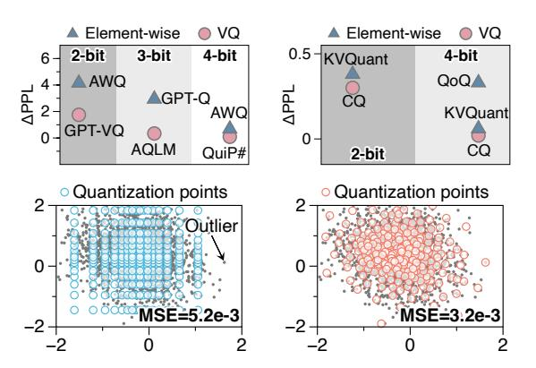

# *A. Vector Quantization (VQ)*

Compared to traditional quantization, vector quantization (VQ) treats the vector of multiple elements as a unit and uses trained quantization points organized into codebooks to quantize the vector into a single element, rather than in an element-wise manner as in traditional quantization. This technique is widely used in vector database, nearest neighbor search, etc. [29], [34] VQ has several configurable parameters, highlighted in Fig. 1, which allow it to be specified for product quantization (PQ), additive quantization (AQ), and hybrid quantization (PRQ) [4], [11], [17], [25]. Apart from these, there are other techniques such as hash-based [23] and lattice-based methods [2]. However, these techniques either cannot reconstruct the original data or need to be used in conjunction with PQ, AQ, and PRQ. Therefore, we do not delve into these techniques as they do not influence the core findings and insights of this work.

Typical VO Pipeline. We use the example in Fig. 1 to demonstrate the typical VQ pipeline, and numbers in (·) represent the value of parameters in this example. We also summarize the VQ parameters in Tbl. I. First, the original 16dimensional vectors are split into four sets of vector size (4)dimensional sub-vectors. Next, we collect sub-vectors in one sub-space (or several sub-spaces, depending on algorithms) and conduct k-means clustering to group these sub-vectors into #Entry (4) clusters. The original sub-vectors are then replaced with the index of their closest cluster centroids, using log2#Entry (2) bits. Next, we collect the differences between the original sub-vectors and their closest cluster centroids as the residuals. We then perform another round of k-means clustering and replace the residual sub-vectors with the index of the closest centroids of the new clusters. This process of residual quantization can be repeated, as determined by the Residual (2) parameter. The quantization process is now complete, as shown in the upper part of Fig. 1. We then gather all the aforementioned cluster centroids and organize them into codebooks. In the following sections, we refer to these centroids as codebook entries.

To reconstruct the original data, a dequantization process is required, as shown in the lower part of Fig. 1. For each residual, we use its quantized data to look up the corresponding codebooks and find the codebook entry indexed by the quantized data in each sub-space. We then gather the results from the same sub-spaces across different residuals, typically via element-wise accumulation. Finally, we concatenate the results from all sub-spaces. Throughout the entire process, *vector size*, *#Entry*, and *Residual* are configurable. These configurations are annotated with  $\mathbf{x}$ ,  $\mathbf{y}$ ,  $\mathbf{z}$ , in the format of  $\mathbf{VQ} < \mathbf{x}$ ,  $\mathbf{y}$ ,  $\mathbf{z} >$ . In this example, the configuration is  $\mathbf{VQ} < \mathbf{4}$ ,  $\mathbf{2}$ ,  $\mathbf{2} >$ .

## B. Large Language Models (LLMs)

LLMs adopt the Transformer architecture [58], which is pivotal in processing and generating natural language in sequences of tokens. The core of the Transformer architecture is multi-head attention (MHA), designed to run several parallel attention processes, allowing the model to simultanesly focus on different types of information from a single input sequence.

TABLE I PARAMETERS OF VQ ALGORITHMS

| Item        | Description                               | Value in Sec. III |
|-------------|-------------------------------------------|-------------------|
| Vector size | Number of elements to quantize at once    | 4                 |
| #Entry      | Number of quantization points (entries)   | 2 8    |
| Residual    | Number of times to quantize residual data | 1                 |

Fig. 2. (Upper) Accuracy of VQ and element-wise quantization, left is weight and right is KV cache quantization. (Lower) VQ (right) can better capture the distribution of data than element-wise quantization (left), with inter-dimensions information.

Each head in MHA can be thought of as an independent attention layer with its own learnable parameters. Outputs of these heads are then concatenated and fed to subsequent operations. Mathematically, MHA can be described as follows:

$$\begin{aligned} \text{MultiHead}(Q,K,V) &= \text{Concat}(\text{head}_1,\dots,\text{head}_h)W^O, \\ \text{head}_i &= \text{Attention}(Q = HW_i^Q,K = HW_i^K,V = HW_i^V), \\ \text{Attention}(Q,K,V) &= \text{softmax}(QK^T/\sqrt{d_k})V. \end{aligned}$$

Here,  $W_i^Q$ ,  $W_i^K$ ,  $W_i^V$ , and  $W^O$  are parameter matrices for the i-th head and the output projection, respectively. And H is the hidden state. The softmax function is applied over the keys to normalize their weights, ensuring that the output is a weighted sum of the values based on the input's relevance.

In the context of text generation, LLMs often first implement a prefill stage where the model processes existing tokens before generating new ones. This sets the initial state of the model's memory and attention mechanisms, making the generation process more context-aware. Following this, the decode phase begins, during which the model generates one token at a time, updating its internal state based on both the newly generated token and the preceding context. To efficiently reuse previously computed token representations during the decode phase, a Key-Value (KV) cache mechanism is often utilized [46], [68], enhancing inference performance.

