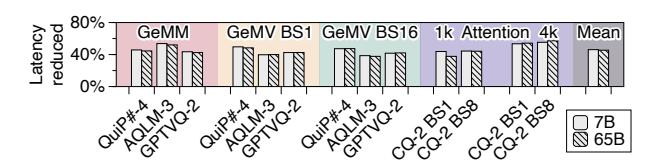
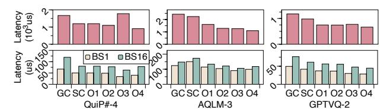
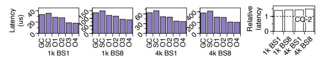
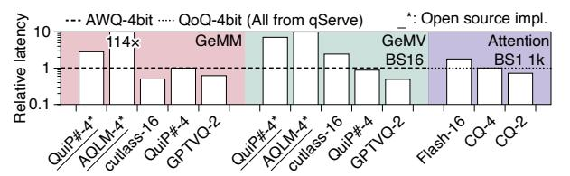
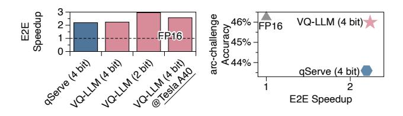

# B. Overall Speedup

As shown in Fig. 13, VQ-LLM reduces the latency by an average of 46.13% (53.73% at most), corresponding to a speedup of  $1.9 \times (2.2 \times)$  (BSx indicates the batch size of x).

Fig. 13. Overall latency reduction of best perform version against unoptimized version for various VQ configurations.

For Attention (Decode), 1k and 4k means sequence length of 1024 and 4096, respectively.

Although VQ-LLM achieves significant speedup values for both GeMM and GeMV kernels, we observe a counterintuitive discrepancy that our optimizations achieve a relatively high speedup value for GeMM kernels compared to GeMV kernels. In other words, the quality of VQ algorithm integration is more critical to the compute-bound kernels (e.g., GeMM) than to the memory-bound kernels (e.g., GeMV). The reason is the former benefit less from reduced memory footprint while suffer more from extra operation (dequantization) [60], leading to significant performance degradation of unoptimized implementation. Meanwhile, we also observe an opposite trend for AQLM-3 between GeMM and GeMV. This AQ configuration has an unaligned 12-bit storage format, which necessitates additional unpacking and decoding logic and requires a more careful optimization for the integration.

We observe that our speedup values for GeMV kernels remain consistent regardless of batch size, whereas they increase with batch size for attention kernels. This is because different input samples share the same weight tensor but have distinct KV caches. Since the GeMV kernel corresponds to weight quantization and the attention kernel to KV cache quantization, the former only requires loading the VQ-compressed weight tensor once, while the latter loads VQ-compressed KV cache tensors multiple times. Consequently, our optimizations are more effective for the attention kernel with large batch sizes.

Moreover, Llama-65B achieves almost identical speedup to Llama-7B, except in the Attention (Decode) scenario with a 1k sequence length and a single batch. This identical speedup occurs because the operators in the larger model can be trivially assembled using those from the smaller ones. We can readily double the launched thread blocks when we double the hidden dimension, demonstrating the good scalability of our optimizations. The sole exception arises because, in Llama-7B, the baseline cannot fully utilize the hardware due to an insufficient number of thread blocks for a 1k sequence length single batch. In contrast, for Llama-65B, the baseline fully occupies the hardware, resulting in better performance and reducing the relative speedup of our system.

## C. Speedup Breakdown

We first analyze the speedup breakdown of GeMM and GeMV, as depicted in Fig. 14. Tbl. V enumerates several factors that influence optimization effects, facilitating our analysis. For QuiP#-4, **SC** and **O1** perform identically due to the small size of its codebook (i.e., 2 KB in Tbl. V).

Fig. 14. Breakdown of optimizations for GeMM (upper) and GeMV (lower).

TABLE V
FACTORS THAT INFLUENCE THE EFFECT OF OPTIMIZATIONS

| Item                                                | QuiP#-4 | AQLM-3              | GPTVQ-2        | CQ-2           |
|-----------------------------------------------------|---------|---------------------|----------------|----------------|
| Codebook/block                                      | 2 KB    | 128 KB              | 32 KB          | 64 KB          |
| #Entry freq> $\mu$ +3 $\sigma$ Output size/block | 1-3     | 15-30 32 KB/<1 K | <li>&lt;1</li> | <1   1-4 KB |
| #Shuffle                                            | 3/7*    | 32 KB/<1 K          | 1/3            | 3              |

\*GeMM/GeMV

AQLM-3 and GPTVQ-2 exhibit noticeable improvements, attributed to their larger codebooks. Additionally, for GeMV, **SC** has a significantly negative impact on AQLM-3, due to its large codebook (i.e., 128 KB in Tbl. V), which restricts the parallelization of memory-bound computations.

**O2** delivers the most improvement in AQLM-3; we find that frequencies of 15-30 entries exceed  $\mu$ +3 $\sigma$ , and **O2**'s register-level caching optimization effectively reduces bank conflicts when accessing these entries. Conversely, the remaining two configurations QuiP#-4 and GPTVQ-2 exhibit far fewer entries exceeding  $\mu$ +3 $\sigma$ , indicating the less optimization opportunity of register-level caching and hence marginal improvements.

O3 affects GeMM and GeMV differently. In GeMM, O3 introduces negative effects due to a large output size. Furthermore, multiple residuals in QuiP#-4 configuration lead to redundant computations for O3, causing significantly increased latency in GeMM. In contrast, for AQLM-3, its misaligned 12-bit indices result in costly unpacking and decoding. It leads to low compute pipeline utilization, and hence is more tolerant to redundant computations. In GeMV, the output size is much smaller and the computation is lighter compared to GeMM. The smaller output size results in minimal global reduction overhead, and the lighter computation introduces less computational overhead than in GeMM. These factors make O3 more advantageous for GeMV.

**O4** significantly enhances GeMM's performance. This improvement primarily stems from GeMM's utilization of mma instructions, which require a layout of 2 and can be satisfied through one to three shuffling instructions. Additionally, **O4** conserves a substantial amount of shared memory, which is crucial as GeMM typically consumes a large shared memory, thus yielding a significant positive impact. Conversely, GeMV requires element-wise reduction, resulting in QuiP#-4 and AQLM-3, with a vector size of 8, requiring a greater number of shuffling instructions. This leads to a slowdown in these configurations. However, for GPTVQ-2 with a vector size of 4, a slight improvement is still observed. Furthermore, since GeMV typically uses minimal shared memory, savings in this

Fig. 15. (left) Breakdown of optimizations of CQ-2 for Attention (Decode). (right) Relative latency of CO-4 against CO-2.

area have a lesser impact on performance.

For Attention (decode), VQ-LLM achieves similar improvements with various sequence lengths and batches. SC significantly reduces performance due to CQ's large codebook, necessitating the use of O1 for achieving high performance. O2 offers only a slight improvement because few entries are accessed very frequently, mirroring situations in QuiP#-4 and GPTVQ-2. O3 significantly enhances performance by eliminating considerable duplicated traffic in the original computation dataflow. O4 provides a minor improvement, for reasons similar to those for O4 in GeMV. Additionally, we illustrate the latency of CQ-4 relative to CQ-2 in the right part of Fig. 15. Our proposed optimizations achieve a similar speedup to CQ-2, so we omit the detailed results to save space.

## D. FP16 and Element-wise Quantization Comparison

We now compare the latency of our optimized VQ kernels against FP16 and element-wise quantization works. Under the same equivalent bit width, the latency of kernels with the element-wise quantization is the theoretical upper bound of VQ kernels if using the same computation dataflow. As such, this comparison further verifies the effectiveness of our work.

As shown in Fig. 16, at 4-bit encoding, our work achieves latencies comparable to  $(1.01\times$  for Attention (Decode)), or even lower than  $(0.88\times/0.96\times$  for GeMV/GeMM), those of AWQ [30] and QoQ [31]. This reduction in latency likely results from our co-designed computational dataflow. These results suggest that our implementation is as viable as AWQ and QoQ, and therefore comparable to qServe [31]. Moreover, VQ kernels can deliver better accuracies at the same bit-width. The open-source implementations of QuiP# [56] and AQLM [12] are impractical for real-world applications, exhibiting  $2.83\times$  to  $114.4\times$  latencies. Our work successfully translates theoretical algorithmic improvements into practical applications.

We would like to explain that in Fig. 16, while both our approach and element-wise quantization methods outperform the cutlass-FP16 baseline in GeMV and Attention kernels, both underperform relative to the cutlass-FP16 baseline in GeMM kernels. This underperformance is due to the complex tiling

Fig. 16. Latency comparing to element-wise quantization works.

Fig. 17. (left) Overall speedup against FP16 and (right) accuracy of arcchallenge of SOTA element-wise quantization (qServe) and VQ-LLM.

strategy employed by cutlass-FP16 GeMM, which could incorporate our method. However, we do not pursue this integration for two reasons. First, accelerating individual GeMM kernels offers minimal overall speedup for LLM inference, as these kernels are used in the prefilling stage (Sec. II-B). The decoding stage, which dominates LLM inference execution time, has a greater impact on performance [64], as confirmed by our end-to-end evaluation results in the next subsection. Second, modifying the cutlass code requires significant engineering effort due to its intricate, template-based kernel design [22], [76]. Therefore, we leave this integration for future work.

