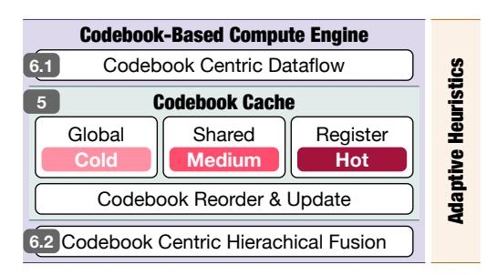
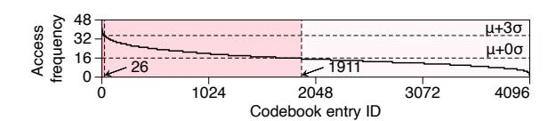
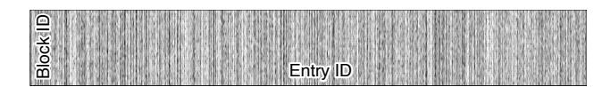
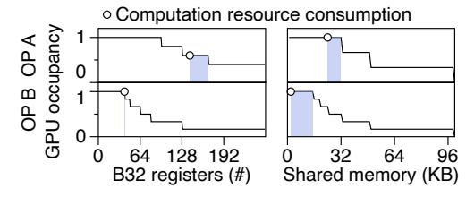
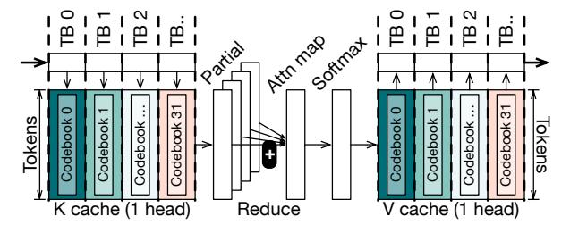
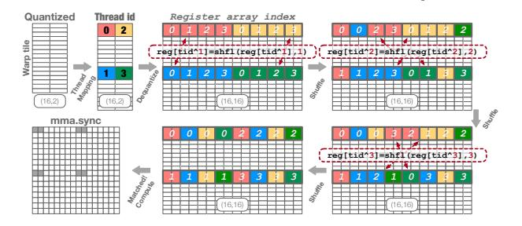

# C. Additional Complexity of VQ Diversity

Our above analysis primarily focuses on a specific VQ configuration for the FlashDecoding kernel. In fact, we have surveyed state-of-the-art methods of using VQs to accelerate LLMs and found considerable diversity, as listed in Tbl. II. These varied configurations add complexity when generating high-performance fused computation kernels. Moreover, different algorithms choose to train a codebook with different parts of tensor which further push up this complexity. For instance, QuiP# [56] can avoid duplicated Global  $\rightarrow$  Shared traffic as it train one codebook with the entire weight tensor, yet it may increase bank conflicts and cause layout mismatches with its vector size 8. Conversely, CQ-4 [69] is able to reduce bank conflicts and layout issues with its vector size 2, but it may lead to significantly duplicated Global  $\rightarrow$  Shared traffic since it train different codebooks with different channels.

On the other hand, there are various computations associated with VQ algorithms, such as VQ-gemm and VQ-gemv for weight-only quantization, and VQ-attn for KV cache quantization, as previously mentioned. The combination of

Fig. 7. VQ-LLM design overview.

VQ algorithm diversity and multiple subsequent computation patterns makes it impractical to manually craft efficient kernel implementations for each specific case.

Takeaway 3 An adaptive solution is necessary to achieve optimal performance across a variety of VQ algorithms and their subsequent computations.

## IV. VQ-LLM OVERVIEW

From the analysis in the previous section, we identify three key challenges in utilizing VQ to accelerate LLM inference: i) efficient codebook entry access, ii) coordinated codebook loading and subsequent computation, and iii) significant diversity in VQ algorithms and subsequent computation patterns.

To address these challenges, we design and implement VQ-LLM, an automatic high-performance code generation framework in Fig. 7. We introduce a software abstraction called codebook cache to optimize codebook access efficiency and support the integration of VQ with various computations. The codebook cache adaptively stores different entries across the GPU's memory hierarchy, including off-chip global memory, on-chip shared memory, and registers. It does so by leveraging the offline-profiled characteristics of codebook entry access, such as cold, medium, and hot.

The codebook cache also enables seamless integration with the subsequent computations. Centered around the codebook cache, we design an efficient computation engine that optimizes memory traffic during computations involving codebooks, incorporating two core techniques. The first technique, called codebook-centric dataflow, divides and parallelizes the original computation task in a way that minimizes the codebook switch overhead. It may split the reduction dimension of the original computation task, for which we adaptively determine the split factor to balance the global reduction. With this dataflow, we eliminate the excessive off-chip memory traffic caused by redundant codebook loads from different thread blocks in current VQ implementations.

The second technique employed by our compute engine, named codebook-centric hierarchical fusion, extends the default shared memory level fusion to support the additional register-level fusion. This mechanism leverages a GPU feature known as intra-warp data exchange [42] to rearrange the dequantized data into the required layout for subsequent computations directly in registers. And we adaptively decide where to conduct the fusion based on profiled exchanging

Fig. 8. Codebook entries access frequency of one thread block in VQ-GeMM kernel, with **VQ<8,12,2>** (AQLM-3).

overhead and difference between layout of dequantized data and layout required by subsequent computation.

Our VQ-LLM framework comprises a set of CUDA templates that employ a codebook-centric dataflow and fusion scheme, along with a set of adaptive heuristics. These templates include both algorithm-specific and hardware-related parameters. To generate a specific VQ-augmented compute kernel, we supply the configuration of the algorithm and target GPU to the corresponding compute kernel template. VQ-LLM then automatically selects the optimal parameters based on the template specifications and heuristics.

## V. CODEBOOK CACHE

We first present the design intuition of codebook cache, and then implementation details. Finally, we describe the user interface that can be utilized by subsequent computations.

## *A. Design Rationale*

As Sec. III explains, naively placing the entire codebook in the shared memory results in suboptimal performance due to two issues: i) increased shared memory usage and ii) significant bank conflicts. To address these issues, we propose storing different entries at various memory levels based on their access frequencies. Specifically, we can store rarely accessed entries in off-chip global memory to conserve shared memory usage, and store the most frequently used entries in the thread local registers to eliminate bank conflicts.

We find that different entries in a codebook indeed demonstrate varying levels of 'hotness' in terms of access frequency. Fig. 8 illustrates such an example of AQLM-3, and results of other algorithms will be shown in Sec. VII. Over half of the codebook entries are accessed less frequently than the average, indicating that placing them in shared memory yields little benefit. There are 26 hot entries that are accessed more frequently than µ+3σ (mean plus three standard deviations), suggesting that they are more susceptible to inevitable bank conflicts. This observation forms the foundation of our codebook cache design, the details of which we introduce next.

## *B. Implementation*

Typically, the implementation of a cache relies on tag array [59] or lookup table [36], which could incur additional latency and storage overhead. In our codebook cache implementation, we adopt a reorder-based static mapping mechanism that is extremely lightweight and configurable, which means there is also no complex eviction policy.

In our implementation, we first sort and reorder the codebook entries by their access frequency in the descending order.

Fig. 9. Entries hot and cold of different parts of tensor.

This is done at the profiling-based offline phase, which ensures that the index of the most frequent entry is 0, and the index of the least frequent entry is the maximum value. All the quantized data would use these new indices. Next, we establish two boundaries:  $n_{reg}$  and  $n_{shared}$ . We allocate the first  $n_{reg}$  entries to thread local registers and the subsequent entries up to  $n_{shared}$  in shared memory. We store any remaining entries in global memory. During runtime dequantization, addressing codebook entries involves simple index comparisons, we locate entries in registers if the index  $< n_{reg}$ , in shared memory if  $n_{reg} \le$  index  $< n_{shared}$ , and in global memory if the index  $\ge n_{shared}$ .

In this implementation, we conduct frequency-based reordering at the tensor level, although different parts of a tensor might have different frequently accessed entries. Fig. 9 presents data to support our choice, where the y-axis represents different parts of the tensor (i.e., different thread blocks), and x-axis indicates the access frequencies of different codebook entries of a thread block. White color indicates frequently accessed entries, and the opposite for darker shades. We observe many vertical white lines, suggesting that these entries are consistently accessed across different tensor parts. This observation supports the rationale for globally determining the most frequently accessed entries.

Adaptivity. The shared memory and register resources of our codebook cache can be adjusted using two parameters:  $n_{reg}$  and  $n_{shared}$ . As mentioned in Sec. III, these resources are limited on GPUs, and excessive usage can decrease the occupancy of thread blocks. We employ a heuristic-based method that adapts their allocation to subsequent computations. Initially, we identify slack in the use of both recources. This concept is illustrated in Fig. 10, where we assign varying amounts of shared memory and registers to two computation kernels, highlighting the most performant configuration with a circle marker. Resource slack, depicted as the blue shaded area in Fig. 10, is a space of resource that we can occupy without hurting concurrency and GPU utilization. The existence of these slacks is due to the GPU's resource partitioning and scheduling [52], which we will not explore further due to space constraints. It is important to note that different computations exhibit varying slacks, which can also be derived by offline profiling. We determine  $n_{reg}$  and  $n_{shared}$  by dividing the available slacks by the size of a single codebook entry.

## C. User Interface

We provide and explain the following APIs for users to utilize our codebook cache, henceforth abbreviated as CB.

 $CB_{cached}, n_{reg,shared} \leftarrow \texttt{Load}(CB, Slack)$   $Entry \leftarrow \texttt{Access}(CB_{cached}, n_{reg,shared}, CB, Index)$  $CB \leftarrow \texttt{Switch}(New\ CB\ Pointer)$ 

Fig. 10. Computation kernel resource consumption and corresponding occupancy of the hardware. The blue region is the resource slacks we can use without influencing the performance.

Fig. 11. Example of codebook centric dataflow for attention (decode) computation following CQ configuration.

The first API is **Load**, which loads codebooks stored in global memory into the cache. It accepts the codebooks and memory slack, returning the codebooks cached across the memory hierarchy along with two access boundaries. The second API is **Access**, allowing users to access specific entries during the dequantization process. It accepts cached and global memorystored codebooks along with indices to locate entries. It also uses two boundaries to determine where to locate entries. Additionally, while we configure these boundaries with preset heuristics, users can still overwrite them.

The last API is **Switch**, useful when algorithms train different codebooks for different parts of a tensor, as in GPTVQ-2 [57]. This API facilitates the switch to new codebooks based on the specific tensor section being processed by the user.

#### VI. CODEBOOK-BASED COMPUTE ENGINE

Based on the above codebook cache, we design an efficient compute engine to optimize the excessive codebook-related traffic when using VQ in the subsequent computation. We first introduce two core techniques employed by our computation engine: codebook-based dataflow and codebook-based hierarchical fusion. We then detail the combined usage of the entire computation engine along with the codebook cache.

#### A. Codebook Centric Dataflow

We start by explaining the intuition of our design. Subsequently, we detail our implementation.

1) Design Rationale: To fully leverage the parallel computation resources of GPUs, researchers employ tiling to divide and parallelize computation tasks [6], [43], [73]. Under the VQ scenario, naive parallelization introduces excessive traffic due to conflicts between the codebook switch axes and the task reduction axes, as discussed in Sec. III. We address this issue with a new codebook-centric dataflow illustrated in Fig. 11,

which employs the same settings as Fig. 5 in Sec. III. In this codebook-centric dataflow, we partition and parallelize the task across every four channels, i.e., every codebook, ensuring that each thread block only needs to load one codebook, thus eliminating any need for duplicated codebooks or switches. Instead of globally reducing the local softmax of different tokens as in FlashDecoding [10], we now require global accumulation of partial inner-products.

2) Implementation: We now formally define our design for the codebook-based dataflow. We first identify the axes where reduction occurs and where codebooks need to be switched, as indicated in Tbl. III. Subsequently, we split and parallelize the computation along the codebook switch axes. Finally, for those axes that traditionally perform temporal accumulation but are now parallelized (intersecting with the codebook switch axes and annotated with colors), we perform an explicit global reduction to ensure accurate results.

Adaptivity. To balance the overhead of global reduction in our dataflow, we utilize a split factor to control the extent of task parallelization along the codebook switch axes. A larger split factor results in fewer duplicated codebooks but necessitates more global reductions, and vice versa. With the objective of minimizing overhead, we adaptively determine the split factor based on the size of the tensor that needs reduction and the traffic associated with duplicated codebooks.

$$\begin{aligned} \textit{Traffic}_{Reduce} \leftarrow Split \; Factor \times Output \; Size \\ \textit{Traffic}_{Codebook} \leftarrow \frac{Original \; Codebook \; Traffic}{Split \; Factor} \end{aligned}$$

Since these two variables exhibit opposing trends with respect to the split factor, we can achieve a minimum by equating them according to the Mean Value Theorem [48].

#### B. Codebook Centric Hierarchical Fusion

Similarly, we begin with a concrete example to illustrate our new fusion scheme. Subsequently, we formally abstract the hierarchical fusion algorithm and detail our implementation.

1) Design Rationale: The baseline method described in Sec. III employs shared-memory-level fusion, which combines VQ dequantization and the subsequent computation kernel by transferring data through shared memory. It leads to excessive

TABLE III
REDUCE AND CODEBOOK SWITCH AXES OF COMPUTATIONS

| GeMM GeMV             | All axes | Reduce axes | Codebook switching axes   |  |
|--------------------------|----------|-------------|------------------------------|--|
| Weight                   | M,N,R    | M,R         | R: AQLM,QuiP# M,N: GPT-VQ |  |
| B B 11 1 1 1 1 1 1 1 1 1 |          |             |                              |  |

R: Residual, M,N: M rows, N columns

| Attention          | All axes           | Reduce axes | Codebook switching axes         |  |
|--------------------|--------------------|-------------|---------------------------------|--|
| K Cache V Cache | B,H,T,C B,H,T,C | C T      | <b>H,C</b> : CQ <b>H,C</b> : CQ |  |

B: Batch, H: Head, T: Token, C: Channel

Fig. 12. Intra-warp data exchange based on shuffle API example, eight elements are dequantized one time per thread, while following computation requires one thread hold only two elements (mma instructions).

traffic between shared memory and registers, as previously explained. Alternatively, we utilize a modern GPU feature that facilitates register-level data exchange [42], effectively bypassing shared memory with following API:

$$register \leftarrow shfl_{xor}(register, offset)$$
 (1)

This API exchanges the reg of the calling thread  $(id_{src})$  with reg of the thread whose  $id_{dst} \oplus offset = id_{src}$  in place  $(\oplus:xor)$ . Note that this instruction is commonly used to enhance the efficiency of collective communication and result reduction [27], [72]. However, we are the first to apply it to accelerate VQ-compressed LLMs.

We illustrate the application of this API for register-level fusion through an example that fuses **VQ<8**,...> with GeMM. In Fig. 12, the layout of the dequantized data is 8 (i.e., VQ vector size), while the layout required by the mma instruction is 2. We initially map the dequantization threads in a specialized manner, as depicted in the figure, to ensure that all data exchanges are confined to four threads, which we subsequently refer to as a mini-warp. Within this mini-warp, we execute three exchange (shfl) operations as follows:

- Tid 0.[1]↔Tid 1.[0], Tid 2.[3]↔Tid 3.[2]
- Tid  $0.[2] \leftrightarrow \text{Tid } 2.[0]$ , Tid  $1.[3] \leftrightarrow \text{Tid } 3.[1]$
- Tid  $0.[3] \leftrightarrow \text{Tid } 3.[0]$ , Tid  $2.[1] \leftrightarrow \text{Tid } 1.[2]$

Note that both the array index and thread ID can be represented using the xor operation. After these shuffle operations, the data held by each thread's register aligns precisely with the requirements of the mma computation instruction.

Thread Mapping. Our approach necessitates a specialized thread mapping within a warp for dequantization, as the naive sequential mapping requires a complex exchange pattern. Consider the sequential mapping with the mma instruction in Fig. 12, data[8,0:8] (blue color) is dequantized by thread 16 but is required by threads 0-3. However, the data held by threads 0-3 is not needed by thread 16 but rather by threads 0-7. This results in a complex data exchange path where ultimately all threads are implicated. Meanwhile, it requires additional registers as the exchange happens in place. To circumvent this, we predetermine the thread mapping offline, based on the layout of the dequantized data and the layout required by the computation, with details described as follows.

