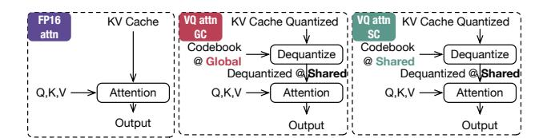
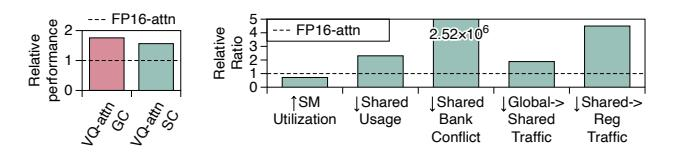
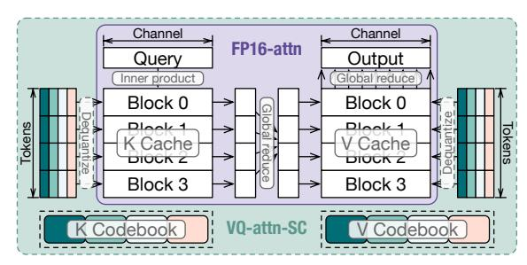
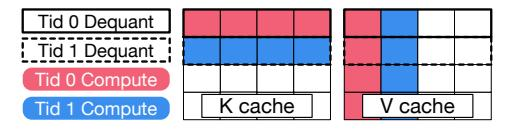

# C. VQ for LLM Acceleration

VQ gains increasing interests for its great potential for compressing and accelerating LLMs. This is because LLMs are highly memory-bound [61], with many researchers identifying weights and KV-cache as the main bottlenecks, accounting for over 95% of the memory footprint [28]. To further compress the weights and KV-cache and reduce memory usage, VQ has come to the center of the stage with its superior compression ratio and reconstruction quality. Various newly proposed VQ-based compression algorithms outperform SOTA elementwise quantization baselines in both weight-only compression (AWQ [30]) and KV-cache compression (KVQuant [24], QoQ [31]) under the same equivalent bitwidth [12], [56],

Fig. 3. Workflow of investigated VQ kernels.

[57], [67], [69], as shown in the upper part of Fig. 2. Some can even achieve higher quality with fewer equivalent bits. The underlying reason is depicted in the lower part of Fig. 2. With cross-dimension information, VQ can better capture the distribution characteristics of the data, resulting in lower reconstruction error. In contrast, traditional quantization relies on the Cartesian product of quantization points between dimensions and cannot represent some outliers well.

While converting the reduced memory footprint to actual speed-up is challenging due to the need for efficient kernels that take quantized data and codebooks as inputs, dequantize them, and perform computations. Unfortunately, existing algorithms only provide kernels with high latency, making them impractical for use [12], [56], as verified in Sec. VII. In the VQ pipeline, dequantization is the main bottleneck in the context of LLMs. This is because quantization can be done offline (for weights) or asynchronously with tiny overhead (for KV cache, also discussed in Sec. VII). However, dequantization is required every time before a computation since the quantized data store codebook indices and cannot be directly operated on. Therefore, this paper focuses on developing efficient fused dequantization-computation kernels.

In the next section, we will analyze the inefficiencies of existing and vanilla optimized fused dequantization-computation kernel. As mentioned before, the core difference between VQ and element-wise quantization is the use of vectorized codebooks, and we primially focus on them in our analysis.

Noted that we target NVIDIA GPUs in this paper, althouth GPUs from other vendors share similar concepts [3], [39], [40], [54]. A GPU compute kernel launches thousands of threads, organized into thread blocks within a grid. Each thread block is dispatched to a Streaming Multiprocessor (SM), which may handle multiple thread blocks to overlap instructions [70]. Threads access three memory hierachies: registers (local to each thread), shared memory (local to the thread block), and global memory (accessible by all threads).

## III. MOTIVATION

In this section, we analyze the inefficiencies of current VQ implementation centering how codebooks are placed and utilized. We first outline our setup for a micro-benchmark-based investigation in Fig. 3 and then analyze it in detail.

## A. Investigation Setup

We evaluate an attention kernel from Llama-7B [55] with 32 heads and head dimension of 128 on an RTX 4090 GPU [44]. We investigate three implementations of vector quantized (VQ) KV cache with the configuration VQ<4,8,1> that follows

Fig. 4. (left) Latency of **VQ-attn-GC** and **VQ-attn-SC** relative to **FP16-attn**. (right) Relative performance counters of **VQ-attn-SC**.

CQ-2 [69]. As illustrated in Fig. 3, the first FP16-attn version implements Flash Decoding [10] from the FlashAttention library [7], [9]. We implement the VQ-attn-GC version ourselves following the original paper [12], [56], [57], [69] due to the lack of open-source kernels. VQ-attn-GC receives the VQ quantized KV cache and its codebooks, dequantizes them to FP16 precision, and performs the subsequent attention computation, with codebooks stored in *global memory*. Given the long access latency of global memory, we propose and implement another optimized version that stores codebooks in *shared memory* and hence is labelled as VQ-attn-GC, with the rest of the process mirroring that of VQ-attn-GC. Here we only analyze attention kernel thus KV cache compression, while these observations can also be generalized to GeMM/GeMV and weight compression.

## B. Inefficiency Analysis

Since the attention (decoding) process is highly memorybound, using VQ<4,8,1>, which compresses the KV cache to 1/8, should significantly enhance its performance. However, as depicted on the left of Fig. 4, both VQ versions underperform the FP16 baseline. We also observe that the shared-memory-based codebook version, VQ-attn-SC, outperforms the global-memory-based version, VQ-attn-GC, demonstrating the effectiveness of utilizing shared memory for codebooks. Although shared memory and the GPU L1 cache share the same physical space, the hardware-managed L1 cache fails to capture the temporal locality of codebook entries. This is because the size and irregular access pattern of the entries does not align with the cache line size and prefetch width (128 bytes [41]) of the L1 cache. According to our profiling results, VQ-attn-GC achieves only a 12.45% L1 cache hit rate, indicating significant wasted capacity in the L1 cache. Consequently, we default to the VQ-attn-SC version to investigate its sources of inefficiencies.

Inefficient Codebook Access. Fig. 4 (right) compares the various performance counters of the VQ-attn-SC version and the FP16 version. We first observe an over 30% drop in compute (SM) utilization in the VQ-attn-SC version (1 $^{st}$  bar). This decline is attributed to the VQ's significantly increasing shared memory footprint (2 $^{nd}$  bar), which reduces the number of thread blocks that can run concurrently on each SM, leading to decreased performance. Additionally, we note high bank conflicts (3 $^{rd}$  bar), indicative of highly serialized access to shared memory. Eliminating these bank conflicts is challenging for several reasons. First, the number of codebook entries vastly exceeds the number of shared memory

Fig. 5. Dataflow of FP16-attn (inner box) and VQ-attn-SC (outer box).

banks, e.g., 256 entries versus 32 banks, and their accesses are random during the VQ dequantization process, precluding the use of common static reordering or padding solutions for coalesced accesses [41]. It is possible to reorder entries or threads at runtime, which can introduce extra complexity and overhead. Second, a single codebook entry can occupy multiple banks in VQ, exacerbating the difficulty of mitigating bank conflicts.

**Takeaway 1** Storing codebooks in fast on-chip buffers like shared memory is necessary, but not trivial.

Uncoordinated Codebook Load and Compute. The 4th bar in Fig. 4 (right) indicates that the traffic from off-chip global to on-chip shared memory is higher for the VQ version than for the FP16 version. This is counterintuitive since VQ is expected to significantly reduce global memory access. The cause of this unexpected off-chip traffic is that integrating VQ into the original compute kernel results in uncoordinated and duplicated loads of codebooks.

The inner box of Fig. 5 shows the original FlashDecoding's dataflow [10], which parallelizes the computation of different tokens and computes the local softmax in global memory. When integrating the VQ codebooks to this computation dataflow, computing every four channels for a token needs to switch to a different codebook, following the VQ algorithm of CQ-2 [69]. Consequently, thread blocks handling different tokens end up accessing and loading identical codebooks as they process data across all channels, as shown in the outer box of Fig. 5. This results in significant duplicated off-chip memory traffic, and this challenge is also presented in the integration of VQ with GeMM kernels. For GPTVQ-2 [57],

TABLE II VQ ALGORITHM AND THEIR CONFIGURATIONS

| Algorithm | Algorithm Compression Ratio against FP16 |       | #Entry | Residual |
|-----------|------------------------------------------|-------|--------|----------|
| QuiP#-4   | 25%                                      | 8     | 65536* | 2        |
| AQLM-3    | 18.75%                                   | 8     | 4096   | 2        |
| GPTVQ-2   | 12.5%                                    | 4     | 256    | 1        |
| CQ-4      | 25%                                      | 2     | 256    | 1        |
| CQ-2      | 12.5%                                    | 4     | 256    | 1        |
| Configs.  |                                          | 21,2, | 21,2,  | 1,2,     |

\*QuiP# utilize a lattice-based codebook, though it has 65536 entries, it only need to look up from 256 of them every dequantization with bit operations.

Fig. 6. Layout of dequantized data and required layout of following computation of KV cache in attention (decoding).

every (256, 256) tile of the weight matrix shares a codebook, while the task is spliced into (·, 128) tiles on weight matrix, and every two thread blocks access and load a same codebook.

Besides the increased off-chip global memory traffic, we also observe a significant rise in on-chip shared memory to register traffic in the **VQ-attn-SC** version, as shown in the last bar of Fig. 4 (right). Ideally, this traffic should remain the same to the **FP16-attn** version, given that the computation precision and the volume of data involved in the computation remain unchanged. The unusual Shared  $\rightarrow$  Reg traffic stems from a mismatch between the layout of dequantized data and the layout required by the computation.

As illustrated in Fig. 6, one thread dequantizes a row of four elements at a time for the KV cache following the CQ-2 algorithm [69]. It then stores these four elements in thread-local registers. However, the computation requires a column-wise weighted accumulation on the V cache, and the four dequantized elements by the thread do not match the data needed for subsequent computations. Consequently, the dequantized data in local registers must be stored back into shared memory, allowing the correct threads to access them. Notice that as depicted in the figure, the K cache does not introduce such a shared memory round-trip since its row-wise accumulation process aligns with the dequantization process.

**Takeaway 2** Integrating and fusing VQ algorithms into LLM's kernels requires a careful coordination between the codebook load and the fused kernel's compute dataflow.

