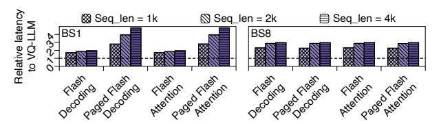

# E. End-to-End (E2E) Result

We present the end-to-end LLM inference improvements of various quantization methods compared to the FP16 baseline in Fig. 17 (left). In the equivalent 4-bit setting, VQ-LLM achieves a speedup comparable to the state-of-the-art elementwise quantization method, qServe [31], with both providing approximately a 2.2× improvement over the FP16 baseline. Additionally, VQ-LLM surpasses qServe in accuracy by about 2.5% on the arc-challenge task [5], as shown in Fig. 17 (right). This result demonstrates VQ-LLM's effectiveness in accelerating LLM inference. he RMSNorm, SiLU, and RoPE operators together account for roughly 10% and 20% of total latency in the FP16 and 4-bit quantized versions, respectively. We also observe a greater speedup with a 2-bit compression ratio, further highlighting the potential of VQ, as previous research suggests that 2-bit quantization can maintain practical accuracy. Additionally, we evaluate the performance of VQ-LLM in a 4-bit setting on the Tesla A40 GPU, which provides 67% of the memory bandwidth of the RTX 4090 [39]. Interestingly, the Tesla A40 demonstrates a greater speedup than the RTX 4090, suggesting that VQ-LLM is more effective in bandwidth-constrained environments. In summary, VQ-LLM offers improved accuracy with comparable latency to elementwise quantization, and vice versa. In terms of memory usage, the FP16 baseline consumes over 22 GB, whereas qServe-4 and VQ-LLM-4 use less than 6 GB of GPU memory, aligning closely with theoretical estimates [65].

## F. Additional Discussion

**Different Types of Attention.** The aforementioned details about Attention (Decode) are based on using Flash Decoding [10] as our baseline dataflow. We also evaluate the speedup of our work against various attention baselines, including Flash

Fig. 18. Relative latency of various attention baselines against our best perform implementation of CQ-4.

Attention, Paged Flash Attention and Paged Flash Decoding [7]–[9], [50]. As illustrated in Fig. 18, our work surpasses all these baselines, primarily due to a significantly reduced KV cache memory footprint enabled by CQ-4. We achieved a 66.4% latency reduction compared to the best-performing FP16 baseline, with a 75% reduction in memory footprint, under the conditions of eight batches and a sequence length of 4096. This indicates an effective transfer from theoretical benefit to practical application. Additionally, our work scales effectively with increases in sequence length and batch size.

**Quantization Overhead.** For weight compression, no runtime quantization overhead is introduced. In KV cache compression, the runtime overhead of on-the-fly quantization for the new key and value of a new token in the decode phase is negligible (<1  $\mu$ s). During the prefill phase, quantizing the keys and values of all prompt tokens introduces less than a 10% overhead compared to linear projections. However, the subsequent computation does not immediately require the quantized KV cache, rendering these overheads negligible.

#### VIII. CONCLUSIONS

In this work, we proposed VQ-LLM, an optimized code generation framework for vector quantization (VQ), consisting of codebook cache and codebook based compute engine. With which we achieve 46.13% latency reduction on average over unoptimized version and up-to 99% over open source implementations. For codebook cache, we propose a hierachical placement strategy to preserve hardware utilization and reduce bank conflict. For compute engine, we propose codebook centric dataflow and fusion scheme to reduce excessive off-chip and on-chip traffic. All proposed optimizations are configured adaptively via several heuristics. Finally we demostrate effectiveness and viability of VQ-LLM comparing to un-optimized implementations and element-wise quantization works.

#### IX. ACKNOWLEDGEMENTS

This work was supported by the National Key R&D Program of China under Grant 2022YFB4501400, the National Natural Science Foundation of China (NSFC) grant (62222210, U21B2017 and 62072297). This work was also supported by Shanghai Qi Zhi Institute Innovation Program SQZ202316. We would like to thank the anonymous reviewers for their constructive feedback and comments to improve this work. Special thanks to Vega Jiang for continuous help and support. Any opinions, findings and conclusions in this paper are those of the authors only and do not necessarily reflect the views of our sponsors.

