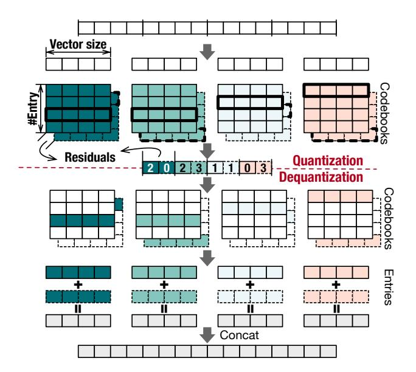

# VQ-LLM: High-performance Code Generation for Vector Quantization Augmented LLM Inference

Zihan Liu1,2, Xinhao Luo1,2, Junxian Guo1, Wentao Ni1, Yangjie Zhou1, Yue Guan1,2, Cong Guo3, Weihao Cui1,4, Yu Feng1, Minyi Guo1,2, Yuhao Zhu5, Minjia Zhang6, Chen Jin7, Jingwen Leng1,2,\*

1 Shanghai Jiao Tong University, 2 Shanghai Qi Zhi Institute, 3 Duke University, 4 National University of Singapore

5 University of Rochester, 6 University of Illinois Urbana-Champaign, 7 Magik Compute

{altair.liu, lxh666, guojunxian, wennitao, yj\_zhou, bonboru, weihao, y-feng}@sjtu.edu.cn, cong.guo@duke.edu
guo-my@cs.sjtu.edu.cn, yzhu@rochester.edu, minjiaz@illinois.edu, chenj@magikcompute.ai, leng-jw@cs.sjtu.edu.cn

Abstract—Vector quantization (VQ), which treats a vector as a compression unit, gains increasing research interests for its potential to accelerate large language models (LLMs). Compared to conventional element-wise quantization methods, VQ algorithms can compress weight and KV cache tensors in LLMs with a greater ratio while maintaining the high model accuracy. However, translating a VQ algorithm's memory reduction into the actual latency improvement is challenging. We profile and analyze the current approach of integrating VQ into computation kernels and show that its major inefficiency lies in the poor access efficiency of codebooks in VQ algorithms and uncoordinated computation dataflow. Meanwhile, the diversity of VO algorithms (e.g., different vector sizes and entry counts) and LLMs' computation kernels (e.g matrix-matrix/vector multiplication and attention computation) makes it impractical to manually craft efficient kernel implementations for each specific case.

In this work, we design and implement VQ-LLM, an efficient fused VO kernel generation framework. We first introduce a software abstraction called codebook cache to optimize codebook access efficiency and support the integration of VQ with various computations. The codebook cache adaptively stores different entries across the GPU's memory hierarchy, including off-chip global memory, on-chip shared memory, and registers. Centered around the codebook cache, we design an efficient computation engine that optimizes memory traffic during computations involving codebooks. This compute engine adopts the codebookcentric dataflow and fusion optimizations. Additionally, we provide adaptive heuristics to tailor parameter selection in our optimizations to diverse VQ configurations. Our optimizations achieve the latency reduction of 64.36% to 99.1% compared to existing open-source implementations. A final comparison with state-of-the-art element-wise quantization methods like AWQ and QoQ shows that our VQ-LLM is practically viable, achieving latencies close or even better latencies to those at equivalent bitwidths, potentially offering greater accuracy.

## I. INTRODUCTION

With the great success of large language models (LLMs), neural networks are placing significant pressure on current hardware, especially memory systems [21], [27], [28], [33], [74], [75]. Quantization techniques become essential for deploying these large models [15], [18]–[20], [24], [30], [51], [62]. Quantization reduces the original IEEE-754 half format FP16 data to types with much narrower bit-widths, such as FP8 and INT4, decreasing the memory footprint significantly [1]. Researchers have developed numerous novel data

formats and algorithms, like MXFP and ANT, with varying scaling granularities to represent the original data using fewer bits [20], [49]. However, these techniques treat each data point as an independent element for compression, overlooking the potential information between elements. As a result, these methods typically reach a 4-bit limit; compressing to 2 bits or less leads to a substantial accuracy loss [12], [15], [56].

Under these scenarios, vector quantization (VQ) emerges as a pivotal technique to further reduce LLMs' memory footprints [12], [56], [57], [67], [69]. The VQ methods compress a vector of multiple elements into a single element and enabling the capture of information across elements [57], [69]. Typically, this cross-element information is gathered through clustering, which involves applying a clustering algorithm to all vectors and using cluster centroids to represent nearby vectors [26], [37]. Furthermore, some researchers suggest iteratively processing the residuals between the original and quantized data to enhance reconstruction quality [32], [63]. For LLMs, VQ achieves higher accuracy at the same 4-bit level or maintains equivalent accuracy at 2-bits, and some approaches can compress the KV cache in LLMs to 1-bit [69].

Despite their appealing accuracy and compression ratios, VQ-augmented LLMs do not significantly enhance the model's latency performance in practice. Our analysis in Sec. III indicates that existing VQ methods have substantially higher latency than conventional element-wise quantization methods, often performing worse than the original FP16 version. The inefficiencies primarily stem from how memory access and computation dataflow are managed when interacting with the codebooks in VQ methods. We have identified three key challenges that must be addressed to generate high-performance kernels integrating VQ with subsequent computations.

The first challenge lies in the placement of VQ's codebooks. We find that the common practice of storing all codebook entries in GPU shared memory increases shared memory usage, thereby reducing the number of thread blocks that can concurrently operate on each SM, which diminishes performance. Additionally, the number of codebook entries far exceeds the number of available shared memory banks, leading to significant bank conflicts. The second challenge involves coordinating the loading of codebooks and subsequent computation. There is excessive traffic in loading the codebook

\*Jingwen Leng is the corresponding author of this paper.

from global memory to shared memory, and in transferring codebook entries from shared memory to registers, which should be much lower in theory. The reasons include multiple thread blocks loading duplicate codebooks, and the requirement for threads to store data reconstructed via codebook entries (we refer to them as dequantized data throughout the paper) back to shared memory in a layout that differs from their dequantization for subsequent computations. The last challenge is that the diversity of VQ algorithms (e.g., different vector sizes and entry counts) and LLMs' computation kernels (e.g matrix-matrix/vector multiplication and attention computation) makes it impractical to manually craft efficient kernel implementations for each specific case.

To address the challenges, this work develops VQ-LLM, an automatic high-performance fused VQ kernel code generation framework. We begin by introducing a software abstraction called codebook cache, designed to optimize codebook access efficiency and facilitate the integration of VQ with various computations. This cache enables efficient codebook placement across the GPU's memory hierarchy. We have identified that only a select few entries are accessed frequently. Therefore, rather than indiscriminately caching all entries in shared memory, we adopt a hierarchical approach: entries with low access frequency remain in global memory, while those accessed more frequently are cached in shared memory. To address inevitable bank conflicts, entries that are accessed extremely frequently are stored in thread-local registers, eliminating bank conflict issues. Furthermore, to mitigate negative impacts on computation (reduced concurrency), we utilize available slacks, which ensues no drop in resource utilization, to adaptively determine the optimal placement of entries.

Centering the codebook cache, we design an efficient compute engine that optimizes memory traffic when computing with codebooks, and it consists of two novel techniques. The first called codebook-centric dataflow divides and parallelizes the original computation task in a way that minimizes the codebook switch overhead. It may split the reduction dimension of the original computation task, for which we adaptively determine the split factor to balance the global reduction. The second technique, codebook-centric hierarchical fusion, extends the default shared memory level fusion to support the additional register-level fusion. This mechanism leverages a GPU feature known as intra-warp data exchange [42] to rearrange the dequantized data into the required layout for subsequent computations directly in registers. We adaptively decide where to conduct the fusion based on profiled exchanging overhead and difference between layout of dequantized data and layout required by subsequent computation.

Our evaluation shows that VQ-LLM achieves the latency reduction of 64.36% to 99.1% compared to compared to existing open-source implementations [13], [56]. We also perform extensive sensitivity to verify the effectiveness of each technique in our framework. A final comparison with stateof-the-art element-wise quantization methods like AWQ [30] and QoQ [31] shows that our VQ-LLM is practically viable, achieving latencies close or even better latencies to those at

Fig. 1. Typical vector quantization pipeline.

equivalent bit-widths, potentially offering greater accuracy. We list our main contributions as follow:

- To the best of our knowledge, we are the first to deeply dive into performance issues of vector quantization and make it practically feasible in LLM inference.
- We deliver a detailed analysis and identify these issues are caused by inefficient codebook entries access and uncoordinated codebook loading and subsequent computation.
- Based on the finding, we propose VQ-LLM to generate efficient fused VQ kernel implementation, it consists of codebook cache and codebook based compute engine, with configurable parameters and adaptive heuristics.
- We compare VQ-LLM with open-sources implementations and element-wise quantization works, with detail speed-up breakdown analysis on proposed optimizations.

