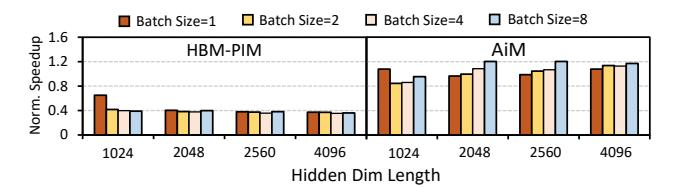

# 8 Related Work

better performance to PIM-DL.

DRAM-PIMs have been proposed for many years to address the "Memory-Wall" problem. Many academic proposals utilize DRAM-PIMs to accelerate data-intensive applications in scenarios like graph processing [2, 15, 67, 97, 104], machine learning [3, 28, 37, 50, 52, 56, 60, 61, 63, 75, 80, 90, 94, 101], and general-purpose applications [4, 10, 25, 27, 32, 35, 38, 91, 96]. They can be categorized into two major types: (1) DRAM-PIMs built with die-stacking memories, e.g., Hybrid Memory Cube (HMC). For example, GraphP [98] and GraphQ [104] adopts HMC to accelerate graph processing. SynCron [32]

Figure 15. GPU-based inference VS. PIM-DL.

proposes efficient synchronization support on HMC for data intensive applications. (2) DRAM-PIMs built with Dual-Inline Memory Modules (DIMMs). For example, TensorDIMM [57] and RecNMP [51] accelerate recommendation systems with near-memory tensor reduction. DIMM-Link [102] presents a full-stack design to enhance the inter-DIMM communication performance for generic DIMM-NMP architectures.

In recent few years, DRAM-PIMs have entered the commercialization phase. UPMEM has proposed PIM-DIMM [18], which equips RISC cores near DRAM banks. Samsung and SK-Hynix have introduced HBM-PIM [55]/AiM [54] to accelerate memory-bound operators in deep learning applications. Although there are various proposals customizing real-world applications on commodity DRAM-PIMs [6–8, 16, 21, 31, 34, 48, 49, 58, 62, 72], none of them can efficiently process mainstream DNNs such as transformers. To our best knowledge, PIM-DL is the first full-stack framework that expands DRAM-PIMs' applicability under deep learning scenarios. Unlike previous proposals implementing LUT-based operations in DRAM circuits [17, 26, 82, 83, 100], we adopt LUTs in the algorithm level, ensuring PIM-DL's efficient deployment on real-world DRAM-PIM products. Although TransPimLib [72] implements LUT-based transcendental functions on UPMEM PIM-DIMMs, it cannot be directly used to accelerate GEMM. PIM-DL and provides algorithmic innovation to maintain the model accuracy when substituting GEMM to LUT-NN and contains efficient mapping & auto-tuning strategies to boost the performance of model inference.

