# Abstract

DRAM-based processing-in-memory (DRAM-PIM) has gained commercial prominence in recent years. However, their integration for deep learning acceleration poses inherent challenges. Existing DRAM-PIMs are limited in computational capabilities, primarily applicable for element-wise and GEMV operators. Unfortunately, these operators contribute only a small portion of the execution time in most DNN workloads. Current systems still necessitate powerful hosts to handle a significant portion of compute-heavy operators.

To expand the applicability of commodity DRAM-PIMs in accelerating deep learning, we introduce a novel PIM-DL framework. The philosophy behind PIM-DL is to replace

<sup>∗</sup>Co-corresponding authors.

Permission to make digital or hard copies of all or part of this work for personal or classroom use is granted without fee provided that copies are not made or distributed for profit or commercial advantage and that copies bear this notice and the full citation on the first page. Copyrights for components of this work owned by others than the author(s) must be honored. Abstracting with credit is permitted. To copy otherwise, or republish, to post on servers or to redistribute to lists, requires prior specific permission and/or a fee. Request permissions from permissions@acm.org. ASPLOS '24, April 27-May 1, 2024, La Jolla, CA, USA

© 2024 Copyright held by the owner/author(s). Publication rights licensed to ACM.

ACM ISBN 979-8-4007-0385-0/24/04. . . \$15.00 <https://doi.org/10.1145/3620665.3640376>

the compute-heavy GEMM operations in linear layers with Lookup-Tables (LUTs). Such LUT-based neural networks (LUT-NNs) substantially reduce multiplications in DNN inference, rendering them suitable for efficient execution on DRAM-PIMs. To accurately convert DNNs into LUT-NNs and achieve optimal inference serving performance, we first introduce an enhanced LUT-NN (eLUT-NN) algorithm for model calibration, then we propose an Auto-Tuner capable of optimizing the mapping parameters on diverse DRAM-PIM platforms. We evaluate PIM-DL on off-the-shelf UPMEM PIM-DIMM products and simulated HBM-PIM/AiM platforms across multiple contemporary DNN workloads. Compared with GEMM-based inference on DRAM-PIMs, PIM-DL achieves 22.6×~37.1× speedup. Compared with CPU/GPUbased inference, PIM-DL achieves up to 3.54×/1.20× speedup.

CCS Concepts: • Computing methodologies → Machine learning.

Keywords: near-memory processing, machine learning

#### ACM Reference Format:

Cong Li, Zhe Zhou, Yang Wang, Fan Yang, Ting Cao, Mao Yang, Yun Liang, and Guangyu Sun. 2024. PIM-DL: Expanding the Applicability of Commodity DRAM-PIMs for Deep Learning via Algorithm-System Co-Optimization. In 29th ACM International Conference on Architectural Support for Programming Languages and Operating Systems, Volume 2 (ASPLOS '24), April 27-May 1, 2024, La Jolla, CA, USA. ACM, New York, NY, USA, 18 pages. [https://doi.org/10.1145/](https://doi.org/10.1145/3620665.3640376) [3620665.3640376](https://doi.org/10.1145/3620665.3640376)

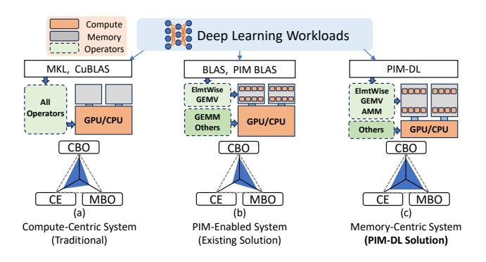

**Figure 1.** Systems Comparison. CBO: Compute-Bound Operators, MBO: Memory-Bound Operators, CE: Cost-Efficiency.

### 1 Introduction

In recent years, commodity DRAM-based processing-in-memory products, exemplified by UPMEM's PIM-DIMM [18], Samsung's HBM-PIM [55], and SK-Hynix's AiM [54], have emerged to enhance DRAM bandwidth while minimizing the data-movement energy consumption. By incorporating processing units near memory banks, these DRAM-PIMs can offer up to 8× higher memory bandwidth and facilitate the processing of various real-world applications such as in-memory databases [6-8, 48, 62], sparse tensor algebra [31], classic machine learning [34], and genome analysis [21, 58], etc. While DRAM-PIMs have found utility in deep learning applications, their focus primarily lies in memory-intensive layers such as element-wise and GEMV operators [13, 59]. Nevertheless, for typical DNN workloads, element-wise operators only contribute less than 15% of the end-to-end latency [23], while GEMV operators are predominantly utilized in singlebatch GPT/LSTM inference [13, 59]. For contemporary DNN serving scenarios in cloud, it is the GEMM operators within linear layers that pose the main bottlenecks [23]. However, none of these DRAM-PIM products have demonstrated the ability to efficiently handle GEMM operators in DNNs.

A primary limitation of DRAM-PIMs in deep-learning acceleration is their restricted computational ability. As DRAM-PIMs implement compute units using the DRAM process, the transistors are 3× slower, and the logic density is several times lower compared to CMOS in the same technology node [19]. Even worse, DRAM chips usually have fewer metal layers, leading to a lower routing density at the same time. Due to these technical constraints, DRAM-PIMs can hardly incorporate powerful compute units. Consequently, the peak computational capacity of UPMEM PIM-DIMM is merely 43.8 GOP/s per DIMM [33]. Samsung's HBM-PIM [55] and SK hynix's GDDR-PIM (AiM) [54] equip dedicated vector units to enhance their tensor-processing ability. HBM-PIM has about 2 TB/s of bandwidth but only 1.2 TFLOP/s of computing capability per cube [55]. Similarly, using high-frequency MAC units, SK-Hynix's AiM reaches about 1 TFLOP/s per chip. However, the GEMM operators widely used in DNNs

usually require more than 10 TOP/s of computational capacity to ensure sufficient throughput[47]. Therefore, DRAM-PIMs are extremely compute-bound and only applicable for memory-bound operators, such as ReLU [68], Residual [36], Layer-norm [5] and Matrix-Vector Multiplication, etc [59].

To compensate for the limited computational ability, existing PIM-enabled systems (Figure 1-(b)) heavily rely on powerful hosts to handle compute-heavy GEMM operators. Although this improves overall performance, it also leads to higher manufacturing costs. Moreover, due to the majority of computation still happening on the host processors, the utilization of DRAM-PIMs becomes too low to motivate the adoption of DRAM-PIMs in modern data-center systems.

To extend the applicability of DRAM-PIMs for deep-learning, we urgently require a PIM-friendly deep-learning paradigm. In this context, the emerging LUT-NN (Lookup Tablebased Neural Network) algorithm [84] becomes a promising solution. It substitutes GEMM in linear layers with table lookups, avoiding extensive multiplications. However, there are three fundamental challenges hindering the application of LUT-NNs on DRAM-PIMs. First, existing LUT-NN algorithms fail to provide satisfactory model accuracy when replacing all linear layers in a DNN with LUTs. Second, current deep learning frameworks do not support DRAM-PIMs as the hardware backend. Third, due to the architectural limitations present in existing DRAM-PIMs, translating the advantages of LUT-NNs into actual speedup is also challenging.

In this paper, we introduce the PIM-DL framework to tackle these challenges. PIM-DL mainly focuses on the optimization of Transformer-based DNNs [87], the de-facto approach in computer vision (CV) and neural language processing (NLP) areas. PIM-DL incorporates a LUT-NN conversion front-end that transforms pre-trained DNNs to LUT-NNs through calibration. The converted models can be efficiently deployed on commodity DRAM-PIMs using a LUT-NN inference backend. To ensure model accuracy, we introduce the enhanced LUT-NN (eLUT-NN) algorithm for efficient model calibration. Unlike baseline LUT-NN algorithms, eLUT-NN can replace all layers with LUTs using only less than 1% of the calibration dataset. To translate the computation reduction achieved by LUT-NNs into actual speedup on DRAM-PIMs, we elaborate the hardware mapping of LUT-NN inference and quantitatively model the dataflow. Then, we develop an auto-tuner to find the best mapping automatically. As shown in Figure 1-(c), PIM-DL enables offloading most operators to DRAM-PIMs and only requires a wimpy host for the small portion of the remaining operators. Compared to the PIM-enabled solution in Figure 1-(b), such a memorycentric system can potentially achieve higher cost-efficiency. To summarize, we have made the following contributions:

 We propose PIM-DL, the first deep-learning framework designed for commodity DRAM-PIMs using the novel LUT-based deep-learning paradigm. (Section 4.1)

- We propose an enhanced LUT-NN (eLUT-NN) algorithm for model calibration, which achieves much higher model accuracy with 100× fewer calibration data. (Section 4.2)
- We design the mapping of LUT-NN on DRAM-PIMs and quantitatively model the dataflow. An auto-tuning framework is proposed to optimize the mapping on different DRAM-PIM platforms. (Section 5)

We evaluate PIM-DL on the off-the-shelf UPMEM PIM-DIMM platform and simulated HBM-PIM/AiM platforms. Compared with GEMM-based inference on PIM-DIMM/HBM-PIM/AiM, PIM-DL achieves up to 22.57×/37.06×/27.25× speedup. Compared with CPU/GPU baselines, PIM-DL achieves up to 3.54×/1.20× speedup. PIM-DL is open-sourced at https://github.com/leesou/PIM-DL-ASPLOS.

## 2 Background & Motivation

#### 2.1 Memory-Centric Computing with DRAM-PIMs

To deal with the well-known "Memory-Wall" problem, researches have proposed DRAM-based in-memory processing architectures (DRAM-PIMs) over the past decades [2-4, 25, 27, 28, 35, 37, 38, 50, 52, 56, 60, 63, 75, 77, 80, 90, 91, 94, 96, 101]. In recent few years, DRAM-PIMs have entered the commercialization phase, as demonstrated by various products listed in Table 1. Notably, UPMEM has introduced the first DDR4-PIM product named PIM-DIMM [18]. They place programmable RISC cores near every DRAM memory bank, resulting in a remarkable 8× increase in total bandwidth. Additionally, Samsung has proposed HBM-PIM products [55], designed to efficiently process memory-bound basic linear algebra subprograms (BLAS) that do not benefit from on-chip cache, such as scalar-vector, vector-vector, and matrix-vector operations. SK-Hynix has also developed their PIM product named AiM, based on GDDR6 memory, which exhibits significant potential in accelerating LSTM models [54].

## 2.2 Limited Computation Ability of DRAM-PIMs

Commodity DRAM-PIMs have exhibited outstanding performance in accelerating a wide range of workloads [6-8, 21, 31, 48, 58, 62]. Despite these achievements, their application in deep learning remains an open challenge. Prior efforts have employed HBM-PIM [59] and AiM [13] to offload specific types of operators, such as ReLU, Residual, Batch Normalization, and GEMV. However, these element-wise operators typically contribute only < 15% of the overall execution time [23]. Furthermore, while HBM-PIM and AiM can accelerate single-batch GPT/LSTM inference, which primarily involves GEMV operators for linear layers, cloud-based scenarios often require batched inference [24, 29, 47, 81, 103] and heavily rely on compute-heavy GEMM operators. Consequently, existing DRAM-PIM systems still depend on a powerful host to handle these computation-heavy parts in DNNs. We refer to these systems as PIM-enabled Systems,

**Table 1.** Comparison of Commodity DRAM-PIMs

| Product         | PIM-DIMM [18]       | HBM-PIM [55]    | AiM [54]        |
|-----------------|---------------------|-----------------|-----------------|
| Technique       | DDR4                | HBM2            | GDDR6           |
| PIM Units       | RISC Cores          | FP16 MAC        | BF16 MAC        |
| Peak Bandwidth  | 80.4 GB/s per DIMM  | 2 TB/s per cube | 1 TB/s per chip |
| Peak Throughput | 43.8 GOP/s per DIMM | 1.2 TFLOPS      | 1 TFLOPS        |

as illustrated in Figure 1-(b). When the workloads are not PIM-friendly, a PIM-enabled system falls back to a traditional compute-centric system shown in Figure 1-(a), but with higher manufacturing costs.

To extend the applicability of commodity DRAM-PIMs for deep learning, a possible direction is to make DNNs more PIM-friendly by reducing their computational requirements. For instance, Prangon et al. [16] proposes to convert CNNs to binary neural networks [66] to enable their deployment on UPMEM's PIM-DIMM. However, BNNs reduce computation at the cost of greatly sacrificed model accuracy, which can hardly be applied to large models such as BERT [20] and ViT [22] models. Therefore, how to design a practical and PIM-friendly DNN algorithm is yet to be explored.

## 3 LUT-based Deep Learning Paradigm

Compute-heavy GEMM operations have been identified as the primary bottleneck for DNN inference on commodity DRAM-PIMs. Apparently, such a challenge is eliminated if we can substitute GEMM operators with lighter alternatives. In this context, the recently proposed LUT-NN algorithms emerge as a promising solution [9, 84]. The key insight of LUT-NN is that for a given layer, the features of different input activation matrices have block-wise semantic similarity, allowing a few typical features, also named *centroids*, to approximate the original values. Accordingly, the GEMM between any inputs and the weight matrix can be converted to the multiplication between centroids and the weight matrix. By getting the centroids in advance, the partial-sums between the centroids and the weight matrix can be precomputed and stored in look-up tables (LUTs). During inference, we just need to fetch and accumulate the pre-computed data in the LUTs according to the indices of the centroids closest to the inputs, as illustrated in Figure 2-(a). Such a partial-sum reduction procedure can greatly reduce the computation overheads compared with GEMM operators. In the following sub-sections, we will first elaborate on LUT-NN's conversion and inference procedure. Then, we will analyze the the affinity between LUT-NN and DRAM-PIMs.

## 3.1 LUT-NN Conversion

As shown in Figure 2-(b), LUT-NN conversion aims to transform the original weight matrix (depicted as the green matrix) into look-up tables (LUTs) and centroids, The centroids are organized into several codebooks. To achieve this, the

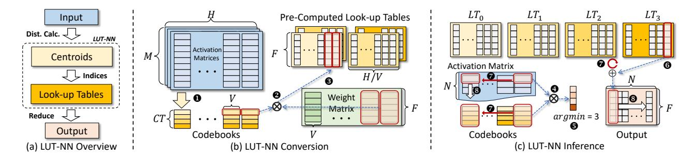

Figure 2. LUT-NN-Based Deep Learning Paradigm

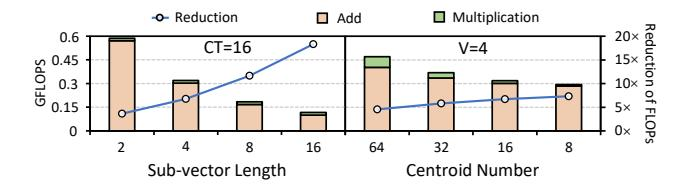

**Figure 3.** Computation Reduction Analysis (N=H=F=1024).

process starts by deriving codebooks through centroid clustering on activation matrices (step  $\bullet$ ). Each  $M \times H$  activation matrix, obtained by feeding calibration datasets into a DNN, is divided into  $1 \times V$  sub-vectors along the H dim, resulting in  $\frac{H}{V}$  columns in total. A codebook is then generated for each column, containing CT centroids (e.g., CT = 4 in the figure). Each centroid is a  $1 \times V$  vector, and its values are obtained through K-means clustering of activation sub-vectors within the same column and across activation matrices.

Once the  $\frac{H}{V}$  codebooks are obtained through clustering on the calibration datasets, we proceed to generate the LUTs using the codebooks and weight matrix. The weight matrix with a shape of  $F \times H$  is also split into  $1 \times V$  sub-vectors along the H dim, and inner-products are performed with the codebooks (step ②). For example, in the figure, the first sub-vectors of the two rightmost codebooks are multiplied with the two rightmost columns in the weight matrix, respectively, which generates the  $F \times 2$  results in the look-up table (step ③). Once all results are generated, it derives CT look-up tables, each with a shape of  $F \times \frac{H}{V}$ . At this stage, we have successfully converted the  $F \times H$  weight matrix into several LUTs, which can be used in inference together with the codebooks.

#### 3.2 LUT-NN Inference

The LUT-NN inference procedure is depicted in Figure 2-(c). When given an input activation matrix with a shape of  $N \times H$ , the conventional GEMM procedure performs matrix multiplication with the  $H \times F$  weight matrix, resulting in a  $N \times F$  output matrix. Here, we demonstrate how an approximated result matrix is obtained using the codebooks and look-up tables derived from the LUT-NN conversion procedure.

Similar to the LUT-NN conversion process, the input activation matrix is divided into several  $1 \times V$  tiles. Each tile is

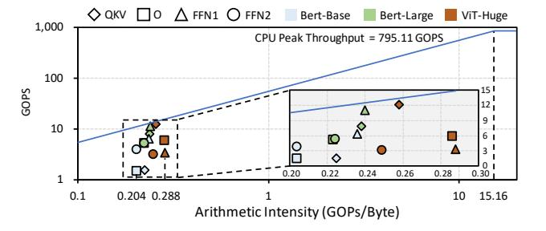

Figure 4. Roofline Analysis of LUT Kernels.

then compared with the codebook of the corresponding column to determine the centroid with the closest L2-distance. This distance estimation is achieved by performing innerproducts between the tile and the codebook (Step 4). The index of the best-match centroid is obtained as the argmin value of the inner-product results (Step 4). Based on this index, we retrieve a column of data from the indexed look-up table (Step 4). For instance, in the figure, if argmin = 3 and the tile corresponds to the right-most column, then the rightmost  $F \times 1$  vector is read from  $LT_3$ . These closest-centroid searching and table look-up operations are repeated for each tile (Step 4-4). For each row of the activation matrix, the searched  $F \times 1$  vectors are accumulated to generate a column of final results (Step 4). After processing all N rows by repeating 4-4, the  $F \times N$  results matrix is formed (Step 3).

## 3.3 Affinity Analysis of LUT-NNs on DRAM-PIMs

LUT-NN based inference is suitable for DRAM-PIMs because of two reasons: First, it greatly reduces the computation overhead. For GEMM with the input shape of  $N \times H$  and  $H \times F$ , we need to conduct  $2 \times N \times H \times F$  operations, half of which are multiply operations. For LUT-NN inference with CT centroids in each codebook and the sub-vector length of V, we need to conduct  $3 \times N \times H \times CT$  operations for index calculation and  $N \times F \times \frac{H}{V}$  for result accumulation. Specifically, LUT-NN inference only incurs  $N \times H \times CT$  multiplications for index calculation. Considering CT is much smaller than F, LUT-NN can greatly reduce the multiplications. In Figure 3, we plot LUT-NN's FLOP count as the bar graphs and use line graphs to illustrate LUT-NN's FLOP reduction

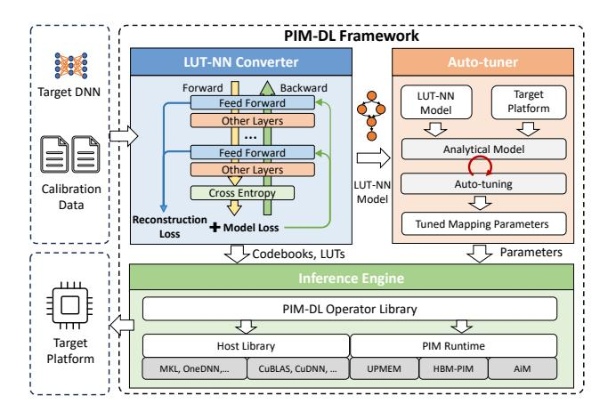

Figure 5. PIM-DL Framework Overview

 $(\frac{FLOP_{GEMM}}{FLOP_{LUT-NN}})$ . We can find that LUT-NN greatly reduces computation (3.66×-18.29×) compared with GEMM operations. What's more, multiplications (the green bar) only take up a tiny fraction of LUT-NN's total operations (2.9%-14.3%).

Second, the memory-intensive nature inherent in the LUT-NN inference makes it suitable for DRAM-PIMs. We conduct roofline analysis on LUT-NN based inference to reveal this characteristic. Specifically, we convert the fully-connected (FC) layers in Bert-Base/Large [20] and ViT-Huge [22] to LUT-NN and evaluate their arithmetic intensity on dual-socket Intel Xeon 4210 CPUs by using Intel Advisor tool [40]. We fuse the Q/K/V projection FC layers into one FC operator and quantize all LUTs to INT8 datatype. The inference batch size and sepuence length are set to 64 and 512, respectively. As illustrated in Figure 4, we can find that the arithmetic intensity of all operators range from 0.204 to 0.288, all of which fall in the memory-bound region of the CPU.

### 3.4 Challenges of Adopting LUT-NNs

Although LUT-NNs enable the deployment of DNN serving on DRAM-PIMs, we point out that three fundamental challenges hinder their application in practice:

C1. Unsatisfactory accuracy of the existing LUT-NN conversion algorithm. The existing LUT-NN conversion algorithm falls short of guaranteeing satisfactory model accuracy. Therefore, [9] only replaces the GEMM in the final classifier layer of DNNs with a lookup table. Although [84] improves upon earlier works, it could still not replace every linear operator. Specifically, [84] could only substitute GEMM in 6 out of the 12 layers of the BERT-base model. If we aim to replace all layers with LUTs, the model's accuracy will become unacceptably low for production environments.

**C2.** Existing DL frameworks do not support DRAM-PIMs as the backend. To deploy converted LUT-NN models on DRAM-PIMs, a deep-learning serving framework that supports both CPU/GPUs and DRAM-PIMs as the backend is necessary. The framework is expected to offload PIM-friendly

operations, especially table lookups to PIMs and the others to the host processors. However, existing inference frameworks [1, 30, 44, 73, 76] do not support commodity DRAM-PIMs, e.g., UPMEM's PIM-DIMM, as the backend.

C3. Tuning the performance of LUT-NNs on DRAM-PIMs is challenging. While LUT-NNs offer promising benefits of reduced computation, how to translate such an advantage into real speedup on DRAM-PIMs is still challenging. This difficulty arises due to the architectural limitations present in existing DRAM-PIMs, such as constrained host-PIM communication and inter-PE communication [33]. As a result, processing LUT-NNs on commodity DRAM-PIMs may yield unsatisfactory performance without taking both algorithm and hardware characters into consideration and properly optimizing the hardware mapping.

To overcome these challenges, we propose the PIM-DL framework, which is introduced in the following sections.

#### 4 PIM-DL Framework

#### 4.1 Framework Overview

Figure 5 outlines the software stack of PIM-DL. To overcome C1, we propose a novel LUT-NN Converter featured with an enhanced LUT-NN calibration algorithm named eLUT-NN. Compared to original LUT-NNs, eLUT-NN is able to replace all linear layers in DNNs with LUTs and maintains high accuracy. To overcome C2, we develop an Inference Engine which implements LUT-NN operators based on host and PIM libraries. To overcome C3, we propose an Auto-Tuner, which analyses the shapes of LUT-NN model and generates the optimized LUT-NN mapping parameters on target hardware platforms. The tuned mapping parameters are fed into the inference engine for efficient LUT-NN serving.

#### 4.2 LUT-NN Converter

The LUT-NN Converter is used to convert a trained DNN model into LUT-NN by jointly calibrating the centroids and DNN weights with calibration datasets. As introduced in Section 3, LUT-NN's clustering-based codebook generation may result in approximation errors. Consequently, the previous method [84] can only replace half of the feed-forward layers to maintain accuracy. To deal with this dilemma, we propose a calibration algorithm named eLUT-NN (enhanced LUT-NN) that can correct the error with minor parameter updates. eLUT-NN introduces two new techniques for model calibration: Reconstruction Loss for computation approximation and Straight Through Estimator for gradient propagation.

Reconstruction Loss for computation approximation: As illustrated in Figure 5, the reconstruction loss accumulates the errors in all replaced layers and constructs LUT-NN's calibration loss L together with the original model loss:

$$L = \text{Model Loss} + \beta \sum_{l \in L} ||\hat{A}_l W - A_l W||^2$$
 (1)

In Equation (1), A represents the original activation matrix, and  $\hat{A}$  denotes the approximated matrix by replacing subvectors with the nearest centroids, i.e.,  $\hat{A}_l = H(A_l)$ . Here we use the function  $H(\cdot)$  to denote the closest-centroid-replacing operation. We define the computation error as L2 distance to ensure the reconstruction loss's differentiability, and add a penalty term  $\beta$  to balance the two loss terms.

The reconstruction loss improves model accuracy and facilitates convergence in two main folds. First, it enables direct gradient propagation. Unlike previous work [84] that updates centroids through layer-by-layer back-propagation, the reconstruction loss directly derives the centroid gradients. This approach can overcome the gradient vanishing problem, allowing for direct gradient updates to the centroids. Second, introducing computation errors to the loss function enables the centroids to learn accurate representations of activations, thus accelerating model's convergence.

Straight Through Estimator for gradient propagation: Since the centroid clustering and table-lookup operators in LUT-NN conversion are not continuously differentiable, we use the Straight Through Estimator (STE) [93] to estimate the gradients and enable back-propagation. Specifically, to differentiate through the closest-centroid-replacing function  $H(\cdot)$  and pass the error to a function F that generates the inputs of a layer, we have the following chain rule:

$$\frac{\partial L}{\partial F} = \frac{\partial L}{\partial \hat{y}} \cdot \frac{\partial \hat{y}}{\hat{A}} \cdot \frac{\partial \hat{A}}{\partial A} \cdot \frac{\partial A}{F} \stackrel{\text{STE}}{\approx} \frac{\partial L}{\partial \hat{y}} \cdot \frac{\partial \hat{y}}{\hat{A}} \cdot \frac{\partial A}{F}$$
(2)

Where  $\hat{y} = \hat{A} \cdot W$  represents the approximated output of the layer. The STE algorithm assigns  $\frac{\partial \hat{A}}{\partial A}$  to identity to pass through the gradients and enable back-propagation. Compared to the Gumbel-Softmax based gradient-estimation used in previous work [84], our STE-based method ensures faster model convergence according to our experiments.

Comprehensive evaluation results in Section 6 will demonstrate eLUT-NN's two advantages over the baseline method: **A1.** *High data efficiency*. Unlike the baseline method [84], which demands 100% training set for model calibration, eLUT-NN only requires less than 1% of the pre-training dataset for calibration, and the model converges more quickly.

**A2.** *High model accuracy.* With the proposed eLUT-NN algorithm, the LUT-NN converter can replace all feed-forward layers of DNNs with LUTs with substantially higher accuracy than the baseline LUT-NN method.

#### 4.3 PIM-DL Engine

As depicted in Figure 6-(a), PIM-DL engine comprises a frontend framework and a backend library. The frontend framework encompasses both host and PIM operators, which cover various operators required by LUT-NNs. The host operators are implemented with high-performance tensor libraries on CPUs/GPUs [30, 41, 42, 69, 70]. The PIM operators contain two components: (1) The PIM kernel on the host triggers

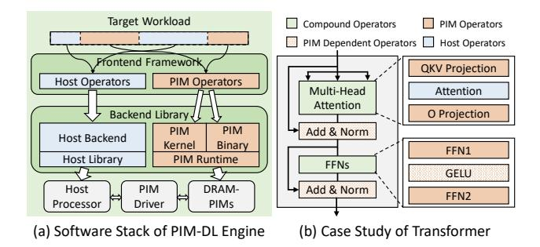

Figure 6. PIM-DL Engine and a Case Study on Transformer.

PIM modules to execute workloads. (2) The PIM binary on the PIM modules describes the offloaded workload. Both host and PIM operators collaborate to implement the LUT-NN's functions. The host processor also controls the PIM binaries' execution via the PIM driver.

Considering transformer has become the de-facto approach in both the neural language processing (NLP) area [11, 20, 64, 78, 79, 92] and the computer vision (CV) area [12, 22, 45, 65, 89, 95], PIM-DL currently mainly focuses on the optimization of transformer-based models. As illustrated in Figure 6-(b), among the basic operators in Transformer [87] models, the QKV projection, Output (O) projection, FFN1, and FFN2 are linear layers. They can be converted to LUTs and offloaded to PIM modules. The attention operator is executed on the host operator, since it cannot be converted to LUTs but requires GEMM operations. The other operators like Add, Norm, GeLU are PIM-friendly element-wise operators. Their offloading choices depend on the functionality supported by target PIM modules.

## 5 Hardware Mapping and Optimization

As analyzed in Section 3.4, considering several architectural limitations of DRAM-PIMs, it is still challenging to efficiently deploy LUT-NNs on DRAM-PIMs. To optimize LUT-NN kernels on different hardware platforms, we design the LUT-NN's mapping strategy and propose the PIM-DL Auto-Tuner, which can generate the best mapping parameters according to the input LUT-NN and the target hardware platform.

In this section, we first present an architecture abstraction of commodity DRAM-PIM products. Subsequently, we delve into a detailed analysis of LUT-NN's mapping on the PIM architecture. Based on this analysis, we model the two essential steps involved in PIM-based LUT-NN operations. We then integrate these steps to establish the PIM-DL Auto-Tuner.

#### 5.1 Abstraction of Commodity DRAM-PIMs

As depicted in Figure 7, a DRAM-PIM system is usually composed of a host processor (e.g., CPU, GPU, FPGA) and multiple PIM modules, which are connected to the host's memory channels. In each PIM module, there are distributed computation nodes, which share the same external data bus. Each

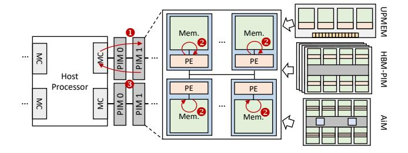

**Figure 7.** Architecture Abstraction of DRAM-PIM Products.

node contains a Processing Engine (PE) and local memory banks. The PE can be either a general CPU core [18] or a specialized computation engine [54, 55], and may also contain on-chip buffers or registers. Since PEs can conduct memory access concurrently, DRAM-PIMs can provide much higher bandwidth than compute-centric architectures.

Existing commodity DRAM-PIMs adopt the *offloading-based execution model*, i.e., operators in workloads are implemented as PIM kernels, which are offloaded to PIMs for execution. As notated in Figure 7, there are three steps to drive the PIM modules to execute the target workload: ① The host processor prepares the input data and sends them to the PIM modules. ② After input preparation, the host launches the PIM kernel, which can be either a chunk of codes implemented in PIM's ISA [18] or a sequence of specified memory commands [55]. ③ After all PEs finish kernel execution, the host fetches the results from PIM modules. It is worth noting that when deploying applications on DRAM-PIMs, we should consider the following architectural limitations:

L1: Constrained Host-PIM communication. As shown in Figure 7, in each PIM module, the PEs collectively share a common memory bus. For example, in UPMEM's PIM-DIMM architecture, each PE can access only an 8-bit data path, and a group of eight PEs in a rank forms a 64-bit data path. Consequently, the host must transfer data to all PEs in a rank simultaneously to fully utilize the bandwidth. Additionally, it has been demonstrated that broadcasting data from the host to PIMs yields the highest bandwidth, primarily due to the avoidance of cache miss at the host side [33].

L2: No direct inter-PE datapath. Due to the scarce on-chip routing resources of DRAM-PIMs [19], no datapath is implemented on UPMEM's PIM-DIMM and HBM-PIM for inter-PE communication. Therefore, PEs rely on host forwarding to exchange data, which involves loading data from one PE to the host's cache, then storing it to the destination PE. Considering the poor host-PIM communication ability, inter-PE communication can easily become the performance bottleneck [102]. Therefore, we should avoid costly inter-PE communication when implementing kernels on DRAM-PIMs.

**L3:** *Load-balancing problem.* Considering that the PIM kernels will be distributed and executed in thousands of PEs, the slowest PE determines the finish time. Therefore, efficient

**Table 2.** Notations Used in PIM-DL Auto-Tuner

| Notation        | Description                                                 |
|-----------------|-------------------------------------------------------------|
| N               | Input index's row count                                     |
| CB              | Codebook number ( $CB = \frac{H}{V}$ )                      |
| CT              | Centroid number                                             |
| F               | Output feature length                                       |
| $X_{s-tile}$    | Tiling factor of <i>X</i> in sub-LUT partition              |
| $X_{m-tile}$    | Tiling factor of X in micro kernel                          |
| $X_{load-tile}$ | Load factor of <i>X</i> in non-static load schemes          |
| $BW_x^{host}$   | Host-PIM bandwidth when transferring tensor <i>x</i>        |
| $BW_x^{pim}$    | Local memory bandwidth when transferring tensor <i>x</i>    |
| #PE             | PE number used during execution                             |
| $STileSize_x$   | Sub-LUT tile size of tensor <i>x</i> transferred to each PE |
| $MTileSize_x$   | On-chip tile size of tensor $x$ during kernel execution     |
| $LCount_x$      | Load count of tensor x during kernel execution              |
| $SCount_x$      | Store count of tensor <i>x</i> during kernel execution      |
| RCount          | Reduce count during kernel execution                        |

load balancing is crucial to minimize the overall execution latency and improve resource utilization.

#### 5.2 LUT-NN's Inference Dataflow on DRAM-PIMs

As introduced in Section 3.2, LUT-NN's inference involves two operators: (1) The closest centroid search (CCS) operator (�-•) in Figure 2). It computes the distance between the activation matrix and the centroids, then searches the centroids with the shortest distance to generate the index matrix. (2) The table lookup (LUT) operator (�-•) in Figure 2). It retrieves the lookup table and accumulates the fetched data to derive output results. As illustrated in Figure 8-(a), when executing LUT-NN on DRAM-PIMs, we offload the LUT operator to PIM modules and assign the CCS operator to the host. We avoid processing CCS on PIM since CCS operators are implemented via GEMM and not suitable for DRAM-PIMs.

Another key problem is how to distribute the LUT tasks to thousands of DRAM-PIM PEs to fully utilize the system's PIM bandwidth. There are two steps to execute LUT on PIM architectures: Step-1: split the workload into sub-LUT workloads, and send each sub-LUT workload to the corresponding PE. Step-2: launch the microkernel on each PE to compute the sub-LUT workloads concurrently. In the following subsections, we will analyze the two steps first. For each step, we will elaborate on the detailed execution dataflow and propose the performance model used for PIM-DL Auto-Tuner. Then, we will put them together to construct the complete design space of LUT-NN inference. The auto-tuner's workflow is finally introduced to search the optimal parameters. To facilitate understanding, we list the notations used in the following sub-sections in Table 2. In these notations, *N*, *CB*, *CT*, *F* specifies the LUT operator's workload shape.  $X_{s-tile}, X_{m-tile}, X_{load-tile}$  are the tiling factors of each tensor.  $BW_r^{host}$ ,  $BW_r^{pim}$ , #PE are parameters related to the underlying DRAM-PIM architecture. The other factors indicate the

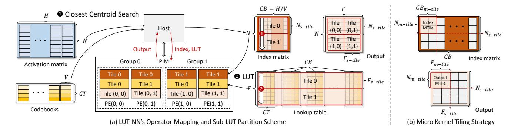

Figure 8. Overview of LUT-NN's Execution Dataflow.

tile sizes or operation counts, which can be deduced from the aforementioned parameters.

**5.2.1 Step-1: Sub-LUT Partition.** According to the PIM architecture abstraction discussed in Section 5.1, we propose the sub-LUT partition scheme as illustrated in Figure 8-(a). In this scheme, the index matrix (outputs of the host-side CCS operation, i.e.,  $\odot$  in Figure 2) and the LUTs are evenly divided along the index row dim (N) and the feature dim (F), respectively, while the other dims remain untiled. In addition, the PIM PEs are logically distributed into multiple groups. PEs in the i-th PE group are responsible for calculating the results of the i-th index tile. The j-th PE in each group is responsible for conducting table lookups between its index tile and the j-th LUT tile. Note that in Figure 8-(a), we use CB to denote  $\frac{H}{V}$  and transpose the CT and CB dims because each index fetches one of the CT pre-computed results.

Such a partition scheme effectively avoids the limitations discussed above. **For L1:** On the one hand, PEs in the same group share the same index tile, and the *j-th* PEs in all groups share the same LUT tile. Tile reuse can enhance the host-PIM communication bandwidth owing to its temporal locality. On the other hand, the codebook dim (*CB*) is not split among PEs, thus ensuring PEs to compute complete results of distinct output tiles and avoiding the extra overhead of partial sum reading and merging. **For L2:** The centroid dim (*CT*) is not split among PEs, so that no inter-PE communication is required when retrieving the LUTs according to the indices. **For L3:** Tiling tensors evenly ensures that each PE's workload size is identical. Since all PEs execute the same micro kernel, we can ensure the load balance among them.

In the example depicted in Figure 8-(a), we use four PEs in total, which are evenly split into two groups. Accordingly,  $\bullet$  the index matrix is split into two tiles (N=8, and  $N_{s-tile}=4$ ), and the i-th tile is broadcast to all PEs in the i-th PE group (i=0,1).  $\bullet$  The LUT is split into two tiles (F=8, and  $F_{s-tile}=4$ ), and the j-th tile is broadcast to the j-th PE in each group (j=0,1). There are four output tiles, and the j-th PE in the i-th group computes output tile (i, j)'s results.

**Analytical Model:** After sub-LUT partition, we need to send the index tiles and the LUT tiles to each PE before launching the micro kernel. After PEs finishing execution, we need to fetch the output results from them. The host-PIM communication dominates the processing cycles. Therefore, assuming the latency of input sending, LUT sending, and output fetching during the sub-LUT partition stage are denoted as  $t_{index}^{sub}$ ,  $t_{lut}^{sub}$ ,  $t_{output}^{sub}$ , respectively, the sub-LUT partition overhead ( $t_{sub-lut}$ ) can be estimated as:

$$t_{sub-lut} = t_{index}^{sub} + t_{lut}^{sub} + t_{output}^{sub}$$
 (3)

In Equation (3),  $t_{index}^{sub}$ ,  $t_{lut}^{sub}$ , and  $t_{output}^{sub}$  can be estimated using the transfer size and the bandwidth. Since the transfer pattern affects the bandwidth [33], we use different notations to represent such divergence:

$$t_x^{sub} = \frac{STileSize_x \times \#PE}{BW_x^{host}}, x \in \{index, lut, output\}$$
 (4)

Note that according to the partition scheme, each PE group holds a index matrix's tile, and each PE in a group is assigned with a LUT table's tile. Therefore, tiling factors in sub-LUT partition should follow the constraint:

$$\#PE = \frac{N}{N_{s-tile}} \times \frac{F}{F_{s-tile}} \tag{5}$$

**5.2.2 Step-2: Micro Kernel Execution.** After sub-LUT partition, the tile size of index matrix, lookup table, and output result in each PE are  $(N_{s-tile}, CB)$ ,  $(CB, CT, F_{s-tile})$ , and  $(N_{s-tile}, F_{s-tile})$ , respectively. To fully utilize PIM PE's on-chip data buffer (e.g. 64KB on each PE in UPMEM PIM-DIMM), we need to further tile these tensors. As illustrated in Figure 8-(b), we conduct tiling along  $(N_{s-tile}, F_{s-tile}, CB)$  dims with tiling factors  $(N_{m-tile}, F_{m-tile}, CB_{m-tile})$ , respectively. In this example, all tiling factors are set to 2. The PIM PE loads one index micro kernel tile (MTile) and the corresponding output MTile each time, then retrieves the LUTs to compute results. For each output MTile, we need to traverse all index MTiles in the same  $N_{m-tile}$ , so that we can reduce data in all codebooks to get the complete results.

**Analytical Model:** The micro kernel's latency  $(t_{micro-kernel})$  is the sum of memory transfer latency  $(t_{transfer})$  and the LUT

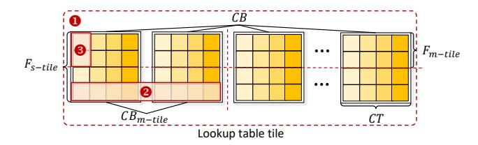

**Figure 9.** Illustration of LUT Load Schemes.

reduce latency ( $t_{reduce}$ ):

$$t_{micro-kernel} = t_{transfer} + t_{reduce} \tag{6}$$

The memory transfer latency  $(t_{transfer})$  is the sum of index load latency  $(t_{index}^{ld})$ , LUT table load latency  $(t_{lut}^{ld})$ , and the output result load-store latency  $(t_{output}^{ld}, t_{output}^{st})$ :

$$t_{transfer} = t_{index}^{ld} + t_{lut}^{ld} + t_{output}^{ld} + t_{output}^{st}$$
 (7)

We can profile the load/store latency of single tile first, and then use the load/store count induced from the tile traversal order to estimate the total latency:

$$t_x^{ld} = \frac{LCount_x \times MTileSize_x}{BW_x^{pim}}, x \in \{input, lut, output\}$$
 (8)

$$t_x^{st} = \frac{SCount_x \times MTileSize_x}{BW_x^{pim}}, x \in \{output\}$$
 (9)

Similarly, we can profile the latency of single reduce ( $t_{single}$   $_{-reduce}$ ) and use the total reduce count to estimate the total reduce latency.  $t_{single-reduce}$  also changes with the underlying DRAM-PIM architecture.

$$t_{reduce} = RCount \times t_{single-reduce} \tag{10}$$

#### 5.3 PIM-DL Auto-Tuner

**Search Space.** PIM-DL auto-tuner utilizes four types of mapping parameters involved in LUT-NN's inference dataflow discussed above to construct the search space:

- **P1.** *Sub-LUT Tiling Factors:* The tiling factors, namely  $(N_{s-tile}, F_{s-tile})$ , not only affect the tile sizes assigned to each PE, but also have influence on the communication pattern (i.e. PE group partition) of each tensor. We can exploit these trade-offs by searching different sub-LUT tiling factors.
- **P2.** *Micro Kernel Tiling Factors:* The tile sizes of index MTile and output MTile are  $(N_{m-tile}, CB_{m-tile})$  and  $(N_{m-tile}, F_{m-tile})$ . We can adjust  $(N_{m-tile}, F_{m-tile}, CB_{m-tile})$  to find the optimal buffer allocation between the two MTiles.
- **P3.** *Tile Traversal Order:* Permuting the traversal order of the MTile factors  $(N_{m-tile}, F_{m-tile}, CB_{m-tile})$  changes the sequence of tile delivery, thus affecting the tile reuse pattern [74]. To exploit the effect of different reuse patterns, we add the tile traversal order to the search space.
- **P4.** *LUT load scheme:* Since the LUT's elements are fetched according to the input index, we can either load the LUT in bulk or on-demand. We include three LUT load schemes into our design space, which are illustrated in Figure 9:

#### **Algorithm 1:** Auto-tuning Workflow

```
1 Input: Workload Size (N, CB, CT, F)
2 Cost = MaxValue
3 MappingParams = \{\}
4 for each \ legal \ (N_{s-tile}, F_{s-tile}) do
5
```

- Static Load. When each PE's LUT MTile size is smaller than the on-chip buffer size, we can place the whole LUT on-chip statically. In this way, we can load the LUT once and reuse it during the execution. We need to hold  $CB_{s-tile} \times CT \times F_{s-tile}$  LUT elements in the on-chip buffer.
- **②** Coarse-grain Load. Since each index selects the target element from every CT candidates, we can load these CT elements to the on-chip buffer and reuse them. In this way, we load  $CB_{load-tile} \times CT \times F_{load-tile}$  elements in the LUT each time. In Figure 9, we set  $CB_{load-tile} = 2$  and  $F_{load-tile} = 1$  for coarse-grain load scheme. These elements will be buffered till the corresponding codebooks have been reduced.
- **6** Fine-grain Load. We can also load the LUT's elements ondemand. In this way, we load  $F_{load-tile}$  LUT values along the feature dim when we process a new index. In Figure 9, we set  $F_{load-tile} = 2$  for fine-grain load scheme. Specifically, if the PE can issue multiple read requests in parallel, we will hold  $F_{load-tile}$  LUT elements for each parallel slot. For example, UPMEM's PE contains multiple hardware threads [18], each of which can issue independent memory requests. Therefore, we keep a buffer with  $F_{load-tile}$  LUT elements for each activated hardware thread.

Among these parameters, the micro kernel tiling factors, tile traversal order, and LUT load scheme jointly construct the micro kernel's mapping space.

**Auto-Tuning Workflow:** PIM-DL auto-tuner's workflow is listed in Algorithm 1. Given the workload size (N, CB, CT, F), PIM-DL auto-tuner traverses all legal sub-LUT tiling factors. For each legal factor pair  $(N_{s-tile}, F_{s-tile})$ , the auto-tuner first calculates  $t_{sub-lut}$ . Then, the auto-tuner searches the micro kernel's mapping space and reports the parameters with the minimum execution latency  $t^*_{micro-kernel}$ . The total execution latency of current sub-LUT tiling strategy is the sum of  $t_{sub-lut}$  and  $t^*_{micro-kernel}$ . By comparing the total execution latency, the auto-tuner generates the most efficient hardware mapping. For a given model, PIM-DL auto-tuner searches for the optimal parameters of all LUT kernels offline. Given

Table 3. Configuration of DRAM-PIM Platforms

|                   | Host     | Xeon 4210 CPU × 2           |  |  |
|-------------------|----------|-----------------------------|--|--|
| DDR4-PIM Platform | поя      | 128GB DDR4 Memory           |  |  |
| DDR4-FIM Flatform | DRAM-PIM | UPMEM PIM-DIMM $\times$ 8   |  |  |
|                   |          | 1024 PEs, 64 GB DDR4 Memory |  |  |
|                   | Host     | NVIDIA A2 GPU × 1           |  |  |
| HBM-PIM Platform  | поя      | 16 GB GDDR6 Memory          |  |  |
| (Simulated)       | DRAM-PIM | Samsung HBM-PIM Cube × 4    |  |  |
|                   | DKAM-FIM | 512 PEs, 8 GB HBM2 Memory   |  |  |
|                   | Host     | NVIDIA A2 GPU × 1           |  |  |
| AiM Platform      | поя      | 16 GB GDDR6 Memory          |  |  |
| (Simulated)       | DRAM-PIM | SK-Hynix AiM Chip × 16      |  |  |
|                   | DKAM-FIM | 512 PEs, 16 GB GDDR6 Memory |  |  |

the input shape, each model need to be tuned only once, which only incurs little overhead (~1s/model on dual-socket Intel Xeon 4210 CPUs) compared with the latency of model inference (tens of seconds/model on our UPMEM platform).

#### 6 Evaluation

## 6.1 Experiment Setup

**Models:** For accuracy validation, we evaluate eLUT-NN on both NLP and CV tasks. Specifically, for NLP tasks, we evaluate the popular BERT-base and BERT-large models [20] on the GLUE [88] benchmark dataset. For CV tasks, we evaluate ViT-base and ViT-huge [22] on the CIFAR-10 and CIFAR-100 [53] datasets. For throughput comparison, since the model size of BERT-base is identical to ViT-base, we evaluate the BERT-base, BERT-large, and the ViT-huge models, whose hidden dim sizes are 768/1024/1280, respectively.

Platforms: Our main experiments are conducted on a real DRAM-PIM platform, namely UPMEM PIM-DIMM [18]. The configuration details are presented in Table 3. This platform equips dual-socket Intel Xeon 4210 CPUs. Each socket designates two channels for conventional DDR4 DIMMs and two channels for UPMEM PIM-DIMMs. Each of the 8 PIM-DIMMs contains two ranks, and each rank equips 64 PEs. The host operators are implemented with C++/OpenMP [14] and GGML tensor library [30], which leverages AVX intrinsics to accelerate inference on x86 CPUs. The PIM operators are implemented with the UPMEM SDK [86] (Version 2021.3.0).

Given that Samsung's HBM-PIM and SK-Hynix's AiM have not been available yet, our evaluation of PIM-DL on these potential platforms is conducted through simulation. We use the simulator officially released by Samsung [71] and extend it to support AiM's functionality. An NVIDIA A2 GPU serves as the host for the two PIM products. We implement the host operators with Pytorch [76] and conduct simulations to estimate the PIM operators' performance.

**Baselines:** We compare eLUT-NN with the baseline LUT-NN [84] in term of accuracy. Both algorithms adopt full-layer replacement. The original model accuracy is obtained from BERT and ViT papers [20, 22]. For throughput evaluation, we compare PIM-DL on DDR4-PIM with GGML [30]-based

**Table 4.** NLP Model Accuracy

| Model      | Settings | MNLI | QQP  | QNLI | SST-2 | CoLA | STS-B | MRPC | RTE  | Avg. |
|------------|----------|------|------|------|-------|------|-------|------|------|------|
| BERT-base  | Original | 83.4 | 71.2 | 90.5 | 93.5  | 52.1 | 85.8  | 88.9 | 66.4 | 79.0 |
|            | LUT-NN   | 35.5 | 63.2 | 50.6 | 49.3  | 0.0  | 1.36  | 31.6 | 52.7 | 35.5 |
|            | eLUT-NN  | 79.9 | 69.6 | 87.4 | 92.4  | 51.2 | 83.2  | 87.1 | 64.7 | 76.9 |
| BERT-large | Original | 85.9 | 72.1 | 92.7 | 94.9  | 60.5 | 86.5  | 89.3 | 70.1 | 81.5 |
|            | LUT-NN   | 34.7 | 62.7 | 51.3 | 52.2  | 0.0  | 4.40  | 38.7 | 50.5 | 36.8 |
|            | eLUT-NN  | 82.1 | 71.0 | 90.2 | 93.1  | 56.8 | 86.7  | 86.1 | 68.4 | 79.3 |

**Table 5.** Vision Model Accuracy

| Model    | Settings | CIFAR-10 | CIFAR-100 | Model    | Settings | CIFAR-10 | CIFAR-100 |
|----------|----------|----------|-----------|----------|----------|----------|-----------|
|          | Original | 98.5     | 91.4      |          | Original | 99.5     | 94.55     |
| ViT-base | LUT-NN   | 10.1     | 1.07      | ViT-huge | LUT-NN   | 10.0     | 1.01      |
|          | eLUT-NN  | 96.3     | 89.1      |          | eLUT-NN  | 97.8     | 91.32     |

transformer inference on a CPU server which equips dual-socket Intel Xeon Gold 5218 CPUs (8 channels, 512 GB DDR4 memory). The baselines adopt FP32/INT8 datatype, and the INT8 baselines are optimized with AVX/AVX2 intrinsics in GGML. We compare the HBM-PIM/AiM based PIM-DL with a DGX-1 workstation equipping 32GB NVIDIA V100 GPUs. On the DGX station, we implement FP32-based model inference with PyTorch [76]. Besides, we also compare the HBM-PIM/AiM based PIM-DL with GEMM-based inference on these platforms. In these baselines, we offload all linear layers to DRAM-PIMs, and implement other GPU-side operators with PyTorch [76]. We adopt FP16 datatype on the HBM-PIM platform and BF16 datatype on the AiM platform. In all baselines, we use the model architectures proposed in Bert/ViT papers [20, 22] without pruning/sparsification.

#### 6.2 Model Accuracy

During calibration, all models are initialized using the pretrained model weights, and the centroids are initialized randomly. We set the sub-vector length and the centroid number to 2 and 16, and set the reconstruction loss penalty term  $\beta$  to 1e-3 for BERT models, 1e-4 for ViT models. The learning rate is 1e-5 for BERT-large and 5e-5 for other models. The tokens used in LUT-NN calibration are randomly sampled from the datasets using the dataloader provided by Pytorch.

Table 4 and 5 presents the accuracy results. We can find that even though the original LUT-NN algorithm consumes the whole training set, it still has great accuracy degradation (90.44%/44.10% average drop on CV/NLP tasks) when all linear layers are replaced. eLUT-NN models reach convergence after no more than 100k iterations and consume only ~0.78% of tokens in the training set. Besides, eLUT-NN greatly enhances the accuracy compared with the baseline LUT-NN (88.09%/41.95% average improvement on CV/NLP tasks) and also achieves accuracy close to the original models (2.36%/2.25% average drop on CV/NLP tasks).

#### 6.3 End-to-end Performance

**Throughput:** We first compare DDR4-PIM based PIM-DL's performance against the CPU server. For BERT-base and

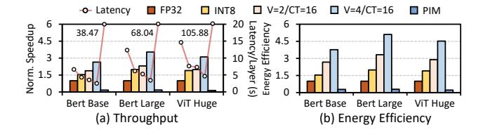

Figure 10. End-to-end performance comparison.

BERT-large, we set the sequence length to 512 and the batch size to 64. For ViT-huge model, we set the shape of an input image to 224×224×3, and the batch size is 128. Under a patch size of 14×14, ViT-huge's sequence length is 257. We pad the sequence length to 264 to evenly partition the workload among PIM PEs. Considering UPMEM's low FP32 computation capacity, we conduct INT8 quantization on the LUTs, which reports ≤ 0.1% accuracy drop. On the CPU server, we evaluate the inference performance with FP32/INT8 data precision. For PIM-DL's inference, we set CT=16 and V=2 or 4. We also evaluate the performance by offloading all linear layers without LUT-NN conversion.

As Figure 10-(a) shows, we plot the speedup as bar graphs and use line graphs to illustrate the inference latency (recorded in second). Compared with FP32/INT8 inference on CPU server, PIM-DL achieves 2.05×/1.14× geomean speedup under the V=2/CT=16 setting and further achieves 3.07×/1.71× geomean speedup under the V=4/CT=16 setting. Besides, compared with the model inference performance on PIM architecture, PIM-DL achieves 12.61×/18.91× geomean speedup under the two settings, respectively. PIM-DL successfully enables deep learning on UPMEM's commodity PIM-DIMMs and brings considerable performance improvement.

Energy Efficiency: We compare the energy consumption (in Joules) of DDR4-PIM based PIM-DL agsinst the baselines on the CPU server. We adopt Intel RAPL [43] to measure the CPU's energy. We adopt the power provided by dpu-diag tool in UPMEM SDK [86] for PIM-DIMM's energy estimation, which reports ~13.92W/DIMM@350MHz. It is the static power of both the PIM cores and the PIM banks. Considering PIM-DIMMs do not use dynamic voltage and frequency scaling (DVFS), this static power is close to PIM-DIMM's dynamic power. Besides, this power is also in alignment with the power officially released by UPMEM [19]. The memory access energy between the CPU and the PIM-DIMMs is measured using the MSR\_DRAM\_ENERGY\_STATUS register provided by Intel RAPL following Intel's manual [39]. As illustrated in Figure 10-(b), all results are normalized to FP32 CPU baseline. Compared with FP32/INT8 inference on the CPU server, PIM-DL achieves 2.95×/1.65× (V=2/CT=16) and 4.42×/2.46× (V=4/K=16) higher energy efficiency (geomean). Compared with PIM-based original model inference, PIM-DL achieves 11.16× (V=2/CT=16) and 16.74× (V=4/CT=16) higher energy efficiency (geomean).

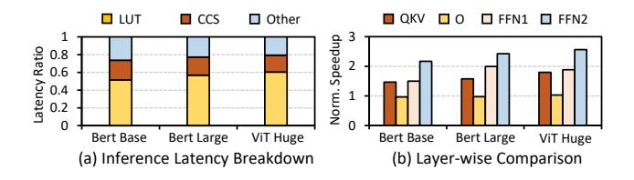

Figure 11. Performance analysis.

## 6.4 Performance Analysis

Latency Breakdown: To better understand the performance improvement of PIM-DL, we first breakdown the latency of PIM-DL into LUT operator's latency, CCS operator's latency, and other operators' latency. As depicted in Figure 11-(a), LUT-NN inference takes up 73.73% ~ 79.39% of total latency. Specifically, the LUT operator's latency takes up 69.88% ~ 76.10% of LUT-NN inference latency, and thus takes up 51.52% ~ 60.41% of total latency. Such results demonstrate that PIM-DL can offload much more portion of deep learning workloads than existing PIM-enabled systems, which considerably improves DRAM-PIM's utilization.

Layer-wise Performance Comparison: We further analyse the speedup of each linear layer with the replacement of LUT-NN. We compare their performance between LUT-NN inference (V=4/CT=16) and GEMM-based INT8 inference on the CPU server. As depicted in Figure 11-(b), these layers can bring 1.81× geomean speedup in total, and each of them can gain 1.61×, 0.99×, 1.78×, and 2.38× geomean speedup, respectively. FFN2 gains the highest performance improvement because it has the largest inner dim in GEMM operations. For QKV projection and FFN1, we can also gain better performance because they have large output feature dims. Even for the smallest O projection, PIM-DL's performance is also comparable to the CPU server's performance.

## 6.5 Sensitivity Analysis

To explore the scalability of DDR4-PIM based PIM-DL, we conduct sensitivity analysis and change four parameters: sub-vector length (V), centroid number (CT), batch size, and hidden dim. By default, we set V=4, CT=16, sequence length to 512, and batch size to 64 for all models. All results are normalized to CPU server's INT8 inference performance.

Sub-vector Length: As depicted in Figure 12-(a), when the sub-vector length is larger, we can gain better performance because larger sub-vector length decreases codebook number, thus shrinking the LUTs' size. However, the performance improvement tends to coverage because UPMEM product's bandwidth decreases when transfer size shrinks [33].

Centroid Number: In Figure 12-(b), we can find that when centroid number shrinks, we can gain better performance because the LUTs' memory footprints decrease. Similar to sub-vector length, the performance improvement has slight tendency to converge with centroid number decreasing.

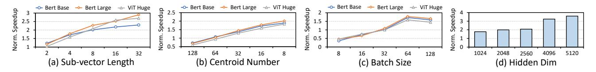

Figure 12. Sensitivity analysis of different parameters.

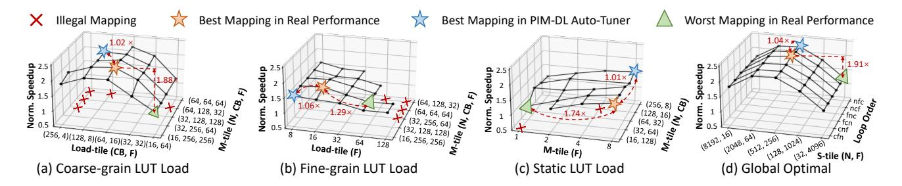

Figure 13. Illustration of LUT-NN inference's mapping space.

**Batch Size:** As Figure 12-(c) shows, when the batch size is small, the CPU server outperforms PIM-DL. That is because when executing small kernels on UPMEM PIM-DIMMs, the poor host-PIM communication bandwidth becomes the main bottleneck [31, 33, 48]. When the PIM kernel becomes larger, such issue will be alleviated.

**Hidden Dim:** We also exploit the performance when changing the hidden dim size. We select several commonly used hidden dim sizes from [99] and illustrate the results in Figure 12-(d). PIM-DL achieves 2.44× geomean speedup against the CPU server. Specifically, when the hidden dim size comes to 4096, PIM-DL gains much better performance because CPU server has poorer scalability than PIM-DL.

#### 6.6 Mapping Space Visualization

To visualize LUT-NN's mapping space on UPMEM's PIM-DIMM, we take BERT-large's FFN1 layer as a case study. The workload shape (N, CB, CT, F) is (32768, 256, 16, 4096), and we set  $(N_{s-tile}, F_{s-tile})$  to (16384, 8) for static LUT load scheme, and (512, 256) for the other LUT load schemes. As shown in Figure 13, we illustrate the neighborhood of the best mapping parameters under three LUT load schemes and depict the global optimal parameters when changing sub-LUT tiling factors and tile traversal order.

**Sub-LUT Tiling Factors:** As depicted in Figure 13-(d), changing  $(N_{s-tile}, F_{s-tile})$  can bring up to  $1.91\times$  performance gap. That is because when  $N_{s-tile}$  or  $F_{s-tile}$  is large, the skew of tile size leads to higher host-PIM communication overhead. **Micro Kernel Tile Size:** For coarse-grain or fine-grain LUT load schemes, the average performance gap brought by changing micro kernel tile sizes is  $1.04\times$ . However, for static LUT load scheme, changing micro kernel tile sizes can bring up to  $1.74\times$  performance gap. That is because under the static scheme,  $F_{m-tile}$  is bounded by  $F_{s-tile}$ : To hold the LUTs on PE's on-chip buffer, we can only set  $F_{s-tile}$  to at most 8 under

the given workload shape. PE's DRAM bandwidth does not saturate and increases rapidly under such a low  $F_{m-tile}$ .

Tile Traversal Order: From Figure 13-(d), we can infer that changing the tile traversal order brings little performance divergence. That is because due to the wimpy computation capacity of PEs in UPMEM's product, the accumulation latency takes up most of the micro kernel's execution latency, which diminishes the benefit of exploiting on-chip data reuse. LUT Load Scheme: As illustrated in Figure 13-(a)~(b), adjusting load tile sizes can bring considerable performance gap. That is because the offsets of on-chip tiles are also computed by the PE. Since the on-chip buffer's bandwidth is related to the instruction number [33], we need to set moderate load tile sizes to fully utilize the on-chip buffer's bandwidth.

**Auto-Tuner Analysis:** As illustrated in Figure 13, the parameters provided by PIM-DL Auto-Tuner bring  $\leq$ 6% performance degradation. Besides, the average error of performance estimation is 3.44%, and the max error is 13.73%. The PIM-DL auto-tuner can help us to automatically find a near-optimal parameter for given workloads.

#### 6.7 PIM-DL on HBM-PIM and AiM

Apart from UPMEM PIM-DIMM, we also evaluate PIM-DL on HBM-PIM/AiM products via simulation. We set the transformer's sequence length to 128, and adjust the batch size from 1 to 8. The hidden dims are selected from [99]. We assume PIM instructions carry the LUT indices and drive the execution of PEs during PIM-DL's inference.

We first compare the performance between PIM-DL and the normal DNN inference on the two products. As depicted in Figure 14, PIM-DL achieves 23.94×/19.06× geomean speedup on HBM-PIM/AiM, respectively. When the batch size increases, PIM-DL's performance gain increases by up to 2.23×, because larger batch sizes are unfriendly to the two products. On the other hand, when the hidden dim increases,

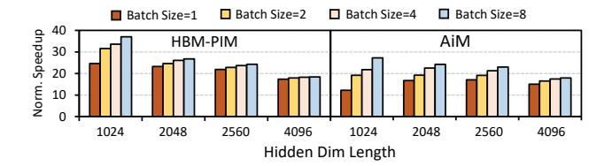

Figure 14. Normal PIM-based DNN inference VS. PIM-DL.

the speedup of PIM-DL against the baselines slightly shrinks. This is because HBM-PIM and AiM's dataflow is optimized for processing matrices with flat shapes.

We also compare PIM-DL on the two products with a V100 GPU baseline running FP32 models. As illustrated in Figure 15, AiM-based PIM-DL outperform NVIDIA V100 GPU by up to 1.20×, while HBM-PIM-based PIM-DL can only achieve 39% of V100's performance (geomean). That is because the huge computation capacity gap between V100 GPU (130 TFLOPS) and HBM-PIM (4.8 TFLOPS). For AiM, since the computation capacity is much higher than HBM-PIM (16 TFLOPS), PIM-DL can provide comparable performance against inference on the V100 GPU.

