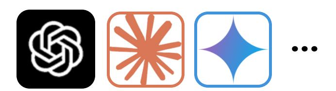
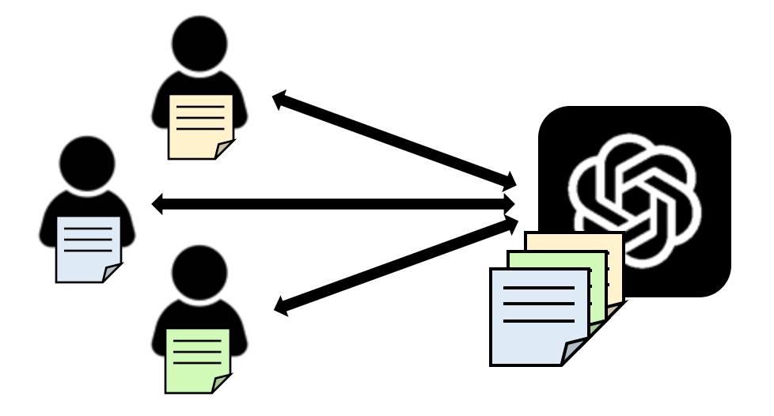
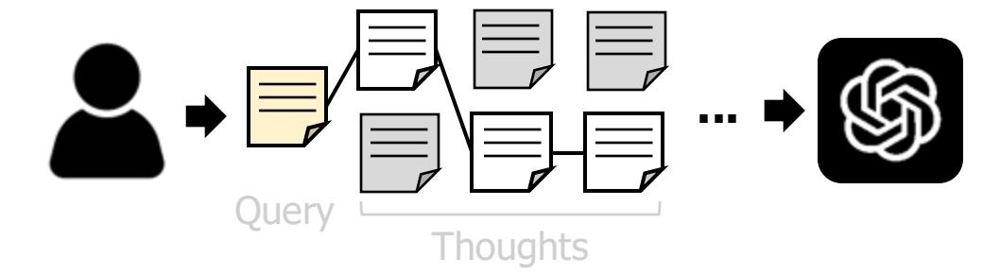
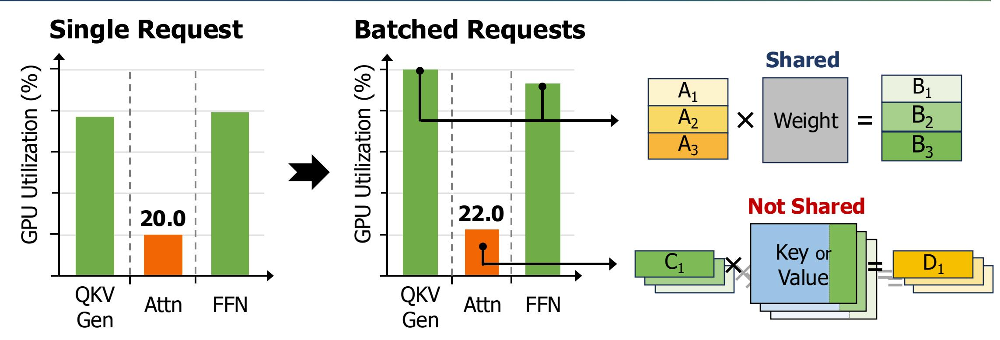

## **Oaken: Fast and Efficient LLM Serving with Online-Offline Hybrid KV Cache Quantization**

#### **Minsu Kim\***

Seongmin Hong\*†

RyeoWook Ko

Soongyu Choi

Hunjong Lee†

Junsoo Kim†

Joo-Young Kim†

Jongse Park

KAIST

† HyperAccel

\* Co-first authors who contributed equally to this work

## **LLM Serving at Scale**

▪ LLM serving system should simultaneously handle **a large number of, long-context requests**

#### **Large Batch Size**

LLM serving system batches multiple requests (+10,000) from users

#### **Long Context Length**

Recent LLM tasks (e.g., RAG, reasoning) involve over tens of thousands of tokens

## Larger Batch & Longer Context put pressure on Memory Capacity & Bandwidth

## KV Cache Matters for "Bandwidth"

- \* NVIDIA A100, Llama2-13B, context length: 1K
- Increasing batch size improves utilization except for attention operation
- Attention operation is bandwidth-bound due to un-sharable KV cache

## **KV Cache Matters for "Bandwidth"**

- \* NVIDIA A100, Llama2-13B, context length: 1K
- Increasing batch size improves utilization except for attention operation
- Attention operation is bandwidth-bound due to un-sharable KV cache

