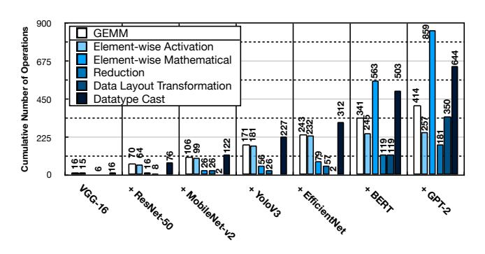
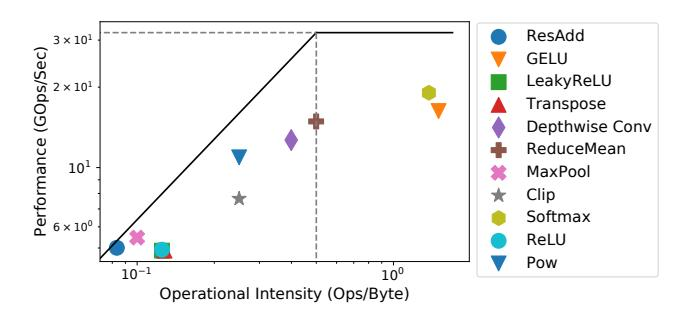

# 2 A Deep Dive into Non-GEMM Operations

#### 2.1 Characteristics of Non-GEMM Operations

Non-GEMM operations are significantly diverse. Table 1 summarizes the non-GEMM operators used for inference across a set of diverse DNN models. We extract these operations from their corresponding ONNX implementations [70]. These layers can be categorized into five classes: (1) element-wise mathematical operations, (2) element-wise activation functions, (3) reduction-based operations, (4) data layout transformation operations, and (5) data type conversion operations. Non-GEMM operators fundamentally differ from GEMM ones. They exhibit a wide diversity in terms of compute operations ranging from simple mathematical operations (e.g. Add, Mul, etc.) to complex ones (e.g. GeLU, Exp, etc.) as opposed to the commonly used multiply-accumulate in GEMM layers. Moreover, they require various patterns of mapping between input and output tensors, from one-to-one in element-wise operations to many-to-one in reduction-based ones.

Usage frequency of non-GEMM operations is continuously growing. Figure 2 shows the usage frequency of the GEMM and non-GEMM operators across the studied benchmarks. We extract this data from the ONNX graph representation of each model and categorize them with respect to the classification in Table 1. The y-axis shows the cumulative usage of these operators as additional models are taken into account. The last group of bars show the total cumulative usage of operators across all benchmarks. As shown in Figure 2, as additional models are covered, the cumulative number of non-GEMM operations noticeably surges. Additionally, taking the entire benchmarks into account (last bar), merely 15% of total DNN operator nodes are GEMMs.

Non-GEMM operations impose non-trivial runtime overheads in newer DNNs. Figure 3 shows the runtime breakdown of benchmark DNNs for three design choices: (1) a GEMM unit with an off-chip CPU (Baseline (1) in Figure 3), (2) a GEMM unit coupled with a set of dedicated units and the same off-chip CPU (Baseline (2) in Figure 3), and NVIDIA A100 GPU that leverages tensor cores and INT8 execution mode. Section 7 describes the experimental methodology to obtain these results. Figure 3 reports the runtime breakdown across the time spent on GEMM layers, non-GEMM layers, and PCIe communications (for the case of Baselines (1) and (2)). As the non-GEMM layers become more diverse and complex

**Figure 2.** Cumulative number of GEMM and non-GEMM operations across benchmarks. Last bar covers the frequency of usage across all the models.

**Figure 3.** Runtime breakdown of benchmark DNNs across various platforms.

in newer models such as EfficientNet, BERT, and GPT-2 they also become the main source of the execution bottleneck. For instance, the execution of non-GEMM layers take up 73% of the runtime for EfficientNet for the GPU.

Non-GEMM operations are interspersed amongst GEMM operations. Figure 4 depicts the core and frequently used subgraphs of three representative DNNs. As shown, the non-GEMM operators are interspersed amongst the GEMM ones (e.g. Conv) with various forms of connectivity. This structure demands back-and-forth data exchange between GEMM and non-GEMM units through off-chip or on-chip memory. On top of this data exchange, tensor reformatting such as datatype casting and tensor layout transformations may be required. For instance the GEMM unit may operate with INT-8/16 mode, while the non-GEMM unit operates in FP32 mode.

The majority of non-GEMM operations are memory-bound. The majority of non-GEMM layers are element-wise operations (>80%). Moreover, the ones that are not element-wise exhibit low

**Figure 4.** Repeated subgraphs of (a) ResNet-50 [44], (b) MobileNetv2 [89], and BERT [26]. The gray ovels illustrate the non-GEMM operations and white rectangles show the GEMM-based operations.

Figure 5. Roofline model for a number of prevalent non-GEMM operators.

compute intensity and data reuse. Figure 5 shows a roofline [111] analysis for a set of prevalent non-GEMM operators. As shown, most of the analyzed operators (other than Softmax and GeLU) fall within the memory-bound region of the roofline. This is in contrast to Conv/GEMM operations that are generally compute-bound [112]. This distinction necessitates architecture design considerations.

#### 2.2 Requirements for Executing Non-GEMM Operations

Inspired by the above characteristics, below we list three key requirements to efficiently execute non-GEMM operations.

R1: In-tandem execution of GEMM and non-GEMM operations. To reduce the data exchange among consecutive layers (GEMM and/or non-GEMMs) through off-chip memory, prior work suggests layer fusion [6, 15, 75, 80]. Layer fusion preserves the intermediate activation values stationary on the chip for subsequent DNN operations. To leverage this technique, the intermediate activations ought to be communicated between GEMM and non-GEMM units via on-chip memory subsystem for a sequence of fused layers. However, this data communication at the granularity of entire layer outputs is neither trivial nor efficient, due to the limited on-chip memory of the accelerators and reduced utilization of GEMM and non-GEMM units (Figure 8 shows the impact on utilization). In essence, the data transfer ought to be performed at a finer granularity of a chunk of output tensor, a.k.a tile. This fine granularity of coordination requires the non-GEMM unit to seamlessly work in tandem with the GEMM unit, while retaining minimal data transfer and reformatting overhead.

R2: Balanced efficiency and programmability for the non-GEMM unit. The diversity of the non-GEMM operators calls for

**Table 2.** Comparison of prior approaches for supporting non-GEMM operators with this work.  $^\dagger$  indicates that these aspects are supported partially.

| Design classes                            | Working in tandem with GEMM Unit | Specialization | Programmability | Execution Control |
|-------------------------------------------|----------------------------------|----------------|-----------------|----------------------|
| Offchip CPU fallback                      | X                                | ×              | V               | V                    |
| Dedicated on-chip hardware units       | ~                                | V              | ×               | X                    |
| Onchip RISC-V core (+ dedicated units) | <b>X</b> ↑                       | <b>X</b> ↑     | ✓               | 1                    |
| General purpose vector unit            | <b>✓</b>                         | <b>X</b> ↑     | ✓               | X                    |
| This work (Tandem Processor)              | V                                | V              | V               | V                    |

a degree of programmability in the hardware. Nonetheless, this should not emerge at the cost of noticeable efficiency reductions. This is important because the inefficiency of the non-GEMM unit can potentially make it the performance bottleneck and result in stalling the GEMM unit. Therefore, striking a balance between programmability and specialization is crucial.

R3: Orchestrating the execution across non-GEMM and GEMM units. Having both GEMM and non-GEMM acceleration units in one coherent system requires adequate support for execution orchestration. In particular, (1) DNN nodes need to be effectively dispatched to their pertinent processing units, (2) GEMM and non-GEMM units need to diligently synchronize and handshake together at the right time to realize in tandem execution and back-and-forth interactions.

#### 2.3 Existing Approaches for Executing Non-GEMM Layers

Table 2 compares prior methods with respect to the aforementioned requirements. Below, we discuss them in details.

Class (1): Off-chip CPU fallback. This approach presumed by a large number of prior work [9, 10, 16, 17, 22, 35, 36, 45, 65, 79, 82, 92, 100, 113, 118, 119] provides ultimate programmability and handles the end-to-end execution orchestration. However, it impedes the performance due to the lack of specialized execution and in tandem execution with the GEMM unit, which the latter is caused by the nontrivial back-and-forth data transfer between the GEMM unit and CPU over PCIe and required data conversions (e.g. integer to float and vice versa).

Class (2): Dedicated on-chip hardware units. An alternative strategy [3, 8, 11, 13, 18, 19, 27, 28, 33, 39, 43, 46, 51, 56, 57, 61, 62, 72, 78, 90, 91, 94, 95, 99] is to equip the GEMM unit with a set of dedicated units customized for specific non-GEMM operations. These dedicated units can often be tightly integrated with the GEMM unit (work in tandem), but do not offer execution orchestration. Another drawback is, it is not scalable to augment neural accelerators with dedicated units for each single type of non-GEMM operation. This also prohibits the accelerator to support emerging non-GEMM operations as a result of evolving DNNs. In the case of unsupported operations these accelerators must still fall back to an off-chip CPU. Class (3): On-chip RISC-V core. The on-chip core in these designs [37, 102] executes the non-GEMM operators and controls on-chip resources. Gemmini [37] extends the RISC-V ISA with a set of dedicated units/instructions for a limited set of non-GEMM layers. Although this approach obviates off-chip CPU communication, but still the overheads of datatype casting and layout conversion remain, blocking in tandem execution. More importantly, the onchip core that has a single ALU lacks in terms of compute power

and efficiency to process the non-GEMM layers and can become the execution bottleneck.

Class (4): On-chip general-purpose vector unit. Nvidia Streaming Multiprocessor (SM) units [\[76\]](#page-15-23) that consist of tensor cores (GEMM units) and CUDA cores (general-purpose vector units) belong to this design class. Another notable example is the Vector Processing Unit (VPU) in Google's TPU [\[49,](#page-15-22) [50,](#page-15-4) [58\]](#page-15-28) and other industrial designs [\[33,](#page-14-9) [105,](#page-16-19) [107\]](#page-16-20). Vectorized execution leverages the inherent parallelism in non-GEMM layers for increased performance improvement. Additionally, these vector units often work in tandem with the GEMM units. However, these units do not handle the execution control [\[50,](#page-15-4) [76\]](#page-15-23) and fall short in terms of specialization. Other related industry designs include SiFive x280 [\[96\]](#page-16-26) and Meta MTIA v1 [\[32\]](#page-14-26). SiFive x260 is a multi-core vector processor with RISC-V vector extensions for deep learning workloads. The design does not include a GEMM unit but provides a set of communication protocols that can be leveraged to integrate this multi-core vector processor with a GEMM unit. Another design point is Meta's MTIA v1. This design comprises a grid of Processing Elements (PEs). Each PE comprises a GEMM unit and three other units to support non-GMEM operations: (1) a SIMD array of dedicated units to support activation functions and typecast operations, (2) a general-purpose core with RISC-V vector extensions to provide further programmability for more complex non-GEMM operations, and (3) a memory layout unit that support transpose/reshape types of operations. In a sense, this design follows both Class (2) and Class (4) of accelerators and includes both dedicated units and general-purpose vector cores.

### 2.4 Our Approach

In this paper we offer the Tandem Processor as a specialized companion SIMD processor that operates in tandem with the GEMM unit, while striking a balance between customization and programmability. In addition, it orchestrates the end-to-end execution, eliminating the need for an additional CPU.

