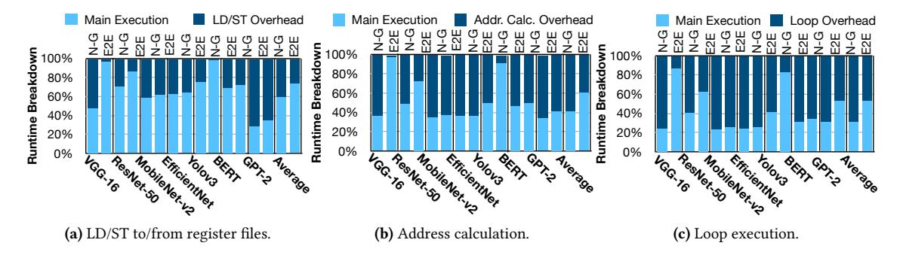
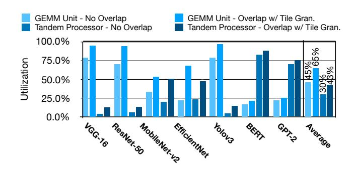
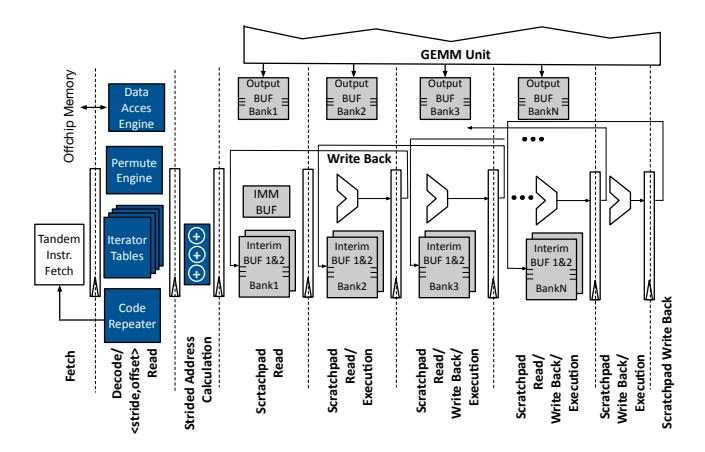

# 3 Design Considerations for the Tandem Processor

### 3.1 Memory Subsystem Design

The low computational intensity and the sizable tensor operands for non-GEMM operators prompt the memory subsystem to repeatedly stream data from off-chip memory. Thus, a locality-oriented hierarchical memory sub-system (i.e., vector register file and cache(s)) and conventional load/store data communication, necessitate an excessive number of memory instructions to deliver off-chip data to/from vector register files, funneling through the memory hierarchy. To address this, we use the following insight: Non-GEMM layers most often operate on statically-structured tensor operands with a-priori known dimensions in a streaming fashion. The Tandem Processor replaces the entire vector register file and cache hierarchy with a collection of single-level software-managed on-chip scratchpads. This design innovation is in contrast to all prior SIMD designs that rely on register file execution and memory semantics (e.g. Google's VPU [\[58\]](#page-15-28)). As shown in Figure [6a,](#page-5-1) these load/store operations to vector register files on average impose 41% and 27% runtime overhead for non-GEMM operations and end-to-end execution, respectively. To manage data movements between off-chip/on-chip memories, we design a Data Access Engine. This unit can be configured and invoked by few explicit load/store instructions per tile to fetch entire tensors. Such data movement merely appears at the boundary of a tile, blocking any further intervention from the off-chip memory.

#### 3.2 Specialized On-Chip Data Access Mechanism

Using large on-chip scratchpads submits a new challenge as fitting the scratchpad addresses in an Instruction Word as opposed to IDs of registers would require significant increase in instruction length. In addition, on-chip address calculations require excessive number of arithmetic instructions. For instance, per two-operand arithmetic/logic instruction, three extra instructions would be required solely for address calculation. As Figure [6b](#page-5-2) shows, this address calculation would impose runtime overheads: On average, 59% of the runtime for non-GEMM layers and 40% of end-to-end DNN runtime. To tackle this challenge, we devise a dedicated pipeline stage for address calculation at the front-end, relieving the burden of address calculation from compute units.

We regulate walking over each dimension of tensor operands by a tuple of ⟨Offset, Stride⟩. Hence, if these tuples can be embedded in a single instruction along with compute operations, upon being inferred at the decode stage, the scratchpad addresses can be calculated in parallel with compute operations. Yet, providing three such tuples for a non-GEMM layer would still require significant increase in instruction length. Instead, we forge scratchpad accesses through indirect strided address calculations. Figure [7](#page-5-3) illustrates this feature. We formulate these strided accesses using ⟨Scratchpad ID, Iterator Index⟩ format. The Scratchpad ID is used to select the corresponding scratchpad iterator table and the Iterator Index points to an entry in the Iterator Table. Each entry in the Iterator Table stores a tuple of ⟨Offset, Stride⟩ for each operand. This design optimization realizes the embedding of strided addresses and compute operations into a single 32-bit instruction word (See Section [5\)](#page-7-0). With this mechanism the Tandem Processor supports address calculation as well as compute operation on the same pipeline path with shared control and no extra runtime overhead. This is in contrast to prior work [\[81,](#page-16-27) [103,](#page-16-28) [115\]](#page-16-29) which leverage decoupled access/execute engines with register files/FIFOs for data access and address generation.

### 3.3 Specialized Loop Execution

Non-GEMM layers are formed of nested loops of primitive operations with pre-determined iteration counts. As Figure [6c](#page-5-4) shows, using conventional loop logic (i.e. conditional branch) incurs on average 70% and 47% runtime overhead for non-GEMM layers and end-to-end DNN execution, respectively. To alleviate this, we devise specialized loop execution semantics, while removing the branch prediction logic.

To that end, the Tandem Processor uses software-managed tables in the fetch pipeline stage to orchestrate the execution of nested loop constructs in hardware. Prior to execution, these tables are configured once with the iteration counts and corresponding number of nested loop levels. Once configured, these specialized tables are used repeatedly in conjunction with the iterator tables to execute the loop body. This is crucial, since appropriate ⟨Offset, Stride⟩ tuples need to be employed at each level of loop nest to correctly calculate the scratchpad addresses. This specialized loop execution is unique to the Tandem Processor, as prior work [\[20,](#page-14-27) [103\]](#page-16-28)

**Figure 6.** Analyzing the overheads of non-GEMM execution eliminated by design considerations in the Tandem Processor, individually. "N-G" and "E2E" denote the runtime for Non-GEMM and End-to-End execution. These experiments are performed on the Tandem Processor + GEMM unit with Table 3 configurations with all hardware specializations and compiler optimizations, except the ones under evaluations.

Figure 7. Indirect strided address calculation for scratchpad accesses.

leveraged hardware-managed loop logic with register-file based designs and did not offer mechanisms to combine it with address calculation.

#### 3.4 Arithmetic Logic Units Design

ALU operations. To support a diverse set of non-GEMM layers, one approach would be to use dedicated specialized instruction for each layer. However, this would lead to a design similar to the second class in Section 2.3. We instead leverage the feasibility of implementing complex non-GEMM layers with a set of simple primitive operations [5, 54]. For instance, GeLU operator can be implemented using five multiplications, three additions, a sign, an absolute, and a minimum operations. We consider a union set of these primitives that is comprehensive enough to support non-GEMM layers shown in Table 1. Hence, the Tandem Processor offers better hardware resource utilization and reuse across a larger set of operations.

ALU precision and datatype. Prior works show that integer-only arithmetic can be used for inference execution of CNNs [48, 114] and transformers [54] with virtually no repercussions on accuracy. Also, while GEMM and few non-GEMM layers (e.g., Relu) are amenable for low-precision INT8 implementation [48], some non-GEMM layers such as ResAdd and Softmax require INT32 [54, 114]. To provide sufficient precision for all non-GEMM operators, we use INT32 for the Tandem Processor ALUs. As a complementary benefit, additional data casting from GEMM to non-GEMM unit is not needed, since GEMM units typically accumulate the partial results in INT32 precision [16, 35, 49, 50, 54, 95]. To support lower

Figure 8. Resource utilization analysis.

precision for GEMM, a datatype casting instruction is required when activations move from non-GEMM to GEMM unit.

#### 3.5 Integration with the GEMM Unit

Coordination granularity. We use tile (sub-tensor) granularity for software pipelining to facilitate execution overlap between GEMM and non-GEMM units, improve resource utilization, and better conform with limited on-chip memory capacity. As Figure 8 shows, the in tandem coordination of the GEMM unit and the Tandem Processor at tile granularity increases the compute resource utilization by 20% and 13% for the GEMM unit and the Tandem Processor, respectively. Note that an operand-level granularity is less efficient. This is because some non-GEMM operators, such as depthwise convolution, require arbitrary accesses to GEMM outputs for consecutive operations. This access pattern results in frequent stalls, curtailing the overall performance.

Communication mechanism. To enable tile-based coordination, one probable approach is to directly move/copy tiled data from the GEMM unit's Output BUF to the Tandem Processor's private scratchpads. However, this design decision incurs communication overhead at the boundary of each accelerator units, requiring complex coordination mechanism. Alternatively, we enable a fluid ownership of the GEMM unit's Output BUF for the Tandem Processor, obviating redundant data communications. After the GEMM unit completes storing the intermediate data in the Output BUF, the Tandem Processor takes the ownership of the buffer and directly executes its computations on the stored data.

Figure 9. The Tandem Processor pipeline microarchitecture. The ALU and scratchpad reads/write stages are interleaved to improve frequency.

Synchronization mechanism. To enable this fluid ownership while simplifying hardware, we leverage the compiler to weave a set of synchronization instructions (See Section [5\)](#page-7-0) between GEMM and non-GEMM instructions those realize the following: (1) They identify the code regions for GEMM unit and the Tandem Processor, facilitating the instruction dispatch. (2) They define the flow of execution between GEMM and non-GEMM units. (3) They govern the handshaking mechanism between the acceleration units. For instance, enforcing the release of ownership of the Output BUF after the Tandem Processor completes the execution.

