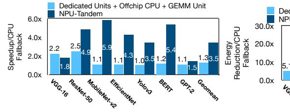
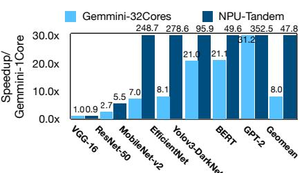
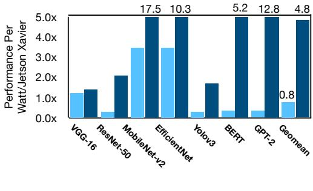
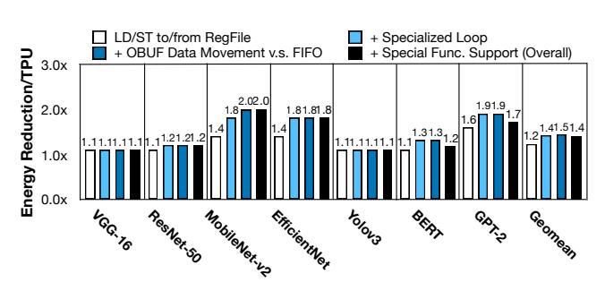
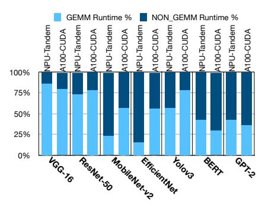
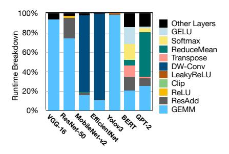
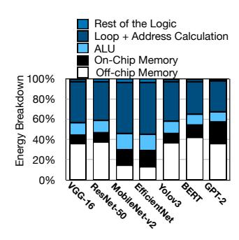
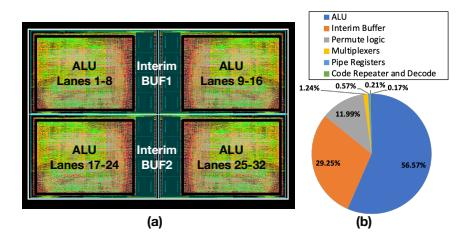

# 8 Experimental Results

### Comparisons to offchip CPU fallback and dedicated units.

Figure [14](#page-11-0) compares performance of the NPU-Tandem with baselines (1) using offchip CPU fallback and (2) using dedicated units. The results are normalized to the baseline (1). On average, the NPU-Tandem provides 3.5× and 2.7× speedup compared to baseline (1) and baseline (2), respectively. The Tandem Processor not only eliminates the overheads of communication with offchip over PCIe and improving resource utilization, it also minimizes the overheads of instruction orchestration and data access compared to the general purpose CPU. The improvements provided by the Tandem Processor are more pronounced for MobileNet-v2 (5.9× over baseline (1) and 5.4× over baseline (2)) and BERT (5.4× over baseline (1) and 4.5× over baseline (2)) due to the use of more complex non-GEMM operations in their structure (depth-wise convolution in MobileNetv2 and large number of mathematical and transpose operations in BERT) that significantly affect the total runtime. Figure [15](#page-11-0) compares the energy reduction benefits of Tandem Processor. On average, the NPU-Tandem reduces the total energy consumption by 39.2× and 20.6× compared to baseline (1) and baseline (2), respectively. These large improvements are due to the significant time that baselines (1) and (2) spend on the power-hungry off-chip CPU (as shown in Figure [3\)](#page-2-2) with a TDP of 165 Watts as opposed to 2.7 Watts in the Tandem Processor. The results show that generally as DNNs evolve and use more complex structures and non-GEMM operations, the benefits of the Tandem Processor grow.

Comparison to Gemmini. As Figure [16](#page-11-0) shows, on average, the NPU-Tandem provides 47.8× performance improvements. Figure [16](#page-11-0) also evaluates the improvements over an extended version of Gemmini that integrates the same number of RISC-V cores as the number of SIMD lanes in the Tandem Processor. On average, using multiple cores improves the performance of Gemmini by 8.0×. Compared to this design point, the NPU-Tandem provides 5.9× speedup, on average (with maximum of 35.3× for MobileNet-v2 and minimum of 0.9× for VGG-16).

To understand the sources of improvements, Figure [17](#page-11-1) shows the runtime breakdown of Gemmini (default setting of one RISC-V core) across its three main components of GEMM unit, dedicated units, and RISC-V core. For MobileNet-v2 and EfficientNet, Gemmini spends a large amount of time ( 90% of runtime) on its im2col dedicated unit to convert the depth-wise convolutions to a series of GEMM operations. This not only requires a time-consuming im2col operation, but also results in additional GEMM operations with low resource utilization. On the other hand, the Tandem Processor executes these operations natively and more efficiently without any need for im2col and overlaps them with other convolutions, as well. For YoloV3, BERT, and GPT-2 RISC-V core is the bottleneck. These DNNs require a significant number of complex mathematical operations such as Leaky ReLU in YoloV3 and GeLu, ReduceMean, Sqrt, Softmax, etc, in BERT and GPT-2, not supported by dedicated units. Note that, Gemmini uses one single RISC-V core (with 40% more area than the 32-lane Tandem Processor), which has one ALU to process all these operations on large tensors. For ResNet-50, still RISC-V core is the bottleneck, because of the last AveragePool layer (this layer takes the average of 7×7 feature maps for 2048

channels). In contrast, the Tandem Processor minimizes the cost of these operations and seeks to overlap them with GEMM ones. These results show that for DNNs with more complex non-GEMM layers, paying the cost of PCIe and using a high-performance offchip CPU (and dedicated units) provides better performance than an on-chip CPU in Gemmini.

Performance comparison to Google's TPU. Figure [18](#page-11-2) compares the end-to-end performance of the NPU-Tandem to a TPU-like design that leverages the general-purpose VPU for non-GEMM layers. According to the Google's patent on VPU [\[58\]](#page-15-28), we considered the following specializations for TPU: 1) strided address generation for LD/ST between DRAM and scratchpad, 2) strided address generation for LD/ST between scratchpad and vector register file, 3) software-pipelining of GEMM and non-GEMM through FIFOs, and 4) supporting specialized instructions for mathematical functions such as exp, sqrt, clip, etc.. As such, the benefits of Tandem Processor over VPU stem from 1) removing the vector register file and its LD/ST overheads, 2) supporting specialized nested loop execution, and 3) software-pipelining through reading from OBUF directly as opposed to FIFOs. On the other hand, supporting special functions in VPU can boost its performance over the NPU-Tandem. Figur[e18](#page-11-2) analyzes the impacts of these four design decisions individually. For each benchmark four bars are reported. The first bar shows the speedup achieved only by removing RegFile and its LD/ST overheads, the second shows the impact of specialized loop execution on top of the RegFile LD/ST, the third shows speedup when the benefits of OBUF data movement is also considered on top of two previous decisions, and finally the last bar includes the slowdown impact of not supporting specialized functions as well. In another word, the last bar includes the impacts of the four design decisions and is the final end-to-end speedup. On average, the NPU-Tandem offers 2.6× speedup. Among the four design decisions, supporting specialized loop execution in the Tandem Processor provides the maximum speedup, 2.1× on average. The benefits due to this design decision are more pronounced for MobileNet-v2 and EfficientNet with depth-wise convolution layers, an operation with five nested loops. The second most effective technique is eliminating the register file and its associated LD/ST operations from/to scratchpad, providing 1.4× speedup on average. GPT-2 enjoys the maximum benefits from this specialization with 2.9× speedup. Direct data access through OBUF in the Tandem Processor as opposed to moving data through FIFOs across GEMM unit and VPU, provides 1.1× speedup on average, while not having hardware support for special functions causes 0.8× slowdown on average. Having the hardware support and dedicated instructions for special functions provides maximum benefits for VPU for BERT and GPT-2, since complex mathematical operations such as sqrt and exp (for softmax) are heavily used in their structure. Note that this speedup comes at the cost of extra area and design complexity for VPU which its quantification would require access to the exact hardware implementation that is not publicly available. Overall considering the impact of four design decisions, MobileNet-v2, EfficientNet, and GPT-2 show the most benefits for NPU-Tandem, while VGG-16 showing the least. Energy comparison to Google's TPU. Figure [19](#page-11-3) shows the end-toend energy reduction achieved by the NPU-Tandem over TPU+VPU while analyzing the impact of the aforementioned design decisions individually. On average, the NPU-Tandem provides 1.4× energy re-

duction. Among the benchmarks the benefits are more pronounced

**Figure 14.** Performance comparison to offchip CPU fallback and dedicated units.

Figure 15. Energy reduction comparison.

Figure 16. Comparison with Gemmini [37].

RTX 2080 TI NPU-Tandem

Figure 17. Gemmini time breakdown.

Figure 20. Comparisons to Jetson Xavier and RTX 2080-TI GPUs.

**Figure 18.** Performance comparison to TPU+VPU and analyzing the contribution of each Tandem Processor's specialization.

**Figure 19.** Energy reduction over TPU+VPU and analyzing the contribution of each Tandem Processor's specialization.

for MobileNet-v2, EfficientNet, and GPT-2 (2.0×, 1.8×, and 1.7×, respectively), while VGG-16 and Yolov3 observes the minimum benefits (1.1×). Eliminating the RegFile and its LD/ST overheads provides the maximum energy reduction with the average of 1.2×. Specialized support for nested loop is the second most effective

technique. Although specialized loop management provides significant speedups, its energy benefits are less pronounced due to their amortization across the SIMD lanes of the VPU. Support for specialized functions in VPU realizes 7% lower energy for TPU, on average, by replacing several primitive operations with a single yet more complex instruction.

Comparison to Jetson Xavier and RTX 2080 TI GPUs. Figure 20 compares the performance-per-Watt benefits with Jetson Xavier NX and RTX 2080 TI GPUs, where the results are normalized to Jetson Xavier. RTX 2080 TI is less energy-efficient compared to mobile Jetson Xavier (20% lower on average). However, the NPU-Tandem provides 4.8× improvements, compared to Jetson Xavier. The trends in the results remain almost similar to the previous analyses with MobileNet-v2 exhibiting the maximum benefits. RTX 2080 TI is more efficient than Jetson Xavier for MobileNet-v2 and EfficientNet, because it can better parallelize the depth-wise convolutions across its abundant threads, compared to Jetson Xavier that employs relatively less number of threads.

Comparison to the A100 GPU. Figure 21 compares the end-to-end speedup of the NPU-Tandem to the A100 GPU with TensorRT and CUDA execution in an iso-TOPs setting. On average, the NPU-Tandem offers similar performance to A100 GPU with TensorRT execution (2.5% improvements) and 4.0× speedup compared to the A100 with CUDA execution. The NPU-Tandem outperforms A100 with TensorRT for ResNet-50, MobileNet, EfficientNet, BERT, and GPT-2, while A100 providing better performance for VGG-16 and Yolov3 that are mainly composed of heavy GEMM operations. Compared to A100 with CUDA execution, the NPU-Tandem provides maximum benefits for MobileNet-v2 and BERT.

Figure 22 shows the runtime breakdown across GEMM and non-GEMM operations for the NPU-Tandem and A100 GPU with CUDA

**Figure 21.** Performance comparison to A100 with CUDA and TensorRT execution, in iso-TOPs setting. Results are normalized to CUDA execution.

**Figure 22.** Runtime breakdown analysis for the scaled-up Tandem Processor and A100 GPU with CUDA execution in iso-TOPs setting.

**Figure 23.** NPU-Tandem speedup for non-GEMM operations over A100 in iso-TOPs setting.

execution. The NPU-Tandem accelerates both GEMM and non-GEMM operations compared to A100 with CUDA execution. However, for DNNs that have larger portion of non-GEMM runtime on A100 (e.g., MobileNet, EfficientNet, BERT, and GPT-2), NPU-Tandem provides larger end-to-end speedups, demystifying the impact of accelerating the non-GEMM operations using the Tandem Processor. This trend in speedups still holds while comparing to TensorRT as well, since the benchmarks mentioned above are those with the largest speedups by the NPU-Tandem with respect to this mode of execution (see Figure 21).

Figure 23 compares the performance of the Tandem Processor to A100 CUDA Cores for performing only non-GEMM operations in an iso-TOPs/resources setting. The Tandem Processor accelerates the non-GEMM operations for all benchmarks and on average provides 3.4× speedup compared to A100 CUDA Cores. The benefits are more pronounced for BERT (8.0×), ResNet-50 (5.2×), and MobileNet-v2 (4.5×). Although GPT-2 comprise a large portion of non-GEMMs similar to BERT, the performance of scaled-up Tandem Processor is mainly bounded by the memory bandwidth for this DNN and hence showing relatively lower speedup compared to BERT.

Runtime breakdown analysis for the Tandem Processor. Figure 24 shows the runtime breakdown of the NPU-Tandem across GEMM and various non-GEMM layers. As the result show, non-GEMM layers are very diverse in terms of execution runtime. The proposed specializations in the Tandem Processor significantly reduce the overhead of non-GEMM layers in DNNs such as VGG-16, ResNet-50, and Yolov3. On the other hand, some DNN layers such as depthwise convolution in MobileNet-v2 and EfficientNet, GELU and transpose in BERT, and ReduceMean in GPT-2 still take a significant portion of runtime. Compared to the baselines, GEMM layers only become a more significant runtime component, when the highly specialized Tandem Processor is used to reduce the overheads of non-GEMM layers.

Energy breakdown analysis for the Tandem Processor. Figure 25 shows the energy breakdown of the Tandem Processor across off-chip memory accesses, on-chip memory (Interim BUF) accesses, ALU logic, loop + address calculation logic, and the rest of the Tandem Processor logic (decode, muxing logic, etc.) Although non-GEMM layers are memory bound operations, but off-chip memory accesses take about only 31% of the total energy on average, due to the seamless integration of Tandem Processor and the GEMM unit which minimizes the number of off-chip data transfer. The

on-chip memory accesses take 13% of the total energy, on average, due to removing overheads of register files and associated memory hierarchy from the design. ALU logic takes 12% of the total energy because of leveraging integer primitive implementation philosophy in its design. Overall, the nested loop execution control and scratchpad address calculation logic takes the majority of the energy consumption in the Tandem Processor (40%), since they handle the heavy lifting portion of the overall execution.

**The Tandem Processor layout.** Fig. 26(a) shows the layout of the Tandem Processor. Fig. 26(b) shows the post-layout area breakdown. ALU logic occupies the largest area (56.6%), Interim BUF 1 & 2 is the second (29.2%) and the permute logic is the third (12.0%). The rest of the area is mainly for muxing logic, pipeline registers, Code Repeater and decode logic.

## 9 Related Work

Section 2.3 covers the related work on supporting non-GEMM layers. Below, we discuss the prior work on SIMD/vector units.

Designing general-purpose SIMD units, vector ISA extensions, and compilation for them have been largely explored in academia [21, 29, 34, 55, 64, 71, 73, 109, 110] and industry products such as Intel AVX-512 [2], ARM SVE [1], RISC-V vector extensions [4], and etc.. Digital Signal Processors (DSPs) [20, 23, 66, 74, 103, 106, 116] are more specialized SIMD units that often come with VLIW architectures. Qualcomm Hexagon DSP [20] and MediaBreeze DSP [103] provide hardware-managed loop executions that work with their register file/FIFOs. MediaBreeze [103] also leverages a decoupled access-execute architecture to handle address generation for streams of data, which are fed into SIMD ALUs through FIFOs. ARM Helium [116] incorporates a set of DSP extensions such as low-overhead branch and scatter-store/gather-load instructions. In contrast, our design completely departures from register-file-memory semantics. This fundamental design choice enables Tandem Processor to eliminate explicit address calculations that are conventionally carried over registers and replace them with a customized loop logic. Additionally, the front-end of the pipeline in Tandem Processor handles memory access while in conventional designs this is normally in the back-end stages. This is also different from the prior SIMD units with Access-Execute architectures (e.g. MediaBreeze) that pass data to the execute units through FIFOs. In Tandem Processor, Access and Execute are part of the same pipeline and there are no FIFOs.

**Figure 25.** Energy breakdown of the Tandem Processor

**Figure 26.** (a) Tandem Processor layout and (b) area breakdown in 65nm node.

Finally, the combination of not using register files/FIFOs with the loop logic is a new design feature in Tandem Processor.

### 10 Conclusion

The increasing prevalence of neural networks and advancements in language models prompt a reevaluation of neural accelerator design. In the last ten years, the research community has primarily concentrated on GEMM operations while overlooking non-GEMM operations. This has created a misconception that neural networks are solely composed of matrix multiplications. Furthermore, as deep learning has evolved and entered new domains, the non-GEMM operations have diversified and been interwoven in various structural patterns within neural networks. As such, to run neural networks end-to-end, there has been a need to consider non-GEMM layers as a first class citizen. To address this timely need, this paper proposes the Tandem Processor that brings forth a novel architecture along with a compiler and an innovative programmable ISA. Moreover, this architecture, which is the result of 10 years of research in building NPUs also enables adapting to the volatile landscape of deep learning algorithms. The Tandem Processor has become the heart of our open-source GeneSys project, a parametrizable NPU generator with a full-stack, multi-target compilation stack that goes from

Python to accelerated execution of LLMs and other DNNs. GeneSys provides comprehensive NPU solutions for applications ranging from high-end datacenters to ultra-low-power brain-implantable devices and is publicly available at https://actlab-genesys.github.io/.

