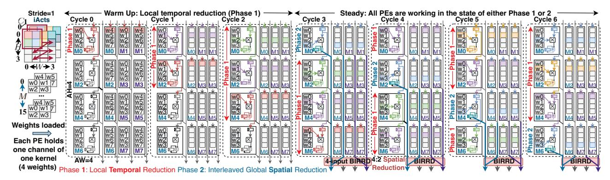
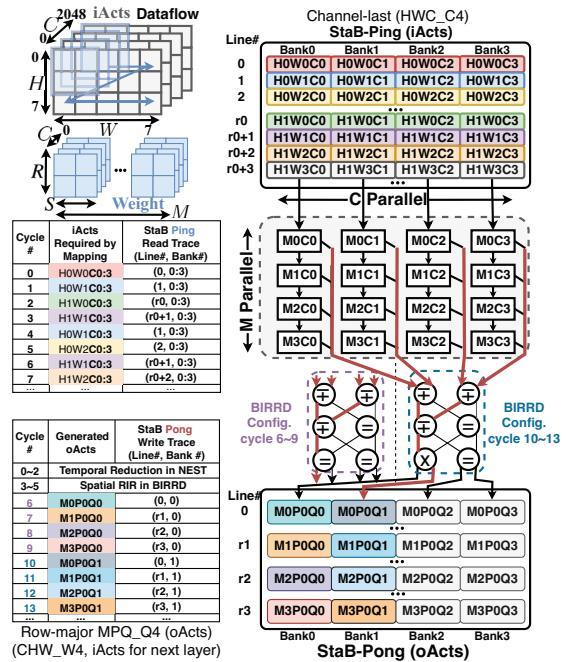

# *A. FEATHER's Neural Engine – NEST*

Accelerators typically use tens of thousands of PEs organized in 1D arrays like MAERI [35] and SIGMA [42], or 2D arrays like Google TPUv4 [26] and Meta's MTIA [19]. 2D PE arrays have better scalability but are limited in their dataflow options due to their rigid structure, leading to suboptimal utilization due to mismatch of layer shapes and array aspect ratios, as prior works have shown [35], [45]. 1D arrays with flexible distribution and reduction NoCs [32] have been shown to support arbitrary dataflows with full-range of TOPS (§II-A), specifically flexible parallelism and shape. However, they suffer from scalability issues due to their all-to-all NoCs.

This work tries to marry the best of both styles. We find that the all-to-all reduction networks in prior works [35], [42] come with prohibitive resource overheads because of redundant reduction paths. This is to accommodate *arbitrary sized reductions*. In contrast, *FEATHER*'s Neural Engine enables all rows of the 2D PE array to share the same reduction network in a time-multiplexing manner (thereby reducing its cost), without compromising flexibility, throughput, or utilization.

Specifically, *FEATHER*'s Neural Engine with Spatial forwarding and Temporal reduction (NEST) works in two phases. One walk-through example for convolution is shown in Fig. 9.

Phase 1: Local Temporal Reduction. *NEST* involves local registers in each PE for temporal (local) reduction of partial sums. This is then followed by a phase of global reduction via the reduction network (described in §III-B).

Phase 2: Interleaved Spatial Forwarding and Reduction. However, unlike prior works where all PEs participate simultaneously in the spatial reduction, the PE rows in *FEATHER* perform spatial reduction one after another, temporally multiplexing on the reduction network. Further, while each PE


Fig. 8: Micro-architecture of *FEATHER*'s datapath for convolution/GEMM. For convolution, the NEST reads iActs from StaB and weights from StrB, streaming both in a top-to-bottom pipeline. PEs in a column time-multiplex a common output bus. *BIRRD* conducts global spatial reduction and reorders results for targeted StaB banks during reduction, altering data layout in StaB. NEST facilitates inter-layer pipelining by reading iActs from StaB Ping (or Pong) and writes oActs (next-layer iActs) back to StaB Pong (or Ping). Note: *FEATHER* is scalable architecture and we show 8-input *BIRRD* as an example.

row sends its locally reduced results to the reduction network, PEs in other rows continue computation and reduction locally. This is ensured via a pipelining mechanism that guarantees that each row performs *AH* number of local reductions, before participating in the global reduction.

Flexible Dataflow: FEATHER retains the ability to support arbitrary dataflow parallelism strategies and shapes (§II-A). This is because Phase 2 can be configured to create arbitrary-sized reduction groups (i.e., all outputs can be unique or any combinations can be reduced) enhancing mapping flexibility.

FEATHER supports inter-layer pipelining. We deploy distinct computation engines for ReLU, BatchNorm, and MaxPooling. For AvgPooling layers, they are transformed into convolution operations and executed within the NEST. When there is a sole

requirement for reorder and reduction, the PE Array can be bypassed, directing inputs from *NEST* directly to the *BIRRD*. To optimize storage utilization and reduce data movement costs, all computation engines utilize the same on-chip storage.

## B. FEATHER's Reordering/Reduction Network – BIRRD

The Butterfly Interconnect for Reduction and Reordering in Dataflows (*BIRRD*) is a multi-stage network designed to reorganize data during the reduction phase. It receives computation results from the previous stage and directs them to new positions in the output buffer while concurrently reducing the data. This process aligns the data in the format needed for the subsequent dataflow, enabling *FEATHER* to seamlessly co-switch (dataflow, layout) for each layer.

Algorithm 1: Inter-stage Connectivity for AW-input BIRRD

```
1: output[i][id]/input[i][id] (id \in [0,AW)) refers to id-th out-
      put/input port of BIRRD switches at the stage i.
 2: FUNCTION reverse bits(data, bit range)
      mask = (1 \ll bit\_range) - 1
      reversed bits = 0
 4:
      for i FROM 0 TO bit range - 1
 5.
 6.
       if (data (1 \ll i))
 7:
         reversed_bits = (1 \ll (bit\_range - 1 - i))
      return (data & ∼mask) | reversed_bits
     for i in [0, 2 \times log_2(AW)) // i is stage_id
      for j in [0, AW) // j is port_id
10:
       output[i][j]-input[i+1][reverse_bits(j, min(log_2(AW), 2+
      i, 2 \times log 2(AW) - i)] (- indicates output connects to input)
```

1) BIRRD Topology: The BIRRD topology is interfaced with NEST engine one side and output buffer on the other side, and is composed of two butterfly networks back-to-back with log(AW)-bit bit reverse connections [16]. This topology grants symmetry with respect to the middle, enabling the construction of each half separately. Each input of BIRRD receives data from one column-wise bus of the NEST while each output of BIRRD forwards the result to one output buffer and eventually back to one bank of stationary buffer (StaB, refer to Fig. 7). For NEST with AW columns in total (AW must be a power of 2), the BIRRD encompasses  $2 \times log(AW)$  stages with AW/2 switches located at every stage. The inter-stage connections of BIRRD are outlined in Alg. 1.

The topology of *BIRRD* has been proven to be strictly non-blocking for unicast (any single data point among concurrent inputs sent to a single output) [5] and rearrangeably non-blocking for multicasting (at least one data point among all concurrent inputs sent to multiple output ports) [8], [16], [36]. We found no multicasting case that it cannot accommodate.

2) BIRRD Reorder-Reduction Switch: The BIRRD is built on 2-input×2-output switch (which we call Egg) with adder as shown in Fig. 8. Each Egg is governed by a 2-bit

<sup>&</sup>lt;sup>1</sup>4-input *BIRRD* is a special case with only  $2 \times log(AW) - 1 = 3$  stages, i.e. the last stages of two half butterfly networks get merged into a single stage.



Fig. 9: Illustration of the FEATHER with NEST and BIRRD employing a convolutional operation with a  $2 \times 2$  weights featuring 2 input channels (C=2) and generating 16 output channels (M=16) across a  $4\times4$  iAct with 2 input channels. The depicted dataflow utilizes a weight-stationary approach, where each PE has a local register file containing a channel of weights  $(2 \times 2)$ . The dataflow is parallelized for two input channel and two output channel across four PE columns, and for four kernels across four PE rows. In each row, four PEs generate 4 partial sums, contributing to 2 final sums, which thus necessitates a 4:2 spatial reduction in the BIRRD to produce two outputs. We assume the weights are already preloaded into NEST before the first cycle in this illustration. The iActs are streamed from the top, undergo multiplication with corresponding weight values (e.g., w0 in the top-left PE at cycle-0), and are locally accumulated for the next set of inputs (e.g., until cycle-3 in the top-left PE). Following this initial phase of local temporal reduction, the top row transmits the locally reduced result to the BIRRD for the second phase of spatial reduction. In the steady state, BIRRD reduces data from one NEST row per cycle (cycles 4-6). In steady state, all PEs are working and there is no output bus conflict for PEs of the same column. This is because, during phase-2 of spatial reduction in one PE, remaining PEs of the same column perform local reduction. In general, AW × AH NEST takes AH<sup>2</sup> cycles to load weights, and ping-pong local registers are instantiated to hide such latency behind computation. BIRRD could reduce results from PEs at different rows as long as only one PE per column uses the output bus. Takeaway: NEST utilizes local temporal and global spatial reduction to (i) ensure all PEs of the same column share the same output bus without competition while achieving full utilization, and (ii) hide weight loading latency in steady phase.

configuration word, allowing for control of four reorder-inreduction functionalities (shown in Fig. 8) as follows.

- Pass (=) / Swap ( $\times$ ): directly pass left (right) input data to left (right) output port, or swap them.
- Add-Left (∓) / Add-Right (±): Accumulates data from input ports and transmits results to the left/right output port, with the secondary output inheriting the input from the same direction. Extra broadcast functions could be added in the Eggs to duplicate accumulated results in multiple banks of StaB.
  - 3) BIRRD Capability and Routing: BIRRD supports
- Arbitrary Reduction: We define "reduction group" as a group of inputs that get reduced into one output. AW-input BIRRD supports arbitrary number of reduction groups (up to AW).
- Arbitrary Reordering: The rearrangeably multicasting capability enables BIRRD to route results from many reduction groups to many arbitrary output ports concurrently.

The examples of *BIRRD* supporting various reordering and reduction patterns are shown in Fig. 10.

From a routing perspective, reduction can be viewed as a reverse multicasting operation, where multiple input data points target the same output port and are reduced upon encountering each other at BIRRD Eggs. Thus, we adopt the multicasting routing algorithm [4] to establish paths and configurations for BIRRD Eggs, enabling reordering during reduction. If a

certain input-output connection cannot be established by the algorithm [4], we will brute force all possible configurations. Fig. 10 showcases how *BIRRD* supports arbitrary dataflows and layout switching requirements.

4) Microarchitectural Benefits of BIRRD: Generally, distribution networks like Benes in SIGMA [42] or fat-tree in MAERI [35] necessitate unicast or multicast capabilities to direct data from relevant on-chip buffer banks to specific processing elements (PEs). This necessity becomes obsolete with BIRRD (via RIR), as it harmonizes data layouts to coincide with dataflows. This enables FEATHER to utilize a straightforward point-to-point connection to the input ports of NEST without sacrificing flexibility. Consequently, BIRRD simplifies the requirements for distribution networks in accelerators, thereby minimizing control, resource, and latency expenses.

## C. On-chip Storage and Post-processing

On-chip storage is physically divided into separate buffers with different organizations for concordance with dataflows.

1) Stationary (StaB) and Streaming Buffer (StrB): The typical paradigm of processing convolution or GEMM will keep one type of data stationary, termed a stationary tensor, and stream the other type of data, termed a streaming tensor. FEATHER fetches and processes the streaming tensor in the tile granularity. Both StaB and StrB implement a ping-pong


Fig. 10: Comparison between per-layer flexible dataflows in *FEATHER* and fixed-dataflow in the systolic array under GEMM. *FEATHER* dynamically alters layout by redirecting oActs to various banks with distinct writing addresses, exemplified by rerouting a blue result from bank 0 (Workload A) to bank 2 (Workload A Change oAct Layout). *FEATHER* consistently outperforms SA in irregular-sized GEMM (Workload B, C, D), achieving near full utilization. Enhanced utilization arises from (1) enabling cross-column spatial reduction using *BIRRD* in *FEATHER*, e.g. *FEATHER* maps K dimension across the entire 2D array instead of a single PE in SA under workload D. (2) Eliminating SA's horizontal rigid reuse links, thereby enabling independent mappings across columns, e.g. (Workload C) adopting iAct stationary in first three columns and weights stationary in the last column. *BIRRD* could perform pure reordering to change the layout when no spatial reduction is required (e.g. *BIRRD* reordering all incoming results to target banks directly under workload B). **Takeaway:** BIRRD's flexible reduction enhances compute utilization across diverse skewed shapes, expanding the range of dataflows that NEST can efficiently support.

buffer to enable (1) the latency hiding of fetching the next tile from off-chip DRAM, and (2) on-chip inter-layer pipelining.

As for convolution/GEMM (Fig. 8), iActs are kept stationary within StaB Ping (or Pong), and the resulting oActs are written back into StaB Pong (or Ping) with a new layout. Meanwhile, weights are streamed via StrB (Ping/Pong). StaB requires a multi-bank organization (AW banks), with each bank storing a single data piece, to accommodate the varied write addresses in different banks necessitated by layout changes in FEATHER. Conversely, StrB adopts a simplified single-bank structure with an AW-data bandwidth to conserve area, because weights do not need layout reordering.

2) *Instruction Buffer (IB):* The configurations for *BIRRD* are generated offline and get fetched into IB to configure the reduction networks at run-time.

- 3) Output Buffer (OB): enables in-situ temporal reduction of partial sums when the reduction size of workloads exceeds the overall reduction capacity of both NEST and BIRRD. OB has AW banks, and each equipped with a 32-bit adder.
- 4) ZP/Scale Buffer and Quantization Module (QM): employing quantization schemes from PyTorch FBGEMM [31] and QNNPACK [17], with 8-bit zero points and 32-bit scales (housed in ZP/Scale Buffer). The quantization module rescaled down 32-bit oActs and then quantized to 8-bit oActs.

## IV. FEATHER IN ACTION

In this section, we first showcase one example (Fig. 11) of how *FEATHER* leverages *RIR* to resolve bank conflicts mentioned in Fig. 6b when co-switching dataflow-layout. Then we deep dive into how *FEATHER* enables general layout transformations without bank conflicts through two insights.



Fig. 11: Example of FEATHER switching from channel-last layout (*HWC\_C*4) to a row-major format (*MPQ\_Q*4(*CHW\_W*4)) during reduction without incurring bank conflicts. This is because multiple iActs are reduced into fewer oActs, thereby reducing accesses within each bank. In this example, NEST leverages parallelism along the kernel M and channel Cdimensions, reading and vertically streaming four iActs of four input channels from top to bottom. Specifically, at cycle 0, NEST fetches H0W0C0:3 from (line 0, banks 0:3), as recorded in the StaB Ping read trace. Subsequent cycles involve a two-stage reduction: temporal reduction within the PE for cycles 0 to 2, and spatial reduction within BIRRD for cycles 3 to 5, culminating in a single oAct M0P0Q0. This oAct is reordered to bank 0 during reduction and written to line 0 in the StaB Pong during cycle 6. FEATHER's pipelined processing of following iActs is further exemplified in the read/write trace. M0: 3P0Q0 target bank 0 and use connectivity of BIRRD as shown in the left while M0:3P0Q1 use the right. For brevity, the notation of R0: 1S0: 1 is omitted, which indicates that each PE in NEST holds four weights of one channel. **Takeaway:** FEATHER reorders oActs into next layer's desirable layout during reduction, enabling dataflow/layout co-switching.

## A. RIR for Bank Conflicts Mitigation and Layout Transform

In the example shown in Fig. 11, the layout conversion from iActs to oActs is realized via *RIR*, thereby avoiding the explicit latency in reorder after reduction. This efficiency stems from the key insight that *RIR reorders post-reduction oActs into a new layout, rather than directly transforming iActs from one layout to another.* 

Specifically, in the reduction phase, numerous iActs naturally get accumulated into fewer oActs and consequently target fewer banks. For example, four iActs get accumulated to one oAct that targets a single line in Fig. 11. Conversely, if we directly transform the layout of iActs from channel-last to row-major, four iActs (H0W0C0:3) would target four different lines within the same bank under row-major layout, leading to bank conflicts.

#### B. (Dataflow, Layout) Flexibility for Bank Conflicts Eradication

While the strategy of 'reordering post-reduction oActs' aids in reducing bank conflicts, conflicts may still arise when the number of partial sums to write into memory exceeds the number of writing ports of the memory. This scenario is particularly common in scaled-up  $128 \times 128$  compute array (Google TPUv4 [26]), as it generates more oActs concurrently.

FEATHER fully eliminates conflicts with the second key insight that FEATHER picks the dataflow with the number of oActs (partial sums) matching with the number of memory write ports. In essence, FEATHER employs dataflows free from bank conflicts, and the flexible reduction of the BIRRD consistently allows FEATHER to identify such dataflows with high performance and efficiency.

In summary, *RIR* together with flexible dataflows selection enable *FEATHER* to switch among arbitrary layouts without incurring bank conflicts.

#### V. LAYOUTLOOP

FEATHER enables (dataflow, layout) co-switching at the layer granularity to achieve optimal latency and energy efficiency. However, deciding which (dataflow, layout) to use for FEATHER is not trivial because both dataflow and layout have huge space, e.g.  $10^{36} \times 10^8$  for a single convolution layer (ResNet-50 layer 1) [27]², necessitating systematic exploration. For this aim, we enhance Timeloop [41], a state-of-the-art dataflow search framework with (1) physical storage modeling and (2) systematic layout assessment capabilities, and term it as Layoutloop to distinguish it from native Timeloop. We employ Layoutloop to explore dataflows under various layouts for FEATHER, selecting the dataflow-layout pair that minimizes energy delay product for each layer.

