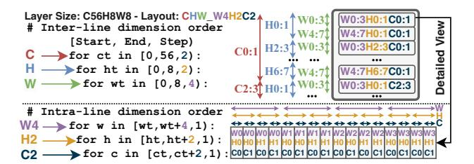
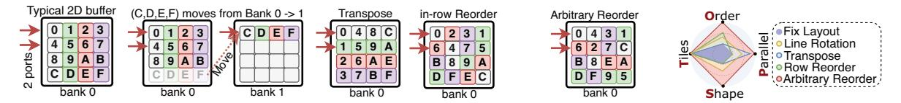

# B. Data Layout in on-chip Storage

Various organizations of on-chip storage are logically a 2D buffer (Tab. II), where the width of each logical buffer row, termed "line size", represents bandwidth (max number of data

Fig. 3: Layout terminology example: 'CHW\_W4H2C2'. 'CHW' signifies the inter-line dimension order as  $C \rightarrow H \rightarrow W$  across lines. 'W4H2C2' indicates the intra-line dimension order: (4,2,2) elements from the (W,H,C) dimensions are flattened into a single row in the order of  $W \rightarrow H \rightarrow C$ .

words a buffer could supply per cycle) and the depth represents the total number of buffer row entries as shown in Fig. 1.

Physically, on-chip storage is implemented by BRAM/U-RAM in FPGA and SRAM in ASICs, which come with a *fixed number (often two) read or write ports*. Therefore, once arranged into the logical 2D buffer, the number of lines being concurrently accessed is limited by the number of ports. A request that accesses more lines than the available ports will lead to bank conflicts, resulting in a slowdown from the reading/writing delay (resource hazard).

**Data Layout Terminology.** In this paper, data layout is represented as "(Inter-line dimension order)\_(Intra-line dimension order interleaved with sizes)" with one example shown in Fig. 3. For instance, two commonly used PyTorch data layouts, channel-last [18] and row-major [38], can be interpreted as Channel (C) or Width (W) being the innermost dimension in both inter and intra-line orders, separately.

#### C. Interaction of Dataflow and Data Layout

In the rest of the paper, we refer to a (dataflow, layout) pair with bank conflicts as *discordant*, whereas its non-conflicting counterpart is termed *concordant*, i.e. a layout is concordant to a dataflow if there are no bank conflicts. And we use *concordant dataflow space of a layout* to refer to all concordant dataflows choices under a layout. Switching optimal dataflows for different layers is not trivial given that it necessitates a costly reordering to convert the data layout into a concordant form to prevent bank conflicts.

In this subsection, we discuss some crucial insights, underscoring the necessity of co-switching dataflows-layouts for different layers by evaluating the performance of various combinations of dataflows and data layouts as shown in Fig. 4.

Insight 1: Discordance between dataflow and data layout leads to bank conflicts and results in performance degradation.

A discordance between dataflow and data layout leads to slowdown because compute units have to stall and wait for data to arrive, as illustrated by the slowdown from green bar to yellow bar in Fig. 2. Taking ResNet-50 layer 47 as an example (Fig. 4-M7), the channel-parallel dataflow requires concurrent access to iActs (H0W0C0:3), which are distributed across four separate lines, including line 0, r4, r5 and r6, in the row-major

layout (Fig. 4-L4). Therefore, a 0.5 slowdown is encountered, resulting in 50% practical computation utilization. Such bank conflicts cannot be resolved by line rotation, since moving one conflicted line to another bank leaves the remaining three lines still in conflict. This slowdown analysis also applies to Fig. 4-M1,2,3,6.

Insight 2: Co-switching (dataflow, layout) for different layers is necessary for high performance with optimal efficiency.

For certain workloads, picking a fixed layout might not suffer a slowdown from bank conflicts, like choosing rowmajor layout for both two layers of ResNet-50 (M4 and M8 in Fig. 4). However, the mapping M5 ("FEATHER's pick") delivers better energy efficiency than M8 as it supplies data with reading less number of lines. Therefore, even under a small parallelism of four, co-switching dataflows and layouts is essential to maximize performance and energy efficiency. Practical designs (e.g.  $128 \times 128$  systolic array in Google TPU) will further amplify such a need as it brings higher parallelism in more dimensions and requires more concurrent data.

Insight 3: Systematic layout modeling should be factored into dataflow exploration for bridging the theory-practice gap.

Dataflow has a huge space, which requires systematic modeling and searching algorithms to identify the optimum. However, many dataflow exploration frameworks [33], [41] and algorithms [9], [27], [28], [30] purely model on-chip storage as bandwidth, often assuming ideal data layouts, which could lead to significant theory-practice performance gap. For instance, all layouts in Fig. 4 possess identical bandwidth, but they result in markedly different compute utilization and energy efficiency for two workloads, which is not the case in the existing frameworks as they do not model layout. In Fig. 2, we find that the best dataflow reported by a mapper from an existing framework [41] (green bar), can in practice perform 2 orders of magnitude worse (yellow bar) than the fixed dataflow case (blue bar) due to the discordant accesses to the on-chip memory. Thus, taking layout into consideration during search (red bar) is necessary and crucial.

## D. Data Reordering Patterns

- 1) Reorder Target (iActs): As established above, both weights and input activations (iActs) necessitate layout reordering within the on-chip memory when switching dataflows. For ML inference, the structure and weights of ML models are established prior to deployment, enabling the offline optimal dataflow-layout determination for each layer and offline reordering of all weights. Consequently, an optimal layout for weights within the on-chip scratchpad is assured. However, iActs are generated in real-time, so that iActs reordering happens online. Therefore, this work focuses on layout reordering of iActs.
- 2) Reorder Patterns vs. Implementations: Layout transformations require certain reorder capabilities, referred to as reorder patterns. A reorder pattern has different hardware implementations with different critical-path latency. To decouple the concept of reorder patterns from their physical implementations, we analyze reordering in two steps: (1) categorize reordering

Fig. 4: Memory efficiency and computation utilization of various (workload, dataflow, data layout) combinations on weight-stationary  $4 \times 4$  Systolic Array (SA). Dataflows: input channel-parallel (D1) and sliding-window parallel (D2). Dataflow D1/D2 reads at most four iActs from C/W dimension concurrently from the on-chip buffer every cycle, separately. The digit in iActs indicates the cycle index such iActs get read. Workloads: (1) ResNet-50 layer 1 with a large height and width, and (2) ResNet-50 layer 47 with a large channel number. Layouts: channel last-layout (L1, L3) and row-major layout (L2, L4). In the channel-last layout, data from different input channels (dimension C) are spread across an individual line, while in the row-major layout, multiple data from different input width (dimension W) are flattened. The performance of mappings (M1 $\sim$ M8) for different (workload, dataflow, layout) combinations are analyzed in the tables. In each table, "iActs Required by Mapping" lists all iActs that need to be concurrently read from on-chip buffer every cycle, and the corresponding index (#) of lines being accessed are listed in "Line # being Accessed". We assume dual read ports (because TSMC offers SRAM with at most two ports), such that a concurrent read for more than two lines leads to slowdown, which reduces "Theoretical Computation Utilization" (estimated as mapping efficiency over the array) into "Practical Compute Utilization" (computed as multiplication of theoretical utilization with slow down). Takeaway: For optimal performance, co-switching (dataflow, layout) is crucial, because dataflow matters (comparing M1 vs. M4), and dayout also matters (comparing M2 vs. M4).

into distinct functional patterns, as illustrated in Fig. 5, and analyze its impact on dataflow flexibility in §II-D3. (2) pinpoint specific hardware implementations to these patterns in §II-E.

3) Impact of Reorder Patterns on Dataflow Flexibility: A fixed layout has limited concordant dataflow space, restricting fully-flexible accelerators to less-performant dataflow choices. To improve performance, reordering is required to enlarge

concordant dataflow space with more flexibility in TOPS.

- Fixed layout (Fig. 5a) is only concordant to dataflows which concurrently access up-to two rows within a single bank, such as  $(0,1,2,\cdots,7)$ . This restricts concordant dataflow space to limited T,O,P,S flexibility (see purple quadrilateral in Fig. 5f).
- Line Rotation (Fig. 5b) arguments concordant dataflow space

(a) Initial layout (b) Line Rotation (c) Transpose (d) Row-Reorder (e) Arbitrary Reorder (f) Concordant Dataflow Space

Fig. 5: Overview of reordering *patterns*. The 2D layout without any reordering is shown in 5a, which only allows reading two rows concurrently, assuming true dual-port SRAM. Line Rotation (5b, e.g., Medusa [48]) moves a row from bank 0 to bank 1 prior to reading, enabling simultaneous access to at most three rows from bank 0 through dual-bank ports. This technique, however, utilizes additional port from bank 1, potentially limiting access to other data in bank 1. Transpose (5c, e.g., MTIA [19] and TPUv4i [26]) could swap rows with columns. Row Reorder (5d, e.g., TPUv4i [26]) permutes data within each row. Arbitrary reorder (5e, proposed in this work) enables arbitrary permutation for data within the entire 2D buffer. Line Rotation, Transpose and Row-Reorder are done by prior works by reading at most two rows per bank, leverage Transpose/Permute unit to reorder and then write data back in concordant order (On-chip RAR in 6b). In contrast, *FEATHER*'s *BIRRD* network (§III-B) performs the Arbitrary-Reorder during the reduction phase of the matrix multiplication or convolution computation (RIR in Fig. 6c). The concordant dataflow space supported by each layout reorder pattern is shown in 5f. *Reordering enables a given layout to alter the order of data it could provide per cycle and across cycles*. Among four dimensions (T,O,P,S) of concordant dataflow space, reordering enlarges O,P,S by supporting dataflows to read from or write to layout in different order. Note that reordering by itself cannot enlarge T dimension flexibility because higher Tiles flexibility requires accessing more data per cycle.

(a) Off-chip Data Reorder. (b) Reorder after Reduction (prior works). (c) Reorder in Reduction (RIR, this work).

Fig. 6: Comparison of data reordering *implementations*. This work proposes RIR that eliminates reorder latency and bank conflicts. We discuss on-chip reorder patterns, including transpose, line rotation, row-reorder and arbitrary reorder, in Fig. 5.

to concurrently access up-to **three** rows within a single bank by storing a copy of a row in other banks. For example, to access three rows including data  $(0,1,\cdots,7,C,D,E,F)$  from bank 0 in Fig. 5b, row (C,D,E,F) is moved to bank such that it provides  $(0,1,\cdots,7)$  from bank 0 and (C,D,E,F) from bank 1 to avoid bank conflicts. However, line rotation comes at the price of (1) extra bandwidth: it employs three ports for reading data that could be accessed with up-to two ports under concordant layout, (2) storage: it stores a copy of (C,D,E,F). Such price could have been used for supporting more parallelism under arbitrary reordering to improve performance.

- Transpose (Fig. 5c) enables concurrently access to up-to two rows *or columns* within a bank, hence augmenting concordant dataflow choice with higher P flexibility than fixed layout. But pure transpose falls short of supporting tiled layout transformation, such as changing layout from HWC\_W2C3 (Fig. 4, L1) to HWC\_W8 (Fig. 4, L2)
- Row Reorder (Fig. 5d) does not support more concurrent access within a single bank, but enables arbitrary order within each row, hence supporting dataflows with higher O flexibility. Further, row reorder also supports im2col [11], which does not reduce bank conflicts because it still accesses the same number of rows from on-chip buffers.
- Arbitrary Reorder (Fig. 5e) enables arbitrary layout trans-

TABLE III: SoTA on-chip reordering vs. FEATHER.

| Work        | Dataflow | On-chip Reorder Patterns     | Implement |
|-------------|----------|------------------------------|-----------|
| im2col [11] | N/A      | Row-Reorder (Fig. 5b)        | RAR       |
| Medusa [48] | N/A      | Line Rotation (Fig. 5b)      | RAR       |
| MTIA [19]   | TOP      | Transpose (Fig. 5c)          | RAR       |
| TPUv4 [26]  | TO       | Trans.+Row-Reorder (Fig. 5d) | RAR       |
| This Work   | TOPS     | Arbitrary Reorder (Fig. 5e)  | RIR       |

formations, hence making all dataflows concordant with full-fledged O,P,S flexibility, as shown by red diamond in Fig. 5f.

