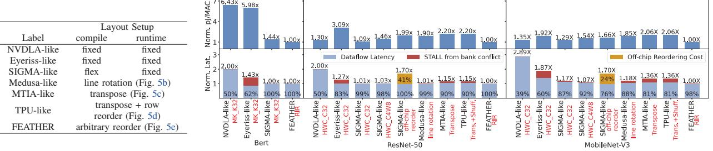
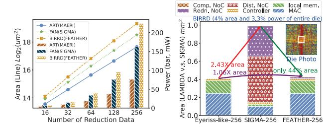

# C. Layoutloop-based Latency/Energy Evaluation

Latency and energy efficiency are affected by (1) compute utilization determined by dataflows, and (2) effective memory bandwidth considering bank conflicts.

TABLE IV: Evaluation setup for SoTAs and *FEATHER* ( $\rightarrow$  indicates the modifications from the original design).

| OF.        |                                                                                                                                                                                                                                                                                                                                                                                                                                                                                                                                                                                                                                                                                                                                                                                                                                                                                                                                                                                                                                                                                                                                                                                                                                                                                                                                                                                                                                                                                                                                                                                                                                                                                                                                                                                                                                                                                                                                                                                                                                                                                                                                |                                                                                                                                                                                                                                                                                                                                                                                                                                                                                                                                                                                                                                                                                                                                                                                                                                                                                                                                                                                                                                                                                                                                                                                                                                                                                                                                                                                                                                                                                                                                                                                                                                                                                                                                                                                                                                                                                                                                                                                                                                                                                                                                |                                                                                                                                                                                                                                                                                                                                                                                                                                                                                                                                                                                                                                                                                                                                                                                                                                                                                                                                                                                                                                                                                                                                                                                                                                                                                                                                                                                                                                                                                                                                                                                                                                                                                                                                                                                                                                                                                                                                                                                                                                                                                                | on-chip BW                                           |                                                      | Area (µm²)/Clock Frequency                           | Evaluation Method                                                                                                                                                                                                                                                                                                                                                                                                                                                                                                                                                                           |
|------------|--------------------------------------------------------------------------------------------------------------------------------------------------------------------------------------------------------------------------------------------------------------------------------------------------------------------------------------------------------------------------------------------------------------------------------------------------------------------------------------------------------------------------------------------------------------------------------------------------------------------------------------------------------------------------------------------------------------------------------------------------------------------------------------------------------------------------------------------------------------------------------------------------------------------------------------------------------------------------------------------------------------------------------------------------------------------------------------------------------------------------------------------------------------------------------------------------------------------------------------------------------------------------------------------------------------------------------------------------------------------------------------------------------------------------------------------------------------------------------------------------------------------------------------------------------------------------------------------------------------------------------------------------------------------------------------------------------------------------------------------------------------------------------------------------------------------------------------------------------------------------------------------------------------------------------------------------------------------------------------------------------------------------------------------------------------------------------------------------------------------------------|--------------------------------------------------------------------------------------------------------------------------------------------------------------------------------------------------------------------------------------------------------------------------------------------------------------------------------------------------------------------------------------------------------------------------------------------------------------------------------------------------------------------------------------------------------------------------------------------------------------------------------------------------------------------------------------------------------------------------------------------------------------------------------------------------------------------------------------------------------------------------------------------------------------------------------------------------------------------------------------------------------------------------------------------------------------------------------------------------------------------------------------------------------------------------------------------------------------------------------------------------------------------------------------------------------------------------------------------------------------------------------------------------------------------------------------------------------------------------------------------------------------------------------------------------------------------------------------------------------------------------------------------------------------------------------------------------------------------------------------------------------------------------------------------------------------------------------------------------------------------------------------------------------------------------------------------------------------------------------------------------------------------------------------------------------------------------------------------------------------------------------|------------------------------------------------------------------------------------------------------------------------------------------------------------------------------------------------------------------------------------------------------------------------------------------------------------------------------------------------------------------------------------------------------------------------------------------------------------------------------------------------------------------------------------------------------------------------------------------------------------------------------------------------------------------------------------------------------------------------------------------------------------------------------------------------------------------------------------------------------------------------------------------------------------------------------------------------------------------------------------------------------------------------------------------------------------------------------------------------------------------------------------------------------------------------------------------------------------------------------------------------------------------------------------------------------------------------------------------------------------------------------------------------------------------------------------------------------------------------------------------------------------------------------------------------------------------------------------------------------------------------------------------------------------------------------------------------------------------------------------------------------------------------------------------------------------------------------------------------------------------------------------------------------------------------------------------------------------------------------------------------------------------------------------------------------------------------------------------------|------------------------------------------------------|------------------------------------------------------|------------------------------------------------------|---------------------------------------------------------------------------------------------------------------------------------------------------------------------------------------------------------------------------------------------------------------------------------------------------------------------------------------------------------------------------------------------------------------------------------------------------------------------------------------------------------------------------------------------------------------------------------------------|
| (Layout,   | Dataflow 2                                                                                                                                                                                                                                                                                                                                                                                                                                                                                                                                                                                                                                                                                                                                                                                                                                                                                                                                                                                                                                                                                                                                                                                                                                                                                                                                                                                                                                                                                                                                                                                                                                                                                                                                                                                                                                                                                                                                                                                                                                                                                                                     | ), Reorder)                                                                                                                                                                                                                                                                                                                                                                                                                                                                                                                                                                                                                                                                                                                                                                                                                                                                                                                                                                                                                                                                                                                                                                                                                                                                                                                                                                                                                                                                                                                                                                                                                                                                                                                                                                                                                                                                                                                                                                                                                                                                                                                    | (#PE,                                                                                                                                                                                                                                                                                                                                                                                                                                                                                                                                                                                                                                                                                                                                                                                                                                                                                                                                                                                                                                                                                                                                                                                                                                                                                                                                                                                                                                                                                                                                                                                                                                                                                                                                                                                                                                                                                                                                                                                                                                                                                          | bit/cycle,                                           | DataType)                                            | Area (µm )/Clock Frequency                           | Real-device/Layoutloop                                                                                                                                                                                                                                                                                                                                                                                                                                                                                                                                                                      |
| (fix,      | T,                                                                                                                                                                                                                                                                                                                                                                                                                                                                                                                                                                                                                                                                                                                                                                                                                                                                                                                                                                                                                                                                                                                                                                                                                                                                                                                                                                                                                                                                                                                                                                                                                                                                                                                                                                                                                                                                                                                                                                                                                                                                                                                             | none)                                                                                                                                                                                                                                                                                                                                                                                                                                                                                                                                                                                                                                                                                                                                                                                                                                                                                                                                                                                                                                                                                                                                                                                                                                                                                                                                                                                                                                                                                                                                                                                                                                                                                                                                                                                                                                                                                                                                                                                                                                                                                                                          | (1024,                                                                                                                                                                                                                                                                                                                                                                                                                                                                                                                                                                                                                                                                                                                                                                                                                                                                                                                                                                                                                                                                                                                                                                                                                                                                                                                                                                                                                                                                                                                                                                                                                                                                                                                                                                                                                                                                                                                                                                                                                                                                                         | unknown,                                             | int8)                                                | 500 MHz (ASIC)                                       | Coral USB accelerator [1]                                                                                                                                                                                                                                                                                                                                                                                                                                                                                                                                                                   |
| (fix,      | T,                                                                                                                                                                                                                                                                                                                                                                                                                                                                                                                                                                                                                                                                                                                                                                                                                                                                                                                                                                                                                                                                                                                                                                                                                                                                                                                                                                                                                                                                                                                                                                                                                                                                                                                                                                                                                                                                                                                                                                                                                                                                                                                             | none)                                                                                                                                                                                                                                                                                                                                                                                                                                                                                                                                                                                                                                                                                                                                                                                                                                                                                                                                                                                                                                                                                                                                                                                                                                                                                                                                                                                                                                                                                                                                                                                                                                                                                                                                                                                                                                                                                                                                                                                                                                                                                                                          | (1152,                                                                                                                                                                                                                                                                                                                                                                                                                                                                                                                                                                                                                                                                                                                                                                                                                                                                                                                                                                                                                                                                                                                                                                                                                                                                                                                                                                                                                                                                                                                                                                                                                                                                                                                                                                                                                                                                                                                                                                                                                                                                                         | unknown,                                             | int8)                                                | 100 MHz (FPGA)                                       | end-to-end on ZCU104                                                                                                                                                                                                                                                                                                                                                                                                                                                                                                                                                                        |
| (fix,      | T,                                                                                                                                                                                                                                                                                                                                                                                                                                                                                                                                                                                                                                                                                                                                                                                                                                                                                                                                                                                                                                                                                                                                                                                                                                                                                                                                                                                                                                                                                                                                                                                                                                                                                                                                                                                                                                                                                                                                                                                                                                                                                                                             | none)                                                                                                                                                                                                                                                                                                                                                                                                                                                                                                                                                                                                                                                                                                                                                                                                                                                                                                                                                                                                                                                                                                                                                                                                                                                                                                                                                                                                                                                                                                                                                                                                                                                                                                                                                                                                                                                                                                                                                                                                                                                                                                                          | (1024,                                                                                                                                                                                                                                                                                                                                                                                                                                                                                                                                                                                                                                                                                                                                                                                                                                                                                                                                                                                                                                                                                                                                                                                                                                                                                                                                                                                                                                                                                                                                                                                                                                                                                                                                                                                                                                                                                                                                                                                                                                                                                         | 512,                                                 | int8)                                                | 50 MHz(1) (FPGA)                                     | FireSim on AWS EC2 F1                                                                                                                                                                                                                                                                                                                                                                                                                                                                                                                                                                       |
| (flexible, | TOPS,                                                                                                                                                                                                                                                                                                                                                                                                                                                                                                                                                                                                                                                                                                                                                                                                                                                                                                                                                                                                                                                                                                                                                                                                                                                                                                                                                                                                                                                                                                                                                                                                                                                                                                                                                                                                                                                                                                                                                                                                                                                                                                                          | Reorder In Reduction)                                                                                                                                                                                                                                                                                                                                                                                                                                                                                                                                                                                                                                                                                                                                                                                                                                                                                                                                                                                                                                                                                                                                                                                                                                                                                                                                                                                                                                                                                                                                                                                                                                                                                                                                                                                                                                                                                                                                                                                                                                                                                                          | (1296,                                                                                                                                                                                                                                                                                                                                                                                                                                                                                                                                                                                                                                                                                                                                                                                                                                                                                                                                                                                                                                                                                                                                                                                                                                                                                                                                                                                                                                                                                                                                                                                                                                                                                                                                                                                                                                                                                                                                                                                                                                                                                         | 720,                                                 | int8)                                                | 100 MHz (FPGA)                                       | end-to-end on ZCU104                                                                                                                                                                                                                                                                                                                                                                                                                                                                                                                                                                        |
| (fix,      | T,                                                                                                                                                                                                                                                                                                                                                                                                                                                                                                                                                                                                                                                                                                                                                                                                                                                                                                                                                                                                                                                                                                                                                                                                                                                                                                                                                                                                                                                                                                                                                                                                                                                                                                                                                                                                                                                                                                                                                                                                                                                                                                                             | none)                                                                                                                                                                                                                                                                                                                                                                                                                                                                                                                                                                                                                                                                                                                                                                                                                                                                                                                                                                                                                                                                                                                                                                                                                                                                                                                                                                                                                                                                                                                                                                                                                                                                                                                                                                                                                                                                                                                                                                                                                                                                                                                          | (16×16,                                                                                                                                                                                                                                                                                                                                                                                                                                                                                                                                                                                                                                                                                                                                                                                                                                                                                                                                                                                                                                                                                                                                                                                                                                                                                                                                                                                                                                                                                                                                                                                                                                                                                                                                                                                                                                                                                                                                                                                                                                                                                        | 25→256,                                              | int8)                                                | 808K (TSMC-28, 1 GHz) (5)                            | Layoutloop                                                                                                                                                                                                                                                                                                                                                                                                                                                                                                                                                                                  |
| (fix,      | TS,                                                                                                                                                                                                                                                                                                                                                                                                                                                                                                                                                                                                                                                                                                                                                                                                                                                                                                                                                                                                                                                                                                                                                                                                                                                                                                                                                                                                                                                                                                                                                                                                                                                                                                                                                                                                                                                                                                                                                                                                                                                                                                                            | none)                                                                                                                                                                                                                                                                                                                                                                                                                                                                                                                                                                                                                                                                                                                                                                                                                                                                                                                                                                                                                                                                                                                                                                                                                                                                                                                                                                                                                                                                                                                                                                                                                                                                                                                                                                                                                                                                                                                                                                                                                                                                                                                          | $(14\times12\rightarrow16\times16,$                                                                                                                                                                                                                                                                                                                                                                                                                                                                                                                                                                                                                                                                                                                                                                                                                                                                                                                                                                                                                                                                                                                                                                                                                                                                                                                                                                                                                                                                                                                                                                                                                                                                                                                                                                                                                                                                                                                                                                                                                                                            | $192 \rightarrow 256$ ,                              | int16→int8)                                          | 1394K (TSMC-65, 200 MHz)                             | Layoutloop                                                                                                                                                                                                                                                                                                                                                                                                                                                                                                                                                                                  |
| (fix3),    | TOPS,                                                                                                                                                                                                                                                                                                                                                                                                                                                                                                                                                                                                                                                                                                                                                                                                                                                                                                                                                                                                                                                                                                                                                                                                                                                                                                                                                                                                                                                                                                                                                                                                                                                                                                                                                                                                                                                                                                                                                                                                                                                                                                                          | none)                                                                                                                                                                                                                                                                                                                                                                                                                                                                                                                                                                                                                                                                                                                                                                                                                                                                                                                                                                                                                                                                                                                                                                                                                                                                                                                                                                                                                                                                                                                                                                                                                                                                                                                                                                                                                                                                                                                                                                                                                                                                                                                          |                                                                                                                                                                                                                                                                                                                                                                                                                                                                                                                                                                                                                                                                                                                                                                                                                                                                                                                                                                                                                                                                                                                                                                                                                                                                                                                                                                                                                                                                                                                                                                                                                                                                                                                                                                                                                                                                                                                                                                                                                                                                                                |                                                      |                                                      |                                                      |                                                                                                                                                                                                                                                                                                                                                                                                                                                                                                                                                                                             |
| (flexible, | TOPS,                                                                                                                                                                                                                                                                                                                                                                                                                                                                                                                                                                                                                                                                                                                                                                                                                                                                                                                                                                                                                                                                                                                                                                                                                                                                                                                                                                                                                                                                                                                                                                                                                                                                                                                                                                                                                                                                                                                                                                                                                                                                                                                          | off-chip reordering(4))                                                                                                                                                                                                                                                                                                                                                                                                                                                                                                                                                                                                                                                                                                                                                                                                                                                                                                                                                                                                                                                                                                                                                                                                                                                                                                                                                                                                                                                                                                                                                                                                                                                                                                                                                                                                                                                                                                                                                                                                                                                                                                        | $(65536 \rightarrow 256,$                                                                                                                                                                                                                                                                                                                                                                                                                                                                                                                                                                                                                                                                                                                                                                                                                                                                                                                                                                                                                                                                                                                                                                                                                                                                                                                                                                                                                                                                                                                                                                                                                                                                                                                                                                                                                                                                                                                                                                                                                                                                      | 256,                                                 | bf16→int8)                                           | 990K (TSMC-28, 500 MHz)                              | Layoutloop                                                                                                                                                                                                                                                                                                                                                                                                                                                                                                                                                                                  |
| (flexible, | TOPS,                                                                                                                                                                                                                                                                                                                                                                                                                                                                                                                                                                                                                                                                                                                                                                                                                                                                                                                                                                                                                                                                                                                                                                                                                                                                                                                                                                                                                                                                                                                                                                                                                                                                                                                                                                                                                                                                                                                                                                                                                                                                                                                          | on-chip line rotation)                                                                                                                                                                                                                                                                                                                                                                                                                                                                                                                                                                                                                                                                                                                                                                                                                                                                                                                                                                                                                                                                                                                                                                                                                                                                                                                                                                                                                                                                                                                                                                                                                                                                                                                                                                                                                                                                                                                                                                                                                                                                                                         |                                                                                                                                                                                                                                                                                                                                                                                                                                                                                                                                                                                                                                                                                                                                                                                                                                                                                                                                                                                                                                                                                                                                                                                                                                                                                                                                                                                                                                                                                                                                                                                                                                                                                                                                                                                                                                                                                                                                                                                                                                                                                                |                                                      |                                                      |                                                      |                                                                                                                                                                                                                                                                                                                                                                                                                                                                                                                                                                                             |
| (flexible, | _TŌ,                                                                                                                                                                                                                                                                                                                                                                                                                                                                                                                                                                                                                                                                                                                                                                                                                                                                                                                                                                                                                                                                                                                                                                                                                                                                                                                                                                                                                                                                                                                                                                                                                                                                                                                                                                                                                                                                                                                                                                                                                                                                                                                           | transpose/row reorder)                                                                                                                                                                                                                                                                                                                                                                                                                                                                                                                                                                                                                                                                                                                                                                                                                                                                                                                                                                                                                                                                                                                                                                                                                                                                                                                                                                                                                                                                                                                                                                                                                                                                                                                                                                                                                                                                                                                                                                                                                                                                                                         | $\overline{(8\times"128\times128")}$                                                                                                                                                                                                                                                                                                                                                                                                                                                                                                                                                                                                                                                                                                                                                                                                                                                                                                                                                                                                                                                                                                                                                                                                                                                                                                                                                                                                                                                                                                                                                                                                                                                                                                                                                                                                                                                                                                                                                                                                                                                           | 256,                                                 | int8)                                                | 600K (7nm, 1050 MHz)                                 | Layoutloop                                                                                                                                                                                                                                                                                                                                                                                                                                                                                                                                                                                  |
| (flexible, | TOP,                                                                                                                                                                                                                                                                                                                                                                                                                                                                                                                                                                                                                                                                                                                                                                                                                                                                                                                                                                                                                                                                                                                                                                                                                                                                                                                                                                                                                                                                                                                                                                                                                                                                                                                                                                                                                                                                                                                                                                                                                                                                                                                           | transpose)                                                                                                                                                                                                                                                                                                                                                                                                                                                                                                                                                                                                                                                                                                                                                                                                                                                                                                                                                                                                                                                                                                                                                                                                                                                                                                                                                                                                                                                                                                                                                                                                                                                                                                                                                                                                                                                                                                                                                                                                                                                                                                                     | (64×"32×32",                                                                                                                                                                                                                                                                                                                                                                                                                                                                                                                                                                                                                                                                                                                                                                                                                                                                                                                                                                                                                                                                                                                                                                                                                                                                                                                                                                                                                                                                                                                                                                                                                                                                                                                                                                                                                                                                                                                                                                                                                                                                                   | 1024,                                                | int8)                                                | 373K (TSMC-7, 800 MHz)                               | Layoutloop                                                                                                                                                                                                                                                                                                                                                                                                                                                                                                                                                                                  |
| (flexible, | TOPS,                                                                                                                                                                                                                                                                                                                                                                                                                                                                                                                                                                                                                                                                                                                                                                                                                                                                                                                                                                                                                                                                                                                                                                                                                                                                                                                                                                                                                                                                                                                                                                                                                                                                                                                                                                                                                                                                                                                                                                                                                                                                                                                          | RIR)                                                                                                                                                                                                                                                                                                                                                                                                                                                                                                                                                                                                                                                                                                                                                                                                                                                                                                                                                                                                                                                                                                                                                                                                                                                                                                                                                                                                                                                                                                                                                                                                                                                                                                                                                                                                                                                                                                                                                                                                                                                                                                                           | $(16 \times 16,$                                                                                                                                                                                                                                                                                                                                                                                                                                                                                                                                                                                                                                                                                                                                                                                                                                                                                                                                                                                                                                                                                                                                                                                                                                                                                                                                                                                                                                                                                                                                                                                                                                                                                                                                                                                                                                                                                                                                                                                                                                                                               | 8000,                                                | int8)                                                | 338K (TSMC-28, 500 MHz)                              | Layoutloop                                                                                                                                                                                                                                                                                                                                                                                                                                                                                                                                                                                  |
|            | (fix , (fix , (fix, (flexible, (fix, (fix, (fix, (fix, (fix, (fix, (fix)), (flexible, (flexible, (flexible, (flexible, (flexible, (flexible, (flexible, (flexible, (flexible, (flexible, (flexible, (flexible, flexible, (flexible, flexible, flexible, flexible, flexible, (flexible, flexible, flexible, flexible, flexible, flexible, flexible, flexible, flexible, flexible, flexible, flexible, flexible, flexible, flexible, flexible, flexible, flexible, flexible, flexible, flexible, flexible, flexible, flexible, flexible, flexible, flexible, flexible, flexible, flexible, flexible, flexible, flexible, flexible, flexible, flexible, flexible, flexible, flexible, flexible, flexible, flexible, flexible, flexible, flexible, flexible, flexible, flexible, flexible, flexible, flexible, flexible, flexible, flexible, flexible, flexible, flexible, flexible, flexible, flexible, flexible, flexible, flexible, flexible, flexible, flexible, flexible, flexible, flexible, flexible, flexible, flexible, flexible, flexible, flexible, flexible, flexible, flexible, flexible, flexible, flexible, flexible, flexible, flexible, flexible, flexible, flexible, flexible, flexible, flexible, flexible, flexible, flexible, flexible, flexible, flexible, flexible, flexible, flexible, flexible, flexible, flexible, flexible, flexible, flexible, flexible, flexible, flexible, flexible, flexible, flexible, flexible, flexible, flexible, flexible, flexible, flexible, flexible, flexible, flexible, flexible, flexible, flexible, flexible, flexible, flexible, flexible, flexible, flexible, flexible, flexible, flexible, flexible, flexible, flexible, flexible, flexible, flexible, flexible, flexible, flexible, flexible, flexible, flexible, flexible, flexible, flexible, flexible, flexible, flexible, flexible, flexible, flexible, flexible, flexible, flexible, flexible, flexible, flexible, flexible, flexible, flexible, flexible, flexible, flexible, flexible, flexible, flexible, flexible, flexible, flexible, flexible, flexible, flexible, flexible, flexible, flexible, flexibl | (fix , T, (fix , T, (fix , T, (fix , T, (fix , T, (fix , T, (fix , T, (fix , T, (fix , T), (fix , T), (fix , T), (fix , T), (fix , T), (fix , T), (fix , T), (fix , T), (fix , T), (fix , T), (fix , T), (fix , T), (fix , T), (fix , T), (fix , T), (fix , T), (fix , T), (fix , T), (fix , T), (fix , T), (fix , T), (fix , T), (fix , T), (fix , T), (fix , T), (fix , T), (fix , T), (fix , T), (fix , T), (fix , T), (fix , T), (fix , T), (fix , T), (fix , T), (fix , T), (fix , T), (fix , T), (fix , T), (fix , T), (fix , T), (fix , T), (fix , T), (fix , T), (fix , T), (fix , T), (fix , T), (fix , T), (fix , T), (fix , T), (fix , T), (fix , T), (fix , T), (fix , T), (fix , T), (fix , T), (fix , T), (fix , T), (fix , T), (fix , T), (fix , T), (fix , T), (fix , T), (fix , T), (fix , T), (fix , T), (fix , T), (fix , T), (fix , T), (fix , T), (fix , T), (fix , T), (fix , T), (fix , T), (fix , T), (fix , T), (fix , T), (fix , T), (fix , T), (fix , T), (fix , T), (fix , T), (fix , T), (fix , T), (fix , T), (fix , T), (fix , T), (fix , T), (fix , T), (fix , T), (fix , T), (fix , T), (fix , T), (fix , T), (fix , T), (fix , T), (fix , T), (fix , T), (fix , T), (fix , T), (fix , T), (fix , T), (fix , T), (fix , T), (fix , T), (fix , T), (fix , T), (fix , T), (fix , T), (fix , T), (fix , T), (fix , T), (fix , T), (fix , T), (fix , T), (fix , T), (fix , T), (fix , T), (fix , T), (fix , T), (fix , T), (fix , T), (fix , T), (fix , T), (fix , T), (fix , T), (fix , T), (fix , T), (fix , T), (fix , T), (fix , T), (fix , T), (fix , T), (fix , T), (fix , T), (fix , T), (fix , T), (fix , T), (fix , T), (fix , T), (fix , T), (fix , T), (fix , T), (fix , T), (fix , T), (fix , T), (fix , T), (fix , T), (fix , T), (fix , T), (fix , T), (fix , T), (fix , T), (fix , T), (fix , T), (fix , T), (fix , T), (fix , T), (fix , T), (fix , T), (fix , T), (fix , T), (fix , T), (fix , T), (fix , T), (fix , T), (fix , T), (fix , T), (fix , T), (fix , T), (fix , T), (fix , T), (fix , T), (fix , T), (fix , T), (fix , T), (fix , T), (fix , T), (fix , T), (fix , T | (fix , T, (fix , T, (fix , T, (fix , T, (fix , T, (fexible, TOPS, Reorder In Reduction)         (fix, T, (fix), T, (fix), T, (fix), TOPS, (fix), TOPS, (fix), TOPS, (fix), TOPS, (flexible, TOPS, (flexible, TOPS, (flexible, TOP, (flexible, TOP, (flexible, TOPS, (flexible, TOPS, (flexible, TOPS, (flexible, TOPS, (flexible, TOPS, (flexible, TOPS, (flexible, TOPS, (flexible, TOPS, (flexible, TOPS, (flexible, TOPS, (flexible, TOPS, (flexible, TOPS, (flexible, TOPS, (flexible, TOPS, (flexible, TOPS, (flexible, TOPS, (flexible, TOPS, (flexible, TOPS, (flexible, TOPS, (flexible, TOPS, (flexible, TOPS, (flexible, TOPS, (flexible, TOPS, (flexible, TOPS, (flexible, TOPS, (flexible, TOPS, (flexible, TOPS, (flexible, TOPS, (flexible, TOPS, (flexible, TOPS, (flexible, TOPS, (flexible, TOPS, (flexible, TOPS, (flexible, TOPS, (flexible, TOPS, (flexible, TOPS, (flexible, TOPS, (flexible, TOPS, (flexible, TOPS, (flexible, TOPS, (flexible, TOPS, (flexible, TOPS, (flexible, TOPS, (flexible, TOPS, (flexible, TOPS, (flexible, TOPS, (flexible, TOPS, (flexible, TOPS, (flexible, TOPS, (flexible, TOPS, (flexible, TOPS, (flexible, TOPS, (flexible, TOPS, (flexible, TOPS, (flexible, TOPS, (flexible, TOPS, (flexible, TOPS, (flexible, TOPS, (flexible, TOPS, (flexible, TOPS, (flexible, TOPS, (flexible, TOPS, (flexible, TOPS, (flexible, TOPS, (flexible, TOPS, (flexible, TOPS, (flexible, TOPS, (flexible, TOPS, (flexible, TOPS, (flexible, TOPS, (flexible, TOPS, (flexible, TOPS, (flexible, TOPS, (flexible, TOPS, (flexible, TOPS, (flexible, TOPS, (flexible, TOPS, (flexible, TOPS, (flexible, TOPS, (flexible, TOPS, (flexible, TOPS, (flexible, TOPS, (flexible, TOPS, (flexible, TOPS, (flexible, TOPS, (flexible, TOPS, (flexible, TOPS, (flexible, TOPS, (flexible, TOPS, (flexible, TOPS, (flexible, TOPS, (flexible, TOPS, (flexible, TOPS, (flexible, TOPS, (flexible, TOPS, (flexible, TOPS, (flexible, TOPS, (flexible, TOPS, (flexible, TOPS, (flexible, TOPS, (flexible, TOPS, (flexible, TOPS, (flexible, TOPS, (flexible, TOPS, (fl | $\begin{array}{cccccccccccccccccccccccccccccccccccc$ | $\begin{array}{cccccccccccccccccccccccccccccccccccc$ | $\begin{array}{cccccccccccccccccccccccccccccccccccc$ | (fix , T, none) (1024, unknown, int8) 500 MHz (ASIC) (fix , T, none) (1152, unknown, int8) 100 MHz (FPGA) (fix, T, none) (1024, 512, int8) 50 MHz(D (FPGA) (flexible, TOPS, Reorder In Reduction) (1296, 720, int8) 100 MHz (FPGA) (fix, T, none) (16×16, 25→256, int8) 808K (TSMC-28, 1 GHz) (⑤) (fix, TS, none) (14×12→16×16, 192→256, int16→int8) 1394K (TSMC-65, 200 MHz) (flexible, TOPS, off-chip reordering ⑥) (65536→256, 256, bf16→int8) 990K (TSMC-28, 500 MHz) (flexible, TOPS, on-chip line rotation) (flexible, TOP, transpose) (64×32×32", 1024, int8) 373K (TSMC-7, 800 MHz) |

①: Latency scaled to 100 MHz. We standardized the frequency at 100 MHz just for a fair comparison purpose, which is not indicative of the maximum clock frequency achievable on ASIC implementations.; ②: Terminology defined in §II-A; ③: HWC\_C4W8 or HWC\_C32; ④: off-chip bandwidth=128 GB/s. ⑤: compute area only.



Fig. 13: *FEATHER* vs. SoTA using Layoutloop (Percentage inside each blue bar indicates average steady-state PE utilization. Red bar indicates bank conflict slowdown, while yellow bar indicates off-chip reordering costs. Lower is better. (The red text in the x-axis of the right chart mentions the fixed layout or the layout reordering mechanism for each design.)

With per-layer dataflow-layout switching, *FEATHER* achieves the peak steady-state utilization of 100%, 100%, and 98.3% with zero bank conflict slowdown under BERT, ResNet-50, and Mob-V3, separately. This indicates that FEATHER consistently provides desirable layout for all three workloads.

- 1) FEATHER vs. NVDLA: FEATHER achieves  $2 \times /2 \times /2.89 \times$  speedup and  $6.43 \times /1.3 \times /1.35 \times$  higher efficiency over NVDLA under BERT/ResNet-50/Mob-V3. Leveraging fixed weights/output stationary dataflows under a fixed HWC\_C32 layout, NVDLA will not encounter any bank conflicts, which delivers good energy efficiency. However, NVDLA only allows flexible tiling sizes T (definition in §II-A), and such dataflows suffer from low utilization (50% and 39%), explaining higher normalized latency in Fig. 13.
- 2) FEATHER vs. Eyeriss: The 1.43×/1.27×/1.87× speedup and 5.98×/3.09×/1.92× higher efficiency of FEATHER over Eyeriss comes from both bank conflicts elimination and higher-performance dataflows. Specifically, Eyeriss adopts row-stationary dataflow and enables flexible tiling and shape but such sub-flexibility comes with the price of bank conflicts. Compared against Eyeriss-like, FEATHER incurs 6% more area by introducing BIRRD and controller, as shown in Fig. 14b.
- 3) FEATHER vs. SIGMA: SIGMA supports flexibility in all 4 dimensions of dataflows (§II-A), but does not have reordering capability (§II-E2). We thus evaluate static layout, off-chip and three on-chip reordering scenarios, as illustrated in Fig. 6.
- Fixed Layout + No Reordering: SIGMA adopts a fixed layout at runtime and keeps iActs and oActs always on-chip. And we leverage Layoutloop to search dataflows with minimal bank conflicts. Results under two layouts (HWC\_C32 and

- HWC\_C4W8) out of seven layouts delivering relatively better latency and energy efficiency are depicted in Fig. 13. Proposed Layoutloop could fully utilize SIGMA's flexibility in TOPS to identify dataflows with fewer bank conflicts, resulting in a small speedup of *FEATHER* over SIGMA (the same for BERT,  $1.01 \times /1.03 \times$  for ResNet-50, and  $1.17 \times /1.07 \times$  for Mob-V3). Although Layoutloop could identify dataflows for SIGMA with good latency, such dataflows always need to read more lines than dataflows adopted by *FEATHER*, resulting in the high energy efficiency of *FEATHER* ( $1.44 \times$  for BERT,  $1.09 \times /1.46 \times$  for ResNet-50, and  $1.29 \times /1.54 \times$  for Mob-V3).
- Concordant Layout + Off-chip Reordering: SIGMA pays the latency and energy costs to send oActs back off-chip and changes layout per layer. Such reordering cost is explicitly shown in Fig. 13. In the case of high compute-intensive ResNet-50, the latency of off-chip reordering could be almost hidden behind computation latency when adopting HBM with 128 GB/s, leading to the pure energy costs of moving data back and forth between HBM and compute. By contrast, in low compute-intensive MobV3, off-chip reordering exposes 24% critical latency, which further restricts the performance of dataflows as SIGMA has to use some dataflows with the least off-chip accesses. This explains the  $1.7 \times /1.7 \times$  speedup and  $1.99 \times /1.66 \times$  efficiency improvement of FEATHER.
- Flexible Layout + On-chip line Rotation: SIGMA is equipped with line rotation, proposed in Medusa [48], to mitigate bank conflicts when reading three lines from the same bank. But typical workloads often access more than 4 lines per cycle. Further, all seven on-chip layouts utilized in the paper require word-granularity data reordering to switch

from one to the other, a capability supported by *FEATHER* but not line rotation, which explains the  $1.01 \times /1.18 \times$  speedup and  $1.90 \times /1.85 \times$  efficiency improvement of *FEATHER*.

- Flexible Layout + On-chip Transpose (MTIA-like): We enhance SIGMA with on-chip data transpose (Fig. 5c), the reordering capability provided by MTIA and TPUv4. Transpose is effective for reducing bank conflicts caused by single-dimensional parallelism. However, multi-dimensional parallelism based bank conflicts require finer-grain data reordering, a function supported by *RIR* but not by transpose. Therefore, FEATHER demonstrates speedups of 1.15×/1.36× and achieves 2.2×/2.06× greater efficiency, highlighting its superior handling of complex data layout transformations.
- Flexible Layout + On-chip Transpose and Row-reorder (TPU-like): On top of MTIA-like, we further add row-reorder (Fig. 5d). Yet, this enhancement does not reduce on-chip buffer accesses nor modify data locations compared to transpose alone, resulting in no further latency saving or efficiency gains.

## D. Resources and Timing Evaluation under TSMC 28nm

- 1) BIRRD vs. FAN [35]/ART [42]: We have implemented BIRRD in Verilog, and obtained its post-layout resources under different scales. Fig. 14a provides a comparative evaluation of BIRRD with other reduction networks like SIGMA's FAN and MAERI's ART, considering int32 adders. Here, the area is represented by lines while the bars demonstrate power consumption. An AW-input BIRRD has more stages  $(2log_2(AW))$  than FAN/ART  $(log_2(AW) 1)$ . Consequently, BIRRD consumes about  $1.43 \times /2.21 \times$  more area and  $1.17 \times /2.07 \times$  more power than FAN/ART. Despite these overheads, the adoption of BIRRD is justifiable for two primary reasons:
- Unlike FAN/ART which requires one  $AW \times AH$ -input instance for all 1D PEs, a single AW-input BIRRD instance can fulfill the reordering and reduction needs for all 2D PEs. As a result, when integrated into FEATHER, BIRRD achieves a resource-saving of 94% over the FAN in SIGMA, as indicated by the Reduction NoC (Redn. NoC in Fig. 14b).
- •While both MAERI and SIGMA necessitate a complex distribution NoC such as fat-tree, crossbar, or Benes, *BIRRD* eliminates such requirements as data always come in a perfect layout without further redistribution demands (§III-B4). Thus *FEATHER* replaces distribution NoC with pt-to-pt connections.
- 2) FEATHER vs. SIGMA/NVDLA: The combined simplification of the distribution NoC and implementation of a singular BIRRD instance results in a substantial 2.93× resource reduction of SIGMA for FEATHER with an equal number of 256 PEs, as illustrated in Fig. 14b. FEATHER has large local memory as each PE in AW × AH FEATHER needs to keep sufficient data inside local memory to perform local reduction when other PE rows are using oAct buses. Further, FEATHER adopts 2D PE array with better scalability compared with 1D PE design in SIGMA. We further implement a NVDLA-like 1D PE array serving as a fix-dataflow baseline.



(a) Reduction Network. (b) Resources Breakdown. Fig. 14: ASIC resource comparison (*FEATHER* vs. SoTA). 16×16 *FEATHER* place-and-route at TSMC 28nm.

## E. Timing Analysis

We layout *FEATHER* with 64, 256, and 1024 PEs, requiring *BIRRD* with 8, 16, and 32 inputs. The die photo of *FEATHER* with 16 × 16 PEs is shown in Fig. 14b revealing that *BIRRD* consumes only 4% of the overall post-layout area in the TSMC 28nm process. *BIRRD* does not have long wires because it is placed outside the PE array as a standalone module instead of spreading among PEs like FAN in SIGMA or ART in MAERI. *BIRRD* attains a peak clock frequency of 1.5 GHz across all scales. The timing critical path of *FEATHER* is the wire connecting local weights registers to 9-bit multiplier in PE, maxing at 1 GHz, similar to SoTA accelerators [26].

#### VII. RELATED WORK

**DNN Accelerators.** Most DNN accelerators today (especially those with end-to-end deployment support [6], [7], [10], [21], [26], [39], [51]) either rely on fixed dataflows - thus fixed layouts or support flexible dataflows [15], [35], [42], [50] but do not consider effects of data layout when switching dataflows, both of which hurt performance. Tab. I,III contrast these.

Layout Reordering Support. To mitigate bank conflicts, Medusa [48] introduces line rotation, which rotates one line inside the conflicted bank into different banks when moving data from off-chip DRAM to on-chip compute. However, typical accelerators with higher parallelism require data in finer word granularity, which leads bank conflicts to line rotation.

To enable word-level layout reordering, MTIA [19] introduces a Memory Layout Unit (MLU) that enables transposing, concatenating, and reshaping with 4/8/16/32-bit data types. Besides these three layout transforms, *FEATHER* further supports arbitrary data reordering layout transformations through *BIRRD*. Moreover, extra reordering latency from MLU is completely hidden behind reduction in *FEATHER* through RIR.

#### VIII. CONCLUSION

This work motivates the need for data layout reordering support for switching between dataflows in DNN accelerators. We introduce *FEATHER*, an innovative accelerator incorporating a novel multi-stage reduction networks called *BIRRD* to implement a unique on-chip reordering strategy for reordering data in reduction. This facilitates simultaneous dataflow and layout switching in *FEATHER* without explicit latency costs, resulting in speedup over SoTAs by using less area.

## IX. ACKNOWLEDGEMENT

We thank Hyoukjun Kwon, Geonhwa Jeong and Raveesh Garg for feedbacks, Angshuman Parashar for concordant layout terminology, Sixu Li for place-and-routing, Yongan Zhang for ZCU104 maintenance. This work was supported in part by ACE, one of seven centers in JUMP 2.0, a Semiconductor Research Corporation (SRC) program sponsored by DARPA.

#### **APPENDIX**

#### A. Abstract

This artifact contains three different flows to evaluate FEATHER with different fidelity against different baselines: (1) end-to-end evaluation on the realistic ZCU 104 FPGA evaluation board, (2) analytic analysis using the mapping search and evaluation framework, LayoutLoop (details in §V) and (3) Verilog implementation with synthesis and place-and-routing evaluation flow.

## B. Artifact check-list (meta-information)

Inside the repo, we provide three different experiments in three separate folders. Each folder consists of (1) pre-run results for each experiments, and (2) detailed step-by-step operation to reproduce the pre-run results.

- 1) Experiment Set 1 Fig. 12: deploys FEATHER on ZCU 104 FPGA board and evaluate the end-to-end layer-wise latency of processing ResNet-50.
- Pre-run per-layer results for inference convolution  $3\times3$ ,  $1\times1$  layers of ResNet50 are stored in the output of provided jupyter notebook "feather.ipynb".
- Pre-built FPGA bitstream for running on ZCU104 FPGA.
- 2) Experiment Set 2 Fig. 13: automated dataflow-layout coexploration, leveraging Layoutloop, to investigate performance of various baselines and FEATHER.
- LayoutLoop Framework in path "LayoutLoop/layoutloop".
- Configurations for FEATHER (arbitrary layout choice), SIGMA (arbitrary layout choice), SIGMA (off-chip reordering), MTIA-like (Transpose), TPU-like (Transpose + Shift), SIGMA-like (HWC\_C4W8), SIGMA-like (HWC\_C32), Medusa-like (Line Rotation), Eyeriss-like (HWC\_C32), NVDLA-like (HWC\_C32), at path "LayoutLoop/configurations".
- Pre-run results at path "LayoutLoop/pre\_run\_results".
- Dataflow-Layout Co-searching scripts (> 24 hours runtime).
- 3) Experiment Set 3 Fig. 14: ASIC synthesis and placeand-route on Verilog implementation of FEATHER.
- Pre-run results.
- automated scripts for synthesis and PnR (> 96 hours).
   An overview of the dependency is listed as follows.
  - Algorithm: We adopt pruned random searching algorithm to explore large dataflow design space under various layouts.
  - Program: We provide three experiment sets with click-and-run program entries.
  - Compilation: We provide step-by-step compilation guideline in the repo and a pre-built docker with all pre-compiled programs.
  - Binary: The pre-built hardware binary for realistic FPGA deployment is provided in the repo.

- Model: We use ResNet-50 for end-to-end FPGA evaluation, and meta data from ResNet-50, MobileNet-v3 and BERT for LayoutLoop analytic analysis.
- Run-time environment: Ubuntu, version does not matter.
- Hardware: We provide the access for ZCU 104 evaluation board. Users need to have multi-core CPU with 32 GB memory.
- Metrics: Latency, Latency-Energy-Product
- How much time is needed to prepare workflow (approximately)?: Estimated (1) 1 minutes (2) 10 mins (3) 10 mins.
- How much time is needed to complete experiments (approximately)?: Estimated (1) 10 minutes (2 & 3) > 96 hours.
- Publicly available?: Yes
- Code licenses (if publicly available)?: MIT
- Workflow framework used?: Our proposed Layoutloop is built upon Timeloop [41]

#### C. Description

- 1) How to access: The artifact is available at 10.5281/zenodo.10999154.
- 2) Hardware dependencies: ZCU104 FPGA evaluation board is required to reproduce the end-to-end evaluation results of FEATHER under ResNet-50.
  - 3) Software dependencies:
- •(Experiment-1) Prebuilt PYNQ 3.0.1 image for ZCU104 FPGA board with Python 3.10.2, which is available at http://www.pynq.io/boards.html.
- (Experiment-2) scons, libconfig++-dev, libboost-dev, libboost-iostreams-dev, libboost-serialization-dev, libyaml-cpp-dev, libncurses-dev, libtinfo-dev, libgpm-dev, cmake; Python 3.8 with matplotlib, numpy, pandas.
- •(Experiment-3) Synopsys 2022.12-SP5 and Cadence innovus v21.14-s109\_1, both could be other versions. TSMC 28nm technology standard cell libraries.

## D. Installation

We provide detailed installation guide and step-by-step instructions to reproduce the results in the repository.

1) Results Visualization: Our visualization requires the following python packages.

```
$ git clone <repo_url>
$ conda create -n <favoriate_name> python=3.8
$ conda activate <favoriate_name>
$ pip3 install matplotlib numpy pandas
$ python results_generation.py
```

2) LayoutLoop Setup: The compilation and code base requires following libraries on Ubuntu system.

```
$ sudo apt install scons libconfig++-dev \
libboost-dev libboost-iostreams-dev \
libtinfo-dev libboost-serialization-dev cmake \
libyaml-cpp-dev libncurses-dev libgpm-dev
```

We also provide pre-built docker at https://tinyurl.com/layoutloop. Install the following packages to run the docker.

```
$ sudo apt-get install docker-ce containerd.io \
docker-ce-cli docker-buildx-plugin \
docker-compose-plugin
$docker load -i feather_layoutloop_docker.tar.gz
```

