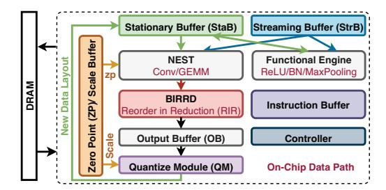

# E. Data Reordering Implementations

The layout reorder patterns described in Fig. 5 could have different implementations with different critical-path latency.

- 1) Existing Implementations: We classify existing reordering implementations into three categories.
- a) No Reordering: If there is no reordering, either the accelerator needs to run a fixed dataflow or a subset of dataflows that are concordant to the fixed layout, or pay the cost of bank conflicts due to discordant accesses. This can lead to suboptimal performance (as shown by blue bar in Fig. 2).
- b) Off-chip Reordering: SoTA that support dataflow switching (Tab. I) require iActs to move to off-chip DRAM, get reordered there by CPU, and then move back to the accelerator. This naturally incurs extra latency and energy costs (Fig. 6a).

- *c) On-chip Reorder After Reduction (RAR):* Existing onchip reordering techniques essentially perform reordering after reduction. The post-reduction oActs are first written to the on-chip buffer, then read and sent to a separate unit to perform a layout transformation, and then fed back to compute unit as iActs of the next layer. This puts reordering in the critical path, as shown in Fig. 6b. Previous arts all fall into this bucket with *explicit reordering latency*, as listed in Tab. III. For example, Medusa [48] proposes dedicated hardware between on-chip buffer to compute unit to implement line rotation (Fig. 5b); Meta's MTIA [19] proposes a Memory Layout Unit (MLU) to implement transpose; Google's TPUv4 [26] also supports row-reordering (Fig. 5d) to facilitate im2col.
- *2) Proposed Implementation On-Chip Reorder In Reduction (RIR):* This work proposes to perform reordering on output during reduction phase of computation, such that oActs are written in the layout concordant with the dataflow of the next layer. We call this Reorder in Reduction (RIR). RIR *implicitly* modifies the layout during the reduction process when *generating oActs* instead of transforming iActs from one layout to another, as depicted inFig. 6c. This approach (i) removes reordering from critical path, (ii) reduces the total number of partial sums into fewer final sums, reducing buffer access and effectively minimizing potential bank conflicts. §IV provides more details.

## *F. Inefficiency of SoTA Reconfigurable Dataflow Accelerators*

Data Reordering Support. Driven by the observation that on-chip dataflow plays a crucial role (§II-A), there has been a suite of past work on accelerators with hardware support for running diverse dataflows [32]. Their key observation is that different dataflows trade-off spatial and temporal reuse, and thereby flexible dataflow requires support for different operand stationarity within buffers and variable-sized spatial and temporal reductions through the interconnect. Unfortunately, these accelerators have two limitations as elaborated in §II-D and §II-E: (i) either they do not support any onchip reordering (Tab. I) or support limited transformations including transpose, line rotation or row-reorder (Tab. III). This work extends support to arbitrary reordering. (ii) prior on-chip reordering support can cause bank conflicts, increasing reordering time. This work removes reordering from critical path by doing it during the reduction phase of the computation.

Dataflow-Layout Co-Search. There has also been a suite of dataflow/mapping search tools [23], [27], [41] that can recommend the optimal dataflow given a layer and hardware resources. *However, none of these tools explore on-chip data layouts as part of the search process.*

Contributions of this work. This work addresses the aforementioned gaps via three key contributions: (i) a reconfigurable accelerator *FEATHER* with a novel on-chip fabric called *BIRRD* that provides support for *both* dataflow flexibility and layout flexibility through arbitrary reorder, (ii) a new on-chip data reordering mechanism called RIR (implemented by *BIRRD*) whose key goal is to *generate* data in the layout required by the next layer instead of explicitly requiring layout conversion

Fig. 7: Overview of *FEATHER* architecture. The compute pipeline (NEST→BIRRD→OB→QM) reads iActs from StaB Ping (or Pong) and writes oActs to StaB Pong (or Ping) with a new data layout.

(§IV), (iii) a tool called LayoutLoop for dataflow and layout co-exploration (§V). *FEATHER* provides two specific benefits over prior work in data reordering: (i) supporting arbitrary reorder, and (ii) proposing RIR to hide reordering latency behind computation, and minimize bank conflicts.

## III. *FEATHER* OVERVIEW

In this section, we provide an overview of *FEATHER* architecture in Fig. 7 and its micro-architectures in Fig. 8.

