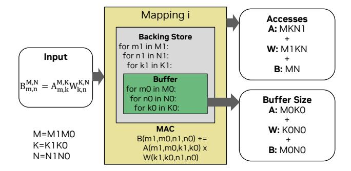
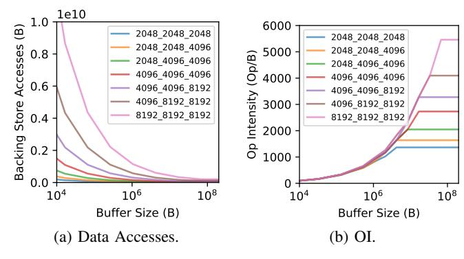

# II. MOTIVATION

During early hardware design space exploration, one of the first analyses an architect conducts is a "speeds and feeds" study on data movement and computation required by the algorithms of interest. Often, operational intensities (OI) [\[25\]](#page-14-10)—i.e., the ratio of compute to data movement—of various algorithms are used as input in a roofline performance model [\[76\]](#page-15-8) to quickly estimate whether a target workload is expected to be computation-limited or memory bandwidth-limited.

The data movement metric used for this analysis is called the *algorithmic minimum* (equivalent to compulsory misses with a cache-based design) and is simply the sum of all operand sizes. Unfortunately, this metric can be too optimistic. For example, Fig. [2](#page-1-2) compares the algorithmic-minimum tensor accesses for a 4k 4k 4k GEMM workload with the data

1Adapted from the word "orogenesis" which means mountain creation.

Inspired by the snowcat vehicle used for crafting ski slopes [\[1\]](#page-14-9).

movement across various levels on an NVIDIA A100 GPU memory hierarchy. The data shows that actual DRAM traffic is  $6.5 \times$  larger than the algorithmic minimum. This **gap** arises from both mapping inefficiencies and fundamental hardware design choices, particularly buffer capacity constraints for enabling data reuse. Worse yet, algorithmic-minimum's gap vs. L2-to-L1 traffic is even more dramatic— $32.3 \times !$  While DRAM access bandwidth and energy efficiency are critical first-order design considerations, on-chip data movement has been shown to be just as important [57], particularly for energy efficiency. A deeply flawed data-movement metric can potentially mislead an architect toward poor initial design decisions.

One might ask why architects cannot use a more precise data movement estimation method during early design-space exploration. The reason is twofold. First, data movement is sensitive to the reuse that can be exploited by an architecture's memory hierarchy. Modeling this accurately requires the use of a more detailed architectural model, which has dramatically higher implementation and runtime costs than the simple equations for algorithmic-minimum accesses.

Second, data movement is sensitive to the specific implementation of an algorithm. Thus, we cannot determine optimal traffic using Bellady's [7] algorithm, which is sensitive to cache capacity, but it only models a single implementation of the algorithm. For tensor algorithms, alternative implementations are called *mappings* [57] and reflect the tiling, parallelization, scheduling and fusion choices that either an expert programmer or optimizing compiler would make to optimally exploit the available hardware resources and the algorithm's inherent reuse patterns. There has been an enormous amount of research on fast models [46], [57], [79], and automated mapspace searches [8], [22], [57], [86] for tensor accelerators. However, an exhaustive mapspace search even for a single design may consume an unacceptable amount of time, rendering this approach useless for early DSE across a large space of designs. Furthermore, a vast design-space search is rarely employed in the real world. Instead, an architect is looking for basic intuition about the behavior of target algorithms that they use to create initial baseline designs, followed by DSE within limited regions around the baselines.

In summary, architects find themselves trapped in a gap between the sheer imprecision of algorithmic-minimum access counts, and the modeling cost and implementation-dependence of more precise models.

We believe we can bridge this gap for the domain of tensor algorithms. Our approach:

- addresses the mapping-specificity of precise datamovement counts by providing a *bound* on data movement that no mapping can improve,
- addresses the reuse-obliviousness of algorithmic minimum accesses by providing a backing-store access bound for any given buffer capacity, allowing projection of data movement bounds at all levels within any design's memory hierarchy.
- addresses the runtime cost of detailed modeling and mapspace search by employing a simple proxy architec-

(a) Example real design.

(b) Snowcat architecture.

Fig. 4: Snowcat architecture compared to a real design.

ture we call a *Snowcat* architecture that exposes an extremely small mapspace and can be analyzed or modeled extremely efficiently.

This tool is available at <a href="https://timeloop.csail.mit.edu/orojenesis">https://timeloop.csail.mit.edu/orojenesis</a>. In the next section, we describe *Orojenesis* in detail. We describe its objectives, our methodology, and how to use the results to extract key insights.

#### III. Orojenesis

#### A. Terminology

We first define a set of terms that we will use frequently in the remainder of this paper. Our terminology is derived from the TeAAL [47] work.

A **tensor** is a multi-dimensional array with a fixed number of **ranks**. Each rank has a **shape**. For example, the tensor A[5][4] has 2 ranks with shapes 5 and 4 respectively.

Operations on tensors such as matrix multiplications, convolutions or contractions can be concisely expressed in Einstein summation (or **Einsum**) notation [20], which has recently been used and/or extended in a variety of works [24], [26], [40], [47], [53], [57], [71]. For example, matrix multiplication is expressed as the Einsum  $B_{m,n}^{M,N} = A_{m,k}^{M,K} W_{k,n}^{K,N}$ , where the superscripts represent the shape of each rank.

A **tensor algorithm** is a computation on a set of tensors that can be expressed either as a single Einsum or as a **sequence** of Einsums in a producer-consumer cascade. A tensor algorithm is always *un-mapped*, i.e., it has *not* been tiled, parallelized, scheduled or fused for optimal execution on a target architecture.

A **mapping** represents a specific way to tile, parallelize, schedule and/or fuse a tensor algorithm on a target architecture. The set of legal mappings of an algorithm on an architecture is known as the **mapspace**. A **mapper** is an algorithm or heuristic that finds an optimal mapping within the mapspace given one or more target optimization metrics and a set of hyperparameters.

#### B. Orojenesis Methodology

*Orojenesis* is a methodology that derives the relationship between the capacity of a *buffer* (i.e., an on-chip scratchpad, cache or buffet [61]) and a lower bound on the accesses to the next-outer level in a memory hierarchy (i.e., a *backing store*)

Fig. 5: The Orojenesis flow.

that no *mapping* of a given tensor algorithm can improve. An example of this relationship is depicted by the green curve in Fig. 1.

The key insight this work leverages is that the data movement behavior across any two consecutive memory levels is *fractal* at the limit. For any given level within the memory hierarchy, we can treat the total storage capacity at that level as a collective "pool of bytes". The maximum data reuse achievable and the resulting traffic volume to the next level in the hierarchy are bounded by the number of bytes that exist in the pool, regardless of the specific memory level it represents.

**Snowcat** architecture. As a result, we can use a simple architecture to study data movement behaviors that can be generalizable to complex architectures. We refer to this architecture as the *Snowcat*. Unlike a real design (Fig. 4a), *Snowcat* is a single processing-element architecture with two levels in its storage hierarchy—an unconstrained buffer and a backing store (Fig. 4b). Because the *Snowcat* architecture has just two storage levels and does not need to consider parallelization, its mapping space is considerably smaller and its modeling complexity is lower. For instance, *Snowcat*'s mapspace for a  $4k_4k_4k_5$  GEMM is  $7350\times$  smaller than that of an Eyerisslike architecture [12], [52], highlighting its effectiveness in significantly reducing mapspace traversal complexity.

**Bound Derivation.** While static compile-time analysis and optimization-based approaches [31], [54], [55] can be applied to find data movement bounds, prior publications do not analyze fused mapspaces and leave gaps in the bounds. Heuristic or data-driven mapspace search approaches [27], [36], [77] offer an alternative, but they do not guarantee to converge to the global optimum. Exhaustive search is the most straightforward method to find all Pareto-optimal points that optimize the combination of buffer size and data access count across all mappings for a comprehensive set of workloads. As noted earlier, the manageable modeling cost and compact search space of the *Snowcat* architecture make exhaustive search feasible for realistic workloads.

**Tool Flow.** Fig. 5 presents the overall *Orojenesis* flow. *Orojenesis* accepts a workload specified as a single tensor algebra Einsum or a chain of such Einsums as input. For a given workload, the *Orojenesis* flow traverses the complete unconstrained mapspace of that workload on the *Snowcat* ar-

Fig. 6: Buffer size requirements and data accesses to the next memory level derived from a matrix multiplication mapping.

chitecture. For each mapping encountered during this traversal, we compute the backing-store access count and the tile sizes (i.e., the live data footprint) for each tensor. Given this information, the buffer's size is expanded or contracted to exactly fit the tile sizes that the mapping needs. We call this the buffer size requirement for the mapping. Throughout this mapspace traversal, Orojenesis collects the buffer size requirements and the backing store access counts for all mappings, continuously updating the best-achieved backing store accesses for different buffer size requirements. Note that this process avoids exploring the cross-product of buffer capacities and mappings, a key difference from tensor accelerator mapspace searches. At the end of the process, connecting the Pareto-optimal points in this space gives us the ski-slope diagram.

We implement the *Orojenesis* flow using Timeloop's [57] mapper configured for exhaustive search, and its performance model configured to report buffer size requirements and memory accesses for the Snowcat architecture. For multi-Einsum evaluation, we adapt Timeloop to accommodate fusion optimization (details are elaborated in Sec.V). Timeloop uses a robust polyhedral approach to compute tile sizes and access counts, which works on a range of affine problems. However, for pedagogical purposes, because GEMM is a straightforward rectilinear affine problem, we illustrate in Fig. 6 how the tile sizes can be derived using simple algebraic expressions. The tile size for each tensor is the product of its inner-loop bounds for relevant ranks (i.e., the dimensions that affect the tensor's size), and the total buffer size requirement is their sum. Backing store accesses for each tensor can be calculated by multiplying inner-loop tile sizes with outer-loop iterations. These iterations are the product of loop tiles outside a relevant loop tile in the backing store memory. For example, in Fig. 6, tensor A's iteration count is  $K1 \times N1 \times M1$ , while for tensor B, the iteration count is  $N1 \times M1$  as K is an irrelevant rank.

**Extrapolating** *Orojenesis* **bounds.** The *Snowcat*-based *Orojenesis* analysis is applicable to a variety of architectural analyses. For example:

1) Multi-level Memory Hierarchy: As demonstrated in the ski-slope diagram in Fig. 7, the *Orojenesis* bound for an algorithm can be probed at different points to find data movement bounds between any two levels (e.g., L1 and L2, L2 and DRAM) in a memory hierarchy. Note that the Pareto-

Inputs: **Buffer Size** Hardware TOPs and BW OI Mesa 335TOps 10KB 100 OI Outputs: Perf Mesa: Performance (TOps 10 335TOp: 10 10 10KB 10 106

Fig. 7: Multi-level memory access bounds for  $16k_{-}1k_{-}1k$  GEMM, with points indicating explored mappings.

Fig. 8: OI mesa for maximum attainable operational intensity.

Fig. 9: Performance mesa with buffer size as input.

optimal mappings achieved may not always compose across multiple levels. Hence, a multi-level backing store lookup yields a lower bound, but it is not guaranteed to be tight.

- 2) Parallel Architecture: Parallelization of a mapping can introduce data duplication since some tensor tiles may need to be made available at multiple parallel instances. This leads to either an effective reduction in the total buffer capacity at a storage level, or more data movement traffic, which leads to a sub-optimal data point relative to *Orojenesis' Snowcat*-derived Pareto bound. In Fig. 6's example, parallelizing the buffered M0 loop leads to the same next-level access count, but the new mapping requires either duplicating M0 weights across different parallel processing elements (PEs) or broadcasting these weights to all PEs during execution, thus increasing network traffic. Therefore, when parallelism is present, *Orojenesis* returns a looser (but still correct) lower bound.
- 3) Constrained Mapspaces: Some architectures may constrain [57] the space of legal mappings to simplify their design, particularly interconnection network design. Such constraints shrink the mapspace, but the *Orojenesis* bounds are still guaranteed to bound the resultant space.

These three scenarios describe the complete set of architectural attributes that can be fractally composed to create a realistic tensor accelerator design. Because *Orojenesis* bounds continue to be valid across these attributes, its bounds are *portable* across all tensor accelerator architectures that can be described in a framework such as [57]. This means that there is no need to re-run *Orojenesis* for different architectures, so long as the underlying algorithm remains unchanged.

#### C. Derivative Models

The *Orojenesis* bounds can be used as a foundation to build more sophisticated models that combine computation with data movement analysis. We show two examples in this paper.

Attainable Operational Intensity (OI) Model. Unlike algorithmic OI derived from inherent algorithmic properties, the attainable OI of a workload depends on the space of mappings and is constrained by the hardware buffer capacity. This attainable OI can be significantly lower than the algorithmic OI. To offer more insight into how the optimal OI of a tensor workload varies with the buffer capacity in a design,

the *Orojenesis* data can be used to derive a maximal *attainable* OI curve as shown in Fig. 8. Instead of the algorithmic OI or an OI point calculated from a specific implementation, our bound represents the best-possible OI subject to given buffer size constraints. The shape of the diagram in Fig. 8 resembles a mesa, a flat-topped ridge. Therefore, we name it an *OI mesa*. In this diagram, OI can be either bounded by the buffer capacity or the inherent algorithmic compute-to-tensor-size ratio. The slope of the OI mesa serves as an indicator of how efficiently the algorithm can leverage data reuse from the buffer.

Attainable Performance Model. The attainable OI model can be combined with a traditional roofline model [76] to form a performance model that takes buffer capacity along with the memory bandwidth and compute capabilities of a hardware architecture as input. The result is a new mapping-agnostic performance model for guiding DSE. The output of this model is called a *performance mesa*, as shown in Fig. 9. This model's usage is later showcased in Sec. VII-D.

#### IV. SINGLE-EINSUM BOUNDS ANALYSIS

In this section, we analyze the *Orojenesis* bounds for commonly encountered tensor Einsums and demonstrate their utility in guiding algorithm and hardware design choices.

1) Matrix Multiplication: A GEMM can be expressed with the Einsum  $B_{m,n}^{M,N} = A_{m,k}^{M,K} W_{k,n}^{K,N}$ . Fig. 10 shows the skislope and OI mesa diagrams for various GEMM shapes. For each GEMM shape, the ridge point of the OI mesa represents the maximal effectual buffer size. Fig. 11 shows the ratios of these maximal effectual buffer sizes normalized to the total operand size for each GEMM shape. These ratios represent Gap 1 described in Sec. I. We observe that the maximal effectual buffer size of a GEMM is approximately equal to the size of its smallest operand. For instance, with M = K = N, the chart shows that the maximal effectual buffer size is about one-third of the total operand size, which roughly matches the size of its smallest operand.

To validate this observation, we symbolically formulated the maximal effectual buffer size calculation for GEMMs from first principles and found that it is the size of its smallest operand, plus the size of its smallest rank, plus 1. A rigorous proof is omitted for space constraints, but the expression

Fig. 10: Impact of GEMM sizes. Larger GEMMs see a more significant reduction in total data movement with increased buffer capacity. Note that the Y-axis uses a linear scale.

Fig. 11: Maximal effectual buffer ratio over total operand size.

produces values that align with our empirical observations. This study illustrates that *Orojenesis* can be used to uncover valuable design insights.

Fig. 10a reveals more insights. For all GEMMs, the backing store access bound exhibits a power-law decrease with increasing buffer capacity. Notably, larger GEMMs experience more data movement under the same buffer capacity and their data access bounds exhibit steeper decreases. This highlights that increasing the buffer capacity is more beneficial for larger GEMMs, resulting in more substantial access savings, both in absolute terms and relative to the original accesses.

Fig. 10b shows that the attainable OI also experiences a commensurate power law increase as the buffer capacity increases, before reaching the top of the mesa (peak OI). The peak OIs of different GEMM shapes reveal that **the optimal OI of a GEMM is limited by its smallest dimension**. This observation can be further supported by the peak-OI equation derived with perfect data reuse:  $OI_{peak} = \frac{MKN}{MK+KN+MN} = \frac{M}{\frac{M}{N}+\frac{K}{K}+1}$ . Assuming M is the smallest dimension such that  $M \ll N$  and  $M \ll K$ , we have  $\frac{M}{K} \to 0$  and  $\frac{M}{N} \to 0$ , in which case  $OI_{peak}$  converges to M.

Fig. 12: Impact of various convolution configurations.

- 2) Convolution: Α multi-channel 2D convolution  $B_{p,q,n}^{P,Q,N}$ be expressed with the Einsum  $A_{t_wp+d_wr,t_hq+d_hs,c}^{TP+DR,TQ+DS,C}W_{c,n,r,s}^{C,N,R,S}$ . In this analysis, we set C and K to 64, P and Q to 16, and vary the shapes of R, S, and the convolution's stride T and dilation D. The ski-slope diagrams (Fig. 12) show that a larger filter size leads to more backing store accesses and higher peak OI. It also leads to a steeper decreasing slope in Fig. 12a, indicating that convolution with larger kernel size benefits more from increased buffer capacity. Meanwhile, stride and dilation introduce slightly higher backing store accesses. The stride of 2 lowers the peak OI as it accesses more input activations to produce the output of the same size.
- 3) Batched Matrix Multiplication: Batched matrix multiplication (BMM) is an important tensor algorithm as it is widely used in the multi-head attention (MHA) [74] design of modern Transformer models. As its name suggests, it allows GEMMs to be processed in batches by introducing an additional batch dimension. Its Einsum is represented as  $B_{h,m,n}^{H,M,N} = A_{h,m,k}^{H,M,K} W_{h,k,n}^{H,K,N}$ , where M, K, and N are the standard GEMM dimensions and H denotes the batch dimension. In Transformers, H is also known as the number of heads, with token features split into multiple heads to enhance the modeling capability of the attention mechanisms.

Fig. 13 shows the ski-slope and OI mesa diagrams for various BMM shapes with identical computation operations (OPs) but varying reduction dimension size K and number of heads H. As the number of heads increases, it leads to higher overall backing store access. The slopes of the curves become less steep with more heads, suggesting that increasing the buffer capacity provides diminishing benefits for BMMs with more heads. For instance, in a typical BMM with 32 heads and a head feature dimension of size K=128, there is very little utility in further increasing the buffer size beyond 100KB. Fig. 13 also shows that the maximal effectual buffer size (ridge points in the OI mesa) decreases with more heads. This suggests that simply increasing the buffer size cannot improve the throughput performance of memory-bound BMMs with small maximal effectual buffer sizes.

Fig. 13b shows that the peak OI decreases with the increase in the number of heads. As a result, adding more computation

Fig. 13: Impact of number of heads in BMM with dimensions H=# of heads, M=4k,  $K=\frac{4k}{\# \text{ of heads}},\ N=4k$  with total computation fixed at 128 GOPs.

is also not beneficial for BMMs with a small reduction dimension K. On Google TPUv5e [23] with an int8 Flops-to-Bytes ratio of 480 and NVIDIA H100 SXM GPU [51] with an int8 Flop-to-Bytes ratio of 1182, BMMs with head dimensions smaller than 128 will be memory bound regardless of the allocated on-chip buffer or last-level cache size as its peak OI is lower than 256. The only feasible ways to improve the performance of BMMs are to increase the memory bandwidth or to enlarge the head feature dimension.

4) Grouped BMM: To alleviate MHA's high memory access costs, multi-query attention (MQA) [67] and grouped-query attention (GQA) [4] have been introduced. They employ an algorithm called grouped BMM, which can be expressed with the Einsum  $B_{h,m,n}^{H,M,N} = A_{h,m,k}^{H,M,K} W_{g,k,n}^{G,K,N}$ , where G represents the number of groups. In grouped BMM, instead of computing multiple heads of both input operands, one operand's head is shared by  $\frac{H}{G}$  heads of the other operand. G=1 corresponds to MQA and G=H reverts to the original MHA. MQA allows for a variable G between 1 and H.

Fig. 14 shows the *Orojenesis* outputs for a grouped BMM. Observe that reducing the number of groups lowers data movement and consequently increases the OI. The result reaffirms the effectiveness of the MQA and GQA design in reducing memory traffic. However, when the buffer capacity is larger than 10 MB, the data access saving from MQA and GQA diminishes, as shown by the converging bounds in Fig. 14.

