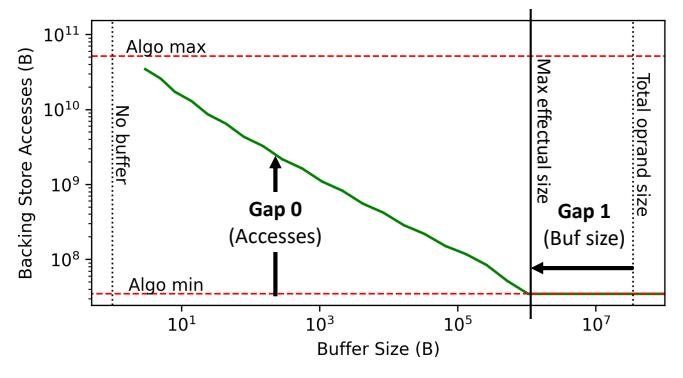

# Mind the Gap: Attainable Data Movement and Operational Intensity Bounds for Tensor Algorithms

Qijing Huang *NVIDIA* jennyhuang@nvidia.com

Po-An Tsai *NVIDIA* poant@nvidia.com

Joel S. Emer *MIT CSAIL / NVIDIA* emer@csail.mit.edu

Angshuman Parashar *NVIDIA* aparashar@nvidia.com

*Abstract*—The architectural design-space exploration (or *DSE*) process—whether manual or automated—benefits greatly from knowing the limits of the metrics of interest in advance. Data movement is rapidly emerging as a critical metric for DSE due to its increasing impact on both performance and energy efficiency. Unfortunately, the commonly used algorithmic minimum (or "compulsory misses") limit for data movement is extremely loose, limiting its utility in design-space search.

In this paper, we present *Orojenesis*, an approach to compute data movement limits (or bounds) for tensor algorithms. Unlike algorithmic-minimum bounds, *Orojenesis* comprehends reuse and the ability of a buffer (such as a cache or scratchpad) to exploit reuse to reduce data movement. *Orojenesis* provides a bound that no dataflow or mapping can possibly exceed under varying onchip buffer capacity constraints, including mappings that *fuse* a sequence of tensor operations to exploit producer-consumer reuse. *Orojenesis* produces a plot that shows the relationship between a buffer's size and the lower data movement limit to/from the next level in a memory hierarchy. This plot, dubbed a *ski-slope diagram*, allows designers to gain critical insights into the behavior of a workload as a function of storage capacity. This analysis can inform early high-level design decisions before embarking on thorough design space searches.

We use *Orojenesis* to analyze a set of valuable tensor algorithms including batched and grouped matrix multiplications, convolutions, and sequences of operations in Large Language Models (LLMs). Our analysis reveals a range of architectural insights, including the fact that attainable data movement can be orders-of-magnitude higher than algorithmic minimum, that there exists a sweet spot between SRAM and compute resource provisioning for optimal throughput, and that up to 5.6× data movement reduction can be achieved with fusion with a buffer capacity of 320MB for the GPT-3-6.7b LLM.

#### I. INTRODUCTION

Data movement is becoming an increasingly significant component of the energy consumption of many applications. This is primarily because process technology scales compute far more efficiently than wires. The phenomenon is exacerbated for tensor algebra algorithms because hardware/algorithm co-designed optimizations such as quantization and sparsity can disproportionately favor computation reduction relative to data movement reduction. In addition to energy costs, data movement also impacts performance if it saturates any data movement channel in a system, such as memory bandwidth. Therefore, optimizing data movement is becoming increasingly critical in the pursuit of more performant and efficient architectural designs. Unfortunately, this is nontrivial. It isn't sufficient to merely reduce memory bandwidth

Fig. 1: Differences between the attainable data movement and the algorithmic minimum (Gap 0), and between the maximal effectual buffer (cache or scratchpad) size and the total operand size (Gap 1). The green curve, which resembles a ski slope, represents the desirable data movement bound in relation to the buffer size requirement for a tensor operation.

demand—data movement is costly even within the on-chip memory hierarchy [\[57\]](#page-15-0).

Furthermore, newer architectures such as tensor accelerators expose immense, multi-dimensional design spaces, and each design exposes a large space of tiling, parallelization and scheduling knobs (often referred to as the mapping space or *mapspace*) for a single algorithm. This results in a complex cooptimization problem that has been attacked by recent research on mapspace exploration [\[17\]](#page-14-0), [\[27\]](#page-14-1), [\[31\]](#page-14-2), [\[43\]](#page-15-1), [\[57\]](#page-15-0), [\[62\]](#page-15-2), [\[82\]](#page-16-0), [\[85\]](#page-16-1), design-space exploration (DSE) [\[18\]](#page-14-3), [\[30\]](#page-14-4), [\[35\]](#page-14-5), [\[41\]](#page-15-3), [\[64\]](#page-15-4), [\[68\]](#page-15-5), [\[75\]](#page-15-6), [\[81\]](#page-16-2)–[\[84\]](#page-16-3), and co-optimization of these spaces [\[28\]](#page-14-6), [\[38\]](#page-14-7).

In the real world, architects rarely utilize na¨ıve searches of massive design spaces. Instead, they start with limit (i.e., *"speeds and feeds"*) studies to develop intuition, craft a set of baseline designs based on this intuition, and then launch more constrained design-space exploration studies around these baselines. Unfortunately, these studies are typically carried out using a primitive data movement limit called *algorithmicminimum accesses*. This limit (or *bound*) is equivalent to compulsory misses for caches and is simply the sum of all input and output operand sizes. This bound is extremely loose (Gap 0 in Fig. [1\)](#page-0-0) because the achievable access counts with any realistic design may be orders of magnitude higher, especially for memory levels closer to arithmetic units. One might think that it would be sufficient to determine optimal traffic using Bellady's [\[7\]](#page-14-8) algorithm, which *is* sensitive to cache capacity, but it only models a single mapping (i.e., tiling, parallelization and schedule) of the algorithm. Other works (see Sec. [X\)](#page-12-0) do not provide tight bounds for a comprehensive set of scenarios. Thus, these data movement analyses have limited utility in informing an architect's intuition for designing new architectures, especially radical new designs for which optimizing compilers do not yet exist.

In this work, we present a methodology to compute data movement bounds for tensor algorithms, creating diagrams such as Fig. [1.](#page-0-0) Because Fig. [1](#page-0-0) looks like a ski slope on the side of a mountain, we call the process of creating these "mountains" *Orojenesis*[1](#page-1-0) . *Orojenesis* provides tighter bounds than algorithmic-minimum accesses because it comprehends data reuse that a buffer (such as a cache, scratchpad or buffet [\[61\]](#page-15-7)) can exploit to reduce data movement. This is especially true for the inner levels of a design's memory hierarchy, where data movement deviates significantly from the algorithmic-minimum accesses. *Orojenesis*' bound is also *mapping-independent* because it provides a limit on what any mapping of an algorithm can possibly extract from an architecture's hierarchy *without running an expensive mapspace search on a complex hardware design.* Given an *unmapped* algorithm consisting of a sequence of tensor computations, *Orojenesis* emits (Fig. [1\)](#page-0-0) a Pareto-curve showing the minimal attainable accesses for that algorithm subject to varying buffer capacity constraints. Our main contribution is the *Orojenesis* approach itself. Using a dramatically simplified proxy architecture called the *Snowcat*[2](#page-1-1) to model data movement between a variable-size buffer and an infinite backing store, *Orojenesis* derives the "ski slope" curve for a given tensor computation using a mapspace search on this architecture. For sequences of tensor computations, we identify the least-restrictive constraints that allow producer and consumer computations to exchange data using tiles, enabling a space of *fused* mappings. These constraints enable *Orojenesis* to derive the ski-slope curve for the entire fused sequence. Armed with this model, we derive a diverse range of architectural insights.

First— we show how the ski-slope curve can be used to address critical questions on the behavior of an algorithm on an architecture, such as:

- Given a buffer capacity, what is the minimal attainable backing store access count, or equivalently, the maximal attainable operational intensity? [Gap 0]
- How much additional buffer capacity is required to achieve the algorithmic-minimum backing store access count? [Gap 1]
- How does the algorithm benefit from an incremental increase in buffer capacity? [rate of change of Gap 0]

Second—we highlight trade-offs between fused and unfused mapping strategies under varying buffer capacity constraints,

Fig. 2: Memory and cache accesses compared to algorithmic minimum for a 4k 4k 4k GEMM on an NVIDIA A100 GPU.

Fig. 3: Maximal effectual buffer size to enable full tensor reuse normalized to total tensor size.

and show that fusion, while often beneficial, isn't always optimal due to the constraints it imposes on intra-layer mappings.

Third—we analyze fusion opportunities in the GPT-3-6.7b Large Language Model (LLM), revealing that up to a 5.6× reduction in data movement can be achieved with a buffer size of 320 MB.

Fourth—we develop a performance model that takes the buffer-to-compute area ratio as input and yields throughput performance, utilizing *Orojenesis* bounds. This model, which is a concave function, facilitates rapid, one-shot design decisions for various tensor algorithms.

We believe that *Orojenesis* is a radical new approach for early-stage architectural DSE, providing significantly improved accuracy over crude algorithmic-minimum or operational-intensity based analyses, while avoiding the implementation-specific pitfalls of traditional cache-based studies and the intractable mapspace searches of contemporary tensor accelerator frameworks.

