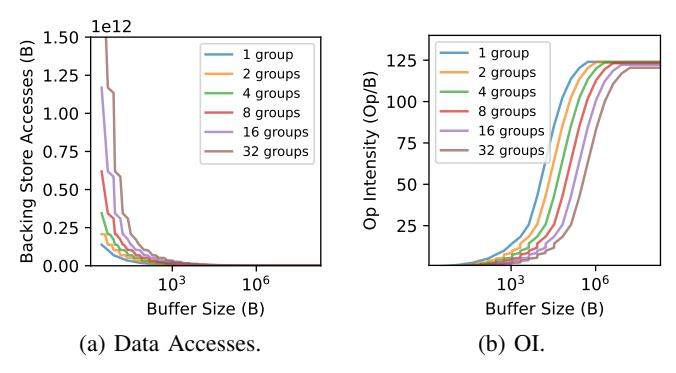
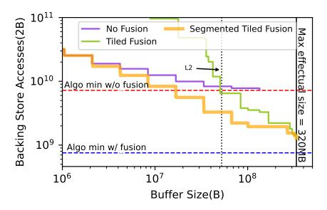
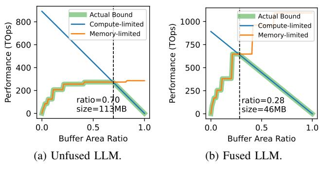

# V. Orojenesis FUSION

When the input to the *Orojenesis* flow is a chain of Einsums, the backing store access bound cannot be simply derived from the sum of bounds from all individual Einsums due to the presence of fusion opportunities. By buffering intermediate outputs of consecutive layers in an efficient storage like an on-chip cache or scratchpad, fusion has the potential to further lower the total minimum backing store accesses.

#### A. Fusion Methodology

For the remainder of this paper, *Einsum* and *layer* are used interchangeably to refer to tensor operations in deep learning.

Fig. 14: Impact of number of groups in grouped BMM with dimensions H=32, M=4k, K=128, N=4k with different number of groups in second input operand.

Fig. 15: Layer Fusion Definition. The output of Einsum e is an input of e+1. At level m of the memory hierarchy, the output of e is completely consumed by e+1.

**Definition of fusion**. We define layer fusion based on two key criteria, as illustrated in Fig. 15: First, for each Einsum in a sequence of E layers indexed by  $e \in [0, E-1)$ , the Einsum's output must serve as an input for the subsequent Einsum e+1. Second, within a given level m of the memory hierarchy, the output of Einsum e, i.e., the *intermediate output tensor*, should be completely consumed by Einsum e+1 without spilling over to any outer memory level n, where n>m.

**Untiled Fusion**. Consider the execution of two Einsums in a sequence on the *Snowcat* architecture, if the buffer can accommodate the full intermediate tensor, fusion does not impose any constraints on the mappings of the individual Einsums (i.e., the intra-layer mappings) in the chain, eliminating the need to tile the intermediate tensor. This mapping approach is termed "untiled fusion". However, untiled fusion often leads to a high buffer size requirement due to a large intermediate tensor size. In Section VI, we show that fused mappings using untiled intermediates tend to be suboptimal.

**Tiled Fusion**. For more effective use of the buffer, tiling intermediate outputs is important. This requires each Einsum's execution order and granularity to be aligned throughout the chain. We accomplish this by forcing all mappings in a chain to conform to a set of constraints collectively known as the Fusion Friendly Mapping Template (FFMT). Fig. 16 shows the FFMT for a GEMM chain, which we use for all fusion analyses in this paper. Other tensor algorithms will need their own FFMTs to model Einsum fusion in the *Orojenesis* flow.

As shown in Fig. 16, the GEMM FFMT works on a block

(a) **Full**: Only the M dimension is tiled to fully consume an input row and produce complete output rows of final sums.

(b) **TiledK**: M and K dimensions are tiled. A sub-partition of the input row is consumed and partial sums are produced.

(c) **TiledN**: M and N dimensions are tiled. The input row is fully consumed and it produces a subpartition of final-sum outputs.

(d) **TiledKN**: All dimensions are tiled, leading to sub-partition input row consumption and sub-partition of partial-sum outputs.

Fig. 16: The GEMM Fusion Friendly Mapping Template (FFMT). The GEMM FFMT is the union of four different constraint sets. The outermost loops in the gray boxes are permutable in two-Einsum chains.

Fig. 17: Imposed GEMM FFMT constraints for different Einsums in the fusion chain. Each loopback arrow indicates the number of times each inner buffer tile is executed. 'K2(0)' and 'N2(0)' denote the K2 and N2 loop bounds for Einsum 0. 'N2(E-1)' represents the N2 loop bound for Einsum E-1.

of M0 input rows at a time and requires M1 iterations through the chain to complete the entire computation. The reason M1 is in the outermost loop is that it is the only shared rank across all GEMMs in the chain. Having any contracted ranks in the outermost fused loop can introduce recomputation and more memory traffic. To model a fused Einsum flow, we use a variant of the Snowcat architecture with a unified InputOutputBuf for storing inputs and outputs, and a separate WeightBuf for buffering weights.

Fig. 16a to Fig. 16d show four mapping patterns in loop nest notation [57], each describing a constraint set that an intra-layer mapping can obey to support fusion. The colored loop tiles correspond to the innermost sub-problem whose operands are always serviced by the buffer, and which will not be further sub-divided for fusion purposes. For single Einsums, new buffer data is loaded before each colored block starts and the output is stored back to the backing store after each colored block finishes. For a chain of Einsums, backing store accesses can be elided when consecutive Einsums are fused. In the figures above the loop nests, the colored tensor partitions represent the region that is accessed during the execution of the colored loop tiles. The colored partitions of the input and

output tensors A and B are also equal to their buffer capacity requirements. For the weight tensor W, its colored partition does not directly reflect its buffer capacity requirement. Instead, the inner-WeightBuf loop bounds determine the buffer size requirement for the weights.

FFMT-Full (Fig. 16a) imposes the most restrictive intralayer constraints as it requires storing tiles with the complete K and N ranks, which results in buffering M0 full rows of input and output tensors. FFMT-TiledK (Fig. 16b) relaxes the constraints by permitting the K dimension to be tiled. It only requires sub-columns of the input tensor to be stored in the buffer. However, leaving the K2 tile outside of the fused execution will result in partially reduced output sums. FFMT-TiledN (Fig. 16c) allows tiling along the N dimension. It only requires the full row of the input tensor to be stored in the buffer and produces a sub-partition of the output row. FFMT-TiledKN (Fig. 16d) allows tiling along all ranks. This relaxed mapping constraint helps to further reduce the input/output buffer size requirements to enable fusion optimizations.

FFMT mapping constraints in the fusion chain vary by the Einsum's position, as depicted in Fig. 17. The variables on the loopback arrows denote the number of iterations the tiled execution in each Einsum needs to be repeated before moving on to the next Einsum to ensure that no partial sum is propagated. For example, Einsum 0 requires three outer loop iterations, and its final data movement count is the product of the inner buffer tiles (colored tiles in Fig. 16) and K2(0), N2(0) and M1. K2(0) and N2(0) refer to the K2 and N2 loop bounds in Einsum 0.

The least restrictive *FFMT-TileKN* template can be applied to the first Einsum (Einsum 0) as its input tensor is directly loaded from the backing store. However, due to the partial input tile consumed in Einsum 1, only a partial sum can be produced. Therefore, it becomes necessary to reiterate back to Einsum 0 N2(0) or K2(1) times (they are equivalent) to obtain the entire output row in Einsum 1 with the final sums.

We avoid using a tiled output row in Einsum 1 because it later becomes the input for Einsum 2, causing partial sums in Einsum 2's result. In order to produce the final sums in Einsum 2, reloading Einsum 1's input row becomes necessary, but it has been evicted from the InputOutputBuf once we start processing Einsum 2. Consequently, we must either recompute the Einsum 1's input row or spill and reload it to and from the backing store, which defeats the purpose of fusion.

Since we disallow tiled output rows after Einsum 0, the subsequent Einsums in the chain need to consume and produce the full M0 input and output rows following the FFMT-Full constraint until the last Einsum. The last Einsum permits a FFMT-TiledN template because the output will be written back to the backing store and there is no subsequent Einsum to consume it.

A two-Einsum chain represents a special scenario where propagating the partial output sums of the last Einsum to the backing store is feasible. We can apply FFMT-TileKN to both Einsum 0 and Einsum 1, with N2(1) and K2(1) loops swapped in Einsum 1's mapping template to avoid reloading the intermediate outputs. Moreover, our flow explores alternative dataflows in the two-Einsum setup by enabling the reordering of the M1(0) and N2(0) loops in Einsum 0's mapping template and the subsequent corresponding M1(1) and K2(1) loops in the Einsum 1's template.

#### B. Buffer Size Requirements

The total buffer size requirement  $BufReq_{t,e}$  of tensor t in a GEMM Einsum e is determined by multiplying loop bounds of the relevant ranks of the tensor:  $BufReq_{t,e} = \prod_{d \in \{M,K,N\}} LoopTile_{d,e} \times Relevance(d,t)$ . In the FFMT shown in Fig. 16, we have the following buffer size requirements:  $BufReq_{W,e} = K0(e)N0(e)$ ,  $BufReq_{I,e} = M0(e)K1(e)K0(e)$ ,  $BufReq_{O,e} = M0(e)N1(e)N0(e)$ . Here, Mi(e) denotes the loop tile bound of rank M at memory level i in Einsum e. The same notation applies to ranks K and K0. The total buffer capacity requirement for each Einsum is the sum of the buffer size requirement for all tensors:  $BufReq_e = \sum_{t \in \{A,W,B\}} BufReq_{t,e}$ .

Fusion can be implemented in a sequential or pipelined manner, each with its own buffer size requirement. In **sequential fusion**, where one Einsum is processed at a time, the buffer size requirement for the entire chain is determined by the maximum buffer size requirement across all Einsums:  $BufReq = \max_e(BufReq_e)$ , assuming the weight tensors are tiled and reloaded for each Einsum during the re-traversal.

Alternatively, in scenarios where weight tensors are not reloaded for chain re-traversal, buffers must hold the complete weight tensors for all Einsums, with K0(e)=K and N0(e)=N for all e. In this case, the buffer size requirement becomes the sum of the full weight tensor sizes of all Einsums, plus the InputOutputBuffer size requirement to stream through a row (M0=1) of tensor:  $BufReq=(\sum_e K(e)N(e))+\max_e(K1(e)K0(e)+N1(e)N0(e))$ .

For a fused sequence of Einsums executed in a **pipelined** manner, the buffer capacity requirement can be computed as

the sum of all weight tensor sizes and the maximum input and output tile size sum among all Einsum e:  $BufReq = (\sum_e BufReq_{W,e}) + max_e(BufReq_{I,e} + BufReq_{O,e})$ . This is because the weights involved in the pipelined sequence must be present at all times to be multiplied by the pipelined data. Pipeline fusion increases buffer capacity requirements for achieving equivalent next-level data accesses due to concurrent layer execution, rendering it less optimal. Therefore, in this paper we focus on presenting the *Orojenesis* bounds for sequential fusion.

#### C. Backing Store Access Count

The backing store access count consists of the sum of the input access counts of Einsum 0 and the output access counts of Einsum E-1, in addition to the total weight accesses for all Einsums. In the FFMTs in Fig. 16, the weight access for Einsum e is calculated as  $Access_{W,e} = M1(e)K(e)N(e)$  when the weights are not fully buffered, and is K(e)N(e) otherwise. Here, M1 represents the outer buffer M tile, while K and N are the complete sizes of the reduction and output dimensions of Einsum e. The total weight accesses is the sum of all Einsums' weight accesses:  $Access_W = \sum_i Access_{W,e}$ . The input access count for Einsum 0 is computed as  $Access_{I,0} = N2(0)M(0)K(0)$ , while the output access count for Einsum N-1 is calculated as  $Access_{O,E-1} = M(E-1)N(E-1)$ . The total backing store access count for a fusion chain is:  $Access = Access_W + Access_{I,0} + Access_{O,E-1}$ .

#### D. Mapping Tradeoffs

Increasing M0 raises the demand for buffer capacity but simultaneously reduces M1 (the number of times the entire chain needs to be re-traversed, which equals  $\frac{M}{M0}$ ), thereby decreasing the total number of weight reloads. However, if we can keep the entire weight tensors of a subsequence of layers stationary for re-traversal, M1 does not affect weight reloading for these layers. We can then set M0=1 to exclusively minimize the buffer size requirement. These parameters, i.e., M0 and the layers chosen to fully buffer their weights, are choices in the space of fused mappings. We traverse this space, along with each layer's intra-layer mapspace, to produce the Orojenesis bounds for fused mappings.

#### E. Tool Flow

To explore the multi-Einsum mapspace, we exhaustively search each Einsum's mapspace under FFMT constraints, constructing valid fused mappings by combining compatible single-Einsum mappings. As each Einsum can have multiple valid mappings for fusion, the total fusion space is a Cartesian product of these mappings. For each valid fused mapping, buffer size requirements and accesses are derived using equations from Sections V-B and V-C. Finally, the *Orojenesis* curve is derived by identifying the Pareto-optimal fused mappings.

### F. Avoiding Partial Sum Propagation

In our current analysis, we focus solely on transferring the final sums from the producer to the consumer Einsum. This

Fig. 18: Fusing  $32k_4k_16k$  and  $32k_16k_4k$  GEMMs.

deliberate choice is made to avoid the transfer of partial sums, which would necessitate either recomputation or additional memory accesses to the backing store memory. As fusion with recomputation changes the compute and data movement simultaneously and complicates the performance analysis, we leave it for future study.

#### VI. MULTI-EINSUM BOUNDS ANALYSIS

This section demonstrates how to analyze a sequence of Einsums using *Orojenesis* and FFMT. Fig. 18 shows the *Orojenesis* bounds for two fused GEMMs with shapes  $32k\_4k\_16k$  and  $32k\_16k\_4k$ . In Fig. 18a, horizontal dashed lines show minimum next-level accesses with (blue) and without (red) fusion. It is important to note that *Orojenesis* bounds with fusion do not always outperform the unfused bounds due to the additional intra-layer constraints imposed by FFMT.

The purple curve shows the baseline backing store accesses achieved without fusion, where we search for optimal intralayer mappings without constraints. To establish each point on this curve, we sum the best data accesses for each Einsum considering a specific buffer size limit. The step-like pattern in the figures results from buffer under-utilization due to our use of perfect factors as loop bounds. It's important to note that our single Einsum curve is constructed using discrete mapping points. When integrating them for fusion, we adopt a conservative approach and assume that data accesses remain constant until we identify another Pareto-optimal mapping with a larger buffer size on the X-axis. Using imperfect factorization [29] can potentially smooth out the curve, which would be a straightforward extension to this work.

The blue curve shows the untiled-fusion backing store access bound with fully buffered intermediates, allowing flexible intra-layer mappings. However, these large intermediates dominate buffer size demand, resulting in a nearly vertical line indicating similar capacities for varying accesses. This suggests full buffering of intermediates isn't essential for optimal reuse.

The green curve represents the optimal access bound enabled with tiled fusion. Compared to untiled fusion, tiled fusion is more effective in reducing backing store access with a much smaller buffer capacity. Fig. 18b compares the data movement reduction factor of tiled fusion to untiled execution. It shows that tiled fusion can further reduce the backing store

Fig. 19: LLM building block architecture.

accesses of the optimal unfused mappings. However, when the buffer size is smaller than 10 MB, we see a reduction factor lower than 1, indicating that tiled fusion does not always outperform unfused mappings. With a buffer size larger than 10 MB, tiled fusion becomes profitable. When provisioned with a buffer larger than 256 MB, fusion can lead to up to  $3.7 \times$  access count reduction. Another key insight drawn from the slopes of the bounds is that a larger buffer benefits fused mappings more than the optimal unfused ones.

#### VII. CASE STUDY: LARGE LANGUAGE MODEL

This case study leverages both intra-layer and inter-layer data reuse in fused-layer large language models (LLMs) to establish data movement bounds and guide accelerator DSE.

LLM architecture (Fig. 19) consists of repeated building blocks with sequences of Einsums present in its Multi-Head Attention (MHA) and Feedforward Network (FFN) modules. The colored boxes in the figure show different Einsums: yellow for GEMM and green for grouped BMM. The notation beneath each layer name is the Einsum expressed in Numpy format where the subscripts for input tensors are listed in a commaseparated format, and the subscripts for the output tensor are specified after the right-arrow symbol.

Our target workload is GPT-3-6.7b, characterized by a feature dimension (d) of 4096, 32 attention heads (h), a head dimension (f) of 128, and a hidden feature dimension (c) of 16384. We study the workload with an input sequence length (l) of 32768, which is the product of the actual sequence length of 2048 and a batch size of 16. For simplicity, we assume that element-wise and reduction operations are already integrated with the GEMMs and BMMs, and therefore, their access counts are excluded from our analyses.

#### A. Comparison of MHA Fusion Strategies

Fusing the BMMs is critical for improving the throughput performance of the memory-bound MHA in LLMs. FLAT [39] and FlashAttention [15], [16] have optimized fused-layer MHA with tiling strategies that can be modeled by FFMTs. Here, we provide a comparison of them together with the unfused baseline in Fig. 20.

In FLAT, the entire output row (shaped  $M0 \times N$  as in Fig. 16) of the producer Einsum  $bmm\_QK$  must be generated for the row-wise reductions performed by Softmax. To avoid tiling its output row dimension N, we apply the TiledK template in Fig. 16b with  $M1 \rightarrow K2$  (outer-to-inner)

Fig. 20: MHA fusion strategies resemble FlashAttention [16] and FLAT [39].

Fig. 21: Impact of segmentation on a six-Einsums chain in GPT-3-6.7b.

Fig. 22: *Orojenesis* bounds for the entire GPT-3-6.7b building block.

ordering for the producer Einsum. For the consumer Einsum  $bmm\_QKV$ , the TiledN (Fig. 16c with  $M1 \to N2$ ) template is used to minimize the buffer size requirement. In contrast, FlashAttention permits the tiling of the producer's output row by exploiting an algebraic manipulation to incrementally perform Softmax reduction. Their fusion strategy resembles using TiledN (Fig. 16c with  $N2 \to M1$ ) for  $bmm\_QK$  and TiledK (Fig. 16b with  $K2 \to M1$ ) for  $bmm\_QKV$ .

As indicated by Fig. 20, the fusion strategy has a substantial impact on data movement bounds. Notably, at a buffer size of 16 MB, FlashAttention (green curve) achieves over 6× lower backing store accesses compared to FLAT (blue curve). However, once the buffer capacity reaches the maximal effectual size at 32MB, both strategies become equally effective.

#### B. Impact of Chain Segmentation

To illustrate the impact of fusing more Einsums, we present Fig. 21 that plots the data movement bounds for a sequence of six Einsums in the GPT-3-6.7b block (*Q\_proj, bmm\_QK*, *bmm\_QKV*, *Final\_proj, mm\_0 and mm\_1*). Normalization operation between fused GEMMs automatically imposes a mapping constraint in FFMT: the producer Einsum's output column cannot be tiled.

In Fig. 21, the purple curve indicates the optimal unfused bound, while the green curve represents the optimal tiled fusion bound for the six-Einsum chain. Our observation reveals that fusing a longer Einsum chain is not always beneficial. One reason is that the additional Einsums increase the overall buffer size demand, which is determined by the Einsum requiring the most buffer. In addition, the FFMT constraints are more restrictive to the middle-Einsum in a longer chain, further increasing the buffer size requirement.

To mitigate this, we exhaustively explore all 2(# of Einsums-1) possible ways to segment the chain and construct the yellow curve using the optimal segmentation strategies at varying buffer size constraints. Different points on the orange curve can entail different segmentation strategies. The results show that partitioning the fusion chain into shorter segments can significantly reduce its data accesses, particularly with smaller buffer sizes. This improvement is evident in the yellow curve, which lies much closer to the purple baseline at lower buffer capacities, compared to unsegmented fusion shown in the green curve.

#### C. Optimal Full LLM Fusion Strategy

Fig. 22 displays the total backing store access requirements for the sequential execution of all Einsums in a GPT-3-6.7b building block (Fig. 19). The bounds follow a trend similar to those in Fig. 21, but include additional accesses from two unfused GEMMs, *K\_proj* and *V\_proj*. Analysis of the bounds shows that, with a last-level cache of 50 MB, the optimal fused execution of LLMs can reduce the overall backing store traffic by 2.5× (a 4.7 GB absolute reduction) compared to optimal unfused mappings. The full potential of fusion can be realized with an on-chip buffer of size larger than 320 MB (the maximal effectual buffer size), resulting in up to 5.6× reduction in DRAM accesses (a 6 GB absolute reduction). This shows fusion is an effective strategy to reduce backing store accesses of LLMs.

#### D. Bounds for Provisioning Buffer to Compute Area Ratios

A common challenge in DSE is determining the optimal ratio of buffer to MAC area, given a fixed total chip area. The DRAM bandwidth is typically predetermined by the memory vendor and thus remains constant.

Our approach begins with a baseline chip specification akin to the GF100 chip [48], which is implemented using 40 nm technology and encompasses a total die area of 529 mm2, operating at 700 MHz. The system's DRAM bandwidth is set at 149 GB/s. Using Accelergy [78], we calculate that the area required per MAC is 332.25 um2, and the area per byte of SRAM buffer is 2.59 um2 for large SRAMs in 40 nm technology. The focus of our experiment is to adjust the on-chip buffer size and the total number of MACs, within the die area constraint, to optimize the hardware for supporting the GPT-3-6.7b workload, as discussed in the preceding section. We assume 20% of the die area is occupied with IOs, leaving 432.2 mm2 area for SRAMs and MACs. Note that larger buffers can lead to longer access times. However, since tensor accelerator buffers are typically managed with explicit orchestration (e.g., double buffering) [60], [61], we assume that the extra latency is hidden and offset by fewer data accesses with larger buffers.

In Fig. 23, we illustrate the chip's throughput performance in relation to varying buffer area ratios, assuming the remaining area is allocated to MACs. As we increase the buffer area and size, we can look up the attainable DRAM accesses from the *Orojenesis* bound presented in Fig. 21 such that:  $accesses = Orojenesis(\frac{buf\_area\_ratio \times total\_area}{area\_per\_B})$ . The

Fig. 23: Mountain-like performance model. The vertical dashed line indicates the optimal buffer area to total chip area ratio that achieves the peak throughput performance in a chip with a die area of 529 um2 in 40 nm technology.

memory-limited throughput performance, illustrated by the orange line, is computed as  $\frac{accesses}{bandwidth}$ . The compute-limited performance is directly derived from the MAC area using the following equation  $\frac{(1-buf\_area\_ratio)\times total\_area}{area\_per\_MAC}\times frequency.$  As depicted by the blue line, the compute-limited performance decreases linearly with reduced area for MACs.

The actual achievable performance, highlighted by the opaque green curve, is bounded by the minimum of memorylimited performance and compute-limited performance. The curve reveals that the throughput performance is a concave function of the buffer area ratio. The X-axis value where compute-bound and memory-bound performance intersect indicates the optimal buffer area ratio for the peak performance. Comparing the optimal hardware designs for unfused and fused LLMs, the fused-LLM design demands a 60% lower buffer area while achieving an overall 2.4× higher throughput performance. This is because fusion more effectively utilizes the buffer area for data reuse and consequently leads to higher memory-bound performance per unit area. This study shows that different workload properties and mapspace choices can significantly impact the optimal hardware design choices. Meanwhile, our methodology can quickly reveal the important design tradeoffs and offer analytical-model-based suggestions.

#### VIII. VALIDATION

We validate the *Orojenesis* bound for a  $4k\_4k\_4k$  GEMM on four NVIDIA GPUs and a model of the Simba [66] accelerator. Fig. 24a shows the measured DRAM accesses from running CUTLASS [72] on NVIDIA GPUs [50], [51] across a range of last-level cache sizes (A2-2MB, A30-24MB, A100-40MB, H100-50MB) and targeting different compute units (SIMT and tensor core). It shows that *Orojenesis* provides a valid bound for off-the-shelf GPUs, and that optimized schedules targeting A100 and H100 achieve close to optimal DRAM accesses. Fig. 24b shows the DRAM accesses gathered from the analytical Timeloop model of Simba [66] with five different buffer configurations. The plot uses different colors to denote different Global Buffer sizes ranging from 128B to 512KB, where each point corresponds to a unique mapping. It verifies that our ski-slope curve serves as a valid bound for

(c) Fusing  $1k_1k_1k$  GEMMs on Simba.

Fig. 24: Measured DRAM accesses vs. Orojenesis.

TABLE I: Orojenesis comparison to Simba 100-design DSE.

|                          | Total Mapping Evaluated | Per-mapping Runtime (ms) | Total Runtime (s) |
|--------------------------|----------------------------|-----------------------------|----------------------|
| Simba (100 designs) [66] | 2.6E+6                     | 3.9                         | 10009                |
| Orojenesis               | 9.0E+4                     | 0.2                         | 18                   |
| Ratio                    | $28.5 \times$              | $19.5 \times$               | 556×                 |

spatial accelerators. Additionally, it shows that less performant mappings can result in substantial deviation from the Pareto curve. Fig. 24c further validates our bounds for a chain of Einsums. The purple curve represents the *Orojenesis* bound for executing two unfused  $1k\_1k\_1k$  GEMMs. The green curve shows the bound when tiled fusion is applied. Blue and orange data points depict the measured data accesses with their corresponding minimal buffer size requirements on Simba with and without fusion, respectively. This plot shows that our multi-Einsum bounds are also valid as the measured accesses consistently stay above the *Orojenesis* bounds.

#### IX. RUNTIME COMPARISON TO MAPPING-AWARE DSE

To demonstrate the *Orojenesis* runtime benefits compared to a full mapping-aware DSE, we conduct a DSE experiment on the Simba architecture in which we evaluate 100 samples, each representing a different Global Buffer capacity. Table I compares the runtime of *Orojenesis* vs. DSE for the Simba accelerator targeting the  $4k\_4k\_4k$  GEMM (as in Fig. 24b).

Each mapping evaluation on Simba takes approximately 3.90 ms on a 4-core Intel® CoreTM i7-1185G7 processor @ 3.00 GHz. In contrast, a single *Orojenesis* sample for the *Snowcat* architecture on the same hardware takes only 0.20 ms, making it  $19.5 \times$  faster. In the Simba DSE, evaluating

a single hardware configuration involves 26k evaluations to identify the optimal mapping, resulting in 2.6m evaluations for 100 configurations. In *Orojenesis*, 90k valid mappings are evaluated in the exhaustive search on the *Snowcat* architecture. Note that more valid mappings are found on the *Snowcat* architecture than on a single Simba configuration. It is because the mapspace in *Orojenesis* is less constrained. Overall, the run time of *Orojenesis* is 556× faster than DSE with 100 Simba configurations.

However, the numbers from this study do not tell the complete story. Data from a single *Orojenesis* run is *portable* to a huge (and possibly unbounded) space of tensor architectures while the Simba run only yields data for the limited DSE on this specific architecture. Even for this specific architecture, a broader DSE may involve searching for different registerfile sizes, PE counts, and other parameters, dramatically compounding the design space beyond the 100 samples shown in our illustrative example. Compared to such a broader mappingaware DSE, the runtime speedup offered by *Orojenesis* would be significantly higher because *Orojenesis* only needs to be executed *once*, while the runtime of mapping-aware DSE grows proportionally to the number of design points explored. Furthermore, Simba is a relatively simple architecture with a highly constrained dataflow. A more complex architecture with more storage levels (such as a GPU with a tensor core) increases the per-evaluation cost relative to the already 19.5× faster *Snowcat*, and a more flexible architecture increases the mapspace size, all of which extends *Orojenesis*' advantage.

