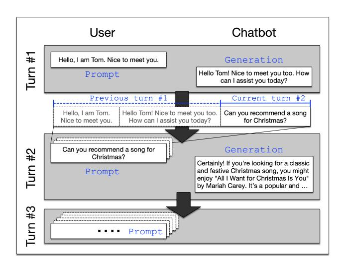

# 1 Introduction

As transformer-based large language models (LLMs) continue to gain significant attention in various domains, it becomes increasingly important to deal with longer context sizes, such as sustained conversations with a chatbot or summarizing long passages [\[7,](#page-13-0) [16,](#page-13-1) [32\]](#page-14-1). For instance, GPT4-Turbo provides up to a 128K context [\[24\]](#page-13-2). Although there have been several efforts to reduce the cost of serving LLMs [\[17,](#page-13-3) [37\]](#page-14-2), the demand for serving long contexts (e.g., chatbots) exacerbates the challenges of providing high computational capability and memory capacity with GPUs.

Typically, a chatbot conversation session involves a multiturn dialogue where users can ask follow-up questions and receive relevant responses, as shown in Figure [1.](#page-1-0) To ensure high-quality answers to users, it is crucial for chatbots to retain the context of previous dialogue turns. For transformerbased generative models, this context information is represented by the attention keys and values (KVs) associated with the prompt and generation of previous turns. The attention mechanism is a key technique of transformer-based LLMs, which captures contextual information within the input sequence [\[34\]](#page-14-3). The model processes each input token while considering all other tokens in the sequence, assigning different attention weights to each token based on its relevance to the current token.

However, due to the limited memory capacity of modern GPUs, caching all the KVs of the attention layers used in previous chat turns becomes prohibitively expensive [\[29\]](#page-13-4). Instead, current LLM frameworks such as vLLM and TensorRT-LLM take an approach that recomputes previous turns. To generate a response, this approach combines the chat history with the current input to form a prompt [\[11,](#page-13-5) [15,](#page-13-6) [17\]](#page-13-3). While this can reduce memory consumption, it renders serving systems inefficient in making forward progress.

This paper reveals that state-of-the-art LLM serving frameworks are inefficient at handling multi-turn prompts used in conversational AI. We conduct a performance characterization study when serving an OPT 13B model with a realworld conversational dataset, ShareGPT [\[27\]](#page-13-7). We highlight two key findings. First, as the number of turns in a chat session increases, the prompt length proportionally increases to

incorporate previous turns. We call this the prompt amplification problem. Upon scheduling such multi-turn prompts, it takes a considerable amount of time to recompute the attention KVs associated with previous turns. This performance overhead stems from the lack of context retention in GPU memory. Given the increasing trend of longer prompts and multi-turn scenarios, we need to revisit the current approach.

Second, the amplification of prompt lengths in multi-turn scenarios poses challenges in achieving cost-effective GPU memory utilization. As the prompt length increases, the required memory space also grows proportionally. When the memory space is insufficient to accommodate the prompt at the head of the queue, the first-come-first-served (FCFS) scheduling policy employed in modern LLM serving schedulers [\[15,](#page-13-6) [17,](#page-13-3) [37\]](#page-14-2) leaves the remaining GPU memory space idle. While such idle space can be utilized in caching KVs of completed previous turns, we observe that the effectiveness of GPU caching decreases due to excessive cache contention under high loads. To effectively utilize the limited GPU memory at a diverse range of workloads, we need a more efficient resource scheduling strategy.

To this end, we introduce FlashGen to expedite the completion of multi-turn prompts by efficiently utilizing the compute and memory resources of GPUs and the host hardware (e.g., DRAM and SSD). First, we design a multi-level cache for attention KVs, called FlashGen-Cache, to efficiently retain context in multi-turn scenarios by leveraging GPU memory, host memory, and SSD. The key observation is that it is more efficient to store computed attention KVs of previous turns in host memory rather than to recompute them. Since our KV manager can minimize the latency of restoring attention KVs from SSD to GPU via host memory, we can achieve significant performance benefits over recomputation.

Second, we present a request reordering technique called FlashGen-Sched, designed to effectively utilize the GPU memory under increasing request loads. As the request load increases, the GPU cache hit rate steadily decreases due to the limited capacity. So, we repurpose the idle memory space to execute awaiting requests. Our scheduler allows younger requests to be dispatched ahead of older ones in cases where older requests are not runnable due to insufficient free memory. While this simple technique improves overall performance, it may lead to a starvation problem for requests conceding their turns. To address this, our scheduler preempts the promoted requests when the combined memory space of these requests and the remaining free space becomes sufficient to accommodate the request yielding its turn.

We implement our FlashGen on top of a popular serving framework, vLLM, which incorporates recent advances such as PagedAttention [\[17\]](#page-13-3) and iteration-level scheduling [\[37\]](#page-14-2). We evaluate the effectiveness of our techniques with diverse datasets including ShareGPT [\[27\]](#page-13-7), which is a real-world chatbot service, as well as Alpaca [\[31\]](#page-13-8) and HumanEval [\[8\]](#page-13-9). We use an Azure instance, Standard\_NC48ads\_ A100\_v4, which

Figure 1. An example of a multi-turn conversation

is equipped with two NVIDIA A100 (80GB) GPUs and 440GB of host memory. For archiving KVs, we use two NVMe SSDs (2 x 960GB) given in the instance. For the ShareGPT dataset, FlashGen can achieve 1.63× and 2.85× better throughput on OPT 30B and Llama-2 70B models, respectively while in the same level of latency, compared to vLLM.

The new contributions of this paper are as follows.

- This paper analyzes the performance inefficiencies in serving multi-turn prompts used in conversational AI and identifies two distinct problems: prompt amplification and recomputation.
- This paper designs a multi-level attention KV caching technique by leveraging GPU memory, host memory, and storage and shows how our technique can efficiently deal with multi-turns dialogues.
- This paper employs a request reordering technique to maximize GPU memory utilization while preventing the starvation problem among requests.

