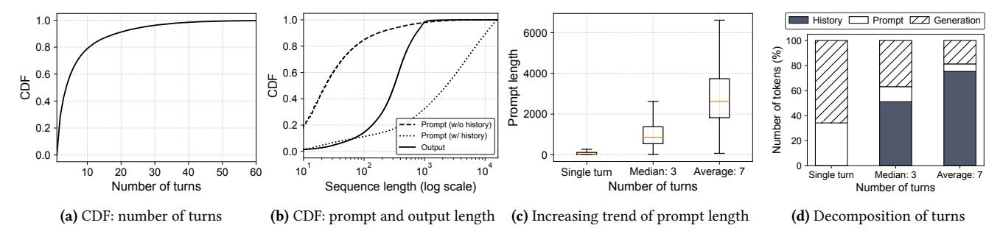
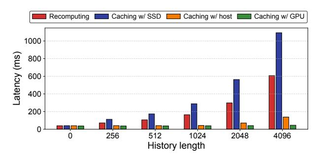
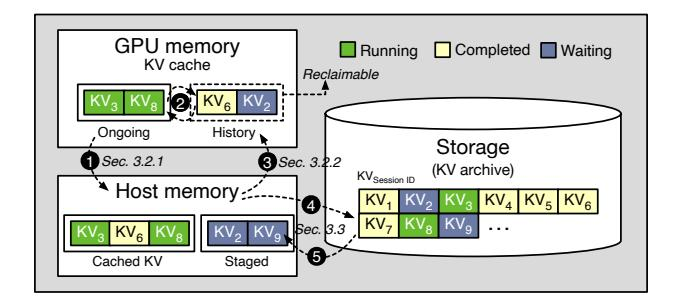
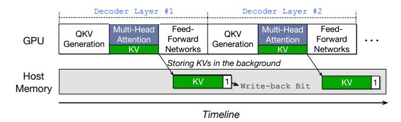
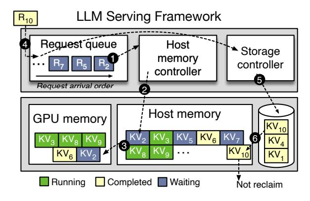

# 2 Background and Motivation

#### 2.1 Inference of Generative Models

Transformer-based generative models (e.g., GPT) have become the de facto standard in the era of generative artificial intelligence. There are two distinct characteristics in inferences of the generative large language models (LLMs). First, LLM inferences operate in an autoregressive manner [\[34\]](#page-14-3), involving two distinct phases. Initially, it takes an input sequence of tokens, known as a prompt, and generates an initial output token. This step is commonly referred to as the prompt (or prefill) phase. Subsequently, the generated output token is fed back into the model to generate the next output token. We call this the generation phase. This generation phase is repeated until it produces an end-of-sentence (EOS) token or reaches the model's maximum token limit.

**Figure 2.** Multi-turn characteristics of a real-world chatbot dataset: ShareGPT [27]

Second, generative models take advantage of the attention mechanism, which computes the correlation among tokens, encompassing both prompt and generated tokens [34]. This mechanism helps the model in determining the relative importance of different tokens, ensuring that the generated text remains contextually relevant. The attention layers retain the states of keys and values (KVs) for all tokens encountered so far, eliminating the need to recompute information for preceding tokens in subsequent iterations. Caching KVs is a common technique for speeding up LLM inferences [1, 4, 17, 20, 33, 37].

#### 2.2 Transformer-based Chatbots

Transformer-based chatbots, such as OpenAI's ChatGPT [25] and Google's Bard [13], represent a significant leap in the field of conversational AI and have garnered widespread attention for their impressive capabilities. Users interact with these chatbots by making an inference request and receiving responses generated by pre-trained language models. A conversation comprises multiple rounds of inference requests and responses. In this continuous dialogue, chatbots are required to maintain contextual information about the entire interaction to ensure contextually relevant responses.

To maintain the context of previous turns within the same conversation session, a chatbot needs access to the attention KVs of all tokens associated with previously exchanged conversations. We call this history KVs. However, retaining all these attention KVs in GPU memory throughout the conversation session is prohibitively expensive due to the lack of GPU memory capacity [3, 28, 29]. To overcome this challenge, modern LLM frameworks employ a practical workaround. Instead of keeping attention KVs of prior chat turns in GPU memory, the client provides the current input prompt and the output tokens generated in prior turns together [11, 15, 17]. Figure 1 presents that the input sequence (prompt) of the second turn actually contains the prompt and output of the first turn. Similarly, the third turn contains the tokens from the first and second turns. The chatbot then computes the combined input, eliminating the need to store attention information of prior turns in GPU memory.

#### 2.3 Characteristics in Multi-turn Dialogues

To understand the distinct characteristics of multi-turn dialogues, we analyze the ShareGPT [27] dataset, which comes from a real-world chatbot service. Our experiments are conducted with an OPT-13B model [38] on a single A100 GPU. The detailed experimental setup is presented in Section 5.1.

**2.3.1** Turns, Prompts, and Generations in a Multiturn Dataset. Figure 2a presents the cumulative distribution function (CDF) of the number of turns per session. Due to the limited space, we show up to 60 turns. Note that chat sessions that are more than 60 turns take only 0.3% in the ShareGPT dataset. We observe the median and average number of turns per chat session are 3 and 7, respectively. The number of single-turn cases occupies only 28% while more than three turns shows 48% of the total number of sessions.

Figure 2b shows the CDF of the number of tokens provided by prompts and those generated during generation phases, respectively. We divide the prompts into two cases: one with history tokens included and the other without. On median, the prompt length without history is 23, while the length with history becomes 2,294 (99× longer). This substantial difference in prompt length suggests a significant contribution to the computational cost when considering prior chat turns.

Figure 2c compares prompt lengths across three cases: single turn, median turns, and average turns. As the number of turns increases, the prompt length expands significantly. For each case, we decompose the token sources into three segments: history (previous turns), prompt (current turn), and generation. Figure 2d illustrates the average for each case. Except for the single turn cases, the recomputation stemming from history takes a significant portion of the inputs. Even in the median case, the tokens attributed to history comprise more than half of the total.

In multi-turn dialogues, the total prompt length is significantly amplified by its prior turns, known as *history*, as the number of turns increases. However, since existing LLM serving frameworks [15, 17, 33] do not take into account

**Figure 3.** Latency of processing prompt with history (prior turns) in a microbenchmark

|                  | OPT-13B | OPT-30B | OPT-66B | OPT-175B |
|------------------|---------|---------|---------|----------|
| History KVs (GB) | 2.8     | 4.7     | 8.1     | 16.2     |

**Table 1.** The average size for history KVs per session when serving OPT models with the ShareGPT dataset

these multi-turn characteristics, the performance efficiency is limited when serving conversational AI.

**2.3.2** Cost of Handling Multi-turn Prompts. As preserving history KVs on the GPU incurs significant overhead in terms of space, current LLM serving frameworks spend additional time recomputing tokens of prior turns. To address this issue, we conduct a preliminary study of caching history KVs in the host memory and make a comparison with GPU caching as an ideal case.

Figure 3 illustrates the comparison of latency in processing prompts with varying history lengths from 0 to 4,096, while maintaining a fixed prompt length of 256. The baseline approach, which recomputes KVs of prior turns without caching them on either the GPU or host memory, is represented by the first bar. With caching history KVs in either SSD (second bar) or host memory (third bar), the cost of computing KVs of prior turns is replaced by the cost of transferring those KVs from SSD to GPU and the host to GPU memory, respectively. Due to the limited bandwidth of SSD, retrieving history KVs directly from SSD is generally undesirable. However, leveraging host memory can significantly reduce the recomputation cost. Ideally, with KVs kept in GPU memory (fourth bar), requests can be served without recomputation or transmission. As the history length increases, the performance gap between recomputation and caching methods becomes significant. The latency of host caching slightly increases from a 2K history length due to the transmission overhead, while the GPU caching maintains consistent performance, demonstrating that caching KVs computed in previous turns is more efficient than recomputation.

However, due to limited GPU memory capacity, caching KVs of previous turns on the GPU is not feasible. As the request load increases, the GPU memory quickly fills up

**Figure 4.** Multi-level attention KV cache comprised of GPU memory, host memory, and storage

with KVs generated during ongoing requests. Consequently, the remaining space for preserving history KVs is significantly reduced at high loads. Table 1 shows the average size for history KVs per session in the ShareGPT dataset when serving diverse OPT models formatted FP-16. The substantial memory consumption of history KVs indicates that relying solely on GPU or host memory would hinder the scalability of concurrent sessions (or loads). To tackle this limitation, we explore a multi-level cache design comprised of GPU memory, host memory, and storage.

### 3 Managing Attention Keys and Values

In this section, we introduce our attention KV cache, called FlashGen-Cache, designed to avoid the cost of redundant computation in processing multi-turn dialogues. Since multi-turn prompts consume a large amount of memory space, it is important for LLM serving frameworks to complete them rapidly, thereby increasing resource efficiency. We describe our caching design with GPU memory, host memory, and storage in the following.

#### 3.1 Design Overview

Figure 4 presents our multi-level caching hierarchy designed to manage attention KVs from prior turns within our LLM serving framework. We design a two-stage data path: (1) between GPU and host memory, and (2) between host memory and the storage. The primary objective of our FlashGen-Cache design is to minimize *the number of transmissions* and *the transmission latency* for KVs between GPU and host memory.

① During inferences, we proactively make a copy of the generated KVs (denoted as *Running*) into the host memory to minimize the overhead associated with reclaiming GPU memory. ② Even after completing the execution of an inference request (denoted as *Completed*), we retain the generated KVs on the GPU memory as cache, but mark them as *reclaimable*. This reclaimable space is considered a free region because the corresponding KVs are already cached in the host memory. ③ Upon a GPU cache miss, we transmit the corresponding KVs on a layer-by-layer basis to enable the immediate execution of layers whose KVs are completely

**Figure 5.** Workflow of caching generated KVs in the host memory during inference (The write-back bit indicates that the KV needs to be stored in the storage)

loaded. This strategy effectively overlaps the transfer of KVs with layer computation.

With the growing trend of longer sequences, the host memory would not be sufficient to cache all the previous attention KVs as discussed in Section 2.3.2. To address this limitation, we extend our caching capabilities with the integration of SSDs. Since modern SSDs are plentiful and cheap compared to memory, this is a cost-effective approach to expand the caching capacity. **4** To mitigate the reclamation cost from host memory, we periodically make a copy of the KVs into SSDs asynchronously in the background. Note that this operation is not on the critical path. However, a challenge arises in the latency associated with loading cached KVs from SSDs to GPU memory directly due to the limited storage bandwidth. To tackle this challenge, 5 we allocate a portion of the host memory to proactively stage the requested KVs from SSDs to host memory upon the arrival of user queries at the server (denoted as Waiting), thus alleviating the performance impact of loading KVs from SSDs.

In summary, for caching attention KVs, there are three possible configurations: GPU-only, GPU+CPU, and GPU+CPU+SSD. We describe each caching layer in the following subsections.

#### 3.2 Caching KVs in GPU and Host DRAM

The current LLM frameworks primarily utilize GPU memory to cache attention KVs only for ongoing requests. So, our GPU caching strategy (GPU-only) aims to efficiently utilize the remaining space to cache KVs from previous turns in a best-effort manner. Even after a given request (or turn) is completed, we retain its attention KVs in the GPU memory as cache. Later, if a request arrives and its KVs for previous turns are still cached in the GPU memory, we can immediately serve the KVs without the recomputation phase for the previous turns. Upon such a cache hit, the corresponding space is no longer reclaimable because it is being used for the currently running request.

Meanwhile, we mark that space used for caching KVs of completed requests as *reclaimable*, allowing the running requests to make use of the space if needed. When GPU memory is insufficient, we can rapidly reclaim the space by discarding the oldest KVs in the completed requests in a FIFO manner. On a cache miss, our GPU-only design needs to recompute its KVs of previous turns like the baseline.

**Figure 6.** Overview of managing attention KVs with our multi-level cache hierarchy

While caching history KVs in GPU is a simple yet effective approach, relying solely on GPU caching is ineffective for reducing the recomputation cost due to limited GPU memory capacity, leading to excessive GPU cache misses. Thus, we extend our caching capabilities with the host memory, called GPU+CPU. By caching the generated KVs from previous turns in the host memory, we further reduce the need for a recomputation phase when a request arrives from the same chat session later. However, this host caching approach introduces additional time for storing and retrieving the KVs belonging to its previous turns to and from host memory. Thus, it is imperative to minimize this overhead.

**3.2.1 Preserving KVs in Host DRAM.** Unlike conventional CPU caches, which typically evict cache lines upon encountering cache misses, we adopt a different approach by immediately copying attention KVs to host memory once they are generated during inferences. Figure 5 presents that the generated KVs are written into the host memory while performing the inference execution. Since these generated KVs remain unchanged during the inferences, we gradually copy the newly generated KVs to the host memory at each attention layer asynchronously. Our strategy helps minimize the replacement overhead from the GPU to host memory by hiding the eviction latency with subsequent computations. In addition, this simplifies the reclaim procedure for GPU memory, as the KVs for completed requests are already copied into the host memory.

**3.2.2 Reloading KVs from Host DRAM to GPU.** Figure 6 presents how we deal with cached KVs in the host memory. When a request arrives at the serving framework, we first check whether the corresponding KVs from previous turns are cached in the GPU memory. Suppose a GPU cache miss occurs. Then, we need to look up the KVs in the host memory which is our second-level cache. If found, we restore them to GPU memory. When the request cannot be scheduled immediately due to precedent

requests, we defer the transmission for the cached KVs until the pending requests are completed. In the meantime, we prevent those KVs from being reclaimed. If we cannot find the matched KVs in the host memory, we request the lower caching layer (here in SSD) to retrieve them.

When restoring KVs from host memory, we leverage the pipeline approach [\[6\]](#page-13-17) to minimize the idleness of GPU compute units. While executing the first transformer layer of the model, we transmit the required KVs for the second layer simultaneously. This optimization minimizes the miss penalty by hiding the latency of the KV restoration from the host memory to the GPU memory.

3.2.3 Batch-aware KV Restoration. In the iteration-level scheduling, requests in a batch can be composed of a combination of prompt and generation phases. If a batch contains one or more prompt phases, the amount of computation is sufficient to hide the transmission of attention KVs when restoring KVs from host memory. On the other hand, when a batch consists solely of generation phases, its computation is relatively less because the number of tokens to be computed is small. Consequently, even with our restoration technique, the execution is frequently suspended to wait for the completion of transferring the required KVs. This impedes the forward progress of the batch, leading to a slowing down of other requests in the same batch. To avoid this problem, we have the scheduler make a batch of remaining requests in the pool by excluding that request whose KVs are not completely loaded. This approach ensures that the currently running requests are not adversely affected. Once all required KVs are ready, we immediately compose a new batch by including the request. This optimization reduces the waiting time for the request to join the batch while not harming the execution of other requests.

3.2.4 Discussion: proactive (inclusive) vs. lazy (exclusive) caching. Our proactive caching aims to minimize the performance overhead associated with reclaiming KVs from GPU to CPU memory. When the GPU memory becomes insufficient, this proactive approach allows us to immediately serve incoming requests by simply discarding the KVs in the GPU memory. That is a key advantage of the inclusive cache. Also, we do not observe that the KV transmission negatively affects the iteration time (See Section [5.3\)](#page-10-0), as the amount of KVs newly generated per layer in each iteration is not significant. Conversely, the lazy approach can effectively utilize the host memory space by deferring the reclamation, working as an exclusive cache. However, when serving requests for long contexts, it causes the direct reclamation procedure, leading to latency increases in the tail.

#### 3.3 Expanding Caching Space for KVs with SSDs

We extend our caching design to archive KVs generated from previous turns in SSD (denoted as GPU+CPU+SSD). This design decision is made by insufficient memory capacity even with the host memory to preserve all prior KVs. As discussed earlier in Section [2.3.2,](#page-3-3) the volume of generated KVs expands proportionally with the increase in the number of sessions.

By adhering to the inclusion property for caching KVs in host memory, we can efficiently archive the generated KVs on SSD at a minimal cost. We follow the same design principle used for preserving KVs from the GPU to host memory. Specifically, we periodically write a copy of the cached KVs from the host memory to the storage device asynchronously in the background. Due to the limited bandwidth of modern SSDs, we do not directly write these KVs from GPU to SSD.

When restoring cached KVs from SSD, we follow a twostep process. Suppose a request arrives, but the corresponding KVs are not cached in the host memory (R10 of Figure [6\)](#page-4-1). As shown in Figure [6](#page-4-1) ( 4 ~ 6 ), our KV manager initiates the restore procedure, transferring the archived KVs from storage to host memory. Although it is possible to supply the KVs directly from storage to GPU using GPUDirect [\[21,](#page-13-18) [22\]](#page-13-19), this is not preferred due to the limited read bandwidth of SSDs. Instead, we place them in the host memory (denoted as staged in Figure [4\)](#page-3-2) and mark them as non-reclaimable, since these KVs will be used shortly. Once the scheduler dispatches the request, our KV manager copies the KVs from the host memory to the GPU, as described earlier. Such a staging strategy can hide the restoration time if there are pending requests ahead. In other words, if there is no opportunity to hide the restoration phase (i.e., when the number of waiting requests is less than 1), it causes delays in scheduling until its history KV is completely loaded. In that case, we opt for recomputation as a fallback mechanism because it is faster than retrieving the KVs from SSDs due to the limited bandwidth of SSDs as shown in Figure [3.](#page-3-0)

Meanwhile, under high demand, staging KVs in the host memory can become a capacity burden. Therefore, we provide a control knob to adjust the host memory usage for staging KVs. By default, the staging space is configured to accommodate the maximum sequence length of the models, preventing a single request from failing to be staged due to lack of space. If the staging region is fully occupied, our KV manager defers loading the KVs even though the request is queued. Once the memory space becomes available by proceeding with requests in the queue, the KVs corresponding to the deferred requests are loaded.

