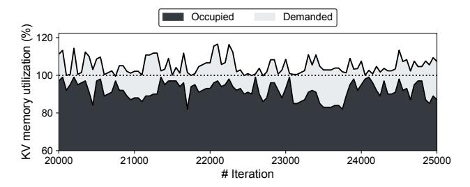
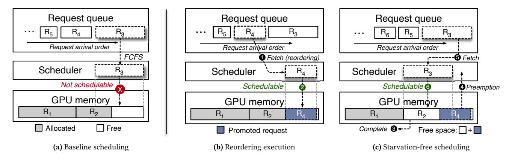

# 4 Effective GPU Memory Utilization with Scheduling

This section introduces our FlashGen-Sched to effectively utilize the remaining GPU memory after allocating for ongoing requests. We first explain why the GPU memory is not fully utilized and then discuss why caching KVs of completed requests in GPU can be inadequate for effectively increasing memory utilization at high loads. Finally, we present our scheduling technique, which opportunistically utilizes

**Figure 7.** GPU (2 x A100-80GB) memory utilization while serving an OPT 30B model with the ShareGPT dataset

idle GPU memory by adjusting the execution order while ensuring fairness among requests.

#### 4.1 Underutilization due to Head-of-Line Blocking

If the available memory space is insufficient to process a given input prompt, the current scheduler in LLM serving frameworks stops processing the input until the memory space becomes sufficient. During this waiting period, the remaining memory space is not utilized. Consequently, even relatively short prompts in the queue that could fit into the current free space are not scheduled. This phenomenon is referred to as the *head-of-line blocking* problem.

Figure 7 exhibits changes in GPU memory utilization as the iteration-level scheduling [37] proceeds. We extract the memory utilization of the KV space at a rate of 0.5 requests per second where the baseline is saturated. The *occupied* region (dark) is utilized for caching KVs of ongoing requests while the *demanded* region (light) indicates the amount of memory space required for serving the request at the head of the queue. Except for the occupied region, the remaining space is underutilized because the head request in the queue cannot fit in the current memory space. Although the PagedAttention mechanism of vLLM can effectively increase memory utilization, it is still around 88% on average due to long sequences.

#### 4.2 Towards Effective Memory Utilization

As explored in Section 3.2, we can utilize the idle GPU memory by caching KVs of completed requests. Under high demand of requests, however, caching history KVs in GPU memory is not effective in terms of utilizing the remaining space. This is because the cache hit rate proportionally decreases as request demand increases1. There are two main reasons. First, the higher load typically means more concurrent users, leading to the contention of GPU memory. To handle the increased number of ongoing requests, the available GPU memory for caching shrinks. Second, in multiturn dialogues, users interact with agents (e.g., chatbots) and spend time reading responses and typing the next message. As the intervals between turns are not short due to humans

involved, it is challenging to exploit temporal locality in the GPU cache.

Conversely, at low demand, the space is effectively utilized for caching as before. Therefore, we opportunistically reclaim the space used for caching to execute awaiting requests using our reordering technique, while preserving the caching functionality. If the request load is not significant, our reordering technique is not activated because it is unlikely to have pending requests due to a lack of free memory. In such cases, the caching space is not reclaimed by our scheduler and is utilized for keeping KVs as previously. In the following, we explain our request reordering technique.

#### 4.3 Reordering Execution

The state-of-the-art iteration-level scheduler is capable of selecting as many requests from the request pool as the memory space can serve. As shown in Figure 8a, when selecting requests, most LLM serving frameworks [15, 17, 33, 37] consider the order of requests to maintain the first-come-first-serve (FCFS) property. If there is not enough memory to serve the oldest one ( $R_3$  in Figure 8a) in the request queue, the subsequent requests ( $R_4$  and  $R_5$ ) cannot be scheduled because of the order of the requests, regardless of whether they are runnable. This increases the waiting time for requests while lowering memory utilization, which is the most valuable resource in GPUs. Note that the longer the prompt length of requests, the more memory space is required.

Our proposed scheduler helps to address this phenomenon by fetching runnable requests first, rather than the order of requests. Figure 8b presents how our simple approach can maximize resource utilization. Instead of waiting for the memory space to become sufficient for  $R_3$ , we search for the next runnable request in a greedy manner. In this example, we fetch  $R_4$ , which fits on memory. We call  $R_4$  a promoted request while  $R_3$  is a deferred request yielding its turn. 2 By squeezing the idle memory space, we reduce the waiting time for requests in the queue. If the prompt length for  $R_4$  is short and generates a small number of output tokens, its execution can be completed before the other older requests ( $R_1$  and  $R_2$ ). In such a case, we can utilize the slack time without any fairness issues due to the reordering of requests.

#### 4.4 Starvation-free Scheduling

Our reordering strategy may lead to a starvation problem where requests with high memory demands (e.g., long prompts) are not continuously selected. To address this concern, our scheduler is designed to dispatch deferred requests by preempting promoted requests. We extend the GPU memory manager of the framework to keep track of the memory occupied by promoted requests and treat the space as free memory. Once any of the preceding requests are completed, our scheduler examines the available memory space, including the space occupied by the promoted requests. This allows

&lt;sup>1The experimental results will be shown in Section 5.

Figure 8. Baseline scheduling (a) and proposed scheduling (b and c)

us to preempt the promoted requests to schedule deferred requests without significantly increasing the waiting time.

Figure [8c](#page-7-4) depicts how our scheduler prevents the starvation problem for the deferred request (R3). 3 Suppose R2 is completed. Then, the free space (R2 + R4) becomes sufficient to serve the long prompt (R3), in which case 4 we preempt the temporarily promoted request (R4), 5 thereby facilitating that the deferred request (R3) is promptly scheduled.

As soon as one of the preceding requests (R1 or R3) completes, the preempted request (R4) is immediately resumed. At this point, we restore the copy of the KVs for R4 from host memory to GPU memory. Note that our FlashGen-Cache helps us to avoid the recomputation phase and minimize the restoration overhead.

With FlashGen-Sched, we can opportunistically reclaim the space used for caching to promote awaiting requests. As a result, we can shorten the average latency of token generation and improve the throughput per token by effectively increasing the batch size. More importantly, our scheduling method does not depend on our caching technique. This can be solely used to minimize the waiting time for long prompts.

